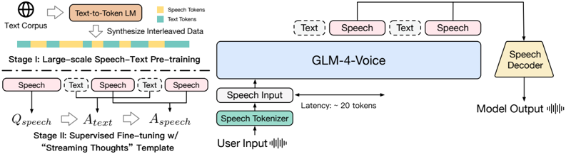

> [!abstract] arXiv · 2024 · Preprint
> **Zeng et al.** (Tsinghua University / Zhipu.AI) · [→ Paper](https://arxiv.org/abs/2412.02612) · Demo: ? · Code: ✓
>
> GLM-4-Voice is an end-to-end bilingual spoken chatbot built on the 9B GLM-4 LLM, combining a 175bps supervised speech tokenizer derived from Whisper with a flow-matching decoder, large-scale 1-trillion-token speech-text pre-training, and a "streaming thoughts" interleaved generation template that enables low-latency, style-controllable voice responses.

## Problem

Traditional spoken chatbot pipelines chain ASR, LLM, and TTS modules, incurring compounded latency and error propagation, and the modular design prevents the LLM from controlling prosody, emotion, or dialect in the output speech. Speech-language models that train entirely on speech data are constrained by the relative scarcity of speech compared to text, limiting their factual knowledge and reasoning quality. Systems that simply fine-tune a text LLM on speech question-answering data avoid the data scarcity issue but produce speech with limited stylistic control and expressiveness because they never acquire dedicated speech generation capability.

## Method

GLM-4-Voice is built on GLM-4-9B-Base, with its vocabulary extended to include speech tokens. The speech pipeline has three components:

**Speech tokenizer.** A Whisper-large-v3 encoder is fine-tuned with an average pooling layer and a VQ bottleneck inserted mid-encoder, producing a single-codebook tokenizer at 12.5Hz and 175bps. Training uses a mix of supervised ASR data (LibriSpeech, GigaSpeech, CommonVoice, AISHELL-1, MLS-Eng, Wenet) and 700k hours of pseudo-labelled unsupervised speech. Causal convolution and block causal attention replace standard Whisper components to enable streaming input encoding. The design deliberately sacrifices full acoustic fidelity for semantic compactness: a single codebook at 12.5Hz avoids the multi-codebook complexity of RVQ-based codecs while preserving enough semantic content for accurate ASR (2.10 WER on LibriSpeech clean) and high-quality reconstruction (MOSNet 3.39).

**Speech decoder.** A flow-matching model (conditioned on speech tokens) feeds a HiFi-GAN vocoder, following the CosyVoice decoder architecture. Two-stage training uses diverse unsupervised speech first, then single-speaker high-quality speech. Streaming inference is enabled by training on truncated prefixes with block size b=0.8s, so the decoder can generate the first audio chunk after receiving just 10 speech tokens.

**Pre-training.** The base LLM is continued pre-training on 1 trillion tokens: 30% text, one epoch of 700k-hour unsupervised speech, one epoch of supervised ASR/TTS data, and the remainder comprising interleaved speech-text data synthesized from text corpora using a text-to-token model (described in 2411.17607). This interleaved data strategy transfers factual and reasoning knowledge from the text LLM to the speech modality without requiring large parallel speech-text corpora.

**Supervised fine-tuning.** The chat model is fine-tuned with a "streaming thoughts" template: the model alternates between generating 13 text tokens and 26 speech tokens, so text generation always leads speech generation, providing semantic context for prosody. Separate loss-masking passes train the text-output and speech-output subtasks at different rates (4 vs. 20 epochs) to account for their different learning speeds.

## Key Results

On the chat model evaluation (Table 6), GLM-4-Voice achieves a ChatGPT score of 5.4 on General QA and 5.2 on Knowledge tasks, compared to Llama-Omni's 3.5/3.9 and Moshi's 2.42/3.6. UTMOS is 4.45 vs. 3.92 (Llama-Omni) and 3.90 (Moshi), with ASR-WER of 5.74 vs. 9.18 (Llama-Omni) and 7.95 (Moshi). The gains over Mini-Omni and SpeechGPT are larger still.

On speech language modeling (Table 3), GLM-4-Voice S→T achieves 93.6 / 76.3 on Topic-StoryCloze / StoryCloze vs. Spirit-LM S→T at 88.6 / 64.6. In S→S mode it roughly matches Moshi and Spirit-LM.

On spoken question answering (Table 4), GLM-4-Voice S→T scores 32.2 / 64.7 / 39.1 on Web Questions / Llama Questions / TriviaQA vs. Moshi S→T at 26.6 / 62.3 / 22.8. The S→S gap over S→T narrows substantially on Llama Questions (50.7 vs. 64.7), suggesting the interleaved pre-training reduces the cost of direct speech-to-speech generation.

Note: Chat model baselines are reproduced from Zeng et al. 2411.17607 rather than re-evaluated under identical conditions; some baselines (SpeechGPT, Mini-Omni) may differ in instruction tuning data or hardware setup, so the large gaps should be interpreted as indicative rather than precisely controlled.

## Novelty Assessment

The core architectural ideas draw heavily from existing work: the supervised tokenizer design follows CosyVoice (2407.05407), the decoder architecture is taken directly from CosyVoice, the LLM backbone is GLM-4-9B, and the interleaved pre-training data synthesis is from 2411.17607 (a companion paper by the same group). What is genuinely new is the end-to-end integration of these components into a single autoregressive model with a unified speech-text vocabulary, and the "streaming thoughts" template that decouples text and speech generation into interleaved chunks during SFT. The ultra-low bitrate single-codebook tokenizer design (175bps vs. 1.1Kbps for Moshi/Mimi) is a deliberate architectural choice that simplifies generation at the cost of some acoustic fidelity, and its application to speech-language modeling rather than just TTS is novel. The primary contribution is demonstrating that large-scale interleaved speech-text pre-training from a strong text LLM substantially narrows the S→S vs. S→T quality gap.

## Field Significance

> [!tip]
> High — GLM-4-Voice demonstrates that end-to-end spoken chatbots can match the content quality of modular pipeline systems while gaining expressive control over prosody, emotion, and dialect, by grounding speech pre-training in a text LLM with trillion-token scale. Its combination of a 175bps single-codebook tokenizer, a streaming flow-matching decoder, and the "streaming thoughts" SFT template offers a practical blueprint for low-latency bilingual spoken dialogue, and its open release (model weights and code) enables community replication and extension.

## Claims

- Speech-text interleaved pre-training at trillion-token scale enables an LLM to acquire speech understanding and generation capabilities that substantially close the gap between spoken and textual reasoning quality. *(§4.1, Table 4)*
- Single-codebook supervised speech tokenizers derived from ASR models can achieve compact bitrates (below 200bps) while retaining sufficient semantic fidelity for both downstream language modeling and speech synthesis. *(§3.1, Table 1)*
- Streaming interleaved generation templates, alternating text and speech token output, enable low-latency spoken responses without sacrificing content coherence by ensuring text generation consistently precedes its corresponding speech. *(§3.3)*
- End-to-end speech language models that include dedicated speech pre-training produce measurably higher-quality and more stylistically controllable speech responses than LLMs fine-tuned solely on speech question-answering data. *(§5.2, Table 6)*
- Decoupling the text and speech output subtasks during fine-tuning, through separate loss-masking passes at different epoch rates, addresses the discrepancy in learning dynamics between the two modalities. *(§4.2.2)*

## Limitations and Open Questions

> [!warning]
> The paper reports no subjective listening test (MOS/MUSHRA) on the chat model output; UTMOS is used as a proxy for speech naturalness, and the chat evaluation relies on GPT-4o scoring of ASR transcriptions, introducing cascaded error from both the vocoder quality and the Whisper transcription step.

The 175bps tokenizer trades acoustic fidelity for compactness: VisQOL at 12.5Hz (2.52) is lower than SpeechTokenizer variants and the 50Hz variant of the same system. This may limit voice cloning quality and the fidelity of paralinguistic feature reproduction (accent, fine-grained emotion), though the paper does not directly evaluate these.

Instruction-following for speech style (emotion, dialect, rate) is described and demonstrated qualitatively but not evaluated quantitatively; it is unclear how reliably the model follows complex or combined style instructions.

The streaming thoughts ratio (13 text : 26 speech tokens) and block size (b=0.8s) are empirically chosen hyperparameters; their sensitivity and generalisability to other tokenizer frame rates or LLM sizes is not studied.

## Wiki Connections

Concepts: [[spoken-language-model]] [[neural-codec]] [[autoregressive-codec-tts]] [[streaming-tts]] [[instruction-conditioned-tts]] [[multilingual-tts]]

Related papers: [[2411.17607]] (companion pre-training paper by same group) · [[2407.05407]] (CosyVoice, tokenizer and decoder source) · [[2409.06666]] (Llama-Omni, key baseline) · [[2411.00774]] (Freeze-Omni, baseline) · [[2408.16725]] (Mini-Omni, baseline) · [[2305.11000]] (SpeechGPT, baseline) · [[2402.05755]] (Spirit-LM, baseline) · [[2407.04051]] · [[2408.16532]]
