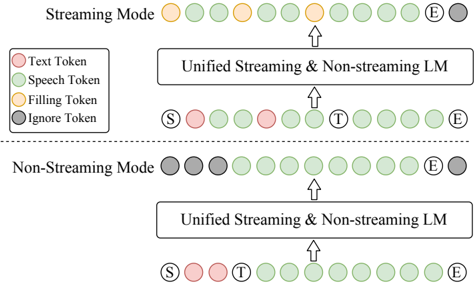

> [!abstract] arXiv · 2024 · Preprint
> **Zhihao Du et al.** (Alibaba Group) · [→ Paper](https://arxiv.org/abs/2412.10117) · Demo: ✓ · Code: ✓
>
> CosyVoice 2 extends CosyVoice with three key changes — FSQ for full codebook utilization, a Qwen2.5-0.5B LLM backbone replacing the custom LM, and a chunk-aware causal flow matching model — achieving human-parity synthesis quality in a unified streaming/non-streaming framework with virtually lossless streaming performance on typical test cases.

## Problem

CosyVoice's VQ-based speech tokenizer used only 23% of its 4096-code codebook, discarding semantic information. The custom text encoder + LM architecture underutilized the contextual understanding capacity of pre-trained LLMs. Most importantly, no well-established streaming solution existed for hybrid LM+flow-matching TTS systems: the flow matching model required all speech tokens before decoding, creating high latency incompatible with interactive voice chat applications. Additionally, the original CosyVoice had separate zero-shot and instruct models; CosyVoice 2 unifies them.

## Method

CosyVoice 2 maintains the two-stage architecture of its predecessor (LM → flow matching → vocoder) but systematically upgrades each component:

**FSQ Speech Tokenizer:** Replaces VQ with Finite Scalar Quantization (FSQ) inside the SenseVoice-Large ASR encoder. FSQ projects intermediate representations into a D-dimensional low-rank space and quantizes each dimension to [-K, K] via a bounded round operation. The codebook size is (2K+1)^D = 6,561 codes. t-SNE visualization and speaker identification experiments confirm FSQ tokens are speaker-independent (SID training on quantized tokens does not converge). FSQ achieves 100% codebook utilization vs. 23% for VQ, and reduces ASR error rate from 18.26% to 10.67% on CommonVoice EN — indicating substantially more semantic content is preserved.

**Unified Text-Speech LM:** Uses Qwen2.5-0.5B as the backbone, removing the text encoder and speaker embedding from the sequence entirely. Two training modes share one model: (1) Non-streaming: [S, text tokens, T, speech tokens, E]; (2) Streaming: text and speech tokens are interleaved at ratio N:M=5:15 — every 5 text tokens are followed by 15 speech tokens, with "filling tokens" inserted when text tokens are not yet available. Both sequences are trained simultaneously, enabling a single model to handle both modes at inference.

**Chunk-aware Causal Flow Matching:** The flow matching model is trained with four mask types simultaneously: non-causal (offline, best quality), full-causal (lowest latency), Chunk-M (past + M future frames), and Chunk-2M (near-offline quality with moderate latency). Training with all four masks provides implicit self-distillation (more-context masks teach less-context masks). The unfolded multi-step ODE (10 NFE) is treated as a stacked network to enable causal application.

**Instructed Generation:** 1,500 hours of instruction data integrated into base training. Natural language instructions (emotion, speaking rate, dialect, role-playing) prepended via `<|endofprompt|>`. Fine-grained instructions: `[laughter]`, `[breath]`, `<strong>`, `<laughter>`. ICL and instruction are unified in a single model.

**RL Post-training:** DPO with WER+SS rewards for speaker fine-tuning. A differentiable ASR reward (Gumbel-softmax sampling through FSQ indices → frozen ASR decoder) avoids the four-forward-pass overhead of standard DPO and generalizes better to out-of-domain/hard cases.

## Key Results

**Codebook (Table 4):** FSQ: 100% utilization, ASR error 10.67% EN vs. VQ: 23% utilization, ASR error 18.26% EN.

**LibriSpeech test-clean (Table 5, EN):** CosyVoice 2: WER 2.47%, NMOS 3.96, SS 0.745. Human: WER 2.66%, NMOS 3.84, SS 0.697. CosyVoice 2 surpasses human on all three metrics.

**SEED test sets (Table 6):**
- test-zh: CosyVoice 2 CER 1.45% vs. CosyVoice 3.63%, Seed-TTS 1.12%
- test-en: WER 2.57% vs. CosyVoice 4.29%, F5-TTS 1.83%
- test-hard: WER 6.83% vs. CosyVoice 11.75%, Seed-TTS 7.59%, F5-TTS 8.67%

**Streaming (Table 8):** Streaming LM + streaming FM (M4): CER 1.45% zh, WER 2.38% en, WER 8.08% hard — virtually lossless on typical cases, small degradation on hard cases only.

**Ablation (Table 7):** Each change contributes cumulatively: LLM init (+18.46% relative CER improvement on zh), drop spk emb (further -0.4%), FSQ (further -0.89%) from CosyVoice baseline.

**Instruction (Table 10):** CosyVoice 2 MOS-I 4.06 vs. CosyVoice-Instruct 3.09 — major improvement.

**RL (Table 11):** Combining differentiable ASR reward + DPO achieves best results on both in-domain speaker and SEED test sets.

## Novelty Assessment

Three concrete innovations: (1) FSQ for speech tokenization is novel in this context and the codebook utilization gain is striking (23%→100%); (2) the unified streaming/non-streaming LM via interleaved text-speech tokens is a clean engineering solution to the streaming problem, requiring only sequence construction changes; (3) the chunk-aware multi-mask flow matching training is a principled way to give a single diffusion/flow model multiple latency profiles. The differentiable ASR reward for RL is also a cleaner alternative to iterative DPO. The work is clearly positioned as a technical report and is thorough in ablation.

## Field Significance

> [!tip]
> High — CosyVoice 2 introduces a principled solution to streaming in hybrid LM+flow-matching TTS, a problem that had no established answer, while simultaneously demonstrating that FSQ codebooks substantially outperform VQ in semantic content preservation. The unified streaming/non-streaming framework and the chunk-aware causal flow matching design are reusable components that subsequent work has adopted directly, making this paper a meaningful inflection point for production-oriented speech synthesis systems.

## Claims

- Finite scalar quantization achieves full codebook utilization in supervised speech tokenizers, capturing substantially more semantic content than vector quantization at equivalent bitrates. *(§2.2, §4.1, Table 4)*
- Replacing a randomly initialized custom LM with a pre-trained LLM backbone improves content consistency in hybrid TTS systems without requiring a separate text encoder. *(§2.3, §4.3, Table 7)*
- Streaming and non-streaming synthesis can be unified in a single autoregressive model through interleaved text-speech token sequences, with virtually lossless quality on typical inputs relative to offline mode. *(§2.3, §4.2, Table 8)*
- Training a flow matching model simultaneously on multiple causal mask types — from non-causal to full-causal — enables a single model to span the latency-quality trade-off continuum at inference time, with masks providing implicit self-distillation. *(§2.4, §4.3, Table 8)*
- Differentiable ASR reward optimization generalizes better to out-of-domain and hard-case inputs than preference-based DPO in TTS speaker fine-tuning. *(§2.8, §4.7, Table 11)*

## Limitations and Open Questions

- EN quality still lags CosyVoice 2 behind Seed-TTS and F5-TTS on SEED test-en (WER 2.57% vs. 2.25% and 1.83%), reflecting data imbalance toward Chinese.
- Japanese synthesis degrades due to character set overlap with Chinese (CER 18.79% test-ja vs. 7.98% test-ko).
- Cannot control timbre through text instructions.
- Singing not supported.
- Streaming still incurs a hard degradation on test-hard, suggesting that contextual information from future text is important for difficult patterns.

## Wiki Connections

CosyVoice 2 is the direct successor to [[2407.05407]] (CosyVoice), replacing VQ with FSQ and adding streaming. Its SEED test set evaluation benchmarks directly against [[2406.02430]] (Seed-TTS) and [[2410.06885]] (F5-TTS), providing one of the most comprehensive comparative evaluations among these contemporaneous systems. The FSQ tokenizer contribution connects to the [[neural-codec]] discussion about codebook utilization. The chunk-aware causal FM design advances [[streaming-tts]]. The RL fine-tuning approach (DPO + differentiable ASR reward) extends [[rlhf-speech]]. The Qwen2.5-0.5B backbone signals the field's adoption of publicly available LLMs as TTS semantic models.

Citing papers in this corpus: [[2506.21619]] (IndexTTS2) adopts the S2M flow-matching pattern; [[2510.12210]] (DiSTAR) and [[2603.29339]] (LongCat-AudioDiT) benchmark against CosyVoice 2; [[2508.16332]] (Vevo2) extends the AR+FM paradigm; [[2508.02038]] (Marco-Voice) builds on CosyVoice1 pipeline; [[2604.00688]] (OmniVoice) compares SIM metrics; [[2512.04720]] (M3-TTS) compares WER on Seed-TTS; [[2512.13251]] (DisCo-Speech) compares VC disentanglement; [[2603.08823]] (Fish Audio S2) uses CosyVoice 2 tokenizer and compares multilingual results; [[2025.acl-long.912]] (LLaMA-Omni 2) uses CosyVoice 2 FSQ tokenizer and chunk-aware FM decoder. Further citing papers: [[2508.04141]] (Parallel GPT) benchmarks MOS against CosyVoice; [[2511.12347]] (VoiceCraft-X) compares against CosyVoice 2 on Seed-TTS; [[2601.03888]] (IndexTTS 2.5) builds on CosyVoice's LLM+FM paradigm for multilingual extension; [[2603.26364]] (LLaDA-TTS) replaces CosyVoice's AR stage with masked discrete diffusion; [[2604.01760]] (T5Gemma-TTS) proposes an alternative encoder-decoder conditioning to address decoder-only dilution present in CosyVoice-style architectures. New citing papers (integrated 2026-05-30): [[interspeech-2025-0704]] (DiffRO) builds directly on CosyVoice 2.0 as the base codec LM for differentiable reward optimization, achieving WER 0.78% zh on seed-tts-eval; [[interspeech-2025-0648]] (MIKU-PAL) cites CosyVoice 2.0 as an emotion control baseline in downstream TTS evaluation. New citing papers (integrated 2026-06-03): [[interspeech-2025-0739]] (FD-Bench) cites CosyVoice 2 in streaming dialogue context; [[interspeech-2025-1344]] (PEFT-TTS) uses CosyVoice 2 as a multilingual baseline comparison; [[interspeech-2025-2447]] (SSD) uses CosyVoice 2 as the target AR LM for speculative decoding, achieving 1.4× speedup; [[interspeech-2025-2449]] (EPSS) uses CosyVoice 2 as a comparison in the step-reduction evaluation. Integration pass 7 (2026-06-05): [[2508.19205]] (VibeVoice) compares against CosyVoice 2 as a baseline on SeedTTS; [[2508.16790]] (TaDiCodec) compares its AR system against CosyVoice 2 on WER/SIM metrics.

[[2501.06282]] — MinMo: A Multimodal Large Language Model for Seamless Voice Interaction
[[2502.11946]] — Step-Audio: Unified Understanding and Generation in Intelligent Speech Interaction
[[2507.16632]] — Step-Audio 2 Technical Report
