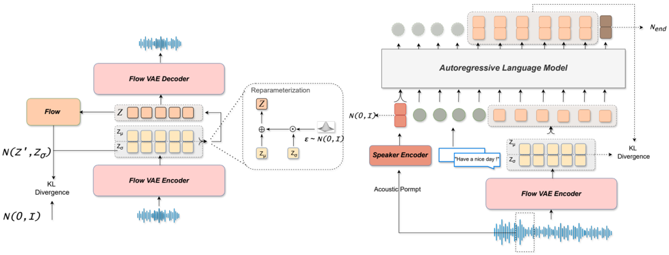

> [!abstract] arXiv · 2025 · Preprint
> **Xia et al.** (Northwestern Polytechnical University) · [→ Paper](https://arxiv.org/abs/2412.16846) · Demo: ✓ · Code: ✓
>
> KALL-E replaces discrete speech tokens with a Flow-VAE continuous latent representation and trains an autoregressive language model to predict the next speech frame's Gaussian distribution via KL divergence loss, operating at 12.5 Hz to achieve lower WER and approximately 15x fewer inference FLOPs than comparable AR systems.

## Problem

Autoregressive TTS systems that treat speech generation as next-token prediction over discrete codec tokens face compounding limitations. Quantization discards acoustic information even when the perceptual impact is not apparent, and high frame rates (50 Hz or more for many codecs) produce long sequences that strain LM modeling stability and invite hallucinations such as prolonged silences or noise runs. Multi-codebook approaches reduce per-frame information loss but multiply training complexity; single-codebook approaches preserve less acoustic detail and require separate post-processing networks to compensate.

The few systems that attempt continuous-representation AR modeling address the quantization problem but introduce a different failure mode: regression-based losses (MSE or MAE) impose a unimodal assumption on each predicted frame that fails to capture the multimodal, complex distribution of natural speech, producing averaged and ambiguous outputs. Additionally, continuous representations in prior work are often modeled at high frame rates, negating the sequence-length advantage that continuous VAEs could provide over multi-codebook discrete systems.

## Method

KALL-E frames TTS as conditional next-distribution prediction. Rather than predicting the next discrete token, the AR language model predicts the mean and variance of a Gaussian distribution over the next continuous speech frame. The system comprises three main components: a Flow-VAE, an autoregressive language model, and a speaker encoder.

The Flow-VAE encodes raw waveforms into continuous latents at 12.5 Hz with a latent dimension of 512. It augments a conventional VAE with a normalizing flow module that transforms the encoder's Gaussian posterior into a richer, non-unit-Gaussian distribution, increasing the diversity and expressiveness of the latent space relative to a standard VAE. The encoder uses dilated convolutions with residual blocks; the decoder mirrors this architecture with transposed convolutions and the Snake activation function from BigVGAN. The Flow-VAE is trained with a combination of KL divergence, mel-spectrogram reconstruction, multi-period and multi-resolution discriminator, and feature-matching losses.

The AR language model uses a LLaMA 3.2-1B causal transformer as its backbone. Text tokens, speaker embeddings, and projected speech latents are concatenated as the input sequence. At each time step, a linear head projects the hidden state to predict the mean and variance of the next frame's distribution. Training minimizes the KL divergence between the predicted distribution and the target distribution from the Flow-VAE encoder, summed over all frames. Generating at 12.5 Hz rather than 50 Hz reduces the sequence length for a 10-second utterance by a factor of four, cutting inference compute substantially.

For speaker conditioning, an ECAPA-TDNN speaker encoder is jointly trained with the LM. A KL penalty regularizes the speaker latent toward an isotropic Gaussian prior, enabling two inference modes: deterministic voice cloning when a reference utterance is available, or reproducible random voice synthesis by drawing a fixed random seed from the prior (resolving the problem of non-reproducible zero-shot voices in reference-free generation).

At inference time, an optional test-time training (TTT) procedure adapts the LM to a target speaker from a single reference utterance. The Flow-VAE encodes the reference into a distribution, from which N latent sequences are sampled to form a small adaptation dataset. Only the LM parameters are updated (the speaker encoder is frozen), using the same KL divergence objective. The paper finds N=200 provides the best balance between improved speaker similarity and avoiding overfitting to idiosyncratic pronunciations in the reference.

Training uses Emilia as the primary dataset (approximately 96.7k hours of English and Chinese). A second fine-tuning stage uses around 3,000 hours of cleaned and internally augmented data. The ESD emotional speech dataset supplements training for emotion-aware generation.

## Key Results

On the Seed-TTS evaluation set, KALL-E achieves the lowest error rates among compared systems: CER 0.96 on test-zh and WER 1.94 on test-en, below Seed-TTS (1.12 CER / 2.25 WER), CosyVoice 2 (1.45 / 2.57), and Llasa-1B (2.22 / 3.6), despite using less training data than most baselines (§TTS Evaluation, Table 2). In subjective evaluation with 15 native listeners, KALL-E scores MOS 4.17 and SMOS 3.93, the highest naturalness among systems tested, significantly outperforming Llasa-1B (MOS 3.92) and on par with the much larger Llasa-8B (MOS 3.97) (Table 3).

Objective speaker similarity (SIM) is lower than Seed-TTS (0.646 vs. 0.796 on test-en). The authors attribute this to those systems conditioning their waveform decoders on the reference audio at decode time, inflating objective SIM without necessarily corresponding to perceived fidelity. TTT improves KALL-E's SIM from 0.568 to 0.611 on test-en with minimal WER change.

For inference efficiency, KALL-E requires 7,947 GFLOPs to synthesize 10 seconds of speech vs. 122,170 for Llasa-1B (same 1B parameter count at 50 Hz) and 12,095 for CosyVoice 2 (500M params at 25 Hz), driven primarily by the 12.5 Hz frame rate (Table 4). Flow-VAE reconstruction at 512-dim, 12.5 Hz reaches STOI 0.96 and PESQ-WB 3.26, outperforming Mimi across metrics while trailing Stable Audio VAE at the same frame rate (Table 1).

Ablation confirms that replacing Flow-VAE with Stable Audio VAE at the same latent dimension collapses CER from 2.79 to 40.09, demonstrating that the richer Flow-VAE latent distribution is critical for LM modeling stability (Table 5).

## Novelty Assessment

The core novelty is the KL divergence objective for autoregressive next-distribution prediction. Prior continuous AR TTS (MELLE) used regression-based MSE/MAE losses that impose a unimodal per-frame assumption. KALL-E predicts Gaussian parameters explicitly, providing a principled probabilistic objective aligned with the Flow-VAE encoder's distributional output. The Flow-VAE architecture adapts the normalizing-flow-augmented VAE concept from VITS (where it served a different role) as an AR speech encoder, producing a broader latent space that is empirically more LM-friendly than a standard VAE as demonstrated by the ablation.

The TTT speaker adaptation at inference is imported from computer vision and has not previously been applied to continuous-representation TTS. The reproducible random voice synthesis (storing a prior sample as a seed) is a practical engineering contribution. The 15x compute advantage over Llasa-1B follows directly from the 12.5 Hz design, rather than from a distinct architectural innovation, but the decision to operate at this rate with a 512-dim continuous VAE rather than a discrete codec is itself a considered choice that the ablations validate. Baseline comparisons are fair at similar parameter counts; training data composition differs across systems, which limits clean attribution of WER gains to architecture alone.

## Field Significance

Moderate — KALL-E demonstrates that continuous-representation AR TTS, trained with a distributional objective rather than regression, can match or outperform discrete-token AR systems on intelligibility and naturalness while requiring substantially fewer inference FLOPs. The result reinforces the position that discrete tokenization is not architecturally necessary for LLM-based TTS, and that the loss function for continuous AR modeling is a consequential design choice. The paper enters a cluster of contemporaneous work (including FELLE and DiTAR) converging on continuous AR speech generation, and provides supporting evidence that Flow-VAE representations, which do not enforce a strict unit-Gaussian prior, are more suitable for this task than standard VAEs.

## Claims

- **supports:** Distributional training objectives for continuous AR speech modeling achieve higher intelligibility than regression-based alternatives.
  > *Evidence:* KALL-E with KL divergence loss achieves WER 1.94 / CER 0.96 on Seed-TTS test sets, below all discrete-token and regression-based baselines; ablation replacing Flow-VAE with Stable Audio VAE (near-zero KL weight, approaching a plain autoencoder) collapses CER from 2.79 to 40.09 at the same latent dimension. *(§TTS Evaluation, Table 2; §Ablation Study, Table 5)*

- **supports:** Low frame-rate continuous representations reduce autoregressive TTS inference compute by over an order of magnitude without sacrificing synthesis quality.
  > *Evidence:* KALL-E at 12.5 Hz requires 7,947 GFLOPs to synthesize 10 seconds vs. 122,170 for Llasa-1B at 50 Hz, while achieving higher MOS (4.17 vs. 3.92) and lower WER (1.94 vs. 3.6) on the same test set. *(§TTS Evaluation, Table 3, Table 4)*

- **complicates:** Objective speaker similarity metrics for zero-shot TTS are unreliable for cross-system comparisons when decoder architectures differ in their use of reference audio.
  > *Evidence:* Discrete-token systems (Seed-TTS SIM 0.796, FireRedTTS SIM 0.635) score differently on objective SPK-SIM than KALL-E (SIM 0.646/0.568), but KALL-E receives higher listener naturalness ratings; the authors attribute the gap to those systems conditioning the waveform decoder on the reference utterance at decode time, which inflates the metric independent of perceived speaker fidelity. *(§TTS Evaluation, Table 2, Table 3)*

- **supports:** Test-time adaptation from a single reference utterance improves speaker similarity in continuous-representation AR TTS without requiring full model retraining.
  > *Evidence:* KALL-E (TTT) improves SPK-SIM from 0.568 to 0.611 on test-en using N=200 latent sequences sampled from the reference utterance's Flow-VAE distribution, with WER remaining stable at 1.90. *(§Test Time Training; §TTS Evaluation, Table 2)*

- **complicates:** Increasing VAE KL regularization weight trades reconstruction fidelity for a latent space structure that is more suitable for downstream generative modeling.
  > *Evidence:* Flow-VAE uses KL weight 32 and scores PESQ-WB 3.26 at 512-dim/12.5 Hz, below Stable Audio VAE (3.11) at the same frame rate with near-zero KL weight; however, Stable Audio VAE's latent space causes CER to collapse when used as the AR LM encoder, demonstrating that reconstruction quality and generation compatibility impose conflicting constraints on VAE training. *(§VAE Evaluation, Table 1; §Ablation Study, Table 5)*

## Limitations and Open Questions

Objective speaker similarity remains below discrete-token systems that condition their decoders on the reference audio, suggesting the Flow-VAE's information bottleneck trades some speaker detail for a more LM-friendly latent space. The TTT procedure assumes the transcript of the reference utterance is available, which may not hold in all deployment settings. Overfitting risk in TTT is real: CER rises after N=200 in ablation, limiting the effective adaptation set size. Evaluations are conducted solely on the Seed-TTS test sets; generalization to other benchmarks, out-of-distribution speakers, or noisy acoustic conditions is not assessed. Training data composition differs from the most directly comparable system (Llasa-1B), making it difficult to fully isolate architecture from data quality as the source of WER gains.

## Wiki Connections

- [[autoregressive-codec-tts|Autoregressive Codec TTS]] — KALL-E proposes a continuous-representation alternative to the discrete-codec AR paradigm, replacing quantization with Flow-VAE latents and using KL divergence rather than cross-entropy as the generation objective.
- [[zero-shot-tts|Zero-Shot TTS]] — the system performs voice cloning from a single reference utterance via speaker latent conditioning, with TTT further improving speaker identity matching.
- [[neural-codec|Neural Audio Codec]] — KALL-E compares its Flow-VAE reconstruction against DAC, Mimi, and X-Codec2, positioning continuous VAEs as a lower-compute alternative to discrete codecs for AR TTS.
- [[subjective-evaluation|Subjective Evaluation]] — MOS and SMOS from 15 native listeners on Seed-TTS test sets are the primary quality measure, with KALL-E scoring highest on naturalness among compared systems.
- [[speaker-adaptation|Speaker Adaptation]] — the TTT mechanism adapts the LM from a single reference utterance at inference time, using latent samples from the Flow-VAE encoder as the adaptation signal.
- [[2502.03930|DiTAR]] (Diffusion Transformer Autoregressive) — a contemporaneous system also exploring continuous-domain AR speech generation, cited alongside KALL-E as part of the emerging non-VQ AR TTS direction.
- [[2502.11128|FELLE]] (Token-Wise Coarse-to-Fine Flow Matching) — another continuous AR TTS system using flow matching on AR outputs, cited as prior work on the continuous representation challenge KALL-E also addresses.
