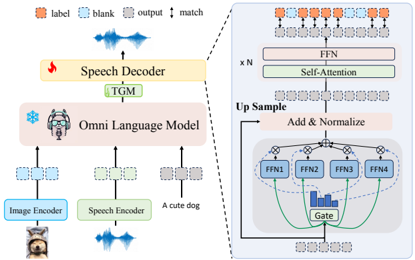

> [!abstract] arXiv · 2025 · Preprint
> **Run Luo et al.** (Shenzhen Institute of Advanced Technology, CAS; Alibaba (Tongyi Lab)) · [→ Paper](https://arxiv.org/abs/2501.04561) · Demo: ? · Code: ✓
>
> A two-stage open-source omnimodal framework that aligns vision, speech, and text via text as a pivot, avoiding tri-modal training data, and pairs this with a lightweight non-autoregressive speech decoder trained with CTC and direct preference optimization for real-time, emotionally coherent speech.

## Problem

Open-source omnimodal large language models (OLLMs) that jointly handle vision, text, and speech lag behind proprietary systems such as GPT-4o for three reasons. First, end-to-end tri-modal training requires paired image-speech-text corpora that are scarce and expensive to curate, forcing most open models to rely on true tri-modal triplets rather than cheaper pairwise data. Second, most existing OLLMs generate speech autoregressively or via a bolted-on external TTS module, which adds inference latency and prevents joint optimization with the language model. Third, existing systems tend to produce flat, non-expressive speech that does not adapt prosody or tone to conversational context, because they lack a mechanism to align speech generation with emotional preference signals.

## Method

OpenOmni is built on a LLaVA-style backbone (Qwen2.5-7B-Instruct LLM, CLIP-ViT-L image encoder, Whisper-large-v3 speech encoder) and trains it in three progressive stages instead of on joint tri-modal data. In the speech-text alignment stage, the LLM is trained on paired text-speech data with a standard language-modeling objective, using the speech encoder's continuous features in place of text tokens. In the image-text alignment stage, the same LLM is trained on image-text pairs. Because the LLM converges to similar hidden representations for semantically equivalent text and speech inputs (f_LLM(x^t) ≈ f_LLM(h_s(x^s))), instruction tuning performed only on image-text data transfers near-zero-shot to image-plus-speech instructions, sidestepping the need for a genuine tri-modal corpus.

For speech generation, a lightweight streaming decoder (Qwen2.5-0.5B-Instruct backbone) is attached after the LLM. A text-guided module (TGM) fuses the LLM's output hidden states with the corresponding ground-truth text features via cross-attention before passing them to the decoder, which stabilizes training and corrects for cases where the LLM's own decoded text would otherwise misalign with the target speech. The decoder supports two modes: an autoregressive (AR) mode using next-token-prediction loss and a 16K-entry GLM4-Voice unit vocabulary for higher-quality but slower streaming generation, and a non-autoregressive (NAR) mode using a mixture-of-experts (MoE) layer followed by transformer layers, trained with connectionist temporal classification (CTC) loss against a smaller 6K-entry CosyVoice unit vocabulary for real-time parallel decoding. Discrete units are converted to waveforms with an external unit-based vocoder.

To make speech emotionally self-aware, the decoder is further tuned with a CTC-adapted direct preference optimization (CTC-DPO) objective on a curated preference dataset (EO2S-9K) built around the Plutchik emotion model: each preference pair contrasts an emotionally congruent unit sequence (chosen) with an emotionally neutral one (rejected) for the same dialogue context, and the frozen post-CTC-training model serves as the DPO reference policy. Training data (O2S-300K speech-instruction pairs and EO2S-9K preference pairs) are synthesized with CosyVoice from MMEvol and UltraChat dialogues, translated to Chinese where needed via GPT-4o-mini and Qwen2-72B.

## Key Results

On OmniBench, a 1,142-question omni-understanding benchmark spanning image, audio, and text, OpenOmni (7B) reaches 37.4 overall accuracy, 4 points above the leading fully open-source tri-modal baseline VITA (7×8B, 33.45), while using a single 7B LLM rather than a 7×8B mixture and roughly 5x less image-text training data. On vision-language benchmarks (MMBench-EN/CN, MMStar, HallusionBench, MathVista, MMMU, AI2D, RealWorldQA), OpenOmni matches or exceeds VITA, including a 7.0-point gain on MMBench-CN and an 11.3-point gain on HallusionBench, despite training on far less data. On speech-language benchmarks, OpenOmni reports the best WER/CER among compared omnimodal LLMs on both speech recognition (S2T) and speech synthesis (T2S) for AIShell-2 (Chinese) and LibriSpeech (English), and the NAR decoding mode generates up to 30 seconds of speech in under 1 second, roughly 5x faster than the AR mode. On the EO2S-9K emotional speech test set, adding CTC-DPO raises Emotion2Vec-classified emotion accuracy from 62.6% to 65.4% on English and from 57.9% to 70.4% on Chinese, an average improvement the paper reports as 7.7 points.

These comparisons are largely against other open-source OLLMs (VITA, EMOVA, AnyGPT, Mini-Omni2) rather than dedicated single-task TTS or ASR systems, and several baseline rows in the benchmark tables are incomplete (marked "-"), so the strength of some comparisons is uneven across methods.

## Novelty Assessment

The overall omnimodal backbone follows an established LLaVA-style recipe (frozen/unfrozen encoder-projector-LLM composition), so the multimodal alignment framework itself is largely engineering integration of existing components (Whisper, CLIP, Qwen2.5, CosyVoice/GLM4-Voice tokenizers). The genuinely new elements relevant to speech generation are the two-mode (AR/NAR) streaming speech decoder with a mixture-of-experts CTC head plus text-guided feature fusion, and the CTC-DPO objective that adapts direct preference optimization to a CTC-trained, discrete-unit, non-autoregressive speech generator for emotional alignment. The "text as pivot" strategy for avoiding tri-modal data is a reasonable idea but is closely related to standard cross-modal transfer arguments used elsewhere in the multimodal LLM literature; its novelty here lies in demonstrating that it works competitively for speech-specific alignment, not in inventing the underlying principle.

## Field Significance

Moderate — the paper's speech-generation-relevant contribution is the demonstration that a small, CTC-trained, MoE-augmented non-autoregressive decoder can be attached to a multimodal LLM to produce real-time, DPO-aligned emotional speech without a separate control module, at lower parameter and data cost than a comparably capable tri-modal-trained system. The evaluation is confined to two languages and to the paper's own curated benchmarks and datasets (OmniBench, EO2S-9K), so the result is best read as a strong efficiency and integration demonstration rather than a new paradigm for speech generation itself.

## Claims

- **supports:** Progressive, text-pivoted alignment across modality pairs can substitute for paired tri-modal training data without sacrificing downstream omnimodal task performance.
  > *Evidence:* OpenOmni trains only on speech-text and image-text pairs (no image-speech-text triples) yet outperforms VITA, which is trained on 5M tri-modal samples, by 4 points on OmniBench while using a 7B rather than 7×8B language model and roughly 5x fewer training samples. *(§4.2, Table 1)*
- **complicates:** Non-autoregressive discrete-unit speech decoding trades generation quality for latency relative to autoregressive decoding.
  > *Evidence:* The paper reports that its AR mode (NTP loss, 16K-unit vocabulary) yields higher speech generation quality but slower streaming, while the NAR mode (CTC loss, 6K-unit vocabulary) achieves under-1-second latency for up to 30 seconds of speech (5x faster) at the cost of "slightly worse" generation quality. *(§4.2, §D "AR mode")*
- **supports:** Direct preference optimization can be adapted to discrete-unit, CTC-trained speech generators to improve emotional coherence without an auxiliary emotion-control module.
  > *Evidence:* CTC-DPO training on the 9K-pair EO2S-9K preference dataset (Plutchik-based emotion categories, CosyVoice-synthesized positive/negative pairs) raises Emotion2Vec-classified accuracy from 57.9% to 70.4% on Chinese and 62.6% to 65.4% on English test speech. *(§4.2, Table 4)*
- **complicates:** Mixture-of-experts capacity is necessary, not merely beneficial, for stabilizing CTC-loss training of multilingual non-autoregressive speech decoders.
  > *Evidence:* Ablations show a single feed-forward decoder layer (1 expert) fails to converge on bilingual WeNetSpeech/LibriSpeech data (CER/WER of 113.6/129.7/87.8/96.5), while increasing to a 4-expert MoE layer brings these down to single digits (8.5/8.4/4.2/4.7); the paper states that "without this layer, the speech decoder fails to train effectively." *(§3.4, §C, Table 6)*

## Limitations and Open Questions

The system is trained and validated only on Chinese and English; the authors explicitly note that multilingual speech data beyond these two languages was not used due to resource constraints, leaving the generalization of the alignment and speech-generation strategy to other languages untested (§Limitation). Separately, the paper acknowledges that because the speech decoder conditions on the LLM's internal hidden states rather than its final decoded text, occasional mismatches between the LLM's actual text answer and the conditioning features used for speech generation can still occur despite the text-guided fusion module designed to mitigate this (§Appendix D). Evaluation of emotional and omnimodal quality relies on automated classifiers (Emotion2Vec, Whisper-based WER) and the authors' own benchmarks rather than independent human listening tests, so subjective perceptual quality of the generated speech is not directly reported.

## Wiki Connections

- [[spoken-language-model|Spoken Language Model]] — OpenOmni adapts a text-pretrained LLM to consume external speech input via a Whisper speech encoder during the speech-text alignment stage, following the external-signal pattern of speech-language models.
- [[speech-to-speech|Speech-to-Speech]] — the system supports bidirectional speech understanding and real-time speech response generation within a single conversational LLM pipeline.
- [[emotion-synthesis|Emotion Synthesis]] — the CTC-DPO training stage is specifically designed to produce self-aware, context-appropriate emotional speech without a separate control module.
- [[multilingual-tts|Multilingual TTS]] — the speech decoder and alignment stages are trained and evaluated on paired Chinese and English data with per-language WER/CER and emotion-accuracy results.
- [[neural-codec|Neural Audio Codec]] — speech is represented as discrete units from the GLM4-Voice and CosyVoice tokenizers, converted back to waveform by an external unit-based vocoder.
- [[rlhf-speech|RLHF Speech]] — the CTC-DPO objective applies direct preference optimization to discrete speech-unit generation, extending preference-based alignment techniques to a CTC-trained speech decoder.
