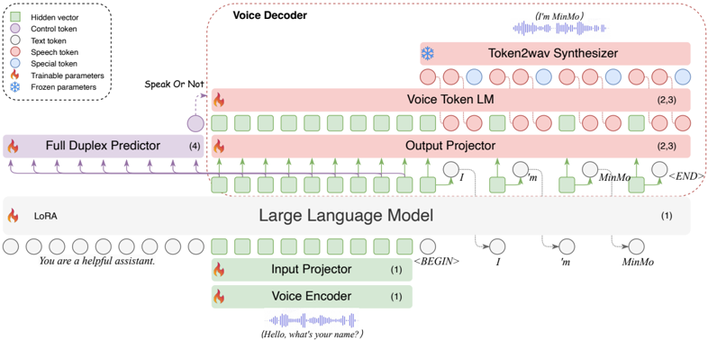

> [!abstract] arXiv · 2025 · Preprint
> **Chen et al.** (Alibaba Group) · [→ Paper](https://arxiv.org/abs/2501.06282) · Demo: ✓ · Code: ?
>
> MinMo is an aligned multimodal LLM (~8B parameters) trained on 1.4 million hours of speech data that achieves full-duplex voice interaction with ~600ms latency through a four-stage alignment strategy and a novel streaming voice decoder that enables nuanced instruction-following control over emotion, dialect, and speaking rate.

## Problem

Prior aligned multimodal models for voice interaction faced two concrete shortcomings. First, they were trained on relatively small datasets (LLaMA-Omni on 200K samples, Freeze-Omni on 120K hours), leaving open the question of whether larger speech corpora would substantially improve performance. Second, existing aligned models were investigated on a narrow set of speech tasks and lacked systematic evaluation of instruction-following capabilities for rich speaking-style control. Native multimodal models such as Moshi addressed some of these gaps but introduced their own challenges: the sequence length mismatch between speech tokens and text tokens complicates scaling, and speech-text co-training with sparse speech data tends to degrade the LLM's original text capabilities through catastrophic forgetting. No prior aligned model had demonstrated that instruction-conditioned style control (emotion, dialect, speaking rate, voice mimicry) was achievable within the aligned paradigm.

## Method

MinMo adopts an aligned multimodal architecture that adapts a pretrained text LLM by adding audio input and output pathways without fundamentally replacing the LLM's operating regime. The backbone is Qwen2.5-7B-Instruct (~7B parameters). Audio understanding is handled by a SenseVoice-Large voice encoder (~636M parameters) connected to the LLM via a two-layer Transformer plus CNN input projector (~170M parameters). The LLM parameters are kept largely frozen or updated only through LoRA during most training stages.

The more distinctive contribution is the streaming voice decoder. Rather than using a non-autoregressive decoder (as in LLaMA-Omni) or a three-part composite (as in Freeze-Omni), MinMo introduces a single autoregressive Voice Token LM initialized from CosyVoice 2's language model (~370M parameters). The decoder operates on interleaved sequences of semantic vectors and speech tokens in a fixed 5:15 ratio: every five text tokens produce five semantic vectors via a linear output projector, and these drive fifteen autoregressive speech tokens from the Voice Token LM. The token-to-waveform conversion uses CosyVoice 2's chunk-aware flow-matching synthesizer and mel-to-wave vocoder. End-to-end instruction control (emotion, dialect, speaking rate, voice identity) is achieved by conditioning on hidden embeddings from the LLM, which carry the user instruction context through to the audio output.

Full-duplex capability is added through a lightweight Full Duplex Predictor (single Transformer layer, ~18M parameters) that reads LLM hidden states to decide when the system should respond or yield to the user. Total model size is approximately 8B parameters across all components.

Training proceeds through four stages, each freezing earlier modules and training only the newly added components. Stage 1 (Speech-to-Text Alignment) uses ~1.2M hours to align the voice encoder and input projector to the LLM's semantic space, with LoRA applied to the LLM only during instruction fine-tuning. Stage 2 (Text-to-Speech Alignment) trains the output projector and Voice Token LM using 170K hours of TTS data plus ~1K hours of instruction-conditioned synthesis. Stage 3 (Speech-to-Speech Alignment) continues training on ~10K hours of simulated multi-turn conversational speech. Stage 4 (Duplex Interaction Alignment) trains only the Full Duplex Predictor on ~4K hours of long-form human-human conversation.

## Key Results

On ASR, MinMo achieves 1.64% WER on LibriSpeech test-clean and 3.82% on test-other (without language ID prompt), outperforming Whisper Large-v3 and Qwen2-Audio with or without LID conditioning. Its Common Voice multilingual average (7.16% without LID) is substantially better than Whisper (11.94%) and Qwen2-Audio (12.6%), and notably MinMo shows minimal dependence on language identification prompts while the baselines degrade significantly without them.

On speech translation (CoVoST2), MinMo achieves 38.92 BLEU average across nine directions, outperforming SeamlessM4T Large v2 (37.79) and a cascaded Whisper+Qwen2.5-7B pipeline (32.22). On Fleurs multilingual translation, MinMo achieves strong results on xx-to-zh and xx-to-en directions.

For voice generation on the Seed-TTS test set, MinMo's decoder achieves 2.48% CER (zh) and 2.90% WER (en) versus CosyVoice 2-SFT at 2.06% CER and 3.19% WER, with NMOS scores of 3.69/3.56 versus 3.73/3.71 — a small gap attributable to differing fine-tuned speaker acoustics. The instruction-following accuracy for voice generation (emotion, dialect, speaking rate, role-playing) reaches 98.4% overall versus 63.1% for GLM-4-Voice on an in-house 122-turn Chinese test set.

On spoken question answering (Llama Questions, TriviaQA, Web Questions), MinMo achieves the strongest speech-to-speech scores reported: 64.1%, 37.5%, and 39.9% accuracy respectively, substantially outperforming Moshi (21.0%, 7.3%, 9.2%) and GLM-4-Voice (50.7%, 26.5%, 15.9%) in S2S mode. The speech-to-text mode also leads on Llama Questions (78.9%) and Web Questions (55.0%).

Full-duplex turn-taking on the simulated test set reaches positive F1 of 0.99 at offset K=10. On real human-human conversation (Alimeeting), assistant turn-taking F1 reaches 0.80 at K=10, with an average response latency of 448ms. The end-to-end full-duplex response latency is ~600ms in theory (250ms duplex decision + 150ms text generation + 70ms speech token generation + 130ms token-to-wave), and ~800ms in practice on L20 GPUs.

## Novelty Assessment

The primary architectural novelty is the streaming voice decoder: interleaving LLM hidden states with autoregressive speech tokens at a fixed 5:15 ratio is a clean design that outperforms both NAR (LLaMA-Omni) and composite multi-decoder (Freeze-Omni) approaches. The claim that aligned multimodal models can support rich style control through end-to-end training contradicts the prevailing assumption (stated by GLM-4-Voice) that only native multimodal models can control speech style and prosody.

The four-stage alignment curriculum is well-motivated but incremental relative to prior staged-alignment work. The Full Duplex Predictor is a straightforward addition. The large-scale training (1.4M hours, spanning ASR, translation, emotion, speaker analysis, and conversational speech) is the most consequential engineering contribution: it substantially exceeds prior aligned models in data volume and task breadth, and the performance improvements are likely attributable to this scale as much as to architectural choices.

The evaluation is broad and the baseline reproductions appear careful (authors re-ran baselines with consistent post-processing), which increases confidence in the comparison validity. However, the instruction-following evaluation uses an in-house test set with only 122 turns, and the model and code had not been released at the time of publication.

## Field Significance

> [!tip]
> High — MinMo provides strong evidence against the widely-held assumption that aligned multimodal models cannot achieve rich speech style control, directly challenging the framing established by GLM-4-Voice. Its scale (1.4M hours across 12+ task types) and breadth of evaluation represent the most comprehensive aligned spoken conversational agent benchmark at the time of publication, and the streaming voice decoder design provides a cleaner, more reproducible blueprint than multi-decoder alternatives.

## Claims

- Large-scale multi-task training across heterogeneous speech tasks substantially improves both comprehension and generation in aligned multimodal speech LMs without catastrophic forgetting of the base LLM's text capabilities. *(§3.4, §4.1–4.5)*
- Aligned multimodal architectures can achieve instruction-controlled speech style (emotion, dialect, speaking rate, voice identity) when trained with appropriate instruction data, contradicting prior claims that this capability is limited to native multimodal models. *(§3.2, §4.4, Table 18)*
- Full-duplex spoken dialogue at sub-second latency is achievable with a modular aligned architecture combining a semantic predictor with a streaming autoregressive decoder, without requiring joint speech-text pre-training. *(§3.1, §4.5, Table 21)*
- An autoregressive streaming voice decoder that interleaves text hidden states with speech tokens outperforms non-autoregressive CTC-based decoders in naturalness and content consistency for aligned speech LMs. *(§3.2, §4.4, Table 17)*

## Limitations and Open Questions

> [!warning]
> The instruction-following voice generation evaluation uses a single in-house Chinese test set of 122 turns, making external validation of the 98.4% accuracy figure impossible. Code and model weights had not been released at time of publication.

LoRA-only updates to the text LLM during training limit the model's ability to follow diverse instructions; more comprehensive LLM updates with higher-quality text data remain unexplored. Long-tail pronunciation errors persist in end-to-end audio generation, partly due to special symbols that the decoder cannot reliably convert to speech. The full-duplex module still relies on external acoustic echo cancellation (AEC) and voice activity detection (VAD) modules, meaning a truly end-to-end duplex system has not been achieved. Performance on speech emotion recognition in low-resource languages shows mixed results (e.g., Polish at 55.9% F1), indicating that cross-lingual generalization is uneven despite the broad multilingual training.

## Wiki Connections

**Concept pages:** [[spoken-language-model]] · [[speech-to-speech]] · [[instruction-conditioned-tts]] · [[zero-shot-tts]] · [[emotion-synthesis]] · [[multilingual-tts]]

**Related papers (in corpus):**
- [[2407.04051]] — FunAudioLLM, the team's prior foundation work
- [[2407.05407]] — CosyVoice (original), whose architecture the voice decoder builds on
- [[2412.10117]] — CosyVoice 2, whose LM and token2wav synthesizer are directly reused
- [[2410.00037]] — Moshi, the primary native multimodal baseline throughout
- [[2411.00774]] — Freeze-Omni, the primary aligned multimodal baseline
- [[2409.06666]] — LLaMA-Omni, whose NAR decoder MinMo's AR decoder supersedes
- [[2411.13577]] — WavChat survey that surveys this class of spoken dialogue models
- [[2412.02612]] — GLM-4-Voice, whose style-control claims MinMo directly contradicts
- [[2407.10759]] — Qwen2-Audio, used as baseline on ASR and speech analysis tasks
- [[2406.02430]] — SEED-TTS, evaluation benchmark for voice generation

[[2507.16632]] — Step-Audio 2 Technical Report
