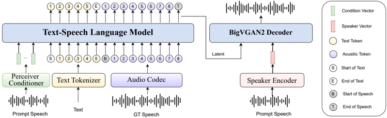

> [!abstract] arXiv · 2025 · Preprint
> **Deng et al.** (bilibili) · [→ Paper](https://arxiv.org/abs/2502.05512) · Demo: ✓ · Code: ?
>
> IndexTTS is a hybrid autoregressive-GAN zero-shot TTS system built on XTTS and Tortoise, with a Conformer-based speaker conditioning encoder, FSQ acoustic tokenisation, and BigVGAN2 speech decoder, achieving strong intelligibility and speaker similarity across Chinese and English with lower GPU utilisation than comparable open-source systems.

## Problem

LLM-based TTS systems that rely on multi-codebook codecs (like VALL-E) achieve high audio quality but suffer from slow inference, training instability, and difficulties with real-time streaming. End-to-end diffusion approaches (F5-TTS, Seed-TTS) also resist streaming. Meanwhile, prior hybrid systems such as XTTS and Tortoise showed weaknesses in speaker similarity, codebook utilisation under small training data, and handling of Chinese polyphonic characters, which are a significant production concern for Chinese-language video creation platforms.

## Method

IndexTTS follows the hybrid three-stage pipeline introduced by XTTS: a speech-to-codec VAE tokeniser, a text-to-codec autoregressive LM, and a latent-to-waveform decoder. The system supports Chinese and English, using a BPE text tokeniser with a vocabulary of 12,000 tokens that includes 8,400 Chinese characters together with 1,721 corresponding pinyin representations. To handle polyphonic characters, a character-pinyin hybrid modelling approach is used at training time: 50% of training samples have 20% of their non-polyphonic Chinese characters randomly replaced with pinyin, training the model to accept pinyin corrections at inference.

The acoustic tokeniser is a VAE (~50M parameters) that encodes 24 kHz mel-spectrograms at 25 Hz with 8,192 codes. The paper compares Vector Quantization (VQ) against Finite Scalar Quantization (FSQ) with levels [8, 8, 8, 6, 5], finding that VQ collapses to around 55% codebook utilisation at 6k hours of training data whereas FSQ reaches near-100% utilisation; at 34k hours both converge. The LM uses a decoder-only transformer conditioned via SEQ3 format (speaker info, text tokens, audio tokens), with prompt text not required at inference. Speaker conditioning uses a Conformer-based Perceiver encoder with a subsampling rate of 2, replacing the single-vector speaker embeddings used by Tortoise and CosyVoice. This Perceiver can aggregate features from multiple reference utterances of arbitrary length. The speech decoder directly converts the LM's last hidden state to waveform via BigVGAN2, with a 4x interpolation step from 25 Hz to 100 Hz before decoding. Training used 34,000 hours of web-sourced Chinese-English audio after voice separation, speaker segmentation, and Demucs-based quality filtering, with ASR-generated pseudo-labels.

## Key Results

On objective metrics across four test sets (LibriSpeech test-clean, AISHELL-1, CommonVoice zh, CommonVoice en), IndexTTS achieves an average WER of 3.7% versus 5.9% for CosyVoice2, 8.2% for F5-TTS, and 8.3% for FishSpeech (Table 3). Average speaker similarity (SPK-SIM) is 0.776 for IndexTTS, just below CosyVoice2's 0.788 but above all other baselines. The human reference upper bound is 0.836 SPK-SIM.

In subjective MOS (double-blind, 100 samples, three dimensions: prosody, timbre, quality), IndexTTS scores 4.01 average versus 3.81 for CosyVoice2 and 3.66 for F5-TTS (Table 4). The largest advantage is in timbre (4.20 vs. 4.05) and quality (4.05 vs. 3.73). On inference efficiency, IndexTTS completes 200 test samples in 397 seconds at 28.5% GPU utilisation, compared to 805 seconds at 48.4% for CosyVoice2 and 320 seconds at 42.1% for F5-TTS (Table 5).

For polyphonic character correction, 18.6% of 2,500 test sentences contained pronunciation errors when using character-only input; 94% of those errors were resolved by providing pinyin input (Table 2).

Comparisons are made against open-source systems only, on shared test sets, though the MOS evaluation uses an unspecified mix of 100 samples and the SPK-SIM model (ERes2Net) differs from those used in some baseline papers, so cross-paper MOS comparisons should be treated with some caution.

## Novelty Assessment

The IndexTTS architecture is an engineering integration of established components: XTTS's three-stage pipeline, BigVGAN2 vocoder, FSQ quantisation (from Mentzer et al. 2023), and Conformer encoders. The genuinely novel elements are the character-pinyin hybrid tokenisation approach for Chinese controllability and the application of a Conformer Perceiver for multi-reference speaker conditioning. The FSQ versus VQ comparison provides useful empirical evidence but is not a contribution from this paper. The training data pipeline and the SEQ3 conditioning choice are practical engineering decisions rather than architectural innovations. The work is best characterised as a well-executed industrial system that improves on XTTS across multiple dimensions, with the character-pinyin approach offering a clear contribution to Chinese-language TTS controllability.

## Field Significance

Moderate — IndexTTS provides solid empirical evidence that the hybrid autoregressive-GAN pipeline (single codebook, direct waveform decoding) can match or exceed diffusion-based and multi-codebook autoregressive systems on intelligibility and MOS while improving inference efficiency. The character-pinyin hybrid modelling introduces a practical approach to pronunciation controllability for Chinese TTS that can serve as a template for other logographic languages with polyphonic characters.

## Claims

- Speaker conditioning via a multi-reference Conformer Perceiver improves zero-shot voice cloning stability and timbre consistency over single-vector speaker embeddings. *(§2.3, Table 4)*
- Direct waveform decoding from LM hidden states via a GAN vocoder achieves competitive audio quality with faster inference than diffusion-based intermediate representation decoding. *(§2.4, Table 5)*
- FSQ reaches near-100% codebook utilisation with less training data than VQ, though VQ converges to similar utilisation with sufficient data scale. *(§3.3.2, Figure 2)*
- Hybrid character-pinyin tokenisation enables reliable correction of Chinese polyphonic character mispronunciations at inference time without requiring a separate grapheme-to-phoneme module. *(§3.3.1, Table 2)*

## Limitations and Open Questions

> [!warning]
> Model size is not reported, and the training data pipeline uses proprietary internet-sourced audio with pseudo-labels from commercial ASR; neither the data nor the code is released, limiting reproducibility.

The system is limited to Chinese and English, with acknowledged weak emotional expression replication. Instruction-based voice generation is explicitly unsupported. The MOS evaluation relies on 100 samples from an unspecified test set distribution, and the SPK-SIM metric uses ERes2Net rather than a standardised model, making direct comparison with published baselines difficult. The paper does not report streaming latency or real-time factor, despite positioning the hybrid architecture as streaming-capable.

## Wiki Connections

- [[autoregressive-codec-tts]] — three-stage hybrid pipeline (VAE tokeniser, AR LM, GAN decoder) following XTTS design
- [[zero-shot-tts]] — speaker conditioning from reference audio without speaker-specific fine-tuning
- [[neural-codec]] — FSQ-based VAE at 25 Hz with 8,192 codes as the acoustic tokeniser
- [[gan-vocoder]] — BigVGAN2 directly decodes LM hidden states to waveform at 24 kHz
- [[multilingual-tts]] — Chinese and English supported via character-pinyin hybrid tokenisation
- [[2406.04904]] (XTTS) — primary architectural base; IndexTTS extends with Conformer Perceiver and FSQ
- [[2305.07243]] (TorToise) — prior hybrid AR-GAN TTS system; conditioning design improved upon
- [[2301.02111]] (VALL-E) — foundational codec AR TTS; contrasted on inference efficiency
- [[2412.10117]] (CosyVoice 2) — primary comparison baseline on WER, SPK-SIM, and MOS
- [[2410.06885]] (F5-TTS) — diffusion-based baseline; IndexTTS outperforms on WER and MOS
- [[2411.01156]] (Fish-Speech) — competing multilingual zero-shot system
- [[2406.02430]] (Seed-TTS) — compared baseline
- [[2206.04658]] (BigVGAN) — vocoder backbone (BigVGAN2) used as the speech decoder
