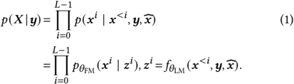

> [!abstract] arXiv · 2025 · Preprint
> **Hui Wang et al.** · [→ Paper](https://arxiv.org/abs/2502.11128) · Demo: ✓ · Code: ?
>
> FELLE combines an autoregressive transformer language model with a token-wise coarse-to-fine flow-matching mechanism that uses the previous mel-spectrogram frame as an informed prior, achieving improved speaker similarity in zero-shot TTS while retaining near-state-of-the-art intelligibility.

## Problem

Discrete-token autoregressive TTS systems (VALL-E family) require lossy vector quantization, which degrades fidelity and complicates training. Continuous-token alternatives like MELLE address this with regression losses (L1/L2 or flux loss), but these assume oversimplified unimodal output distributions that blur predictions and inadequately model the multimodal structure of mel-spectrograms. Additionally, prior continuous-token models treat temporal dependencies only implicitly through the autoregressive recurrence: SALAD denoises per-token latent diffusions independently, while MELLE's frame-level flux loss does not explicitly enforce spectral continuity across adjacent frames. The result is models that trade off intelligibility against speaker similarity rather than improving both simultaneously.

## Method

FELLE operates directly on 80-dimensional log-magnitude mel-spectrogram frames (80 Hz, 16 kHz audio) without any neural codec or vector quantization. The system has two coupled components.

**Autoregressive language model.** A 12-layer Transformer decoder (16 attention heads, feed-forward dimensionality 4,096, embedding dimension 1,024) processes phoneme tokens and a mel-spectrogram speech prompt via a pre-net linear projection. At each autoregressive step it emits a latent hidden state z_i that encodes both linguistic content and accumulated acoustic context.

**Token-wise coarse-to-fine flow matching (C2F-FM).** Rather than using a standard Gaussian prior, FELLE initialises the flow-matching ODE for frame i from the previous predicted frame x_{i-1} via a Gaussian centred at that frame (variance sigma^2 = 0.1). This learned prior dramatically reduces the number of function evaluations (NFE) required: 3 NFEs suffice versus 7+ for a vanilla Gaussian prior, without quality loss.

The C2F-FM module performs two sequential flow-matching stages per frame. In the coarse stage, a small network predicts the even-indexed mel bands (downsampled coarse representation) conditioned on z_i. In the fine stage, a second network predicts the residual high-frequency details conditioned jointly on z_i and the upsampled coarse estimate, explicitly coupling low- and high-frequency components. Both stages share the same residual-block backbone (3 blocks, 1,024-dimensional fully connected layers), which contributes roughly 18M total parameters to the C2F-FM heads.

Classifier-free guidance (CFG) is applied to both stages jointly: the speech prompt is randomly masked with probability 0.1 during training, and at inference guided vector fields are blended at scale w = 1.6.

The full training objective combines the C2F-FM flow-matching loss, an L1+L2 condition loss that regularises z_i against the target frame, and a binary cross-entropy stop-prediction loss. A HiFi-GAN vocoder reconstructs waveforms from the predicted mel-spectrograms. The model was trained for 2 million iterations on 8 NVIDIA V100 GPUs on LibriSpeech 960h.

## Key Results

Evaluations on LibriSpeech test-clean use two zero-shot schemes: continuation (same utterance, first 3 s as prompt) and cross-sentence (different utterance from the same speaker as prompt).

On MOS (automated via RAMP+), FELLE scores 3.836 (continuation) and 4.157 (cross-sentence), versus MELLE's 3.843 and 4.036 respectively and ground truth 4.043. FELLE is the only system to exceed ground truth MOS on the harder cross-sentence task.

On WER-C (Conformer-Transducer), FELLE achieves 1.53% continuation and 2.20% cross-sentence, matching MELLE's 1.53% and 2.21% — both near or below ground truth WER of 1.61%.

On speaker similarity (SIM-r, WavLM-TDNN embeddings), FELLE scores 0.539 continuation (+0.022 over MELLE's 0.517) and 0.654 cross-sentence (+0.021 over MELLE's 0.633). Compared with discrete-token baselines, FELLE achieves substantially higher SIM scores; VALL-E reaches only 0.508 continuation SIM-r.

Ablations confirm all three novel components contribute: removing the previous-frame prior degrades both WER and SIM; replacing C2F-FM with holistic (HFM) or decoupled (DFM) flow matching degrades one or both metrics. The C2F-FM network size of 3 residual blocks at width 1,024 (18M params) is the sweet spot — larger heads overfit.

## Novelty Assessment

The primary contribution is the combination of two ideas that individually exist elsewhere but have not been joined in this way: (1) using the preceding mel-spectrogram frame as an informative prior for per-token flow matching (reducing NFE by more than half while improving temporal coherence), and (2) hierarchical coarse-to-fine decomposition within each flow-matching step to explicitly couple low- and high-frequency spectral bands. The use of continuous mel-spectrograms rather than codec tokens follows the recent MELLE and SALAD trend, so the architecture family is not new. The combination is well-motivated and the ablations are thorough. The contribution is primarily an architectural refinement over MELLE, with the learned prior being the more original element. Model size is not reported for the LM backbone (parameter count omitted in the paper), which limits reproducibility comparisons.

## Field Significance

Moderate — FELLE advances the continuous-AR TTS line of work by demonstrating that an autoregressive-context-aware flow-matching prior can simultaneously improve speaker similarity and reduce inference steps relative to a standard Gaussian prior. The contribution is architectural rather than foundational: it extends MELLE's mel-spectrogram framework with two complementary mechanisms whose combination had not previously been demonstrated. The paper provides clean ablation evidence isolating each component's contribution, making it a useful reference point for subsequent continuous-AR TTS work.

## Claims

- Autoregressive context from the preceding mel-spectrogram frame provides a more informative prior for per-token flow matching, enabling high-quality synthesis with fewer function evaluations than a standard Gaussian prior. *(§4.2, §6.2, Table 3)*
- Hierarchical coarse-to-fine spectral decomposition within each flow-matching step improves speaker similarity over holistic or fully decoupled generation approaches in continuous-token autoregressive TTS. *(§4.2, §6.2, Table 3)*
- Continuous mel-spectrogram autoregressive models can match discrete-token systems on intelligibility while substantially surpassing them on speaker similarity in zero-shot TTS. *(§6.1, Table 2)*
- The number of flow-matching function evaluations introduces a trade-off in autoregressive TTS: moderate NFE improves intelligibility but excessive NFE degrades both intelligibility and speaker similarity. *(§6.3, Figure 3)*

## Limitations and Open Questions

- The model operates at 16 kHz with 80-band mel features; extension to 24 kHz or higher fidelity representations is not addressed.
- Inference is significantly slower than non-autoregressive systems due to the frame-by-frame autoregressive loop compounded with 3 flow-matching NFEs per frame. Streaming or parallel decoding is not explored.
- Training and evaluation are English-only (LibriSpeech); multilingual zero-shot capability is not tested.
- The LM parameter count is not stated, making it difficult to assess compute efficiency relative to MELLE or VALL-E.
- The MOS evaluation uses automatic prediction (RAMP+) rather than human listeners; discrepancies with human MOS are possible, especially when comparing systems at similar quality levels.
- Coarse-to-fine decomposition uses a fixed downsampling strategy (even-indexed frames); more principled spectral decompositions (e.g., sub-band filterbanks) are unexplored.

## Wiki Connections

FELLE advances the [[autoregressive-codec-tts]] paradigm by operating on continuous representations rather than codec tokens, avoiding the information bottleneck of vector quantization. The token-wise [[flow-matching]] prior is the central methodological novelty, extending conditional flow matching (Lipman et al. 2022) to exploit autoregressive context. It directly competes with and builds on MELLE (arXiv 2407.08551), the primary continuous-AR baseline. The [[zero-shot-tts]] capability is demonstrated via prompt-conditioned speaker identity transfer. The coarse-to-fine spectral hierarchy connects to [[prosody-control]] in that it explicitly models frequency-domain structure. The HiFi-GAN vocoder situates FELLE within the [[gan-vocoder]] ecosystem for waveform reconstruction.

In-corpus related papers: [[2505.13181]] (KALL-E-style continuous AR, cited as related work) and [[2412.16846]] (next-distribution prediction AR, cited as contemporaneous continuous-token work). Back-linked by [[2508.19098|CLEAR]], which uses FELLE as a direct comparison baseline for continuous AR TTS on LibriSpeech-PC. Also cited by [[2507.22746|Dragon-FM]], which positions its hybrid chunk-AR+FM approach relative to FELLE's per-token flow matching.
