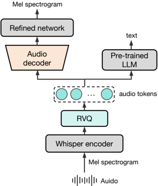

> [!abstract] arXiv · 2025 · Preprint
> **Li et al.** (Baichuan Inc.) · [→ Paper](https://arxiv.org/abs/2502.17239) · Demo: ? · Code: ✓
>
> Baichuan-Audio introduces an end-to-end audio LLM that tightly couples a custom multi-codebook tokenizer with a two-stage pretraining strategy and text-guided interleaved generation, enabling real-time bilingual (Chinese and English) speech interaction with substantially lower intelligence degradation than prior systems.

## Problem

Extending LLMs to end-to-end spoken conversational agents forces a trade-off: integrating audio tokens as native LLM inputs tends to erode the model's language reasoning capabilities, because audio sequences carry duration and paralinguistic information that disrupts the semantic coherence the LLM learned over text. Cascade systems (ASR + LLM + TTS) sidestep this but introduce latency and lose paralinguistic signals. Existing end-to-end approaches such as Moshi handle this via multi-stream decoding, while GLM-4-Voice uses text-guided interleaved generation, but both still exhibit a notable drop in intelligence relative to their pure-text counterparts. The challenge is to close this gap while retaining real-time capability.

## Method

Baichuan-Audio builds on a 7B-parameter LLM backbone (Baichuan) extended with three interconnected components: a custom audio tokenizer, an independent audio head, and a flow-matching audio decoder.

**Baichuan-Audio-Tokenizer.** Audio is encoded at 12.5 Hz using the Whisper Large encoder followed by a residual convolutional network with 4x downsampling. An 8-layer residual vector quantisation (RVQ) stage quantises the resulting features with a decreasing codebook size schedule ({8K, 4K, 2K, 1K, 1K, 1K, 1K, 1K}). The tokenizer is trained jointly with a multi-objective loss combining Mel spectrogram reconstruction (L1+L2 at multiple scales), text prediction from a frozen LLM (for semantic alignment), and VQ commitment. Layerwise dropout concentrates semantic content in the top codebook layers, analogous to the design principle in SpeechTokenizer. Ablations show that 8-layer VQ achieves the best balance between semantic preservation (WER 5.3% vs. 26.2% for 1-layer on LibriSpeech) and acoustic reconstruction quality (Mel MAE 0.466).

**Audio LLM.** The LLM receives audio embeddings formed by summing the 8 per-codebook embedding layers. An independent audio head (3-layer depth transformer with 8 classification heads, depth 8) processes the generated audio tokens separately from the main LLM head, allowing specialised capture of audio token characteristics. During inference the model alternates text and audio token generation, with modality-switching special tokens enforcing alignment, so text completion always precedes audio generation for the corresponding utterance.

**Flow-matching decoder.** A U-Net-based conditional flow-matching decoder (OT-CFM, trained on 270k hours at 24 kHz) refines VQ-compressed Mel spectrograms before vocoding with HiFi-GAN. The decoder raises UTMOS from 3.43 (VQ alone) to 4.05, approaching ground truth (4.08), while also reducing WER from 2.84% to 2.78% on LibriSpeech-dev.

**Two-stage pretraining.** In Stage 1, the LLM is frozen and only audio embeddings and the audio head are updated. In Stage 2, all parameters except the text embedding and LM head become trainable. This staged approach is designed to prevent audio modality training from overwriting textual knowledge; ablations (Table 5) show it closes roughly 2 percentage points of the S→T accuracy gap on sStoryCloze relative to single-stage training. The full pretraining corpus is approximately 887k hours, combining ASR (185k h), AQA (21k h), S2TT (15k h), interleaved audio-text (INTLV, 393k h), TTS (51k h), interleaved TTS (ITTS, 142k h), and pure audio (80k h). Loss over audio segments in INTLV data is dropped to avoid modality conflict.

## Key Results

On the OpenAudioBench suite (Reasoning QA, Llama Questions, Web Questions, TriviaQA, AlpacaEval), Baichuan-Audio outperforms GLM-4-Voice (9B) in S→S mode across all tasks, with particularly large margins on Reasoning QA (+11.4) and AlpacaEval (+20.7). In S→T mode it is competitive with VITA-1.5 (7B) and MiniCPM-o 2.6 (7B). On sStoryCloze (general intelligence), two-stage training achieves 79.6, compared to 77.5 for the single-stage variant and 83 for the pure-text T→T baseline, placing Baichuan-Audio closer to the text ceiling than prior open-source systems.

On ASR, Baichuan-Audio-Base achieves WER 3.2% on Fleurs test-zh, well below Whisper-large-v3 (12.4%) and marginally better than Qwen2-Audio-Base (4.3%). It also handles Chinese dialects (KeSpeech) and challenging meeting scenarios comparably to Qwen2-Audio-Base. On speech translation (Covost-2), it surpasses Qwen2-Audio-Base in both zh2en and en2zh BLEU. TTS quality on an in-house MED-TTS test set yields WER 2.71%, though no MOS comparison to external TTS systems is reported.

The gap to the closed-source GPT-4o-Audio baseline remains substantial across all benchmarks (e.g. 41.9 vs 55.6 on Reasoning QA, S→T).

## Novelty Assessment

The main architectural contribution is the Baichuan-Audio-Tokenizer: an 8-layer RVQ design combining Whisper encoder features with semantic alignment via a frozen LLM and multi-scale Mel reconstruction, trained with layerwise codebook dropout. This represents genuine design work beyond simply combining EnCodec and SpeechTokenizer, though it draws directly on both. The two-stage pretraining strategy is not technically novel (frozen-first approaches appear in Freeze-Omni and related work), but the specific instantiation for intelligence preservation is well-motivated and the ablation evidence is credible. The flow-matching decoder follows Matcha-TTS and CosyVoice closely; its inclusion is an engineering integration. The overall system architecture is closest to GLM-4-Voice but with the added audio head as a distinct component. The primary contribution is the combination of these elements in an open, bilingual, real-time system with a large-scale training corpus and full open-source release (data, model, and code).

## Field Significance

> [!tip]
> High — Baichuan-Audio demonstrates that the intelligence degradation problem in end-to-end speech LMs can be substantially mitigated through careful tokenizer design (multi-objective RVQ with semantic alignment) and staged pretraining, narrowing the S→T vs T→T gap to within 3 percentage points on sStoryCloze at 7B scale. The full open-source release (including 887k hours of training data) provides a replicable baseline for the community. Its benchmark suite (OpenAudioBench) can serve as a reproducible evaluation framework for spoken conversational agents.

## Claims

- Multi-codebook RVQ tokenizers with semantic alignment objectives better preserve both acoustic and linguistic content than single-codebook designs, with each additional layer reducing ASR error substantially up to 8 layers. *(§3.1, Table 1)*
- Staged pretraining (frozen LLM first, then joint training) measurably reduces intelligence degradation in end-to-end speech LMs relative to single-stage joint training. *(§3.3.1, Table 5)*
- Text-guided aligned generation, where the model completes text tokens before emitting the corresponding audio tokens, mitigates semantic incoherence in speech LM outputs. *(§3.3, §4.1)*
- Flow-matching decoders trained as post-VQ refinement stages recover significant audio quality lost during quantisation, with UTMOS improvements of 0.6 points possible without retraining the LLM. *(§3.2, Table 3)*
- End-to-end speech LMs evaluated in S→S mode exhibit notably lower benchmark performance than the same model evaluated in S→T mode, indicating that audio token generation itself introduces a quality penalty beyond the comprehension step. *(§4.3, Table 8)*

## Limitations and Open Questions

> [!warning]
> The TTS quality evaluation is limited to an in-house test set (MED-TTS); no comparison against standard TTS benchmarks (VCTK, LJSpeech, LibriTTS test-clean) or against dedicated TTS systems is reported. The naturalness and speaker similarity of the generated speech relative to state-of-the-art TTS systems is therefore unknown.

The intelligence gap to GPT-4o-Audio remains large (roughly 15-20 percentage points on QA tasks), and the paper does not explain what architectural or data factors account for this difference. The OpenAudioBench evaluation uses GPT-4o as judge, which may introduce evaluation bias. The full-duplex and interruption-handling capabilities common in deployed spoken conversational agents are not evaluated. Training data mix decisions (e.g. dropping INTLV audio loss, ITTS loss design) are motivated empirically but without systematic ablation.

## Wiki Connections

Core architecture concepts: [[spoken-language-model]], [[neural-codec]], [[autoregressive-codec-tts]], [[flow-matching]], [[self-supervised-speech]], [[speech-to-speech]]

Related systems compared or cited: [[2410.00037]] (Moshi), [[2412.02612]] (GLM-4-Voice), [[2409.06666]] (LLaMA-Omni), [[2411.00774]] (Freeze-Omni), [[2407.05407]] (CosyVoice), [[2301.02111]] (VALL-E), [[2411.17607]] (GLM-4 scaling), [[2412.17048]] (speech LM semantic incoherence), [[2210.13438]] (EnCodec), [[2407.10759]] (Qwen2-Audio), [[2407.08551]] (ARST)
