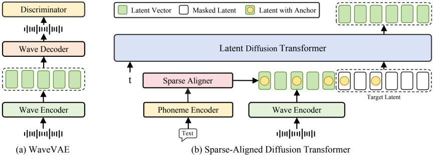

> [!abstract] arXiv · 2025 · Preprint
> **Jiang et al.** (Zhejiang University, ByteDance) · [→ Paper](https://arxiv.org/abs/2502.18924) · Demo: ✓ · Code: ?
>
> MegaTTS 3 proposes a sparse alignment mechanism that inserts coarse phoneme anchor tokens into the latent speech sequence to guide a latent diffusion transformer, combining the robustness of forced-alignment systems with the naturalness of implicit-alignment systems while supporting accent intensity control via multi-condition classifier-free guidance.

## Problem

Zero-shot TTS models face a persistent trade-off in speech-text alignment. Implicit-alignment approaches, where attention mechanisms learn the mapping end-to-end, suffer from robustness failures on hard sentences and cannot control individual phoneme durations. Forced-alignment methods, which precompute duration paths from an external aligner, achieve better intelligibility but constrain the model's generation search space and introduce naturalness penalties tied to the accuracy of the duration model. Prior work chooses one extreme or the other; MegaTTS 3 is motivated by the observation that neither extreme is necessary.

A secondary gap is accent control. Existing accented TTS systems require explicit accent labels or paired data, limiting their applicability.

## Method

MegaTTS 3 combines a continuous latent codec (WaveVAE) with a rectified-flow latent diffusion transformer. The WaveVAE encoder compresses 16 kHz speech into a highly compact continuous latent space at 25 vectors per second, achieved by a VAE with KL regularisation, spectrogram reconstruction loss, and adversarial discriminators (multi-period, multi-scale, and multi-resolution). The compact latent rate is intentional: the authors show that fewer tokens per second substantially improves the quality of the downstream diffusion model (§4.5, Table 6).

The diffusion transformer backbone follows the LLaMA block structure with RoPE positional embeddings, 24 layers, 1024 embedding dimensions, and 16 attention heads, totalling 339M parameters. It is trained with a masked speech modelling objective: a segment of the latent sequence is randomly masked as the target, and the model predicts its rectified-flow velocity conditioned on a prompt region and phoneme embeddings.

The sparse alignment strategy is the paper's primary contribution. Instead of expanding phoneme tokens to fill every latent frame (forced alignment) or learning alignment purely via attention (implicit alignment), MegaTTS 3 randomly retains one anchor per phoneme from the forced-alignment path, replacing remaining frames with mask tokens. These sparse anchors are downsampled and concatenated with the latent sequence along the channel dimension. The anchors provide approximate positional cues per phoneme without locking the model into a rigid duration mapping, allowing the transformer's attention layers to refine the alignment detail. The result preserves the intelligibility advantage of forced alignment while recovering the naturalness benefit of implicit alignment.

For acceleration, MegaTTS 3 applies Piecewise Rectified Flow (PeRFlow) distillation: the ODE trajectory is divided into K time windows, and a student model is trained to span each window in fewer steps by mimicking the teacher's endpoint within each window. This reduces inference from 25 to 8 sampling steps with negligible quality loss.

Multi-condition classifier-free guidance separates the text guidance scale (alpha-txt) and speaker guidance scale (alpha-spk). During training, the speaker prompt is dropped independently at 10% probability, and the phoneme condition is further dropped at 50% probability only when the speaker prompt is dropped. At inference, varying alpha-txt independently of alpha-spk is found to shift pronunciation systematically along an accent intensity axis, from distorted to accented to standard English, without any accent labels in training.

## Key Results

On the LibriSpeech test-clean set (NaturalSpeech 3 protocol), MegaTTS 3 achieves WER 1.82% and SIM-O 0.71, the best among all compared systems including VALL-E 2 (0.4B), VoiceBox (0.4B), NaturalSpeech 3 (0.5B), CosyVoice, MaskGCT (1.0B), and F5-TTS (Table 1). CMOS is anchored at 0.00 (reference level) and SMOS reaches 3.98, matching NaturalSpeech 3 (3.95) and outperforming all other baselines. On the LibriSpeech-PC protocol (Table 2), MegaTTS 3 again leads in both SIM-O (0.70) and WER (2.31%), edging out F5-TTS (SIM-O 0.66, WER 2.42%).

Prosodic naturalness metrics (GPE, VDE, FFE, Table 4) show sparse alignment improving over forced alignment by a meaningful margin: GPE drops from 0.44 to 0.31, VDE from 0.33 to 0.29, FFE from 0.37 to 0.34. The accelerated model (8 steps vs. 25) retains nearly identical SIM-O (0.70 vs. 0.71) and WER (1.86% vs. 1.82%), with RTF dropping from 0.188 to 0.124 (Table 1).

For robustness on hard sentences (Table 11), MegaTTS 3 achieves 3.95% WER versus 4.28% for F5-TTS and 8.49% for E2-TTS on the ELLA-V challenge set. Scaling experiments (Table 8) show that SIM-O improves from 0.52 at 2k training hours to 0.66 at 600k hours, and a 7B parameter model reaches 0.74 SIM-O and 1.90% WER, confirming data and model scalability.

Accented TTS on L2-ARCTIC (Table 3) shows MegaTTS 3 outperforming the CTA-TTS baseline in MCD (5.69 vs. 5.98 dB), ASMOS (3.84 vs. 3.72), and pitch distribution statistics, using no accent labels during training.

## Novelty Assessment

The sparse alignment idea is genuinely novel in its formulation: rather than treating alignment as a binary choice between hard and soft, it introduces a minimal constraint (one stochastic anchor per phoneme) that preserves the model's generative freedom. The concept is simple enough that the paper can justify it analytically and demonstrate the gains clearly in ablation (Table 7: +0.17 CMOS over forced alignment, -0.12 CMOS over no alignment).

The WaveVAE codec is an engineering contribution, not an architectural novelty independently, but the decision to use 25 continuous tokens/s (vs. 50-600 for discrete codecs) and its measured impact on TTS quality (Table 6) is a substantive empirical finding about codec design choices for diffusion-based TTS.

The multi-condition CFG mechanism for accent control is an adaptation of an established technique, though the emergent accent-axis behaviour (that alpha-txt smoothly interpolates accent intensity without annotation) is a notable practical finding.

The PeRFlow distillation follows prior work directly and is applied without modification.

## Field Significance

> [!tip]
> High — MegaTTS 3 demonstrates that a middle path between forced and implicit alignment is both tractable and strongly beneficial, providing a concrete algorithmic solution to a persistent trade-off that has constrained all prior latent diffusion TTS systems. The sparse alignment formulation is simple enough to be adopted by other systems, and the strong results across intelligibility, naturalness, speaker similarity, and robustness benchmarks provide well-calibrated evidence about the alignment design space. Its accent control finding, that standard CFG guidance scale can serve as an accent intensity dial without paired labels, provides a potentially reusable technique for customised TTS.

## Claims

- Providing coarse stochastic phoneme anchors rather than fully expanded forced alignments improves both naturalness and robustness simultaneously in latent diffusion TTS. *(§3.2, §4.3, Table 4, Table 7)*
- Compact continuous latent representations at very low token rates enable higher zero-shot TTS quality than discrete codecs at higher bit rates when used as the target space for diffusion. *(§4.5, Table 5, Table 6)*
- Piecewise rectified flow distillation reduces inference steps from 25 to 8 with negligible degradation in speaker similarity and intelligibility. *(§3.2, §4.2, Table 1)*
- Decoupled text and speaker guidance scales in classifier-free guidance provide a continuous accent intensity control axis without requiring accent labels. *(§3.2, §4.4, Table 3)*
- Latent diffusion TTS systems exhibit strong data and model scaling behaviour, with both speaker similarity and intelligibility improving consistently as training data grows from 2k to 600k hours and model size grows from 0.5B to 7B parameters. *(Appendix D, Table 8)*

## Limitations and Open Questions

> [!warning]
> The main results are reported on LibriSpeech test-clean, a read-speech corpus recorded in controlled conditions. The scaling and cross-domain results (Appendix D) use an internal test set of 400 samples, limiting external reproducibility for those claims.

Language coverage is restricted to English and Chinese despite the 600k-hour multilingual training corpus. The sparse alignment mechanism still depends on an external forced aligner (Montreal Forced Aligner) at training time, which requires a transcription pipeline and does not eliminate the dependency on alignment tools, merely relaxing it. The relationship between alignment anchor density and generation quality is explored only qualitatively; no principled analysis determines the optimal sparsity level. Code and checkpoints are not publicly available at time of writing.

## Wiki Connections

- [[flow-matching]] — MegaTTS 3 is trained with rectified flow and uses PeRFlow distillation to reduce ODE steps, demonstrating flow matching's efficiency advantage in latent diffusion TTS.
- [[diffusion-tts]] — the system is a latent diffusion transformer using a continuous VAE latent space at 25 tokens/s, contributing evidence that compact continuous latents outperform discrete codecs as diffusion targets.
- [[zero-shot-tts]] — achieves strong SIM-O and WER on LibriSpeech test-clean and LibriSpeech-PC benchmarks for zero-shot voice cloning from short prompts.
- [[neural-codec]] — introduces WaveVAE as the compression backbone, benchmarking it against EnCodec, DAC, WavTokenizer, and X-codec2, and demonstrating that continuous latents at 25 tokens/s produce superior TTS quality.
- [[prosody-control]] — the sparse alignment mechanism enables explicit per-phoneme duration adjustment and the multi-condition CFG mechanism provides a continuous accent intensity control axis.
- [[speaker-adaptation]] — the masked speech modelling objective allows the system to learn speaker timbre from any audio prompt at inference, supporting zero-shot adaptation without fine-tuning.
- [[2406.02430]] (Seed-TTS) — competing large-scale zero-shot TTS system; MegaTTS 3's naturalness and intelligibility results are comparable or superior.
- [[2406.05370]] (VALL-E 2) — autoregressive codec language model baseline; MegaTTS 3 surpasses it in SIM-O (0.71 vs. 0.64) while being non-autoregressive.
- [[2403.03100]] (NaturalSpeech 3) — primary forced-alignment baseline; MegaTTS 3 matches intelligibility and speaker similarity while achieving higher prosodic naturalness through sparse rather than hard alignment.
- [[2304.09116]] (NaturalSpeech 2) — earlier latent diffusion TTS baseline using predefined alignments; establishes the forced-alignment paradigm that MegaTTS 3 seeks to improve upon.
- [[2301.02111]] (VALL-E) — foundational autoregressive codec LM; establishes the zero-shot TTS paradigm the paper evaluates against.
- [[2407.05407]] (CosyVoice) — LLM-plus-flow-matching baseline in both zero-shot and accented TTS experiments.
- [[2406.18009]] (E2 TTS) — fully implicit alignment baseline; MegaTTS 3 substantially outperforms it on hard-sentence WER (3.95% vs. 8.49%).
- [[2409.00750]] (MaskGCT) — non-autoregressive codec-based baseline; MegaTTS 3 achieves better SIM-O (0.71 vs. 0.69) with a much smaller model (0.3B vs. 1.0B).
- [[2408.16532]] (WavTokenizer) — compared as a codec baseline in WaveVAE reconstruction experiments.
- [[2404.03204]] (RALL-E) — autoregressive codec LM cited for alignment robustness issues that motivate MegaTTS 3's alignment approach.
- [[2502.04128]] (Llasa) — concurrent scaling work on speech synthesis; shares training data scalability motivation.
- [[2303.03926]] (VALL-E X) — cross-lingual extension of VALL-E; cited as part of the codec language model family.
