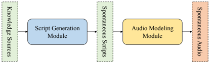

> [!abstract] arXiv · 2025 · Preprint
> **Ju et al.** (Moonshot AI) · [→ Paper](https://arxiv.org/abs/2503.14345) · Demo: ✓ · Code: ✓
>
> MoonCast introduces a long-context, two-speaker zero-shot TTS system capable of generating spontaneous, coherent podcast audio of up to ten minutes from text-only sources (PDF, URL, plain text) using unseen speaker voices, through a combined LLM-powered script generation module and a curriculum-trained autoregressive codec language model.

## Problem

Standard zero-shot TTS systems are designed for short single-speaker utterances and struggle on two counts when applied to real-world podcast generation. First, podcasts span several minutes and involve multiple speakers in sequence; context lengths of 5+ minutes translate to sequences of 15,000+ semantic tokens, far exceeding what most TTS systems can model coherently. Second, podcasts are fundamentally spontaneous: they contain filler words, hesitations, repetitions, and dynamic speaker interaction that formal read-speech TTS data does not capture. Prior dialogue generation work (e.g., dGSLM, CHATS) is limited to datasets of about 2,000 hours and dialogue clips under 90 seconds, and does not support zero-shot multi-speaker generation from arbitrary text sources.

## Method

MoonCast decomposes podcast generation into two stages: (1) spontaneous script generation from a knowledge source, and (2) long-context speech synthesis from the generated script using unseen speaker voices.

**Script generation module.** An LLM (Gemini 2.0 Pro) converts input documents into a two-speaker podcast script via a three-step pipeline: content analysis, briefing document creation (with structured sections covering abstract, main topics, key citations, and conclusion), and script generation. The script prompt explicitly instructs the LLM to include filler words ("um", "uh", "like", "you know"), response words ("yeah", "right"), repetitions, and informal grammar. The paper demonstrates empirically that spontaneous scripting alone accounts for a large fraction of the final audio spontaneity.

**Long-context text-to-semantic model.** A 2.5B-parameter Llama-style transformer (16 layers, hidden size 3072, 24 attention heads) autoregressively generates discrete semantic speech codes from podcast script text. The semantic codec is a VQ-VAE trained on W2v-BERT 2.0 SSL features (17th layer) at 50Hz with an 8192-entry codebook. The sequence design interleaves full podcast text with full speech codes (rather than per-turn interleaving), using speaker-change tokens to signal speaker transitions. Reference speech prompts for both speakers are prepended, enabling zero-shot voice conditioning for each speaker throughout the sequence. Training uses curriculum learning across three stages: single-turn single-speaker zero-shot TTS; long-context two-speaker non-conversational data (audiobooks, up to 40,000 tokens / 800 seconds); and long-context two-speaker conversational data (podcasts).

**Chunk-wise autoregressive speech detokenizer.** A 0.8B-parameter DiT-style flow-matching model converts semantic codes into mel-spectrograms chunk by chunk (3-second chunks at inference). A chunk-wise causal attention mask allows each chunk to attend to all previously generated chunks, preserving continuity across boundaries without loading the full sequence. BigVGAN (250M parameters) then converts mel-spectrograms to waveforms.

## Key Results

On the Chinese podcast benchmark (Table 1), MoonCast outperforms both the concatenation baseline and CosyVoice2 across all subjective dimensions: spontaneity (4.25 vs. 3.85 vs. 3.63), coherence (4.13 vs. 3.80 vs. 3.38), and speaker similarity (3.98 vs. 3.75 vs. 3.78). On the English benchmark (Table 2), spontaneity (4.63 vs. 3.58 vs. 3.78) and coherence (4.50 vs. 3.58 vs. 3.80) show especially large gains. CER reaches 2.15% (Chinese) and 1.91% (English), demonstrating robustness of the semantic codec pipeline under long-context generation. However, SIM-O (automatic speaker cosine similarity) is notably lower for MoonCast on English (0.53 vs. 0.75 for the concatenation baseline), attributed to insufficient audiobook data in the English training curriculum, which the authors acknowledge as a limitation.

The spontaneous script ablation (Table 3) is particularly revealing: removing spontaneous details from the ground-truth script drops spontaneity from 4.16 to 3.21, a gap almost as large as the gap between the proposed system and the best baseline. Reintroducing spontaneous details via LLM largely recovers the score (4.03). This establishes the script generation component as roughly equal in importance to the audio modeling component.

## Novelty Assessment

MoonCast makes two genuine contributions. The long-context two-speaker sequence design (full-text-to-full-audio interleaving with speaker-change tokens, extended to 40,000-token context windows) is a non-trivial adaptation of the standard VALL-E-style codec LM approach to the multi-speaker long-form setting. The chunk-wise autoregressive flow-matching detokenizer (borrowing the causal mask idea from ARDiT) addresses a real engineering problem in long-sequence mel reconstruction without sacrificing continuity. Curriculum learning across three data complexity stages is sensible but not novel in itself.

The script generation module is straightforward LLM prompting (Gemini 2.0 Pro with structured prompts); the finding that spontaneous scripting significantly impacts audio spontaneity is empirically useful but not architecturally novel. The training data (515K hours internal) and comparisons are limited to an internal evaluation set of 4 documents and 7 podcasts, which restricts reproducibility. The SIM-O drop on English suggests the system has unresolved speaker consistency issues at scale.

## Field Significance

> [!tip]
> High — MoonCast demonstrates that long-context, multi-speaker, spontaneous speech generation is achievable within the codec LM paradigm by extending sequence design and training curriculum, rather than requiring a fundamentally new architecture. It also provides rigorous empirical evidence that the text input quality (specifically, spontaneous scripting) is as important to perceived naturalness as the acoustic model itself, a finding with direct practical implications for speech pipeline design.

## Claims

- Spontaneous scripting from an LLM is roughly as important as the acoustic modeling choice for perceived spontaneity in long-form dialogue TTS. *(§4.2.2, Table 3)*
- Full-sequence interleaving of text and speech codes, extended to 40,000-token context windows with speaker-change tokens, enables coherent long-form zero-shot multi-speaker synthesis that turn-level concatenation cannot match. *(§3.2.1, Tables 1–2)*
- Curriculum learning, progressively exposing a codec LM to increasing dialogue complexity, is an effective strategy for developing long-context and spontaneous generation capability without requiring matched long-context data from the outset. *(§3.2.1)*
- Automatic speaker similarity metrics (cosine embedding similarity) can disagree with subjective speaker similarity ratings in long-form generation settings, particularly when the acoustic model attends to prosodic rather than purely timbral features. *(§4.2.1)*
- Chunk-wise autoregressive decoding with a causal chunk mask provides a practical solution to the continuity and memory constraints of mel-spectrogram reconstruction from long semantic code sequences. *(§3.2.2)*

## Limitations and Open Questions

> [!warning]
> All evaluation is conducted on a small internal test set (4 knowledge sources for podcast, 7 podcasts for the script ablation), and training data is entirely proprietary (~515K hours). Results cannot be independently reproduced, and generalisability to other domains or languages beyond Chinese and English is unverified.

The notably lower SIM-O score for English (0.53 vs. 0.75 baseline) reveals unresolved speaker consistency challenges in the English long-context setting, which the authors attribute to an imbalanced training curriculum favouring audiobook over conversational English data. Hallucinations in speaker attribution (utterances assigned to the wrong speaker) emerge from the interplay of semantic token timbre leakage, diarization errors in training data, and ambiguous filler-word interpretations; no mitigation is proposed beyond discussion. The two-speaker restriction (host + guest) is a deliberate scope limitation; extension to three or more speakers is left as future work. Evaluation is subjective-only for multi-speaker interactions; no standardised zero-shot TTS benchmark (LibriSpeech, VCTK) is used, limiting direct comparison to single-speaker zero-shot systems.

## Wiki Connections

- [[autoregressive-codec-tts]] — extends the codec LM paradigm (VALL-E family) to long-context, two-speaker podcast generation with a novel full-sequence interleaving design.
- [[zero-shot-tts]] — achieves zero-shot voice conditioning for two unseen speakers simultaneously across a podcast-length generation using reference speech prompts.
- [[multilingual-tts]] — demonstrates joint Chinese and English podcast generation through a multilingual curriculum training stage.
- [[neural-codec]] — uses a VQ-VAE semantic codec derived from W2v-BERT 2.0 SSL features as the intermediate discrete representation bridging text-to-semantic and semantic-to-audio stages.
- [[spoken-language-model]] — the 2.5B autoregressive LM is the core generation backbone, leveraging LLM-style in-context learning for long-context speaker conditioning.
- [[flow-matching]] — the chunk-wise autoregressive speech detokenizer uses a DiT-based flow-matching model for semantic-code-to-mel conversion.
- [[2406.02430]] (Seed-TTS) — uses single semantic codebook approach for reducing discrete code generation difficulty; MoonCast builds on this line for multi-speaker extension.
- [[2412.10117]] (CosyVoice 2) — serves as a single-speaker zero-shot TTS baseline in the podcast generation evaluation.
- [[2403.03100]] (NaturalSpeech 3) — prior zero-shot speech synthesis system from overlapping authors; MoonCast extends toward long-form multi-speaker generation.
- [[2301.02111]] (VALL-E) — foundational codec LM for zero-shot TTS; MoonCast's text-to-semantic model is a direct descendant scaled to long-context two-speaker dialogue.
- [[2409.00750]] (MaskGCT) — provides the VQ-VAE semantic codec design (W2v-BERT 2.0, 50Hz) that MoonCast adopts directly for its speech semantic representation.
- [[2406.05370]] (VALL-E 2) — extends VALL-E with improved codec LMs for zero-shot TTS; MoonCast builds on this line for the multi-speaker, long-form setting.
