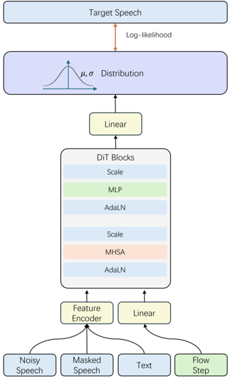
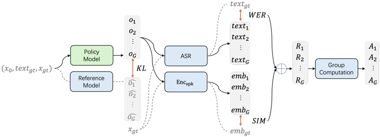

> [!abstract] arXiv · 2025 · Preprint
> **Sun et al.** (Tencent) · [→ Paper](https://arxiv.org/abs/2504.02407) · Demo: ✓ · Code: ?
>
> F5R-TTS introduces Group Relative Policy Optimization (GRPO) into a flow-matching TTS system by reformulating the model's deterministic outputs as probabilistic Gaussian distributions, enabling reinforcement learning to directly optimise intelligibility and speaker similarity in a non-autoregressive setting.

## Problem

Reinforcement learning has proven effective for aligning autoregressive TTS systems with human-preference proxies such as WER and speaker similarity, but integrating RL into non-autoregressive (NAR) architectures remains an open problem. Flow-matching models produce deterministic outputs at each denoising step, which are structurally incompatible with the policy-gradient formulations that underpin algorithms like GRPO. Prior work on RL for TTS (e.g., Seed-TTS with PPO/REINFORCE) operated exclusively in the autoregressive codec-LM paradigm; no successful application of RL to NAR TTS had been demonstrated.

## Method

F5R-TTS adapts F5-TTS as its backbone and introduces two sequential training phases. In the pretraining phase, the final linear layer of the F5-TTS DiT-based model is modified to output a mean and variance rather than a single deterministic velocity vector. The model is then trained under a modified flow-matching objective that maximises the log-likelihood of the target velocity under the predicted Gaussian, making the pretraining phase functionally equivalent to the original flow-matching loss while rendering the outputs probabilistic.

In the GRPO phase, the pretrained model serves as both the policy model and the (frozen) reference model. At each GRPO step, the policy samples G candidate speech outputs by drawing from the predicted Gaussian at every flow step. Two reward signals are computed: a WER-based semantic reward (using SenseVoice ASR) and a speaker-similarity reward (using WeSpeaker cosine similarity). Group-relative advantage estimation normalises rewards within each group before computing the GRPO objective. A KL penalty against the frozen reference model constrains drift from the pretrained distribution. The entire GRPO phase uses only 100 hours of data from the same Mandarin corpus and runs for 1,100 update steps on 8 A100 GPUs, compared to 1 million steps in pretraining.

The evaluation uses mel-spectrogram acoustic features throughout; no neural codec is involved. Input text and reference speech are conditioned via the text-guided infilling formulation inherited from F5-TTS.

## Key Results

On the Seed-TTS-eval test-cn general set (Mandarin), F5R-TTS achieves a WER of 1.48% versus 2.10% for vanilla F5-TTS, a 29.5% relative reduction. Speaker similarity rises from 0.698 to 0.730 (4.6% relative). On the hard set (tongue twisters and repetitive text), WER drops from 11.30% to 10.63% (6.1% relative) and SIM improves from 0.673 to 0.711 (5.6% relative). A noise-robustness subset using noisy reference audio shows an even larger WER benefit (33.6% relative reduction: 2.32% to 1.54%), suggesting GRPO also improves robustness to reference audio quality. Results on an internal 10,000-hour Mandarin dataset corroborate the findings (18.4% WER reduction, 3.1% SIM improvement on the general set), ruling out dataset-specific overfitting.

The paper also shows via t-SNE visualisation of speaker embeddings that F5R-TTS produces tighter per-speaker clusters, and via global variance (GV) analysis that its mel-spectrogram variance aligns more closely with reference speakers than either the baseline or the intermediate probabilistic model.

All comparisons are between the same pretrained base trained on identical data, isolating the contribution of the GRPO phase. No subjective (MOS) evaluation is reported.

## Novelty Assessment

The core technical contribution is the reformulation of flow-matching outputs as Gaussian distributions, enabling policy-gradient RL algorithms to operate on NAR TTS for the first time. This is a genuine methodological bridge: the probabilistic output layer is a targeted modification that leaves the rest of the architecture unchanged, and GRPO itself is adapted without modification from its LLM use. The choice of GRPO (from DeepSeekMath) over PPO reduces implementation complexity by eliminating the value network. The reward design (WER + speaker cosine similarity) follows Seed-TTS directly but is newly applied in the NAR setting.

The paper is honest about what is left unaddressed: only Mandarin is evaluated, no naturalness (MOS) results are reported, and the hard-set WER (10.63%) remains notably higher than the general-set figure, indicating that complex phonetic sequences continue to challenge the system.

## Field Significance

Moderate — F5R-TTS provides the first demonstration that RL post-training can improve a flow-matching TTS system, closing a gap that existed relative to autoregressive codec-LM approaches (Seed-TTS, KOEL-TTS). The probabilistic output reformulation is a transferable technique: any deterministic continuous-output generative model with a final linear layer could in principle adopt this pattern to become RL-compatible. The study is limited to Mandarin and objective metrics, so the perceptual implications remain uncharacterised, but the directional results are consistent across two datasets.

## Claims

- Reformulating the output of a flow-matching TTS model as a Gaussian distribution is sufficient to enable standard policy-gradient RL algorithms without architectural redesign. *(§2.2)*
- GRPO with WER and speaker-similarity rewards consistently reduces word error rate and increases speaker similarity in non-autoregressive TTS post-training, across diverse Mandarin datasets. *(§3.2.2, Table 1, Table 2)*
- RL post-training that optimises speaker-similarity reward also improves robustness to noisy reference audio, not only clean-reference speaker cloning. *(§3.2.2, Table 1)*
- Hard text (tongue twisters and repetitive phrasing) degrades all flow-matching TTS variants substantially, and RL training with WER rewards provides smaller relative gains in this regime than on plain text. *(§3.2.2, Table 1)*
- The GRPO phase requires only a small fraction of the pretraining data (100 h out of 7,226 h) and update steps to achieve measurable objective improvements, suggesting that RL fine-tuning is data-efficient for this task. *(§3.1)*

## Limitations and Open Questions

> [!warning]
> No subjective evaluation (MOS or MUSHRA) is reported. All claimed improvements are based on automatic WER and speaker cosine similarity, which are proxy metrics. Whether GRPO post-training preserves or alters naturalness remains untested.

Evaluation is restricted to Mandarin (Seed-TTS-eval test-cn). Generalisation to English, multilingual, or cross-lingual settings is not studied. The model builds directly on F5-TTS architecture and the WenetSpeech4TTS corpus; adapting to other flow-matching backbones or languages would require separate experiments. The hard-set WER (10.63% for F5R-TTS vs. 11.30% for F5) remains high in absolute terms, indicating that difficult phonetic sequences are not resolved by RL post-training alone. Future directions identified by the authors include PPO and DDPO integration, improved reward design for challenging scenarios, and larger-scale training experiments.

## Wiki Connections

- [[flow-matching]] — this paper extends the flow-matching TTS paradigm by adding a probabilistic output layer and RL post-training phase on top of a standard DiT-based flow-matching backbone.
- [[rlhf-speech]] — F5R-TTS is the first application of a GRPO-style RL algorithm to a non-autoregressive TTS architecture, using WER and speaker similarity as reward signals.
- [[zero-shot-tts]] — the system targets zero-shot voice cloning, conditioning on a reference utterance to reproduce target speaker characteristics without speaker-specific training.
- [[autoregressive-codec-tts]] — the paper contrasts the NAR flow-matching approach with autoregressive codec-LM systems (VALL-E family, Seed-TTS) where RL had previously been applied, establishing the motivation for this work.
- [[2301.02111]] (VALL-E) — cited as a representative autoregressive codec-LM TTS system, providing context for the contrast between AR and NAR RL integration.
- [[2406.05370]] (VALL-E 2) — cited as further AR TTS context showing human-parity zero-shot synthesis; F5R-TTS targets the same capability in the NAR paradigm.
- [[2410.06885]] (F5-TTS) — the direct architectural predecessor from which F5R-TTS derives its backbone; the probabilistic output modification is applied to F5-TTS's final linear layer.
- [[2406.02430]] (Seed-TTS) — the primary inspiration for the RL post-training approach; Seed-TTS demonstrated WER+SIM-based RL for AR TTS, which F5R-TTS adapts to the flow-matching setting.
- [[2402.08093]] (BaseTTS) — cited as a large-scale AR TTS system, part of the autoregressive landscape that motivates NAR alternatives.
