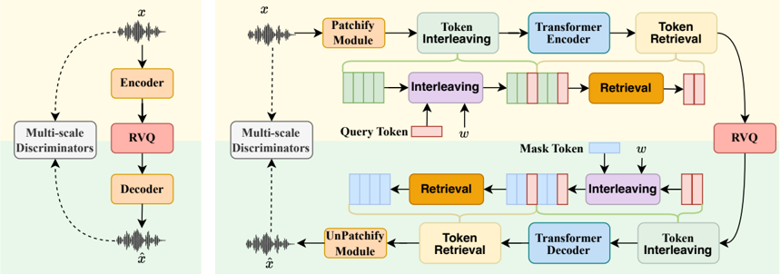

> [!abstract] arXiv · 2025 · Preprint
> **Yang et al.** (The Chinese University of Hong Kong) · [→ Paper](https://arxiv.org/abs/2504.10344) · Demo: ? · Code: ?
>
> ALMTokenizer introduces a query-based compression strategy for neural audio codecs that explicitly models cross-frame context using learnable query tokens, achieving 0.41 kbps with stronger semantic content than prior codecs while outperforming them as a tokenizer backbone for language model-based speech, sound, and music tasks.

## Problem

Frame-level audio codecs such as EnCodec treat each audio frame independently during quantization, ignoring contextual information across frames. This design limits compression efficiency and makes the resulting tokens semantically thin: the residual vector quantization (RVQ) layers beyond the first carry little structured content, causing autoregressive language models to struggle with predicting them. Prior low-bitrate codecs either sacrifice reconstruction quality (semantic tokenizers with diffusion decoders) or retain high reconstruction but encode minimal semantic structure (acoustic codecs). The result is that codec choice materially affects downstream language model performance, yet codec design has largely optimised for reconstruction rather than LM-friendliness.

## Method

ALMTokenizer replaces the per-frame encoding paradigm with a query-based compression strategy. A conventional convolution-based Patchify module (following EnCodec's encoder architecture) first converts raw waveform into a frame sequence. Rather than quantizing these frames directly, a token interleaving module inserts one learnable query token (CLS token) into the frame sequence at every w frames, where w is the compression window size. A causal transformer encoder with sliding attention windows then processes this interleaved sequence, after which a token retrieval module extracts only the query tokens as the compressed representation. Three RVQ layers with a codebook size of 2048 quantize these query tokens at 12.5 Hz, yielding 37.5 tokens per second and a bitrate of 0.41 kbps. A symmetric transformer decoder expands the quantized query tokens back to frame resolution using mask tokens before the UnPatchify module reconstructs the waveform.

Three complementary training objectives augment the standard GAN reconstruction loss. A Masked Autoencoder (MAE) loss encourages the encoder to capture global context: a fraction of input frames is zeroed out, and a separate MAE decoder transformer must reconstruct them, with the mask rate set dynamically between 20-30%. Semantic priors from k-means clustering of wav2vec 2.0 (for speech) and BEATs (for general audio) features initialise and fix the codebook of the first VQ layer, injecting structured semantic content without requiring online distillation. An AR prediction loss trains a lightweight autoregressive transformer to predict the quantized features of deeper RVQ layers from shallower ones, making the latent space more amenable to sequential LM modelling. Training proceeds in two stages: the first stage trains the Patchify/UnPatchify modules as an autoencoder with the MAE loss (no quantization); the second stage freezes the Patchify module and trains the full system including quantization. The complete model is 174M parameters. For downstream evaluation, the codec is paired with a LLaMA 3.2 1B LM augmented with LoRA and a 6-layer depth transformer, following the Moshi framework, across six tasks: TTS, ASR, audio captioning, music captioning, text-to-sound, and text-to-music.

## Key Results

On speech reconstruction at 0.41 kbps (VCTK), ALMTokenizer reaches UTMOS 3.76, DNSMOS 3.64, PESQ 2.0, and STOI 0.81, outperforming MimiCodec at the same bitrate (UTMOS 3.01) and matching WavTokenizer's UTMOS (3.67) despite using roughly half the bitrate. In MUSHRA subjective evaluation, ALMTokenizer scores 84.8 on speech, 72.4 on sound, and 69.0 on music, comparing favourably with WavTokenizer (84.0, 63.1, 54.1) while operating at lower bitrate. Semantic retention, measured by ASR WER on LibriSpeech features using the codec's quantized representations, is 18.3% for ALMTokenizer versus 44.6% for WavTokenizer and 44.1% for DAC; emotion classification accuracy (29%) approaches WavLM (29%) and HuBERT (31%). In LM-based TTS using the same language model framework, ALMTokenizer achieves WER 11.7 compared to WavTokenizer's 18.5, MimiCodec's 16.0, and StableCodec's 22.7 (Table 4). Ablations confirm the query-based framework is the dominant contributor: removing it degrades UTMOS from 3.76 to 2.49 and ASR WER from 18.3 to 34.5. The MAE loss and two-stage training each provide meaningful but smaller improvements. Comparison with SemantiCodec shows ALMTokenizer is 30x faster at inference (RTF 0.031 vs. 0.92) while achieving better reconstruction and semantic scores at lower bitrate (Table 16).

## Novelty Assessment

The query-based compression strategy is genuinely novel for audio codecs: inserting CLS tokens into a frame sequence and using a transformer to compress context into them is adapted from vision (TiTok, BLIP-2) and audio understanding (SALMONN) but had not been applied to the codec quantization stage. The combination of semantic-prior-initialised VQ codebooks and an AR prediction loss for the residual layers is also a practical contribution, directly addressing the observed difficulty of LMs fitting higher RVQ layers. The MAE loss for codec training builds on He et al. 2022 in a straightforward way but is applied here in the codec context rather than pure representation learning. The overall contribution is primarily architectural rather than a pure training-recipe or scale contribution. However, the evaluation is somewhat narrow: all LM experiments use the same small (1B) backbone with limited training data, making it hard to know whether the improvements transfer to frontier-scale audio LMs. The two-stage training strategy increases complexity and discards large components (MAE transformers, AR decoder) after training, as the authors acknowledge.

## Field Significance

Moderate — ALMTokenizer addresses a real design gap: audio codec models optimised for reconstruction are not necessarily optimal for language model training, and this paper empirically validates that both bitrate and semantic richness matter independently. The query-based compression approach provides an alternative to distillation-based semantic injection (used by MimiCodec) and to high-codebook single-layer tokenizers (WavTokenizer, StableCodec). The breadth of evaluation across speech, sound, and music domains is a practical contribution for audio LM researchers choosing a tokenizer backend. The paper's findings reinforce the emerging principle that codec design should be co-optimised with downstream LM objectives rather than treated as an independent reconstruction module.

## Claims

- Frame-level quantization without cross-frame context limits codec semantic richness and increases the difficulty of autoregressive LM training on the resulting tokens. *(§1, Figure 1)*
- Initialising VQ codebook entries from semantic priors derived from self-supervised models improves downstream recognition accuracy without additional distillation overhead. *(§3.2, Table 6)*
- Lower token-sequence length (lower Hz frame rate) improves both training and inference efficiency for audio language models, independent of bitrate. *(Appendix B, Table 8)*
- Reconstruction quality alone is an insufficient predictor of a codec's suitability for autoregressive language modelling: codecs with stronger semantic content produce more robust LM-based TTS even at higher bitrates. *(§4.6, Table 4)*
- A masked autoencoder auxiliary loss during codec training increases semantic information in learned representations at a modest reconstruction cost. *(§3.3, Table 6)*

## Limitations and Open Questions

> [!warning]
> All downstream LM experiments use the same 1B-parameter LLaMA backbone with limited training data (2000 hours speech, ~500 hours each sound/music). Gains observed may not transfer to larger-scale audio LM systems, where baseline tokenizers may reach ceiling performance.

The two-stage training adds complexity and discards large sub-networks (MAE encoder/decoder, AR prediction transformer) after training, increasing resource cost without reuse. The authors note this explicitly and flag it as future work. Sound and music reconstruction remains challenging at 0.41 kbps, with VISQOL scores substantially lower than speech. Semantic retention still lags SSL models for ASR (18.3% WER vs. 6.2% for WavLM), indicating the codec does not fully substitute for purpose-built SSL representations. Code and model weights were not released at submission time, limiting reproducibility.

## Wiki Connections

- [[neural-codec]] — proposes a query-based compression architecture for RVQ-based audio codecs that jointly targets low bitrate and semantic richness, directly advancing codec design for audio LM use cases.
- [[spoken-language-model]] — the paper's primary motivation is improving codec suitability as a tokenizer for autoregressive audio LMs, and its evaluation framework spans six LM-based tasks.
- [[self-supervised-speech]] — uses wav2vec 2.0 and BEATs cluster centroids to initialise VQ codebooks with semantic priors, making self-supervised representations a core component of the training design.
- [[autoregressive-codec-tts]] — evaluated as the tokenizer backbone for LM-based TTS within a Moshi-style framework, with semantic richness shown to directly improve TTS robustness.
- [[2210.13438]] (EnCodec) — adopts the EnCodec-style convolutional Patchify/UnPatchify architecture and GAN training as its backbone, extending it with cross-frame transformer compression.
- [[2410.00037]] (Moshi) — the LM evaluation framework directly follows Moshi's hierarchical audio LM design with a depth transformer, and MimiCodec is the primary baseline for low-bitrate comparison.
- [[2308.16692]] (SpeechTokenizer) — an earlier semantic-acoustic codec that ALMTokenizer improves upon in both reconstruction quality and semantic retention at comparable bitrates.
- [[2408.16532]] (WavTokenizer) — a low-bitrate single-codebook competitor; ALMTokenizer outperforms it on semantic metrics and LM-based TTS while matching subjective reconstruction quality at lower bitrate.
- [[2411.19842]] (StableCodec) — another low-bitrate transformer codec; ALMTokenizer achieves better semantic retention and LM TTS performance despite StableCodec's stronger raw reconstruction scores.
- [[2301.02111]] (VALL-E) — positions itself within the VALL-E lineage of autoregressive codec LMs for TTS, motivating codec design choices by their impact on LM token prediction.
- [[2403.03100]] (NaturalSpeech 3 / FACodec) — cited as a task-driven codec approach; ALMTokenizer positions itself as a general-purpose alternative extending beyond speech to sound and music.
