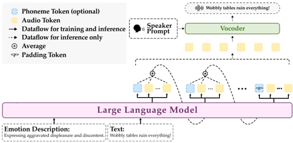

> [!abstract] arXiv · 2025 · Preprint
> **Yang et al.** (Shanghai Jiao Tong University / Tongyi Speech Lab) · [→ Paper](https://arxiv.org/abs/2504.12867) · Demo: ✓ · Code: ✓
>
> EmoVoice extends an LLM-based TTS backbone with freestyle natural language emotion prompting and introduces a parallel phoneme-boost decoding variant that outputs phoneme tokens alongside audio tokens to improve content consistency, along with EmoVoice-DB, a 40-hour synthetic English emotional speech dataset with fine-grained natural language emotion descriptions.

## Problem

Emotion-controllable TTS has largely been limited to coarse-grained categorical labels (happy, sad, angry, etc.) that cannot capture the nuanced, context-specific emotional states needed for expressive synthesis. Natural language description-based control exists in general style-control systems, but no prior work was specifically designed for fine-grained emotion control through freestyle text prompts. Additionally, evaluation of emotional TTS remains unsatisfying: automatic emotion similarity metrics show weak sentence-level alignment with human perception, and whether multimodal LLMs can serve as emotion evaluators is unexamined.

## Method

EmoVoice is built on Qwen2.5-0.5B (24 transformer layers, ~0.49B parameters), initialized from the pretrained LLM weights and extended with a new audio codebook. The model takes a structured prompt combining a natural language emotion description and the text to be synthesized, then autoregressively predicts 50Hz CosyVoice semantic tokens. To compress sequence length and accelerate training, it uses semantic group modeling (from SLAM-Omni): at each decoding step the model predicts G=3 tokens simultaneously via a linear projection from the audio logits, achieving 2.64× faster training than single-token output.

Audio tokens are passed to the CosyVoice flow-matching module and HiFi-GAN vocoder to produce waveforms; a reference speech sample from the same speaker is used as a timbre prompt for the flow-matching step.

Training is two-stage: a standard TTS pretraining phase on large synthetic neutral speech (VoiceAssistant, 3,234h English; Belle, 6,418h Chinese), followed by emotional fine-tuning on EmoVoice-DB, LAION Got Talent, and in-house Chinese data.

**EmoVoice-PP (Phoneme Boost variant)** adds a parallel prediction head that simultaneously outputs phoneme tokens (~11Hz) alongside audio tokens (~17Hz). Phoneme tokens are predicted slightly earlier due to their lower rate and serve as intermediate supervision to guide audio token generation — a design inspired by chain-of-thought and chain-of-modality reasoning. Ground truth phonemes are extracted by Phonemizer for teacher-forcing during training. This variant substantially reduces WER, particularly on a hard-case test set with tongue twisters and technical terms (WER 11.68 vs. 18.07 for the base model).

A 1.5B variant uses Qwen2.5-1.5B (28 layers, 1.54B parameters) and serves as a scaling experiment. Data augmentation is applied to EmoVoice-DB by using GPT-4o to rephrase each emotion description in three ways, improving robustness to varied instruction phrasings and reducing WER by 28.7% relative.

## Key Results

On the English EmoVoice-DB test set (objective), EmoVoice(1.5B) achieves the highest emotion similarity (0.9118) and recall rate (0.424) among open systems, with WER of 2.62 and UTMOS of 4.35. It closely trails GPT-4o-mini-tts (emotion similarity 0.9168, recall 0.456) while exceeding CosyVoice2 (recall 0.37, emotion similarity 0.8647) and PromptTTS (recall 0.291). GPT-4o-audio is treated as an upper-bound reference.

In subjective evaluation (MOS on emotional expressiveness, 30 raters, 60 samples), EmoVoice(1.5B) scores 3.507 vs. CosyVoice2's 2.138 and GPT-4o-mini-tts's 3.598 — a substantial gap over the CosyVoice2 baseline, and near-parity with GPT-4o-mini-tts.

On the Chinese Secap test set, EmoVoice-PP achieves the best WER (7.6), emotion similarity (0.7939), and recall (0.434) among evaluated models, outperforming CosyVoice2 and GPT-series models, which struggle with non-English prosody and timbre.

The ablation on LLM initialization shows it is essential: removing pretrained Qwen2.5 weights raises WER from 2.73 to 6.16 for the base model, confirming that LLM language understanding transfers meaningfully to emotional TTS quality.

Scaling from 0.5B to 1.5B improves recall rate from 0.395 to 0.424 and reduces WER from 2.73 to 2.62, with gains bounded by the limited size of the emotional fine-tuning data.

> [!note]
> All English results are evaluated on EmoVoice-DB, a synthetic dataset generated by GPT-4o-audio. The training data is entirely synthetic for the English model. This conflates the evaluation oracle with the training distribution, which may inflate metrics relative to naturally recorded emotional speech benchmarks.

## Novelty Assessment

EmoVoice's primary novelty is in combining two largely independent prior components — LLM-based autoregressive TTS (from the CosyVoice/SLAM-Omni lineage) and natural language emotion prompting — with the phoneme-boost parallel decoding head. The parallel phoneme output as a content-consistency scaffold is the most architecturally interesting element, distinguishing EmoVoice-PP from interleaved or serial variants compared in the ablation. Group token modeling (from SLAM-Omni) and the use of CosyVoice's flow-matching vocoder stack are adopted rather than introduced.

The contribution of EmoVoice-DB is real but modest: 40 hours of GPT-4o-audio synthetic data with natural language labels is a useful resource, though the dataset is itself derived from a closed proprietary model. The evaluation analysis (Section 7) is a genuine contribution: the finding that sentence-level emotion similarity has only ~40% Spearman correlation with human MOS, and that GPT-4o/Gemini also fall short as emotion evaluators, is practically important for the field.

Overall the contribution sits between engineering integration and architectural novelty: the phoneme-boost design is new, but the surrounding pipeline is assembled from published components.

## Field Significance

Moderate — EmoVoice advances emotion-controllable TTS by pairing LLM backbones with freestyle natural language emotion prompts and demonstrating that parallel phoneme guidance improves content consistency. Its most durable contribution may be the negative finding on emotion evaluation: showing that neither automatic emotion similarity nor multimodal LLM judges reliably track human perception at the sentence level surfaces a gap that future evaluation work will need to close.

## Claims

- Fine-grained natural language emotion descriptions provide richer control over expressive speech synthesis than coarse categorical labels, at the cost of requiring emotion-specific training data.
- Parallel phoneme token prediction as a secondary output head reduces intelligibility errors in LLM-based TTS, particularly on challenging inputs such as rare words and tongue twisters.
- LLM pretraining initialisation meaningfully benefits emotion-controllable TTS: models without it show substantially higher word error rates and weaker emotion transfer.
- Automatic emotion similarity metrics (e.g. emotion2vec cosine similarity) correlate reasonably at the system level but poorly at the utterance level with human perceptual judgments, limiting their utility for fine-grained model comparison.
- Multimodal LLMs are not yet reliable judges of emotional speech quality, exhibiting both low correlation with human ratings and inter-run instability.

## Limitations and Open Questions

> [!warning]
> The English model is trained and evaluated entirely on synthetic data generated by GPT-4o-audio. Both EmoVoice-DB (training) and the test set are GPT-4o-audio outputs, creating circularity: the model learns to mimic GPT-4o-audio's synthesis style rather than natural human emotional speech. Generalisation to real human emotional recordings or to out-of-distribution TTS systems is undemonstrated.

The emotion recall evaluation omits three of seven emotion categories (disgusted, fearful, surprised) due to low recognition accuracy from emotion2vec, which limits the scope of the emotional expressiveness claims.

EmoVoice does not support zero-shot speaker generalisation: speaker identity is controlled via a reference speech prompt passed to the CosyVoice flow-matching module, but the system is not evaluated in a cross-speaker zero-shot scenario.

The phoneme-boost variant (EmoVoice-PP) requires phoneme sequences at training time, adding a preprocessing dependency (Phonemizer) and making extension to languages with complex or poorly supported phonemisers non-trivial.

No efficiency or latency analysis is provided; the streaming characteristics of the grouped decoding approach relative to real-time deployment requirements are not reported.

## Wiki Connections

Concepts: [[autoregressive-codec-tts]] · [[emotion-synthesis]] · [[instruction-conditioned-tts]] · [[neural-codec]] · [[evaluation-metrics]] · [[subjective-evaluation]]

Papers that cite this: [[2508.15931]] (QvTAD — instruction-conditioned TTS for controllable style as a downstream application of timbre attribute modelling).
