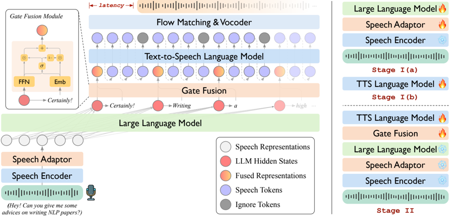

> [!abstract] arXiv · 2025 · Preprint
> **Fang et al.** (Institute of Computing Technology, Chinese Academy of Sciences) · [→ Paper](https://arxiv.org/abs/2505.02625) · Demo: ? · Code: ✓
>
> LLaMA-Omni 2 is a family of modular spoken conversational agents (0.5B–14B parameters) that achieves competitive spoken QA and instruction-following performance by replacing the original non-autoregressive speech decoder with an autoregressive streaming TTS language model and a causal flow matching vocoder, while training on only 200K multi-turn dialogue samples.

## Problem

Modular spoken conversational agents connecting an LLM backbone to a speech decoder face a quality-latency tension: non-autoregressive (NAR) decoders such as the CTC-based one in LLaMA-Omni produce low latency but noticeably unnatural speech, while native speech LMs trained end-to-end (such as GLM-4-Voice) require millions of hours of speech data and still suffer large gaps between their speech-to-text and speech-to-speech accuracy. The question this paper addresses is whether an autoregressive streaming speech decoder, bolted onto a strong LLM backbone with minimal data, can match or exceed native SpeechLMs in both speech quality and semantic fidelity.

## Method

LLaMA-Omni 2 is a modular SpeechLM consisting of three main components: a speech encoder (Whisper-large-v3), an LLM backbone (one of the Qwen2.5-0.5B/1.5B/3B/7B/14B-Instruct variants), and a streaming speech decoder composed of a TTS language model and a causal flow matching vocoder. The speech encoder outputs representations that are compressed by a 5x downsampling adapter (FFN) before being fed to the LLM.

The key architectural contribution is the gate fusion mechanism in the TTS language model (M_TTS, initialized from Qwen2.5-0.5B). Rather than conditioning M_TTS on LLM hidden states alone, the model adaptively blends two representations per output position: a projected hidden state from the LLM (carrying contextual information) and a text token embedding (ensuring alignment with the textual response). A learned sigmoid gate computes a per-position linear interpolation between these two streams. The fused representations drive an autoregressive decoder that generates discrete speech tokens at 25 tokens/second from a CosyVoice 2 FSQ-based tokenizer (6,561 codes). A chunk-aware causal flow matching model then converts speech token chunks into mel spectrograms for streaming synthesis via a HiFi-GAN vocoder.

Streaming is controlled by a Read-Write (R:W) strategy: after every R LLM text tokens are generated, W speech tokens are produced by M_TTS and synthesized as a waveform chunk. The paper evaluates R=3, W=10 as the primary operating point, giving a total first-chunk latency of around 580 ms for the 7B model.

Training proceeds in two stages. Stage I trains the speech-to-text and text-to-speech components separately on text-speech pairs extracted from the 200K dialogue set; the LLM is fine-tuned for S2T while M_TTS is pretrained for streaming TTS using text embeddings only (gate fusion is disabled). Stage II freezes everything except the gate fusion module and M_TTS, training jointly on speech-to-speech data to fuse the hidden-state and embedding streams. The 200K multi-turn dialogue samples are synthesized from Alpaca/UltraChat text data using CosyVoice 2 for responses and FishSpeech-1.5 for diverse instruction voices.

## Key Results

On the SpokenQA benchmarks (Llama Questions, Web Questions), LLaMA-Omni2-7B achieves 70.3% and 34.5% accuracy in the S2T setting and 60.7% and 31.3% in the S2S setting (Table 1), surpassing both LLaMA-Omni (8B) and GLM-4-Voice (9B) at comparable parameter counts. Crucially, the S2T-to-S2S accuracy drop is substantially smaller than competing models: on Web Questions, LLaMA-Omni2-7B drops only 3.2 points vs. 9.7 for LLaMA-Omni and 16.3 for GLM-4-Voice, suggesting that the autoregressive TTS LM better preserves semantic content during speech generation.

On the speech instruction following task (Alpaca-Eval subset), LLaMA-Omni2-7B scores 4.28 (S2T) and 4.15 (S2S) on the ChatGPT score, with an ASR-WER of 3.26%, outperforming GLM-4-Voice (4.16/4.09, 9.02% WER) and LLaMA-Omni (3.99/3.52, 5.95% WER). UTMOS scores across the LLaMA-Omni 2 family range from 4.19 to 4.22, substantially above LLaMA-Omni (3.67) and GLM-4-Voice (3.48). Response latency sits at approximately 540–660 ms across model sizes, higher than LLaMA-Omni's 347 ms but well below GLM-4-Voice's 1,563 ms and the real-time threshold.

Ablation studies confirm the contribution of individual components: removing the gate fusion module reduces S2S ChatGPT score from 4.15 to 4.02 and raises WER from 3.26 to 4.89; removing text embeddings entirely causes a further drop to 3.88 and 6.83% WER (Table 2). TTS pretraining strategy matters significantly: a randomly initialized M_TTS fails to converge, and text-only pretraining without streaming causes WER to reach 10.34% (Table 3). Larger R:W write chunks improve UTMOS (speech quality) at the cost of latency, while smaller values reduce latency at a modest quality cost (Table 4).

## Novelty Assessment

The primary contribution is an engineering integration: LLaMA-Omni 2 assembles a Qwen2.5 LLM backbone, a Whisper encoder, and a CosyVoice 2 streaming speech decoder into a modular SpeechLM and demonstrates that this assembly, trained on 200K samples, rivals a native SpeechLM trained on millions of hours. The gate fusion mechanism is the one genuinely novel architectural element, offering a simple and effective way to inject both contextual and lexical signals into the TTS language model. The R:W streaming strategy and the causal flow matching vocoder are directly adopted from CosyVoice 2. The two-stage training recipe is clean and practical, but straightforward. The paper's main empirical contribution is demonstrating data efficiency at scale: competitive SpeechLM quality from 200K multi-turn samples. The model family (0.5B to 14B) enables useful edge-device deployment analysis, though benchmarks are limited to English and to a narrow instruction-following and QA scope.

## Field Significance

Moderate — LLaMA-Omni 2 provides concrete evidence that modular spoken conversational agents can match native speech LMs in quality and semantic fidelity while requiring orders of magnitude less training data, advancing a practical alternative to large-scale native SpeechLM pre-training. The gate fusion mechanism is a transferable component for future modular SpeechLM designs, and the ablation suite offers useful guidance on the impact of streaming parameters and pretraining strategies.

## Claims

- Autoregressive streaming TTS decoders in modular spoken conversational agents produce higher-quality speech and smaller S2T-to-S2S accuracy gaps than non-autoregressive streaming decoders, at a modest latency cost. *(§5.1, Table 1)*
- Modular spoken conversational agents trained on tens of thousands of hours of synthesized speech-to-speech dialogue can match the performance of native SpeechLMs trained on millions of hours of unsupervised speech data. *(§5.1, Table 1)*
- Jointly conditioning a TTS language model on LLM hidden states and text token embeddings via a learned gate fusion improves both semantic consistency (WER) and instruction-following quality over hidden-state-only conditioning. *(§5.2, Table 2)*
- TTS language model pretraining on text-speech pairs is a critical prerequisite for stable convergence in modular SpeechLMs; initializing from a language model alone is insufficient. *(§5.2, Table 3)*
- In streaming speech generation, the write chunk size (W) primarily determines speech naturalness while the read chunk size (R) primarily determines text-speech alignment, with latency jointly determined by both. *(§5.2, Table 4)*

## Limitations and Open Questions

> [!warning]
> All evaluations are conducted in English only. The model is trained on a single fixed output voice, and no multilingual or voice-diversity experiments are reported. Generalization to other languages or to emotionally expressive speech is untested.

The model cannot modulate speech style (emotion, speaking rate, dialect) in response to paralinguistic cues in the input, because training data contains only conventional speech-to-speech dialogue. The authors note this as planned future work. The benchmarks used (SpokenQA accuracy, ChatGPT score) are narrow and do not cover naturalness in unconstrained conversational settings or robustness to noisy or accented input. Comparisons to Minmo (a concurrent work using 1.4M hours) are mentioned in related work but not included in the main experimental table, leaving the data efficiency claim partially unverified against the most directly comparable system.

## Wiki Connections

- [[spoken-language-model]] — LLaMA-Omni 2 demonstrates that modular SpeechLMs with autoregressive streaming decoders can approach native SpeechLM quality without large-scale pre-training.
- [[streaming-tts]] — the R:W read-write strategy and chunk-aware causal flow matching enable word-synchronous streaming synthesis with sub-600 ms latency.
- [[autoregressive-codec-tts]] — the TTS language model component (M_TTS) uses autoregressive generation of discrete speech tokens via a CosyVoice 2 FSQ tokenizer at 25 Hz.
- [[speech-to-speech]] — the full system implements end-to-end speech-to-speech interaction, replacing the cascade pipeline of ASR + LLM + TTS.
- [[neural-codec]] — the CosyVoice 2 FSQ-based speech tokenizer (6,561 codes, 25 Hz) serves as the discrete speech representation backbone.
- [[2412.10117]] (CosyVoice 2) — LLaMA-Omni 2 directly adopts CosyVoice 2's pretrained speech tokenizer, flow matching model, and vocoder; the R:W streaming strategy is also derived from CosyVoice 2.
- [[2411.00774]] (Freeze-Omni) — compared as a baseline modular SpeechLM that combines NAR and AR decoding with sentence-level streaming; LLaMA-Omni 2 extends this toward token-level streaming with autoregressive generation.
- [[2412.02612]] (GLM-4-Voice) — the primary native SpeechLM baseline; LLaMA-Omni 2 surpasses it on SpokenQA and instruction following with far less training data.
- [[2402.05755]] (SpiRit-LM) — cited as an example of native SpeechLMs using speech-text interleaved data for cross-modal transfer; contrasted with LLaMA-Omni 2's modular approach.
- [[2408.02622]] (LSLM) — cited as a native SpeechLM capable of full-duplex conversation; contextualized against LLaMA-Omni 2's modular streaming design.
- [[2407.04051]] (FunAudioLLM / SenseVoice) — the SenseVoice-Large ASR encoder is used as the backbone for the CosyVoice 2 speech tokenizer adopted in LLaMA-Omni 2.
