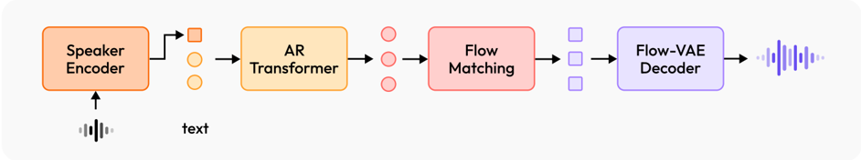

> [!abstract] arXiv · 2025 · Preprint
> **Zhang et al.** (MiniMax) · [→ Paper](https://arxiv.org/abs/2505.07916) · Demo: ✓ · Code: ✗
>
> MiniMax-Speech introduces a jointly-trained speaker encoder that enables true zero-shot voice cloning from untranscribed reference audio, combined with a Flow-VAE decoder, achieving top rank on the Artificial Analysis TTS Arena leaderboard and best-in-class WER on the SeedTTS-eval benchmark.

## Problem

Most prior autoregressive TTS systems require a transcribed text-audio pair at inference for speaker conditioning, which the authors term one-shot learning. This dependency on paired reference data creates several downstream problems: cross-lingual synthesis is hindered when the reference language differs from the target language, transcription errors degrade cloned voice quality, and the model's prosodic decoding space is constrained by the prosodic patterns in the prompt audio. Fixed speaker encoders pre-trained on speaker verification objectives further compound these issues, as their optimization target diverges from the TTS task's requirements for fine-grained timbre capture.

## Method

MiniMax-Speech is an autoregressive Transformer TTS system with three main components: a speech tokenizer, an autoregressive Transformer with integrated learnable speaker encoder, and a latent flow matching decoder built on a novel Flow-VAE.

The speech tokenizer uses an Encoder-VQ-Decoder architecture with vector quantization on mel-spectrograms at 25 tokens per second, with CTC supervision to preserve semantic information. Text is tokenized with Byte Pair Encoding (BPE).

The autoregressive Transformer generates discrete audio tokens from text. Its core innovation is the jointly-trained speaker encoder, which takes a variable-length reference audio segment (without transcription) and compresses it to a fixed-size conditional vector. Because the speaker encoder is trained end-to-end with the AR model rather than imported from a pre-trained speaker verification system, it is optimized specifically for the synthesis task and achieves broader multilingual coverage. The system supports two voice cloning paradigms: zero-shot (conditioning only on the speaker encoder's output from an untranscribed reference) and one-shot (additionally providing a paired text-audio exemplar as an in-context prompt). The paper argues that what prior systems (VALL-E, CosyVoice 2, SeedTTS) call "zero-shot" actually requires transcribed reference audio, making them one-shot by this stricter definition.

The decoder is a flow matching Transformer conditioned on the AR output, a global speaker embedding, and an optional prompt segment. Rather than targeting mel-spectrograms, the flow matching model predicts latent features from a Flow-VAE. The Flow-VAE extends a standard VAE by inserting a normalizing flow between the encoder's posterior distribution and the standard normal prior, enabling a more expressive latent space. The KL divergence constraint is computed between the flow-transformed distribution and the standard normal, allowing the encoder to produce richer representations than a conventional VAE while keeping the latent distribution tractable for flow matching prediction. This yields measurable improvements in both waveform reconstruction quality (higher PESQ, lower MS-STFT loss) and downstream TTS SIM scores.

The system is trained on a proprietary 32-language dataset; model size is not reported. Three downstream extensions are documented: LoRA-based emotion control (separate LoRA modules per emotion category loaded at inference), text-to-voice generation (a compact model predicts speaker embeddings from natural language descriptions and discrete attribute tags), and professional voice cloning (PVC), which fine-tunes only the speaker embedding vector for a target speaker while keeping the AR Transformer frozen.

## Key Results

On the SeedTTS-eval benchmark, MiniMax-Speech in zero-shot mode achieves WER of 0.83% (Chinese) and 1.65% (English), outperforming both Seed-TTS (1.12%, 2.25%) and CosyVoice 2 (1.45%, 2.57%) on intelligibility, which are one-shot systems (§3.2, Table 1). Speaker similarity (SIM) in zero-shot mode reaches 0.783 (Chinese) and 0.692 (English), comparable to ground truth (0.75, 0.73). Notably, zero-shot WER is lower than one-shot WER for MiniMax-Speech itself, suggesting that prompt-based conditioning introduces prosodic bias that harms intelligibility in some cases.

In one-shot mode, MiniMax-Speech SIM (0.799 Chinese, 0.738 English) surpasses ground truth and matches Seed-TTS while outperforming CosyVoice 2.

On the public Artificial Analysis TTS Arena leaderboard (May 2025), MiniMax-Speech (Speech-02-HD) ranks first with an ELO score of 1153, ahead of OpenAI TTS-1 HD (1151), ElevenLabs Multilingual v2 (1116), and Microsoft Azure Neural (1058) (§3.3, Table 2). All Arena samples were generated using zero-shot cloning.

Multilingual evaluation across 24 languages shows MiniMax-Speech SIM consistently and substantially higher than ElevenLabs Multilingual v2 across all tested languages (§3.4, Table 2). WER is comparable in most languages, with MiniMax-Speech showing clear advantages in tonal and complex-inventory languages (Chinese, Cantonese, Thai, Vietnamese, Japanese).

Ablation on speaker conditioning (§3.6, Table 4) confirms the learnable speaker encoder outperforms both fixed speaker embedding (pre-trained speaker verification model) and prompt-only conditioning in WER-SIM balance. Flow-VAE ablation (§3.7, Tables 5-6) confirms improvements over standard VAE in resynthesis (NB-PESQ 4.34 vs. 4.27, WB-PESQ 4.30 vs. 4.20) and TTS SIM.

## Novelty Assessment

Two genuinely new elements are combined here. The learnable speaker encoder joint-trained with the AR model is an established concept (originating in TorToise-TTS, Betker 2023), but the paper contributes a carefully-motivated and rigorously evaluated implementation that distinguishes true zero-shot (no text reference) from one-shot (paired text-audio reference), bringing conceptual clarity that prior work muddied. The Flow-VAE is a more novel contribution: augmenting a VAE's KL regularization term with a normalizing flow to allow a more expressive posterior distribution is not standard practice in TTS systems, and the paper provides quantitative evidence of its benefit in both resynthesis and TTS quality. The downstream extensions (LoRA emotion control, text-to-voice, PVC) are engineering integrations of existing techniques adapted to the disentangled speaker representation rather than new methods in themselves.

The evaluation is thorough, using SeedTTS-eval with methodology aligned to prior work and a public leaderboard for subjective assessment, though the training data is proprietary and the model size is unreported, limiting reproducibility.

## Field Significance

> [!tip]
> High — MiniMax-Speech introduces a principled distinction between zero-shot and one-shot voice cloning that clarifies terminology across a class of AR TTS systems, and demonstrates that jointly training the speaker encoder with the AR model can surpass both fixed-embedding approaches and prompt-only conditioning on intelligibility metrics. The Flow-VAE provides a reusable architectural component for improving latent flow matching quality beyond what mel-spectrogram intermediates or standard VAEs allow. This combination can serve as a reference for future multilingual AR TTS systems targeting high speaker similarity without requiring transcribed reference audio.

## Claims

- Jointly training a speaker encoder with an autoregressive TTS model yields better intelligibility and competitive speaker similarity compared to using a fixed speaker verification embedding. *(§3.6, Table 4)*
- Zero-shot voice cloning conditioned on untranscribed reference audio produces lower word error rates than one-shot conditioning with a paired text-audio exemplar, at the cost of slightly reduced speaker similarity. *(§3.2, Table 1; §3.5, Table 3)*
- Augmenting a VAE with a normalizing flow on the latent space (Flow-VAE) improves both waveform reconstruction quality and downstream TTS speaker similarity over a standard VAE with the same architecture. *(§3.7, Tables 5–6)*
- Speaker encoder representations trained without text dependencies support cross-lingual synthesis with high intelligibility, outperforming prompt-based systems that require transcribed reference audio in cross-lingual scenarios. *(§3.5, Table 3)*
- Disentangled speaker embeddings from a task-specific encoder enable parameter-efficient per-speaker adaptation by fine-tuning only the speaker embedding vector, preserving base model generalization. *(§4.3)*

## Limitations and Open Questions

> [!warning]
> The training dataset is proprietary and the model size is not reported, which makes independent replication impossible. All results are from internal or public leaderboard evaluations only; no code release is indicated.

The leaderboard evaluation (Artificial Analysis Arena) uses preference judgements that may be influenced by sample selection; the Arena snapshot is from a single date (May 12, 2025) and rankings can shift as more models are added. The claim of "top position" is time-bound.

WER metrics for several tested languages (Cantonese, French, Hindi) remain substantially higher than for well-resourced languages, indicating multilingual coverage is uneven. The cross-lingual evaluation is limited to seven target languages using Chinese source speakers, leaving broader cross-lingual generalization untested.

Emotion control via LoRA requires separate training runs per emotion category and discrete emotion labels, which limits granularity. The text-to-voice extension relies on structured attribute tags alongside free-text descriptions, constraining the range of expressible timbres. No human evaluation of the LoRA emotion control or text-to-voice outputs is reported.

## Wiki Connections

- [[zero-shot-tts]] — true zero-shot cloning from untranscribed reference audio via jointly-trained speaker encoder; contrasted with one-shot systems (VALL-E, CosyVoice, SeedTTS) that require a transcribed reference
- [[autoregressive-codec-tts]] — AR Transformer generating discrete speech tokens from BPE text and speaker conditioning
- [[flow-matching]] — Flow-VAE decoder uses latent flow matching for waveform generation, replacing mel-spectrogram targets
- [[multilingual-tts]] — trained on a proprietary 32-language dataset; evaluated across 24 languages on Mozilla Common Voice
- [[speaker-adaptation]] — PVC extension fine-tunes only the speaker embedding vector for per-speaker adaptation while keeping the AR Transformer frozen
- [[disentanglement]] — speaker encoder explicitly separates timbre from content, enabling cross-lingual synthesis without transcribed reference audio
- [[2406.02430]] (Seed-TTS) — primary baseline on SeedTTS-eval; MiniMax-Speech outperforms on WER in zero-shot mode
- [[2305.07243]] (TorToise-TTS) — originating reference for jointly-trained learnable speaker encoder concept
- [[2301.02111]] (VALL-E) — foundational codec AR TTS system; cited as representative of one-shot conditioning that requires transcribed reference
- [[2407.05407]] (CosyVoice) and [[2412.10117]] (CosyVoice 2) — compared baselines; one-shot systems outperformed on WER
- [[2410.06885]] (F5-TTS) — compared baseline
- [[2409.03283]] (FireRedTTS) | [[2502.18924]] (MegaTTS 3) | [[2402.08093]] (BaseTTS) | [[2503.01710]] (Spark-TTS) | [[2409.00750]] (MaskGCT) — related zero-shot and large-scale TTS systems cited in context
- [[2406.04904]] (XTTS) — competing multilingual zero-shot system
