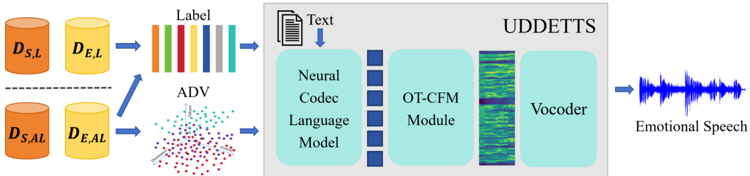

> [!abstract] arXiv · 2025 · Preprint
> **Jiaxuan Liu et al.** (University of Science and Technology of China; Alibaba Group; China Mobile) · [→ Paper](https://arxiv.org/abs/2505.10599) · Demo: ✓ · Code: ✓
>
> UDDETTS unifies discrete emotion labels and continuous Arousal-Dominance-Valence (ADV) values within a single LLM-based TTS framework, using semi-supervised training to learn from datasets that only provide one annotation type or the other.

## Problem

Controllable emotional TTS has largely relied on discrete emotion labels (happy, sad, angry) to select category and intensity, an approach that cannot capture the continuity and overlap of real emotional expression. Dimensional emotion theory offers a more continuous alternative, and prior work has explored ADV-style spaces for interpretable control, but existing space-based approaches (e.g., Cartesian-spherical transformations of ADV) distort emotion clusters and struggle to represent intermediate emotions. A separate obstacle is data: large emotional speech datasets typically provide only discrete labels, ADV-annotated datasets are much rarer, and most corpora are dominated by neutral-emotion samples, so any model trained solely on ADV-labeled data faces low controllable coverage of the emotion space. No prior LLM-based TTS system had combined discrete-label and dimensional-ADV conditioning within one model, or addressed the resulting annotation scarcity directly during training.

## Method

UDDETTS is a three-part pipeline: a semi-supervised neural codec language model, an optimal-transport conditional flow matching (OT-CFM) module, and a HiFi-GAN vocoder. Training data is split into spontaneous emotion datasets (natural recordings such as conversations or speeches, where text and emotion tend to align) and elicited emotion datasets (speakers reading fixed text under prescribed emotion categories), and further into four annotation types depending on whether label and/or ADV values are present. The neural codec LM defines a unified token sequence (text, speaker embedding, ADV tokens, label token, speech semantic tokens) whose loss masking pattern is set dynamically per sample according to which annotations are available, so a single model can be trained across heterogeneously-annotated corpora rather than requiring uniform annotation.

Speaker identity is captured by a fixed speaker embedding averaged from a speaker's neutral-emotion utterances, keeping timbre separate from the emotion representation used elsewhere in the sequence. Speech semantic tokens are produced by a supervised multitask speech tokenizer built by inserting a Finite Scalar Quantization (FSQ) module into the encoder of the MinMo model, jointly trained on ASR, speech emotion label recognition, and speech ADV recognition so the resulting tokens carry paralinguistic emotional information. Continuous ADV vectors are converted into discrete tokens by a nonlinear (clustering-based) binning quantizer designed to counteract the imbalanced, near-normal distribution of ADV values in the training data, with bin count chosen via a central-limit-theorem argument to balance granularity against coverage. Because predicting label and semantic tokens from text alone tends to default to neutral emotion, an ADV predictor (a RoBERTa encoder with pooling) estimates pseudo-ADV values from text and feeds their quantized tokens back into the LM, enabling a third, fully text-adaptive inference mode alongside label-controlled and ADV-controlled generation.

The OT-CFM module reconstructs mel-spectrograms from the generated semantic tokens, conditioned on speaker, semantic, and emotion embeddings. Its emotional mixture encoder separately encodes the ADV tokens and label token, fuses them via cross-attention (label as query, ADV as key/value), and combines the result with a semi-supervised gating rule that falls back to whichever annotation type is available for a given sample. A U-Net predicts the OT-CFM vector field under a cosine noise schedule, and a HiFi-GAN vocoder (fine-tuned on the training data) converts the resulting mel-spectrograms to waveform. Training proceeds in two stages: an initial stage on ~49,400 hours of unannotated English speech to establish general TTS competence (LLM 0.70B params, OT-CFM 0.35B params), followed by semi-supervised fine-tuning on the emotion-annotated corpora with the text encoder frozen.

## Key Results

Under label-controlled synthesis, UDDETTS is compared against CosyVoice 1-3, IndexTTS 1-2, FireRedTTS 1-2, Spark-TTS, F5-TTS, and VALL-E on a shared test set. UDDETTS reports the highest naturalness MOS among LLM-based baselines except CosyVoice3 (4.29 vs. 4.35), the highest macro-precision/recall on a five-class emotion confusion matrix (0.94/0.90), the highest emotion similarity (0.833) and PESQ-WB (2.8), while keeping WER low (2.4%) and speaker similarity competitive (0.702) (§4.3, Table 1). For ADV-controlled synthesis, Spearman's Rank Correlation between perceived and ground-truth emotion rankings reaches 0.85-0.92 across the arousal, dominance, and valence axes with nonlinear binning, versus 0.48-0.58 with linear binning, and Kendall's W above 0.6 indicates strong inter-rater agreement (§4.4, Table 2). An ablation on ADV-space coverage shows nonlinear binning alone raises coverage from 60.83% (linear binning) to 77.89%, and full semi-supervised training raises it further to 89.35%, including synthesis of previously unseen ADV combinations such as sobbing-like speech at an extreme dominance/valence setting (§4.4, §4.6, Figure 4). In pairwise preference tests for text-adaptive, end-to-end emotional TTS, participants preferred UDDETTS over two description-based baselines built on CosyVoice2 (67.33% vs. 13.22%) and IndexTTS2 (58.60% vs. 12.17%), both significant at p < 0.05 (§4.5, Table 3).

## Novelty Assessment

The individual components (an AR neural codec LM, OT-CFM mel reconstruction, HiFi-GAN vocoding, a MinMo-based multitask tokenizer, RoBERTa-based auxiliary prediction) are all established techniques recombined rather than newly invented. The genuine contribution is the conditioning and training design layered on top: a unified token sequence that accepts either discrete labels or continuous ADV values (or neither, at inference), a nonlinear ADV quantizer tuned against real annotation imbalance, and a semi-supervised masking/gating scheme that lets the same model train on four structurally different annotation regimes without discarding any of them. This is a legitimate architectural contribution focused on emotion conditioning rather than on the backbone TTS architecture itself. The evaluation is broader than most emotional-TTS papers (ten LLM-based baselines, three distinct control tasks, both subjective and objective metrics), which strengthens the empirical claims, though all data and evaluation is English-only and the comparisons rely on the authors' own reimplementation prompts for baseline emotion control (e.g., "Angry <|endofprompt|> Content Text"), which may not reflect each baseline's best-supported emotion-control interface.

## Field Significance

Moderate — This paper demonstrates that discrete emotion labels and continuous dimensional emotion values need not be treated as competing conditioning schemes: a single LLM-based TTS model can be trained to accept either, and a semi-supervised masking strategy can substantially expand the practically controllable region of a continuous emotion space beyond what any single annotation type would allow. Its contribution is concentrated in the emotion-conditioning and training-data-utilization layer rather than in the underlying TTS backbone, and the evaluation, while broad, is confined to English datasets and the authors' own baseline reimplementations.

## Claims

- **supports:** Combining discrete emotion labels and continuous dimensional emotion representations within one conditioning scheme, rather than choosing one, expands the practically controllable range of emotional TTS beyond what either representation supports alone.
  > *Evidence:* Semi-supervised training across label-only, ADV-only, and jointly-annotated datasets raises ADV-space controllable coverage from 70% (training on jointly-annotated data alone) to 89.35% (full semi-supervised training), including synthesis of previously unseen ADV combinations. *(§4.4, §4.6, Figure 4)*
- **complicates:** The reliability of continuous emotion control depends heavily on how the continuous space is quantized into controllable units, not just on the underlying representation.
  > *Evidence:* Replacing the clustering-based nonlinear ADV quantizer with linear binning drops Spearman's Rank Correlation for perceived linear emotion control across all three ADV dimensions (e.g., valence SRC falls from 0.92 to 0.57), showing that imbalanced raw annotation distributions bias the model toward overrepresented regions of the space unless the quantizer compensates. *(§4.4, Table 2, §4.6)*
- **supports:** Predicting an emotion conditioning signal directly from input text allows emotional TTS to operate without an explicit emotion label or reference at inference time.
  > *Evidence:* An ADV predictor infers pseudo-ADV tokens from text alone; removing it biases synthesis toward neutral emotion and drops pairwise preference against baselines from 67.33%/58.60% to 46.88%/28.50% in end-to-end preference tests. *(§4.5, §4.6, Table 3)*
- **complicates:** Fine-grained control over continuous emotion representations remains bounded by the consistency of the human annotations used to train the control mechanism.
  > *Evidence:* The authors note that subjective inter-annotator variation in ADV labels degrades linear control accuracy, and that texts with ambiguous emotional attributes cause the ADV predictor to infer inappropriate values, since the same text can express different emotions in different contexts. *(§Limitations)*

## Limitations and Open Questions

Training and evaluation are restricted to English-language datasets; the paper does not report whether the semi-supervised ADV/label fusion strategy transfers to multilingual emotional speech. The ADV predictor's text-only inference mode is explicitly noted to fail on texts with ambiguous emotional attributes, since a single sentence can carry different emotions depending on context that the model cannot observe. The framework also depends on the quality and consistency of ADV annotations, which the authors identify as inherently noisy due to subjective variation across human annotators; they suggest more data and more consistent annotation as the primary mitigation rather than a modeling fix. Speaker conditioning uses a fixed embedding averaged from a speaker's neutral-emotion utterances rather than zero-shot cloning from an arbitrary reference clip, which is a narrower speaker-control setting than several of the LLM-based baselines it is compared against.

## Wiki Connections

- [[emotion-synthesis|Emotion Synthesis]] — introduces a unified discrete-label-plus-ADV conditioning scheme with a nonlinear quantizer and semi-supervised training designed specifically to expand controllable coverage of a continuous emotion space.
- [[autoregressive-codec-tts|Autoregressive Codec TTS]] — builds its emotional TTS system around an autoregressive neural codec language model that generates semantic tokens from a unified text/speaker/emotion token sequence.
- [[flow-matching|Flow Matching]] — uses an optimal-transport conditional flow matching module, conditioned on a purpose-built emotional mixture encoder, to reconstruct mel-spectrograms from generated semantic tokens.
- [[disentanglement|Disentanglement]] — separates speaker timbre (via a neutral-utterance speaker embedding) from emotional representation (via ADV/label tokens) within the same token sequence design.
- [[subjective-evaluation|Subjective Evaluation]] — relies on human listening and ranking studies (MOS, emotion confusion matrices, Spearman/Kendall rank agreement, pairwise preference tests) to validate both label-based and ADV-based emotion control.
- [[2407.05407|CosyVoice]] — used as an LLM-based TTS baseline for label-controlled emotional synthesis and as an inspiration for the multitask speech tokenizer design (CosyVoice3's tokenizer approach).
- [[2412.10117|CosyVoice 2]] — used as a label-controlled TTS baseline and as the reference model for one of the two description-based baselines in the end-to-end emotional TTS comparison.
- [[2505.17589|CosyVoice 3]] — used as a label-controlled TTS baseline; its supervised multitask speech tokenizer design directly informs UDDETTS's own speech tokenizer.
- [[2501.06282|MinMo]] — its encoder is extended with a Finite Scalar Quantization module to build UDDETTS's supervised multitask speech tokenizer.
- [[2503.01710|Spark-TTS]] — its approach to separating textual content from speech attribute features inspires the input-output token sequence design of UDDETTS's neural codec language model, and it is also used as a label-controlled baseline.
- [[2502.05512|IndexTTS]] — used as a label-controlled emotional TTS baseline for subjective and objective comparison.
- [[2506.21619|IndexTTS2]] — used as a label-controlled TTS baseline and as the reference model for the second description-based baseline in the end-to-end emotional TTS comparison.
- [[2409.03283|FireRedTTS]] — used as a label-controlled emotional TTS baseline for subjective and objective comparison.
