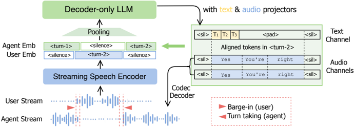

> [!abstract] arXiv · 2025 · Preprint (Interspeech 2025)
> **Hu et al.** (NVIDIA) · [→ Paper](https://arxiv.org/abs/2505.15670) · Demo: ✓ · Code: ✓
>
> SALM-Duplex introduces a full-duplex speech-to-speech architecture that routes user audio through a pretrained streaming encoder and agent speech through a personalized codec, eliminating the speech pretraining requirement while outperforming Moshi on barge-in, turn-taking, and reasoning benchmarks.

## Problem

Full-duplex spoken dialogue systems must handle simultaneous user and agent speech streams in real time, but existing approaches face significant practical barriers: they require extensive speech-text pretraining on top of the LLM backbone, use additional submodules for turn-taking decisions that break end-to-end modeling, and must balance speech perception and generation within a single codec architecture. Cascaded approaches (ASR, LLM, TTS) avoid these issues at the cost of high latency and loss of paralinguistic information. Half-duplex LLM-based models (SpeechGPT, GLM-4-voice) handle turn-based interactions but cannot support user barge-in.

## Method

SALM-Duplex uses an asymmetric architecture to handle the two duplex streams independently. User speech passes through a 100M-parameter streaming CTC encoder (NVIDIA FastConformer with 80ms right context) that produces continuous frame-rate embeddings. Agent speech is tokenized by a personalized NanoCodec operating at 0.6 kbps (12.5 Hz frame rate, 4 independent codebooks using FSQ). A 1.1B-parameter TinyLlama serves as the LLM backbone, with its vocabulary extended to include speech codec tokens via zero-initialized embeddings. A modality adapter bridges the continuous encoder output to the LLM input space.

During training, user and agent embeddings are time-aligned and summed as input to the LLM, a channel fusion operation. Both text and speech channels are predicted in parallel via multi-channel next-token prediction, with turn-level alignment between text and speech (rather than word-level alignment). A one-token delay is introduced on the speech channel to allow the text channel to guide generation. Text and speech losses are weighted 3:1.

The asymmetric design enables a key capability absent from prior symmetric codec-only duplex systems: the agent codec can be fine-tuned independently for a target speaker voice without affecting the user input pathway. FSQ independent codebooks allow fully parallel multi-codebook prediction with no inter-codebook delay, keeping generation latency low.

Training data is entirely synthetic, generated by TTS from text sources: question-answering from MS MARCO and Alpaca, ASR-relabeled speech rephrased via Mixtral-8x22B (ASR-QA), multi-turn conversations from UltraChat and an internal SFT dataset (totaling approximately 27k hours). Barge-in behavior is simulated by truncating agent turns at user speech onset and padding with silence.

## Key Results

Compared to Moshi on the Impatient evaluation set (designed for frequent user interruptions), SALM-Duplex achieves 94.5% barge-in success rate versus Moshi's 55.1%, with lower barge-in latency (0.69s vs. 0.81s) and zero false alarms on both systems. On the less adversarial UltraChat set, success rate is 83.0% vs. 56.0%. Speech quality as measured by UTMOS is 4.0 vs. 3.8 (Impatient) and 4.3 vs. 3.9 (UltraChat) (§6.1, Table 2).

On reasoning quality evaluated via GPT scores (gpt-4o-mini), SALM-Duplex consistently outperforms Moshi across all five test sets by large margins: Roleplay 4.6 vs. 1.7, Topic 6.1 vs. 2.8, ASR-QA 7.8 vs. 1.9. Compared to an oracle cascaded system (GT+LLM, which feeds ground-truth user transcriptions directly to TinyLlama), SALM-Duplex performs better on 2 of 5 sets and worse on 3, with the largest gap on UltraChat (3.5 vs. 6.4) (§6.2, Table 3).

Codec personalization (fine-tuning NanoCodec on 21k target-speaker utterances) delivers consistent gains across all metrics. The personalized 0.6 kbps codec outperforms both the 1.2 kbps untuned NanoCodec and Moshi's 1.1 kbps Mimi: MOS 4.75 vs. 4.54 vs. 4.16, CER 1.36 vs. 3.55 vs. 3.0, SECS 0.94 vs. 0.57 vs. 0.65, and S2S ASR-BLEU 18.7 vs. 16.2 (§6.3, Table 4).

## Novelty Assessment

The primary architectural contribution is the channel fusion design: routing continuous user embeddings and discrete codec agent tokens through separate pathways and summing them as LLM input. This asymmetry allows the system to leverage a pretrained streaming encoder for user comprehension, bypassing the need for speech pretraining. The approach combines existing components (TinyLlama, FastConformer, NanoCodec) in a novel structural arrangement rather than introducing new algorithmic primitives.

The codec personalization capability is a genuine practical advantage of the asymmetric design over symmetric codec-only systems such as Moshi: because user and agent pathways are separate, the agent codec can be fine-tuned without touching the user comprehension stack.

The evaluation contribution also has standalone value: the barge-in metrics (success rate, latency, false alarm rate) and the Impatient test set construction (halving silence between user turns to force frequent interruption) provide a more demanding and reproducible benchmark for duplex systems than prior evaluations in controlled conditions.

The comparison baseline is limited to Moshi; other contemporaneous duplex systems (SyncLLM, OmniFlatten, MinMo, SALMONN-Omni) are discussed but not benchmarked quantitatively. The backbone (TinyLlama 1.1B) is modest, and training data is predominantly synthetic TTS, limiting statements about real conversational speech generalization.

## Field Significance

Moderate — SALM-Duplex demonstrates that full-duplex spoken language model systems can be constructed without speech pretraining by using a pretrained streaming encoder for user input, materially reducing the data and compute barriers for this class of system. The open-source release of training and inference code provides a reproducible foundation for duplex SCA research that was previously absent from the literature. The proposed barge-in evaluation protocol, including the Impatient test set, introduces a more systematic and adversarial benchmark for duplex conversational behavior.

## Claims

- **supports:** Full-duplex spoken dialogue systems can be built without speech-text pretraining by routing user audio through a pretrained streaming encoder rather than requiring the LLM to learn audio representations end-to-end.
  > *Evidence:* SALM-Duplex skips speech pretraining entirely and instead uses a 100M streaming CTC encoder for user input; it still outperforms Moshi on barge-in success rate (94.5% vs. 55.1%) and reasoning GPT scores across all five evaluation sets. *(§3, §6.1, §6.2, Tables 2–3)*

- **supports:** Asymmetric duplex architectures that separate user and agent speech pathways enable independent specialization, including speaker-specific codec fine-tuning without affecting user comprehension.
  > *Evidence:* Personalized 0.6 kbps NanoCodec (fine-tuned on 21k target-speaker utterances) outperforms Moshi's Mimi at 1.1 kbps and untuned NanoCodec at 1.2 kbps on MOS, CER, and SECS, while operating at roughly half the bitrate. *(§3.2, §6.3, Table 4)*

- **complicates:** End-to-end speech-to-speech models do not consistently match optimal cascaded systems in reasoning quality, even when the cascaded oracle has access to ground-truth ASR transcriptions of user speech.
  > *Evidence:* SALM-Duplex outperforms GT+LLM on Roleplay and ASR-QA but underperforms on UltraChat (3.5 vs. 6.4), Topic, and Alpaca; the gap reflects compounding ASR error and limited backbone reasoning capacity at 1.1B parameters. *(§6.2, Table 3)*

- **supports:** Barge-in success rate and latency together constitute more discriminative signals for evaluating full-duplex systems than speech quality metrics such as UTMOS.
  > *Evidence:* On the Impatient set, SALM-Duplex and Moshi have zero false alarms each and UTMOS within 0.2 points (4.0 vs. 3.8), yet differ by 39.4 percentage points in barge-in success rate, making success rate the dominant differentiating metric. *(§5.2, §6.1, Table 2)*

## Limitations and Open Questions

> [!warning]
> All agent speech in training data is synthesized using a TTS model with a fixed speaker. Generalization to diverse agent voices or real conversational speech has not been demonstrated.

The 1.1B TinyLlama backbone limits reasoning ceiling; the gap to the GT+LLM oracle on complex dialogue tasks suggests ASR error compounds with limited LLM capacity. The quantitative comparison is restricted to Moshi; other contemporaneous duplex systems (OmniFlatten, SALMONN-Omni, MinMo) are discussed in related work but not benchmarked. The hardcoded 0.64s post-user-turn silence used to suppress unexpected agent barge-in may not transfer to naturally paced conversation. Evaluation datasets are largely synthetic, so performance on real recorded conversational speech remains an open question.

## Wiki Connections

- [[speech-to-speech|Speech-to-Speech]] — this paper proposes a full-duplex S2S architecture enabling simultaneous listening and speaking, addressing user barge-in and turn-taking for real-time spoken dialogue.
- [[spoken-language-model|Spoken Language Model]] — SALM-Duplex generates agent speech via autoregressive prediction of discrete codec tokens, placing it within the spoken LM paradigm for speech generation.
- [[neural-codec|Neural Audio Codec]] — the personalized NanoCodec (0.6 kbps, 4 FSQ codebooks) is a core component and an independently evaluated contribution, with fine-tuning shown to outperform higher-bitrate baselines including Moshi's Mimi.
- [[evaluation-metrics|Evaluation Metrics]] — the paper introduces a systematic duplex evaluation suite (barge-in success rate, barge-in latency, false alarm rate) and the Impatient test set for stress-testing interruption handling under adversarial conditions.
- [[speaker-adaptation|Speaker Adaptation]] — codec personalization by fine-tuning on target-speaker utterances achieves strong speaker similarity (SECS 0.94) at half the bitrate of the un-adapted baseline, demonstrating adaptation at the codec tokenizer level.
