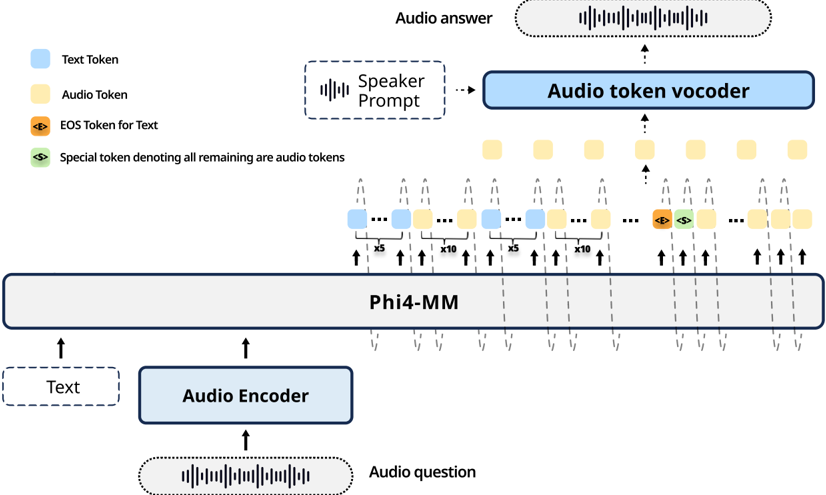

> [!abstract] arXiv · 2026 · Preprint
> **Haibin Wu et al.** (Microsoft) · [→ Paper](https://arxiv.org/abs/2506.04518) · Demo: ? · Code: ?
>
> Under a controlled experimental setup that fixes the base language model, speech tokenizer, and training data, this paper compares interleaved and parallel speech-text decoding paradigms for a single speech language model, then proposes an early-stop interleaved (ESI) decoding pattern that cuts sequence length by roughly 25% while matching or slightly improving accuracy.

## Problem

Speech language models that jointly generate text and speech tokens within a single autoregressive model must choose a decoding paradigm: interleaving speech and text tokens in one sequence, predicting them in parallel at each step, or separating text and speech generation into distinct Thinker and Talker modules. Prior systems adopting these paradigms (e.g., GLM-4-Voice for interleaving, Moshi for parallel decoding, MinMo and LLaMA-Omni2 for Thinker-Talker) differ from each other in base language model, speech tokenizer, and training data, which makes it difficult to isolate how much of their performance difference is attributable to the decoding paradigm itself versus these confounding factors. Separately, the interleaved paradigm, when it is used, is often bottlenecked at inference time because a fixed text-to-speech token ratio requires padding tokens once the (shorter) text stream is exhausted, inflating sequence length and slowing generation.

## Method

The paper fixes a common experimental scaffold across paradigms: the Phi4-MM language model (3.8B, scaled to 7B) as the shared backbone, the same supervised fine-tuning data, the same LoRA-based trainable parameter budget (rank 320; 460M trainable parameters at 3.8B, 707M at 7B), and the same speech tokenizer (S3Tokenizer, adopted unmodified from CosyVoice 2). Under this fixed scaffold, it retrains and directly compares two paradigms: interleaved decoding (speech and text tokens alternate in a single sequence with a fixed ratio, using padding once text is exhausted, and every generated token is fed back for next-token prediction) and parallel decoding (one text token and one or more speech tokens are predicted per forward pass, and their averaged hidden-space embedding is fed back for the next step). Thinker-Talker (a separate LLM that predicts only text, paired with an autoregressive Talker that generates speech from the LLM's hidden states) is included only as a reference baseline using existing released checkpoints (LLaMA-Omni2), since it is not retrained under the matched setup.

Having found that interleaved decoding gives the best alignment but the longest sequences, the paper proposes early-stop interleaved (ESI) decoding: interleaved sequences are constructed with a 5:10 text-to-speech token ratio; once the model emits the end-of-sentence token for text, a special `<S>` token marks that all subsequent tokens are speech, and the model stops interleaving text padding and generates speech tokens only. This removes the redundant padding tokens that a fixed-ratio interleaved sequence would otherwise need, shrinking total sequence length to approximately 75% of standard interleaved decoding.

The full system (Phi4-MM with ESI) is a speech-in, speech-out question-answering pipeline: a spoken question is processed by an audio encoder (initialized from a pretrained ASR encoder and further fine-tuned on ASR data) into speech embeddings, which are combined with text input (system prompt or instruction) and fed into Phi4-MM. The model decodes interleaved text and speech tokens using the ESI pattern; the text tokens are returned directly as the textual answer, while the speech tokens are passed to a streaming audio token vocoder (the flow-matching model and neural vocoder adopted unmodified from CosyVoice 2, optionally conditioned on a speaker prompt) to synthesize the spoken answer.

Separately, the paper curates additional speech QA training data from two text-based QA datasets, TriviaQA and Natural Questions: an LLM is prompted to rewrite each terse reference answer into a full conversational sentence, zero-shot TTS synthesizes spoken versions of the questions and answers (using thousands of distinct speaker prompts for diversity), and ASR-based filtering discards any QA pair whose synthesized answer has a word error rate above 20%.

## Key Results

In the main comparison (Table III), the full model (Ours 7B-ESI) reaches 65% speech-out accuracy on LLaMA Questions, versus 50% for GLM-4-Voice (9B) and 43.7% for Moshi (7B), and its 3.8B variant already exceeds GLM-4-Voice on LLaMA Questions despite a much smaller backbone. Against LLaMA-Omni2, whose training setup (a few thousand speech QA examples) is the closest match to this paper's own setup, Ours 7B-ESI outperforms all LLaMA-Omni2 variants including the 14B model (65% vs. 63.33% speech-out accuracy on LLaMA Questions). The model underperforms MinMo on text-only QA accuracy, which the authors attribute to MinMo's stronger base LM rather than the decoding paradigm.

Under the controlled, same-backbone comparison (Table IV, 3.8B model, VoiceAssistant data only), interleaved decoding outperforms parallel decoding on every benchmark: 57.33% vs. 46.67% speech-out accuracy on LLaMA Questions, and 5.11% vs. 17.94% WER on Web Questions, indicating substantially worse speech-text alignment for parallel decoding. ESI matches or slightly exceeds standard interleaved decoding while using roughly 75% of the sequence length; for example, on Trivia-QA, ESI improves text-out accuracy from 24.76% to 27.29% and speech-out from 23.2% to 24.56% (Table IV), and further ablations (Table V) show ESI improving speech-out accuracy on LLaMA Questions from 59.33% to 64.67% when trained on the full curated data mixture (3.8B-All). The data curation ablation (Table VI) shows that adding the curated Natural Questions and TriviaQA data on top of VoiceAssistant generally improves Web Questions accuracy, though gains are not uniform across all metrics when datasets are added individually.

## Novelty Assessment

The paper's central contribution is empirical rather than architectural: a controlled, apples-to-apples comparison of interleaved and parallel decoding paradigms for joint speech-text generation, something prior papers proposing these paradigms had not directly enabled because each used a different base LM, tokenizer, and training set. The early-stop interleaved (ESI) pattern is a genuinely new inference-time mechanism (a learned stop token that terminates padding-driven interleaving), but it is a targeted efficiency fix to an existing paradigm rather than a new decoding paradigm in its own right, and the speech synthesis and tokenization components are explicitly reused unmodified from CosyVoice 2. The QA data curation pipeline combines existing techniques (LLM answer rewriting, zero-shot TTS, ASR-based filtering) without methodological novelty. Overall, this is a careful, well-controlled empirical study with one modest but practical engineering contribution (ESI), rather than a new architecture class.

## Field Significance

moderate — the paper provides a genuinely fair, controlled comparison of decoding paradigms that prior speech LM papers, evaluated in isolation with different backbones and data, could not offer, and demonstrates a simple, transferable technique (early-stop interleaving) for reducing interleaved decoding's inference cost without sacrificing accuracy. Its scope is limited to a small set of spoken QA benchmarks and a single backbone family (Phi4-MM), and the Thinker-Talker comparison relies on externally released checkpoints rather than a matched retraining, which narrows how far its conclusions generalize.

## Claims

- **supports:** Under matched base language model, speech tokenizer, and training data, interleaved token generation for joint speech-text decoding yields both higher task accuracy and stronger speech-text alignment than parallel (averaged-embedding) token generation.
  > *Evidence:* With the same 3.8B backbone and VoiceAssistant-only training data, interleaved decoding reaches 57.33% speech-out accuracy and 5.11% WER on LLaMA Questions/Web Questions, versus 46.67% accuracy and 17.94% WER for parallel decoding. *(§IV.B, Table 4)*
- **supports:** In an interleaved speech-text decoding scheme, removing the padding tokens needed to maintain a fixed text-to-speech ratio (by inserting a single token that switches the sequence to speech-only generation after text ends) can substantially shorten inference sequences without sacrificing, and sometimes slightly improving, output quality.
  > *Evidence:* The proposed early-stop interleaved (ESI) pattern reduces total sequence length to approximately 75% of standard interleaved decoding while matching or exceeding it in accuracy, e.g. Trivia-QA text-out improves from 24.76% to 27.29% and speech-out from 23.2% to 24.56%. *(§II.B.2, Table 4)*
- **complicates:** Cross-system comparisons of speech language models on text-QA accuracy conflate the effect of the decoding paradigm with the capability of the underlying base language model, so weaker text-QA results do not necessarily indicate a worse decoding strategy.
  > *Evidence:* The paper's base models underperform MinMo on text-based QA despite MinMo's Thinker-Talker paradigm being used only as a reference baseline; the authors attribute this gap to MinMo's stronger base LM rather than the decoding paradigm, since MinMo is trained on millions of diverse examples versus a few thousand for the comparable systems. *(§IV.A)*
- **refines:** Augmenting a speech-in speech-out QA training set with additional curated question-answering data generally improves both text and speech answer accuracy, but the improvement from any individual added data source is not uniform across all evaluation benchmarks or metrics.
  > *Evidence:* Combining VoiceAssistant with curated Natural Questions and TriviaQA data yields the best overall Web Questions accuracy (31.66% text-out, 30.88% speech-out), but adding Natural Questions alone to VoiceAssistant lowers LLaMA Questions text-out accuracy from 64.67% to 61%. *(§IV.D, Table 6)*
- **complicates:** An inference-efficiency modification to a decoding paradigm can improve some alignment or accuracy metrics while slightly degrading others, so a single headline metric is insufficient to establish that an efficiency change is uniformly beneficial.
  > *Evidence:* Under the controlled 3.8B comparison, ESI's WER on Web Questions (5.72%) is slightly higher than standard interleaved decoding's WER (5.11%), even though ESI improves text-out and speech-out accuracy on the same benchmark. *(§IV.B, Table 4)*

## Limitations and Open Questions

> [!warning] The paper explicitly notes that TriviaQA has no official test split, so the test samples used here likely differ from those used by other papers; TriviaQA results (Tables III-IV) are described by the authors as not directly comparable to other published results and should be treated as reference only. *(§III.4)*

Several additional caveats limit how far the results generalize. Speech-out accuracy and alignment are measured indirectly by transcribing generated speech with Whisper-large-v3 and checking for the reference answer, rather than through direct human listening evaluation, so no subjective quality (e.g., MOS) judgment of the synthesized responses is reported. The Thinker-Talker paradigm is compared only via externally released LLaMA-Omni2 checkpoints and results reported in the MinMo paper, not retrained under the same controlled scaffold as interleaved and parallel decoding, so its comparison is less tightly controlled than the interleaved-vs-parallel comparison. The ESI pattern is evaluated only at a single text-to-speech interleaving ratio (5:10); the paper does not report how sensitive its efficiency or accuracy gains are to other ratios. Finally, the speech tokenizer and vocoder are used unmodified from CosyVoice 2, so any limitations of that component (e.g., voice quality, language coverage) are inherited rather than addressed by this work.

## Wiki Connections

- [[spoken-language-model|Spoken Language Model]] — presents a systematic, controlled comparison of joint speech-text decoding paradigms within a single speech LM, isolating the paradigm choice from confounds like backbone and training data that differ across prior speech LM papers.
- [[speech-to-speech|Speech-to-Speech]] — builds a speech-in, speech-out spoken question-answering pipeline where an external spoken question is transcribed into embeddings by an audio encoder and answered with synthesized speech, fitting the dialogue sub-paradigm.
- [[autoregressive-codec-tts|Autoregressive Codec TTS]] — the interleaved and ESI decoding patterns generate discrete speech codec tokens autoregressively alongside text within the same language model.
- [[streaming-tts|Streaming TTS]] — the generated speech tokens are synthesized into audio via a streaming audio token vocoder, inherited unmodified from CosyVoice 2, to support real-time conversational responses.
- [[neural-codec|Neural Audio Codec]] — relies on the S3Tokenizer/CosyVoice 2 codec to discretize speech into tokens the language model can jointly decode with text.
- [[2412.10117|CosyVoice 2]] — its S3Tokenizer, flow-matching model, and neural vocoder are adopted unmodified as this paper's speech tokenizer and audio synthesis pipeline.
- [[2505.02625|LLaMA-Omni2]] — used as the primary Thinker-Talker baseline via its officially released checkpoints, chosen because its small-scale QA-only training setup most closely matches this paper's own.
- [[2501.06282|MinMo]] — a Thinker-Talker baseline whose stronger base LM and much larger training set are cited to explain why it exceeds this paper's system on text-based QA despite the paper's advantages in speech-output accuracy and alignment.
- [[2412.02612|GLM-4-Voice]] — one of the earliest models to adopt interleaved speech-text decoding; this paper positions its proposed ESI pattern as extending and improving that paradigm.
- [[2410.00037|Moshi]] — the first open-source real-time speech-to-speech model using parallel decoding, used as a baseline that this paper's interleaved/ESI approach consistently outperforms.
- [[2412.15649|SLAM-Omni]] — cited as an example system using the parallel decoding paradigm this paper compares against.
- [[2503.01743|Phi-4-Mini Technical Report]] — the technical report for the Phi4-MM backbone that this paper adopts and fine-tunes with LoRA as its base language model.
- [[2411.17607|Scaling Speech-Text Pre-training with Synthetic Interleaved Data]] — cited as prior work establishing the interleaved decoding paradigm this paper builds on and accelerates.
