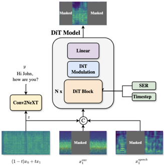

> [!abstract] arXiv · 2025 · Preprint
> **Glazer et al.** · [→ Paper](https://arxiv.org/abs/2506.09874) · Demo: ✓ · Code: ?
>
> UmbraTTS extends flow-matching TTS to jointly generate speech and environmental background audio, introducing a speech-to-environment ratio (SER) conditioning parameter and a self-supervised data extraction framework that enables training without manually annotated speech-background paired recordings.

## Problem

Existing TTS systems generate clean speech in isolation, then optionally overlay environmental sounds as a post-processing step. This naive approach misses three interconnected problems: speakers naturally adapt vocal effort and rhythm to their acoustic surroundings (the Lombard effect), background sounds with temporal structure such as applause require precise synchronisation with speech rather than simple mixing, and post-hoc mixing cannot produce varied background textures within the same environmental condition. Diffusion-based environmentally aware systems such as VoiceLDM and VoiceDiT partially address this, but a compounding problem is the lack of datasets containing speech, isolated background audio, and aligned transcripts together. No existing corpus pairs these three modalities in natural, contextually appropriate combinations.

## Method

UmbraTTS is built on the F5-TTS conditional flow matching (CFM) framework, using Diffusion Transformer (DiT) blocks with adaptive LayerNorm (adaLN-zero) to model the velocity field. The model operates on mel spectrogram representations and takes a masked reconstruction objective: given the mel of a reference speech segment, a reference environment segment, and a target text transcript, it learns to reconstruct the masked portion of the joint speech-plus-environment mel spectrogram.

Text conditioning follows the F5-TTS approach: characters are tokenised and padded with filler tokens to match the mel sequence length, then embedded by a ConvNeXT V2 network. Environmental conditioning enters through a reference environment audio mel spectrogram provided at inference alongside the reference speech clip. Speaker characteristics are drawn from the reference speech mel, while environmental characteristics come from the reference environment audio, making the system a zero-shot speaker-plus-environment cloning model.

The SER (speech-to-environment ratio) parameter, ranging from 0 to 1, allows fine-grained control of how loud the background is relative to speech. SER is encoded via a sinusoidal positional encoding followed by a MLP (SEREmbed) and combined additively with the flow time-step embedding before being injected into the adaLN-zero blocks, so the same conditioning pathway that controls diffusion time also controls environment prominence.

To overcome the absence of paired training data, the paper introduces a self-supervised data construction pipeline applied to unlabeled mixed-audio recordings. For each recording, a transcript is obtained via Whisper-large-v2; then either (i) voice activity detection (VAD) extracts non-speech regions as the environment track when speech and background are temporally separated, or (ii) a source separation model handles overlapping mixtures. Both strategies are used stochastically during training to improve robustness. AudioSet provides naturally mixed recordings processed by this pipeline; LibriSpeech clean speech is augmented with FSD50K environmental sounds at randomly sampled SNR values (converted to SER) to produce additional training pairs. Training runs for 550k steps on two L40S GPUs.

## Key Results

On the AudioCaps test subset (following the VoiceLDM evaluation protocol), UmbraTTS achieves WER 6.89%, CLAP 0.37, and FAD 4.14, compared to VoiceDiT (7.09%, 0.22, 4.60) and VoiceLDM text (10.39%, 0.21, 5.56). In the audio-to-audio evaluation where only the environment audio prompt is provided, UmbraTTS reaches CLAP 0.619 and KL 1.87 on AudioCaps and CLAP 0.77 and KL 0.939 on MusicCaps, outperforming VoiceLDM, VoiceDiT, AudioLDM, and AudioLDM2 on most metrics.

Human evaluations confirm the value of joint generation. In an A/B test with at least 20 raters per sample across 30 AudioSet recordings, 87.89% of responses preferred UmbraTTS over F5-TTS with post-hoc background mixing. Against VoiceLDM across 55 AudioCaps samples with 50 participants, UmbraTTS is preferred 81.91% of the time for naturalness, 78.54% for background integration, and 81.83% for background preservation. SER controllability was verified in a separate listening test: 96.6% of participants correctly identified the higher-environment-volume audio in pairwise comparisons across 20 sample pairs.

## Novelty Assessment

The primary contributions are the joint speech-plus-environment generation architecture and the SER conditioning mechanism, both genuine extensions of flow-matching TTS to an under-explored problem. The model structure builds directly on F5-TTS rather than introducing a new backbone; the novelty lies in the additional environmental conditioning pathway and the SER injection into adaLN-zero. The self-supervised data pipeline (VAD plus source separation applied to AudioSet) is practically important because paired data does not otherwise exist, though the individual components (Whisper, SileroVAD, MossFormer2 source separation) are off-the-shelf. The evaluation setup follows VoiceLDM's AudioCaps protocol, which enables fair comparison with prior diffusion-based systems; the human evaluations are thorough and credibly sized. This is a workshop paper, so the architecture and experiments are scoped accordingly.

## Field Significance

Moderate — UmbraTTS addresses a genuine gap: TTS systems that produce contextually integrated environmental audio rather than clean speech. The flow-matching approach establishes a stronger baseline than prior diffusion methods in this setting, and the SER conditioning mechanism provides a practical handle for content creators who need control over background prominence. The self-supervised data framework removes a key barrier to training, suggesting the approach could extend to other domains with naturally mixed audio. The paper demonstrates that joint generation consistently outperforms post-hoc mixing in human preference, which is a useful result for any downstream system designer considering acoustic scene synthesis.

## Claims

- **supports:** Joint generative modelling of speech and environmental audio produces more naturally integrated output than post-hoc mixing of separately generated speech with background sounds.
  > *Evidence:* A/B tests with 20+ raters per sample showed 87.89% preference for UmbraTTS over F5-TTS plus post-hoc background mixing across 30 AudioSet samples, with raters specifically judging natural integration with background noise. *(§4.2)*

- **supports:** Self-supervised extraction of speech and background audio from unlabeled mixed recordings is sufficient to train environmentally conditioned TTS to state-of-the-art performance.
  > *Evidence:* UmbraTTS uses VAD-based silence extraction and learned source separation applied to AudioSet to construct training triplets without manual annotation, achieving best WER and FAD among all baselines on AudioCaps. *(§3, §4.1, Table 1)*

- **supports:** Flow matching outperforms diffusion-based architectures in environmentally aware speech synthesis on both automatic and human evaluation metrics.
  > *Evidence:* UmbraTTS (CFM-based) achieves WER 6.89% and FAD 4.14 vs VoiceDiT (diffusion, DiT) at 7.09% and 4.60 and VoiceLDM (diffusion, LDM) at 10.39% and 5.56 on AudioCaps; human preference is 78.54–81.91% over VoiceLDM. *(§4.1, §4.2, Tables 1–3)*

- **complicates:** Controlling speech-to-environment balance in jointly generated audio scenes requires an explicit scalar conditioning parameter; standard text and speaker conditioning are insufficient for this degree of output control.
  > *Evidence:* UmbraTTS introduces a dedicated SER signal injected via adaLN-zero; a separate controlled listening test confirms that 96.6% of participants correctly distinguish the intended background volume direction in pairwise comparisons. *(§3, §4.2)*

## Limitations and Open Questions

> [!warning]
> The evaluation protocol is borrowed from VoiceLDM and covers only the AudioCaps and MusicCaps test subsets. The paper does not evaluate intelligibility or naturalness on held-out speakers or linguistic domains beyond what these two benchmarks contain, so generalisation to other environmental conditions is untested.

The vocoder used to convert mel spectrograms to waveforms is not specified, making exact replication uncertain. The SER parameter governs volume balance but not the temporal structure of environmental sounds — synchronisation of event-aligned background audio (e.g., crowd laughter timed to speech pauses) is described as a design goal but not explicitly evaluated. Speaker identity conditioning relies on a reference speech clip of unspecified minimum length; behaviour with very short or noisy reference clips is not characterised. The paper does not report model size or training data volume in a form that allows meaningful scaling comparisons with other systems.

## Wiki Connections

- [[flow-matching|Flow Matching]] — UmbraTTS extends the CFM objective from clean speech synthesis to joint speech-plus-environment generation, using DiT blocks and adaLN-zero for both flow time and SER conditioning.
- [[zero-shot-tts|Zero-Shot TTS]] — the system clones speaker identity and environmental character at inference from reference audio clips without speaker-specific fine-tuning, following the zero-shot paradigm of F5-TTS.
- [[evaluation-metrics|Evaluation Metrics]] — evaluation uses FAD, KL divergence, CLAP score, and WER computed with Whisper, providing a multi-dimensional view of audio quality across both the speech and environmental audio dimensions.
- [[subjective-evaluation|Subjective Evaluation]] — A/B preference tests with 20–50 participants assess naturalness, background integration, and background preservation, complementing the automatic metrics.
- [[2025.acl-long.313]] (F5-TTS) — UmbraTTS is built directly on the F5-TTS flow-matching framework, inheriting its DiT backbone and CFM training objective while extending it with environmental audio conditioning and SER control.
