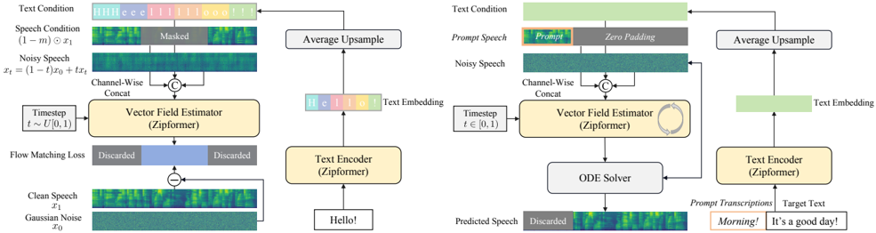

> [!abstract] arXiv · 2025 · Preprint
> **Zhu et al.** (Xiaomi) · [→ Paper](https://arxiv.org/abs/2506.13053) · Demo: ✓ · Code: ✓
>
> ZipVoice is a compact (123M parameter) flow-matching zero-shot TTS system that achieves quality competitive with much larger baselines by combining a Zipformer backbone repurposed from ASR, a parameter-free average upsampling strategy for speech-text alignment, and a flow distillation method that eliminates classifier-free guidance overhead at inference.

## Problem

Large-scale zero-shot TTS models achieve strong speech quality but are expensive to deploy: they rely on hundreds of millions or billions of parameters and require many ODE function evaluations (NFEs), often compounded by classifier-free guidance (CFG) which doubles the cost of each step. Prior compact TTS models trained on small datasets consistently underperform large counterparts across quality, intelligibility, and speaker similarity metrics. The challenge is to build a system that is simultaneously small, fast, and quality-competitive at large-scale training.

## Method

ZipVoice is built on conditional flow matching (CFM) with an optimal-transport path, following the E2-TTS lineage of fully non-autoregressive systems that avoid explicit token-level duration prediction. Its two main sub-models both use Zipformer as the backbone, an encoder architecture originally developed for ASR. Zipformer contributes three complementary properties that transfer well to flow-matching TTS: a U-Net-style multi-resolution structure (an effective inductive bias for diffusion-family models), convolutional modules that capture fine-grained local speech correlations, and an attention weight reuse mechanism across self-attention and non-linear attention modules that reduces parameter count without sacrificing capacity.

The speech-text alignment problem, which E2-TTS solves by padding text tokens with filler tokens and relying on the model to learn alignment implicitly, is addressed in ZipVoice by a parameter-free average upsampling strategy. Given N text tokens and T speech feature frames, each token is assigned a uniform duration of floor(T/N) frames, with any remainder padded with filler embeddings. This simple assumption provides a substantially better initial alignment signal than filler-only padding, resulting in dramatically lower WER in ablation experiments (removing average upsampling raises WER from 1.69 to 20.19 on LibriSpeech-PC test-clean; see §V.C, Table IV). The text encoder, which also uses Zipformer (without the U-Net structure), transforms phoneme tokens into features that are then average-upsampled before being concatenated with the noisy speech and audio prompt condition as input to the vector field estimator.

Zero-shot capability is implemented as a speech infilling task: during training, a binary mask hides a portion (70-100%) of the speech feature, and the model reconstructs the masked region conditioned on the visible audio prompt and the text condition. At inference, the audio prompt occupies the first segment and the model generates the remaining frames.

The distilled variant, ZipVoice-Distill, is trained in a second stage using a flow distillation objective. A fixed pre-trained teacher generates a target vector field via two-step CFG inference; the student (initialized from the teacher) is conditioned on the CFG strength itself as an additional input via a Fourier embedding, enabling it to internalize CFG behavior and bypass the doubled evaluation cost at runtime. An optional self-distillation phase uses an EMA copy of the student as the teacher for further refinement. The total parameter count is 123M for both ZipVoice and ZipVoice-Distill. The Vocos vocoder (trained on LibriTTS) converts mel features to waveforms at negligible additional cost.

## Key Results

On Emilia (100K hours multilingual training), ZipVoice (16 NFE) achieves WER 1.64, SIM-o 0.668, and UTMOS 3.98 on LibriSpeech-PC test-clean. ZipVoice-Distill at 8 NFE improves UTMOS to 4.11 and WER to 1.54 while accepting a slight SIM-o drop to 0.647, and at 4 NFE remains competitive at CMOS +0.05 and SIM-o 0.657. Subjective CMOS scores for ZipVoice (16 NFE) and ZipVoice-Distill (8 NFE) are +0.17 and +0.16 respectively above the ground truth reference, better than all baselines including MaskGCT (-0.08) and F5-TTS (-0.03). These results are on the same test sets under the same evaluation conditions as the baselines.

Speed comparisons (Table II) show ZipVoice-Distill (4 NFE) at 23.7x faster real-time factor (RTF) than F5-TTS on GPU and 32.6x faster on a single CPU thread, driven by: a 2.7x smaller model (123M vs. 336M), fewer NFEs (4 vs. 32), and no CFG overhead per step. ZipVoice-Distill at 4 NFE approaches real-time on a single CPU thread (RTF ~1.22).

On LibriTTS (585 hours), ZipVoice outperforms a trained F5-TTS of similar size on all three metrics (§V.B, Table III), suggesting the Zipformer backbone provides per-parameter efficiency gains that persist at smaller data scales.

## Novelty Assessment

The paper's core contribution is architectural adaptation: Zipformer, an ASR-designed encoder, is shown to transfer effectively to flow-matching TTS vector field estimation. The U-Net inductive bias and convolutional modules from Zipformer turn out to be properties already identified as beneficial in diffusion and flow-matching models (via the DiT-UNet and ConvNeXt literature), so the connection is engineering-motivated rather than theoretical. The average upsampling alignment strategy is deliberately simple and parameter-free, contrasting with F5-TTS's ConvNeXt refinement module; ablations (Table IV) show it substantially outperforms the filler-token-only baseline, and matches or exceeds ConvNeXt refinement.

The flow distillation method is a variant of guided distillation (related to consistency distillation and ReFlow) specifically adapted to integrate CFG strength as a model input, enabling one-forward-pass CFG. The comparison in Table VI shows this outperforms consistency distillation and ReFlow at 4 NFEs for this architecture. The overall contribution is an engineering combination of known components (flow matching, Zipformer, distillation) but the specific combination yields notable efficiency gains at comparable quality to systems 2-8x larger.

## Field Significance

Moderate — ZipVoice provides concrete evidence that the efficiency-quality gap in compact flow-matching TTS can be substantially narrowed through architecture selection and distillation rather than data or parameter scaling. The Zipformer backbone repurposing is a useful signal that ASR encoder designs with multi-resolution U-Net structure are directly applicable to continuous-output generative models, and the average upsampling alignment strategy demonstrates that simple deterministic heuristics can outperform learned refinement modules in the alignment sub-problem.

## Claims

- Compact flow-matching TTS models can match the speech quality of models two to eight times larger when architectural components are selected for per-parameter efficiency rather than chosen by default from the diffusion literature. *(§V.A, Table I)*
- In non-autoregressive TTS without explicit duration prediction, a simple uniform-duration upsampling assumption provides substantially better initial alignment than filler-token padding, yielding large intelligibility improvements without additional parameters. *(§II.D, §V.C, Table IV)*
- Flow distillation that conditions the student on CFG strength eliminates the doubled forward-pass cost of classifier-free guidance while preserving its quality benefit, outperforming consistency distillation and ReFlow at 4 NFEs. *(§II.E, §V.E, Table VI)*
- The U-Net-style multi-resolution structure and convolutional modules in Zipformer transfer the inductive biases beneficial for diffusion-family models from ASR into TTS vector field estimation, with ablation evidence showing each structural element independently contributes to intelligibility and naturalness. *(§II.C, §V.D, Table V)*

## Limitations and Open Questions

> [!warning]
> Speaker similarity (SIM-o) for ZipVoice-Distill is consistently below F5-TTS and the larger NAR baselines on all three test sets (Table I), despite quality and intelligibility advantages. This trade-off is acknowledged but not explained mechanistically; it is unclear whether it stems from the uniform-duration alignment assumption, the distillation objective, or the compact model size.

The paper uses UTMOS rather than human MOS for most evaluations; CMOS/SMOS human scores are reported only against a limited set of baselines, making the subjective quality advantage difficult to verify broadly. Average upsampling assumes uniform token durations within a sentence, which is a poor model of natural prosody, potentially limiting expressiveness for prosodically varied speech. The model operates on mel features and requires Vocos for waveform synthesis; end-to-end codec-native generation is not explored.

## Wiki Connections

- [[flow-matching]] — ZipVoice applies conditional flow matching as its core generative framework, with a custom flow distillation stage that integrates CFG strength as a conditioning variable.
- [[zero-shot-tts]] — the speech infilling formulation enables zero-shot speaker adaptation from a short audio prompt at inference without speaker-specific fine-tuning.
- [[distillation]] — ZipVoice-Distill uses a guided flow distillation method that internalizes CFG behavior into the student model, eliminating the doubled inference cost while preserving quality.
- [[speaker-adaptation]] — the zero-shot speaker conditioning via audio prompt infilling enables flexible adaptation to arbitrary voices from a 3-second reference clip.
- [[2410.06885]] (F5-TTS) — ZipVoice is directly compared against F5-TTS across all three benchmarks and on inference speed; it outperforms F5-TTS on WER and UTMOS with fewer parameters and NFEs.
- [[2409.03283]] (FireRedTTS) — cited as a related zero-shot TTS system in the experimental comparison landscape.
- [[2406.02430]] (Seed-TTS) — the Seed-TTS test-en and test-zh benchmarks define two of the three evaluation sets used for the main comparisons.
- [[2407.05407]] (CosyVoice) — compared as an AR baseline in the large-scale training setting; ZipVoice matches CosyVoice on speaker similarity at 3.4x fewer parameters.
- [[2412.10117]] (CosyVoice 2) — compared as a stronger AR baseline; ZipVoice matches on Seed-TTS test-zh SIM-o and outperforms on WER.
- [[2503.01710]] (Spark-TTS) — compared as a large AR baseline; ZipVoice outperforms on WER on Seed-TTS test-en with 4x fewer parameters.
