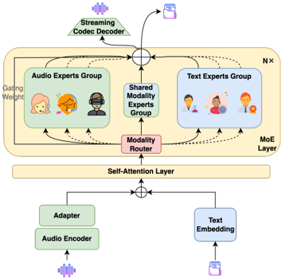
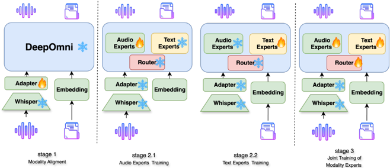

> [!abstract] arXiv · 2025 · Preprint
> **Hang Shao et al.** (Tencent) · [→ Paper](https://arxiv.org/abs/2506.21864) · Demo: ? · Code: ✓
>
> Introduces a Mixture-of-Experts training strategy that adaptively partitions a native multimodal speech-text LLM's existing experts into audio, text, and shared groups, sharply reducing the catastrophic forgetting that otherwise afflicts native speech-and-text large language models.

## Problem

End-to-end speech interaction models fall into two families: modular systems that bolt a separate speech encoder and decoder onto a frozen or lightly-tuned LLM, and native systems that retrain the LLM itself to emit both text and speech tokens from a single decoding path. Modular systems preserve the backbone LLM's language ability well but confine paralinguistic expression (emotion, prosody) to a downstream decoder that the LLM cannot directly control, and add architectural complexity. Native systems retain paralinguistic richness and lower latency by having the LLM generate speech tokens directly, but retraining a text LLM into a joint speech-text model demands far more paired audio-text data than is available relative to the text corpora used to pretrain the LLM. As a result, native multimodal LLMs suffer catastrophic forgetting of the backbone's original language capability, with the paper reporting an average relative benchmark drop of over 20% for representative native systems, compared to single-digit drops for modular ones.

## Method

DeepOmni is a native multimodal speech-text LLM built on a Mixture-of-Experts (MoE) backbone, with the goal of isolating speech-specific and text-specific parameters so that a single unified decoding path can emit both modalities without eroding the pretrained text LLM. The architecture consists of a Whisper-medium audio encoder, an MLP-based adapter that downsamples and aligns audio features with the LLM's embedding space, a MoE backbone initialized from DeepSeek-V2-Lite (27 layers, 66 experts per MoE layer: 6 audio, 58 text, 2 shared, with 6 experts activated per token), and a streaming SNAC codec decoder that discretizes output speech into 7 codebooks at 82 Hz. At each decoding step the model uses 8 LM heads to jointly predict 1 text token and 7 audio tokens, following a parallel audio-text modeling paradigm with a MusicGen-style delay pattern across codebook layers, and applies batch-parallel decoding (generating a text-only stream alongside a joint text+speech stream, then substituting the higher-quality text-only tokens into the joint stream) to protect text quality.

The central contribution is an adaptive modality expert selection algorithm applied after an initial modality-alignment stage: for unimodal audio and text inputs, the algorithm computes each expert's token load ratio per modality per layer, then greedily assigns experts with high audio load and low text load as audio experts (and vice versa for text experts), leaving the model's original router allocation for already-capable experts largely undisturbed. Training proceeds in three stages: (1) modality alignment, where only the audio adapter is trained with cross-entropy loss to align speech and text semantic spaces using WenetSpeech; (2) unimodal expert specialization, where the router is frozen and audio/text experts are trained separately on their own modality's instruction data (AudioQA-1M for audio experts; MathInstruct, camel-ai-math, and databricks-dolly-15k for text experts); and (3) joint multimodal training, where the router is unfrozen and cross-modal instruction data (AudioQA-1M) trains all experts together to collaborate on joint text-and-speech output. A final reinforcement-learning stage applies direct preference optimization (DPO): the model paraphrases LibriSpeech text into response audio, the audio is re-transcribed with Whisper-large, and word error rate is used to rank samples into preference pairs for stabilizing speech generation quality.

## Key Results

On text-only LLM benchmarks (CEval, CMMLU, MMLU, BBH, and others via OpenCompass), DeepOmni's average score drops only 5.45% relative to its DeepSeek-V2-Lite backbone, versus drops of 44.32% for GLM-4-Voice, 26.73% for Mini-Omni, and 27.14% for LUCY among native multimodal baselines, and comparable to the 6-9% drops typical of modular systems such as Qwen2.5-Omni and VITA-1.5. On spoken question answering (LLaMA Questions, Web Questions, TriviaQA, evaluated both speech-to-text and speech-to-speech), DeepOmni's speech-to-speech average of 36.8 leads all evaluated native MLLMs, including GLM-4-Voice (31.0), LUCY (29.1), and Moshi (12.5), though it remains below the best modular systems on the speech-to-text side. On the SeedTTS TTS benchmark, DPO refinement improves DeepOmni's Chinese CER from 1.68 to 1.41 and English WER from 6.28 to 3.25, but leaves the harder test-hard subset essentially unchanged (7.34 to 7.29), which the authors attribute to the underlying supervised model being unable to produce a correct output at all for the hardest cases. On ASR (WenetSpeech, AIShell, LibriSpeech), DeepOmni's 2.4B activated parameters achieve error rates in the same range as, though generally slightly worse than, larger modular systems such as Qwen2.5-Omni and GLM-4-Voice. Measured end-to-end half-duplex dialogue latency is 0.44 seconds, with 0.34 seconds attributed to first-audio-chunk generation.

## Novelty Assessment

The individual components (Whisper encoder, DeepSeek-V2-Lite MoE backbone, SNAC codec, DPO alignment) are all pre-existing. The genuine contribution is the adaptive modality-specific expert selection algorithm and its accompanying three-stage training recipe, which the authors present as the first MoE-based approach to native multimodal speech interaction. The ablations (varying the number of audio experts, and comparing adaptive selection against a plain shared MoE, LoRA-tuned MoE, and three random modality-expert assignments) support that which experts are chosen, not merely the presence of separate expert groups, drives most of the benefit. The contribution is primarily architectural/training-recipe rather than a new representation or objective: it is a targeted mitigation for a known failure mode (catastrophic forgetting in native multimodal LLMs) built on an existing MoE backbone.

## Field Significance

moderate — This paper offers a concrete architectural mechanism for narrowing the well-documented performance gap between native and modular multimodal speech-text LLMs, demonstrating that expert-level modality isolation inside an existing MoE backbone can bring a native system's catastrophic-forgetting profile down to modular-system levels without abandoning single-model joint decoding. The demonstrated backbone is comparatively small (2.4B activated parameters) and the model still trails larger modular systems on several absolute benchmarks, so the result reads as a promising mitigation technique rather than a new performance ceiling for the field.

## Claims

- **supports:** Native multimodal speech-text LLMs that retrain a single backbone to emit both speech and text tokens suffer substantially more degradation of the backbone's original language capability than modular architectures that route speech generation through a separate decoder.
  > *Evidence:* On the OpenCompass LLM benchmark suite, native MLLMs show an average relative performance drop of over 20% (GLM-4-Voice -44.32%, Mini-Omni -26.73%, LUCY -27.14%) compared to single-digit drops for modular MLLMs like VITA-1.5 (-8.51%) and Qwen2.5-Omni (-6.47%). *(§4.2, Table 3)*
- **supports:** Partitioning a shared Mixture-of-Experts backbone into modality-specific expert subsets, selected adaptively by measured token load rather than assigned at random or added as new capacity, can let a native multimodal speech-text LLM approach the language-preservation levels of modular architectures while keeping a single unified decoding path.
  > *Evidence:* The adaptive modality-specific MoE strategy limits the relative LLM benchmark drop to 5.45% versus its DeepSeek-V2-Lite backbone, matching modular-system-level degradation while still outputting speech directly from the backbone. *(§4.2, Table 3)*
- **complicates:** Simply enlarging an existing MoE model with newly added experts for a new modality, without adapting the pretrained router's allocation over the original experts, degrades performance relative to reassigning experts already present in the model.
  > *Evidence:* MoExtend, which adds six new audio experts on top of DeepSeek-V2-Lite, scores lower on speech-to-speech spoken QA (avg 26.5) than DeepOmni's adaptive selection using the model's existing experts under the same six-audio-expert budget (avg 36.8), because expanding the expert pool disturbs the router's prior distribution. *(§4.2, Table 2)*
- **complicates:** Which specific experts are designated for a new modality in a shared Mixture-of-Experts model materially affects downstream task performance, independent of simply having separate modality expert groups.
  > *Evidence:* Random modality-expert assignment repeated three times on the same architecture yields spoken-QA speech-to-speech averages ranging from 19.4 to 29.3, all below the 36.8 achieved by load-based adaptive selection with the identical expert budget. *(§B.1.3, Table 8)*
- **complicates:** Preference pairs constructed from automatic transcription-based reward signals (e.g., ranking by ASR word error rate) can improve average speech generation quality via direct preference optimization, but provide little benefit on the hardest generation cases where the underlying supervised model cannot produce a correct output within its search space at all.
  > *Evidence:* After DPO on WER-ranked LibriSpeech preference pairs, SeedTTS test-zh CER improves from 1.68 to 1.41 and test-en WER improves from 6.28 to 3.25, but test-hard CER is essentially unchanged (7.34 to 7.29). *(§4.2, Table 1)*

## Limitations and Open Questions

The evaluation relies entirely on automatic metrics (CER/WER, benchmark accuracy); no human listening tests (MOS, preference tests) are reported for speech quality or naturalness. The training data is Chinese-heavy, and the paper itself notes the model performs better on Chinese TTS tasks than English (§4.2). The backbone is comparatively small (2.4B activated parameters) relative to some modular baselines (e.g., Step-Audio at 130B), so it remains unclear whether the adaptive modality-specific MoE strategy scales favorably to larger backbones or larger expert counts; the paper's own ablation shows that pushing past 24 audio experts degrades both text and speech capability (§B.1.1). The half-duplex latency measurement excludes voice activity detection and full-duplex turn-taking, which are needed for naturalistic conversational deployment.

## Wiki Connections

- [[spoken-language-model|Spoken Language Model]] — proposes a native speech-text LLM training strategy specifically targeting the catastrophic forgetting problem common to this class of models.
- [[speech-to-speech|Speech-to-Speech]] — evaluates spoken question answering end-to-end in a speech-in, speech-out dialogue setting alongside speech-to-text variants.
- [[autoregressive-codec-tts|Autoregressive Codec TTS]] — generates speech by having the LLM autoregressively predict SNAC codec tokens through multiple parallel LM heads.
- [[neural-codec|Neural Audio Codec]] — relies on the SNAC codec to discretize speech into 7 codebooks at 82 Hz for both training targets and streaming output.
- [[rlhf-speech|RLHF Speech]] — uses ASR-WER-ranked preference pairs and DPO to stabilize the quality of generated speech tokens.
- [[2412.02612|GLM-4-Voice]] — used as the primary native MLLM baseline for language-capability retention, spoken QA, TTS, and ASR comparisons.
- [[2410.00037|Moshi]] — cited as a representative native MLLM baseline showing severe catastrophic forgetting and low speech-to-speech spoken QA performance.
- [[2503.20215|Qwen2.5-Omni Technical Report]] — used as a leading modular MLLM baseline for language retention and ASR performance.
- [[2501.06282|MinMo]] — cited as a modular MLLM baseline for spoken question answering that DeepOmni compares its adaptive expert strategy against.
- [[2502.11946|Step-Audio]] — cited as a large-scale modular MLLM baseline for spoken QA and ASR, illustrating the parameter-scale gap with DeepOmni's smaller backbone.
- [[2411.00774|Freeze-Omni]] — cited as a modular baseline that freezes the LLM entirely to prevent language degradation, contrasted with DeepOmni's native but forgetting-resistant approach.
- [[2501.01957|VITA-1.5]] — used as a modular baseline for both TTS (SeedTTS) and LLM benchmark retention comparisons.
- [[2408.16725|Mini-Omni]] — cited as an early native MLLM baseline using SNAC codec and delayed decoding, whose language-retention drop DeepOmni substantially improves on.
