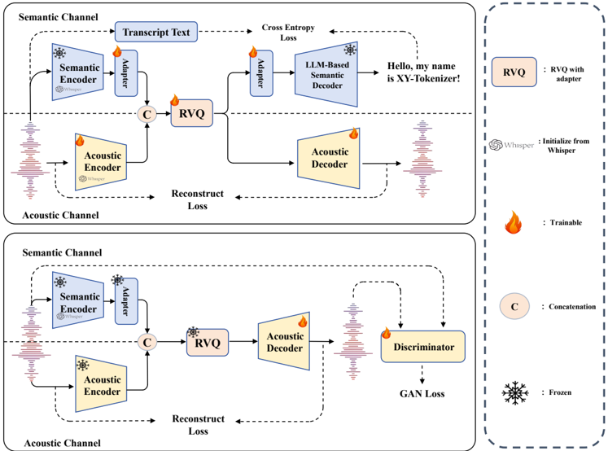

> [!abstract] arXiv · 2025 · Preprint
> **Gong et al.** (Fudan University) · [→ Paper](https://arxiv.org/abs/2506.23325) · Demo: ? · Code: ✓
>
> XY-Tokenizer proposes a dual-tower codec architecture that combines LLM-based ASR alignment with GAN-based reconstruction, achieving strong text alignment and competitive acoustic quality simultaneously at 1 kbps, where existing distillation-based codecs consistently sacrifice one objective for the other.

## Problem

Existing speech codecs for language model integration struggle to excel at both semantic alignment (useful for downstream LM modeling) and acoustic fidelity (necessary for high-quality reconstruction) at low bitrates. Acoustic codecs trained with RVQ-GAN (DAC, BigCodec) produce high-quality audio but encode representations that are poorly aligned with text, yielding high word error rates on ASR probing tasks. Semantically-enriched codecs using representation distillation (SpeechTokenizer, Mimi) improve text alignment but introduce a fundamental conflict: the distillation objective competes with the reconstruction objective, and at low bitrates this tension becomes severe. The paper empirically shows that the degree of parameter sharing between semantic and acoustic modeling pathways is the primary driver of this conflict, and that existing approaches have not addressed it structurally.

## Method

XY-Tokenizer uses a dual-tower encoder architecture where a fixed semantic channel (initialized from Whisper-small) and a trainable acoustic channel process mel-spectrogram inputs in parallel. Their outputs are concatenated before entering an 8-layer RVQ quantizer operating at 12.5 Hz, yielding a 1 kbps bitrate. The design minimizes shared parameters between semantic and acoustic pathways, confining sharing to the RVQ module and surrounding adapter layers. A preliminary experiment motivating the encoder choice (Table 1) shows that Whisper preserves speaker timbre and paralinguistic detail far better than HuBERT or WavLM when used as a frozen encoder for audio reconstruction.

Training proceeds in two stages. The pre-training stage uses multi-task learning: a cross-entropy loss from an LLM-based ASR decoder (Qwen2.5-0.5B, kept fixed) aligns the quantized representations with text, while a multi-scale mel-spectrogram reconstruction loss trains the acoustic decoder. During this stage the codec takes an "X-shaped" form, with both semantic and acoustic decoders active. In the post-training stage, the semantic decoder is discarded and a GAN framework (using MPD, MSD, and MS-STFTD discriminators) trains the acoustic decoder on fine-grained perceptual quality, resulting in a "Y-shaped" inference graph. The combined design is the origin of the XY-Tokenizer name.

## Key Results

On LibriSpeech, XY-Tokenizer achieves WER 0.13 on the ASR probing task (a downstream LSTM-CTC model trained on quantized embeddings), SPK-SIM 0.83, STOI 0.91, and PESQ-NB 3.00 at approximately 1 kbps (Table 3). On text alignment, this places XY-Tokenizer just behind Baichuan Audio Tokenizer (WER 0.10) and well ahead of distillation-based competitors at similar bitrates: Mimi-8 (WER 0.28), SpeechTokenizer-x1 (WER 0.34), and XCodec2.0 (WER 0.30). On acoustic reconstruction, XY-Tokenizer matches SpeechTokenizer (full 4 kbps version, SPK-SIM 0.84) and substantially outperforms low-bitrate SpeechTokenizer variants (x1: 0.65, x2: 0.60, x3: 0.48). BigCodec, the strongest acoustic-only codec at 1 kbps, achieves SPK-SIM 0.84, which is only marginally better.

The ablation in Table 4 shows that a single-channel variant with comparable parameters (Whisper-medium encoder, 356M) achieves SPK-SIM only 0.77 vs. XY-Tokenizer's 0.80 at equivalent training steps, confirming that dual-tower separation rather than scale drives the reconstruction improvement. Table 5 shows that keeping the LLM fixed during pre-training is critical: a trainable LLM improves LLM decoder WER but degrades ASR probing WER progressively over training, suggesting the encoder's text alignment capability shifts into the decoder when the LLM can adapt.

## Novelty Assessment

The core architectural insight, that minimizing shared parameters between semantic and acoustic modeling pathways resolves their conflict, is well-motivated and cleanly validated. The dual-tower encoder combining a frozen Whisper channel with a trainable acoustic channel is the primary structural contribution. Pairing this with an LLM-based ASR objective (rather than SSL distillation) is effective and provides a plausible explanation for the strong text alignment results. However, all individual components are established: Whisper encoders, Qwen2 LLMs, RVQ quantizers, and GAN discriminators (MPD, MSD, MS-STFTD) are widely used. The contribution is structural recombination motivated by a clear empirical analysis of why distillation-based approaches fail at low bitrates. Evaluation relies entirely on objective metrics with no subjective listening tests, limiting direct quality comparison with commercial or state-of-the-art synthesis systems.

## Field Significance

Moderate. XY-Tokenizer provides a concrete, reproducible architecture for low-bitrate codecs that avoids the semantic-acoustic trade-off that plagues distillation-based designs. The analysis identifying shared parameters as the root cause of the conflict is a useful diagnostic that can inform future codec architectures targeting speech LM applications. The work is primarily an engineering contribution with a clean empirical justification rather than a paradigm shift, and its practical impact depends on whether the observed objective-metric improvements translate to downstream speech LM quality.

## Claims

- **supports:** Minimizing shared parameters between semantic and acoustic encoding pathways in a speech codec reduces task conflict and enables simultaneous strong text alignment and high acoustic fidelity at low bitrates.
  > *Evidence:* XY-Tokenizer's dual-tower architecture (parameters shared only in the RVQ module) achieves WER 0.13 and SPK-SIM 0.83 at 1 kbps; a matched single-channel model sharing encoder and RVQ across both tasks achieves SPK-SIM 0.77 with the same WER, confirming that parameter sharing degrades reconstruction. *(§3.1, §4.4, Table 4)*

- **supports:** LLM-based ASR supervision during codec pre-training provides stronger text alignment than SSL representation distillation for low-bitrate codecs.
  > *Evidence:* At approximately 1 kbps, XY-Tokenizer (LLM-based ASR, WER 0.13) substantially outperforms SpeechTokenizer variants (distillation-based, WER 0.18-0.34) and Mimi-8 (distillation-based, WER 0.28) on the ASR probing task, while maintaining comparable or better reconstruction quality than those baselines. *(§4.3, Table 3)*

- **complicates:** Representation distillation from SSL models for semantic alignment introduces reconstruction-quality penalties that worsen with distillation strength at low bitrates.
  > *Evidence:* SpeechTokenizer-x3 (5x stronger distillation than the official setting) achieves WER 0.18 but SPK-SIM only 0.48 at 1.5 kbps, compared to SpeechTokenizer-x1 (WER 0.34, SPK-SIM 0.65), demonstrating that stronger distillation systematically degrades acoustic fidelity. *(§4.3, Table 3)*

- **complicates:** Allowing the LLM decoder to train freely during multi-task codec pre-training improves autoregressive text generation but degrades the encoder's transferable text-alignment representations.
  > *Evidence:* A trainable-LLM variant achieves lower LLM decoder WER (0.03 vs. 0.06 at 200K steps) but higher ASR probing WER (0.18 vs. 0.13), with the probing WER worsening progressively over 800K training steps, suggesting the encoder's text alignment capacity migrates into the flexible decoder. *(§4.4, Table 5)*

- **supports:** Whisper's supervised ASR pre-training enables better paralinguistic information preservation in codec encoder architectures than self-supervised alternatives.
  > *Evidence:* Preliminary auto-encoder experiments with frozen encoders show Whisper achieves SPK-SIM 0.68, STOI 0.88, and PESQ-NB 2.03 on LibriSpeech test-clean, compared to WavLM (SPK-SIM 0.53) and HuBERT (SPK-SIM 0.42), motivating Whisper as the codec encoder initialization. *(§2, Table 1)*

## Limitations and Open Questions

> [!warning]
> Evaluation uses only objective metrics (WER, SPK-SIM, STOI, PESQ). No subjective listening tests or MOS scores are reported, making it impossible to assess perceptual audio quality relative to competing systems.

Achieving further reductions in bitrate below 1 kbps without performance degradation remains an open challenge noted by the authors. The scaling behavior of the two-stage training approach with respect to parameter count and dataset size is not characterized, leaving open questions about how to optimize training efficiency for larger variants. The LLM-based ASR decoder (Qwen2.5-0.5B) adds substantial parameter overhead during pre-training that is absent during inference, but the computational cost and training complexity of this stage relative to distillation-based approaches is not discussed.

## Wiki Connections

- [[neural-codec|Neural Audio Codec]] — XY-Tokenizer is itself a neural audio codec targeting speech LM applications, contributing an architectural solution to the semantic-acoustic conflict at low bitrates.
- [[spoken-language-model|Spoken Language Model]] — the paper motivates its design around the need for codecs that serve as effective discrete token representations for autoregressive speech language models.
- [[autoregressive-codec-tts|Autoregressive Codec TTS]] — the semantic-acoustic conflict analysis addresses a core bottleneck for autoregressive speech generation systems that require codec tokens to be both LM-friendly and acoustically expressive.
- [[disentanglement|Disentanglement]] — XY-Tokenizer explicitly separates semantic and acoustic representations into distinct dual-tower encoder channels, with the hypothesis that reduced shared parameters between pathways resolves task conflict.
- [[evaluation-metrics|Evaluation Metrics]] — the paper uses and discusses the ASR probing task (a downstream LSTM-CTC model trained on quantized codec embeddings) as a quantitative measure of semantic alignment quality in codec representations.
- [[2301.02111|VALL-E]] (VALL-E) — cited as the foundational neural codec language model that established the paradigm motivating the need for semantically rich codec tokens in autoregressive speech generation.
