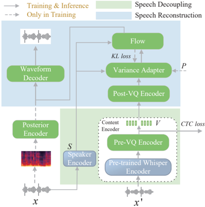

> [!abstract] arXiv · 2025 · Preprint
> **Cheng et al.** · [→ Paper](https://arxiv.org/abs/2507.01348) · Demo: ? · Code: ?
>
> Introduces SpeechCodeVAE, the first content tokenizer to integrate CTC regularization directly into vector quantization codebook discretization, producing speaker-agnostic speech tokens with a "locality" property, embedded in a unified autoregressive framework that jointly trains foreign accent conversion and TTS to compensate for accented speech data scarcity.

## Problem

Foreign accent conversion (FAC) modifies non-native L2 speech to sound like native L1 speech while preserving the speaker's identity and linguistic content. The task poses two compounding difficulties: standard K-means-based semantic tokenizers lose substantial speech information through quantization, compromising downstream LLM training, and accented speech datasets are small relative to what autoregressive LMs need to converge reliably. Prior work either required paired reference L1 utterances that are hard to obtain, or trained FAC models in isolation and suffered slow convergence. A further issue is that LLM-based speech generation produces stochastic token errors (spurious substitutions, deletions) that degrade acoustic continuity in ways that are not addressed by the generation model itself.

## Method

SpeechAccentLLM integrates three purpose-built modules: SpeechCodeVAE for speech disentanglement and tokenization, a transformer decoder-based FAC+TTS model for joint generation, and SpeechRestorer for post-hoc token error correction.

**SpeechCodeVAE** builds on VITS (Kim et al., 2021) extended with four additional modules: Content Encoder, Speaker Encoder, Post-VQ Encoder, and Variance Adapter. The Content Encoder processes perturbed speech (random f0 and formant modifications applied to 50% of samples to discourage timbre leakage) through a frozen Whisper-medium encoder (50Hz), a hybrid convolutional-transformer Pre-VQ Encoder trained with CTC loss against IPA targets, and an EMA-updated VQ module with 1024 codebook entries. CTC is applied before quantization, imposing a phoneme-alignment pressure that gives the resulting discrete tokens their locality property: each token captures only information from its local speech segment, with no cross-frame dependencies. The Speaker Encoder uses a frozen ECAPA-TDNN (512-dim) to extract timbre embeddings. The Variance Adapter predicts and integrates f0 via a dual-stream transformer that bridges discretized pitch and content vectors. Training uses a composite loss: VQ reconstruction (L_VQ), CTC (L_CTC), f0 prediction (L_f0), mel reconstruction (L_mel), KL divergence (L_KL), adversarial (L_adv), and feature-matching (L_fm) terms.

![The overview of SpeechAccentLLM for FAC inference. Speech Decoupling extracts nonnative accented content tokens and speaker information from nonnative accented speech. The FAC&TTS Model takes nonnative accented content tokens as input and outputs predicted native accented content tokens. SpeechRestorer post-processes the speech content tokens predicted by the FAC&TTS Model. Finally, Speech Reconstruction combines the output content tokens from SpeechRestorer with speaker information to reconstruct native accented speech.](assets/2507.01348/figure-1.png)

The **FAC+TTS Model** is an 8-layer transformer decoder (512-dim, 8 heads) trained jointly on both tasks. A Task ID token at the start of each sequence selects the mode: for TTS, the model maps text tokens to speech content tokens autoregressively; for FAC, it maps nonnative content tokens to native content tokens. TTS data from LibriSpeech and VITS-synthesised native counterparts (370 hours total) is oversampled 1:1 against the FAC data (9.3 hours, L2-ARCTIC across six L1 backgrounds) to balance the tasks during training.

**SpeechRestorer** is a 4-layer bidirectional transformer encoder (512-dim, 4 heads) trained separately in a masked-token-restoration regime: 10% of tokens are randomly replaced and 10% are masked, with the model trained to recover originals. At inference, it filters the FAC+TTS Model's output before waveform reconstruction, correcting local substitution errors while preserving the token-level locality that makes such correction feasible.

SpeechCodeVAE is pre-trained on a 562-hour multilingual corpus (AISHELL-1, LibriSpeech train-clean-360, JVS) spanning 92% of IPA phonemes. Whisper and ECAPA-TDNN encoders are frozen throughout.

## Key Results

On the FAC evaluation (100 utterances from L2-ARCTIC test set, four L1 backgrounds), SpeechAccentLLM reduces accentedness from 2.48 (baseline, Quamer et al. 2022) to 1.86 (25% improvement) and WER from 14.4% to 9.1%. CMOS improves from 3.552 to 4.074. Accentedness and naturalness show a strong negative correlation (r = -0.82), suggesting the two are coupled through pronunciation accuracy (§5.1, Table 1).

On SpeechCodeVAE's tokenization quality (Table 2), the full model achieves De-duplication Efficiency of 0.253 vs. CosyVoice-50Hz's 0.159 (59% higher) and Speed Robustness of 0.219 vs. 0.024 (roughly 9 times better). Removing CTC loss collapses Speed Robustness to 0.009, confirming that CTC regularization is the primary driver of locality, not the VQ architecture alone.

In zero-shot VC evaluation on L2-ARCTIC (50 source / 50 reference utterances, no speaker seen during training), SpeechCodeVAE outperforms YourTTS (CMOS 4.256 vs. 3.961; SMOS 4.302 vs. 3.950) and FreeVC (CMOS 4.256 vs. 3.810; SMOS 4.302 vs. 4.144). A K-means variant replacing VQ quantization degrades all metrics, traced to codebook-decoder mismatch at inference (Table 3).

TTS ablations (100 utterances, LibriSpeech test-clean reference speakers) show that removing SpeechRestorer drops CMOS from 3.850 to 3.629 and removing the Variance Adapter drops it further to 3.537, with SMOS falling from 4.204 to 3.926. The full model trails NaturalSpeech2 (CMOS 3.850 vs. 3.944, SMOS 4.204 vs. 4.263), a gap the authors attribute primarily to training data scale (NS2 trains on roughly two orders of magnitude more data) rather than architectural factors (Table 4).

## Novelty Assessment

The integration of CTC regularization directly into VQ codebook discretization is genuinely new. Prior approaches to speaker-agnostic content tokenization either rely on K-means clustering of SSL features (which discard information) or supervised semantic tokens without explicit phoneme-alignment pressure at the quantization stage. Using Whisper as the feature extractor is motivated by its speaker-suppression property rather than by simple convention, and the CTC-VQ combination is validated with a dedicated locality metric. This is the paper's strongest contribution.

The joint FAC+TTS training strategy is a practical engineering response to data scarcity rather than a novel method; multitask learning to compensate for low-resource tasks is well established. SpeechRestorer's BERT-style token restoration is an application of an existing mechanism (masked language modeling) to speech token sequences; its value here is empirical rather than conceptual. The overall framework is an integration of established components (VITS, Whisper, ECAPA-TDNN, transformer LM, BERT) around the novel SpeechCodeVAE tokenizer.

## Field Significance

Moderate — SpeechAccentLLM advances a specialized sub-area (foreign accent conversion) rather than core TTS, but the CTC-regularized VQ tokenizer is a transferable design principle for any system that needs phoneme-aligned, speaker-agnostic discrete speech representations. The locality property demonstrated here provides a principled basis for token-level post-processing modules such as SpeechRestorer; this connection may inform error-correction strategies in other LLM-based speech generation pipelines. The evaluation is conducted on a public benchmark (L2-ARCTIC) with a clear baseline, which supports reproducibility.

## Claims

- **supports:** CTC regularization applied before vector quantization improves the temporal locality and temporal robustness of discrete speech content tokens.
  > *Evidence:* SpeechCodeVAE achieves 59% higher De-duplication Efficiency and approximately 9 times better Speed Robustness than CosyVoice-50Hz; ablation without CTC loss collapses Speed Robustness from 0.219 to 0.009, identifying CTC as the critical factor. *(§5.2, Table 2)*

- **supports:** Multi-task learning with TTS as an auxiliary objective compensates for data scarcity in foreign accent conversion, improving both convergence and output quality.
  > *Evidence:* Joint FAC+TTS training on 370 hours of TTS data alongside 9.3 hours of FAC data yields 25% accentedness reduction and WER improvement from 14.4% to 9.1% relative to a standalone FAC baseline. *(§3, §5.1, Table 1)*

- **supports:** BERT-style masked token restoration can correct stochastic local substitution errors introduced by autoregressive speech token decoding, improving acoustic continuity.
  > *Evidence:* Removing SpeechRestorer decreases TTS CMOS from 3.850 to 3.629, with the paper attributing the gain to error-correction of spurious token substitutions that cause acoustic discontinuities. *(§5.3, Table 4)*

- **complicates:** Token-level post-processing for LLM speech generation can correct local substitution errors but fails to address higher-level failure modes such as word skipping and repetition.
  > *Evidence:* The paper explicitly states that SpeechRestorer cannot fix skipped words or repetitions, as these require sequence-level rather than token-level correction. *(§6)*

- **refines:** Training data scale, rather than architectural design, is the primary driver of quality gaps between LLM-based TTS systems at different performance levels.
  > *Evidence:* SpeechAccentLLM trails NaturalSpeech2 in TTS naturalness (CMOS 3.850 vs. 3.944) despite comparable architecture; the gap is attributed to NS2 training on approximately two orders of magnitude more data. *(§5.3, Table 4)*

## Limitations and Open Questions

> [!warning]
> The FAC evaluation is restricted to four L1 backgrounds from L2-ARCTIC and uses a single TTS model (LJSpeech-trained VITS) to generate native accent counterparts. Generalisation to other accents, speaking styles, or higher-quality native reference speech is untested.

Prosody modelling is acknowledged as incomplete; the Variance Adapter models f0 only and does not capture rhythm, duration patterns, or prosodic phrasing beyond pitch. Timbre reconstruction quality is bounded by the frozen ECAPA-TDNN speaker encoder, which was not trained for the L2/accented-speech domain. SpeechRestorer cannot resolve sequence-level decoding failures (word skipping, repetition), leaving a category of LLM-generated errors unaddressed. The paper does not report total parameter counts for any module, which complicates direct comparison with other systems.

## Wiki Connections

- [[voice-conversion|Voice Conversion]] — FAC is framed as a specialised form of voice conversion; zero-shot VC on L2-ARCTIC serves as the primary evaluation of SpeechCodeVAE's disentanglement capability.
- [[autoregressive-codec-tts|Autoregressive Codec TTS]] — the FAC+TTS Model is a transformer decoder LM that generates discrete speech content tokens autoregressively, placing it squarely within the codec-native LM generation paradigm.
- [[neural-codec|Neural Audio Codec]] — SpeechCodeVAE contributes a novel CTC-regularized VQ tokenizer design for speaker-agnostic content tokens, distinct from acoustic codecs like EnCodec.
- [[disentanglement|Disentanglement]] — SpeechCodeVAE explicitly separates content (V), speaker timbre (S), and prosody (P) into distinct representation spaces, with dedicated encoders and training losses enforcing the separation.
- [[zero-shot-tts|Zero-Shot TTS]] — SpeechCodeVAE's content-speaker disentanglement enables zero-shot voice conversion; the paper evaluates on completely unseen L2-ARCTIC speakers without fine-tuning.
- [[2407.05407|CosyVoice]] (CosyVoice) — serves as the primary tokenization baseline; SpeechCodeVAE demonstrates substantially better De-duplication Efficiency and Speed Robustness than CosyVoice's supervised 50Hz semantic tokens.
- [[2412.10117|CosyVoice2]] (CosyVoice 2) — cited as a related scalable multilingual TTS framework; the paper's approach draws on CosyVoice's use of supervised semantic tokens as a design reference.
