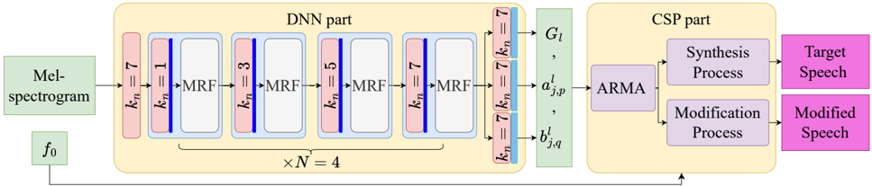

> [!abstract] arXiv · 2025 · Preprint
> **Chen and Toda** (Nagoya University) · [→ Paper](https://arxiv.org/abs/2507.01611) · Demo: ? · Code: ?
>
> QHARMA-GAN is a hybrid neural vocoder that encodes speech resonance characteristics as ARMA filter coefficients estimated by a GAN-trained network, enabling high-quality resynthesis alongside reliable pitch and time-scale modification beyond the training frequency range.

## Problem

End-to-end neural vocoders such as HiFi-GAN generate waveforms by mapping mel-spectrograms directly to audio through learned upsampling networks. While effective for in-distribution synthesis, this approach has two structural weaknesses. First, the network has no explicit model of the speech production process, making speech modification (pitch scaling, time stretching) unreliable: adjusting f0 outside the training range produces distorted output because the network has never learned the amplitude and phase relationships at those frequencies. Second, the black-box waveform generation requires large training corpora to avoid overfitting. Conventional signal-processing vocoders such as WORLD and QHM provide explicit controllability but suffer from low synthesis quality and slow, iterative analysis. The prior work QHM-GAN (the authors' own Interspeech 2024 paper) combined quasi-harmonic modeling with a neural network generator but lacked spectral envelope modeling, leaving pitch modification inaccurate.

## Method

QHARMA-GAN replaces the direct waveform prediction of neural vocoders with a two-stage process: a neural network predicts framewise ARMA (autoregressive moving average) filter coefficients, and a classical signal-processing (CSP) synthesis stage uses those coefficients analytically to compute the amplitude and phase of each quasi-harmonic component and then sum the components into a waveform.

The generator uses a stack of MRF (multi-receptive field fusion) modules, the same building block as HiFi-GAN, but avoids upsampling by operating at the frame rate throughout. The network outputs three parameter streams: the gain G, the AR coefficients, and the MA coefficients, all time-varying at the frame level. Because the ARMA model provides a closed-form frequency response H(t, omega), the amplitude and phase delay at any quasi-harmonic frequency can be computed directly by substituting that frequency into the filter equations. This is the key enabler: when pitch is shifted by a factor rho, the modified frequency is simply substituted into the same ARMA response, giving accurate amplitude and phase estimates without retraining. To extend the frequency correction range, the ARMA coefficients are split into a cascade of r mini-ARMA models, each contributing a bounded phase delay; their total phase range scales with r, matching the wide-band correction of QHM's phase-compensation mechanism.

During synthesis, a voiced/unvoiced (V/UV) mask selectively modifies voiced frames for pitch scaling while leaving unvoiced frames unchanged, preserving stochastic noise segments that would otherwise lose energy when the number of harmonics changes with pitch.

Training uses three discriminators: a multi-resolution spectrogram discriminator (MRD), a multi-scale discriminator (MSD), and a multi-period discriminator (MPD). The MRD and MPD guide voiced speech generation; the MSD proves most effective for unvoiced regions.

## Key Results

In the main synthesis experiment on VCTK (110 speakers) and JVS (100 Japanese speakers), QHARMA-GAN achieves MOS 4.21 (VCTK) and 3.80 (JVS), compared to HiFi-GAN's 4.08 / 3.64, WORLD's 4.12 / 3.67, and QHM's 4.07 / 3.40. PESQ is intermediate (3.14 on VCTK), behind QHM (3.45) but comparable to HiFi-GAN (3.14). The perceptual advantage is attributed to smoother frequency trajectories enabled by ARMA-based phase estimation and cubic phase interpolation (§V.B, Table III).

For f0 extrapolation, QHARMA-GAN consistently outperforms Vocos and hn-NSF in V/UV rate and UTMOS across all four pitch-scale factors tested (rho = 2^-1, 2^-0.5, 2^0.5, 2^1). Vocos fails entirely at large pitch shifts, exhibiting f0 RMSE of 0.65-0.67 Hz on VCTK, while QHARMA-GAN stays at 0.08-0.11 Hz (§V.B, Table II).

Runtime: QHARMA-GAN overall RTF is 0.187 on a single CPU core, comparable to HiFi-GAN (0.153). The simplified QHARMA-GAN-small reduces this to 0.084, faster than HiFi-GAN, by reducing MRF modules and removing upsampling in the analysis stage (§V.C, Table V).

In out-of-distribution singing voice evaluation (OpenSinger; models trained on Japanese speech), QHARMA-GAN achieves the best UTMOS (2.2) and f0 RMSE (0.11), while HiFi-GAN and Vocos fail to generate high-frequency soprano harmonics (§V.D, Table VI).

In few-shot evaluation on a small LJSpeech subset (919 training utterances), QHARMA-GAN scores MOS 3.85 and QHARMA-GAN-small scores 3.90, matching QHM (3.86) and well above HiFi-GAN (3.53), which overfits on the limited data (§V.D, Table VII).

## Novelty Assessment

The contribution is genuine architectural novelty within a niche design space: hybrid source-filter vocoders that combine classical signal-processing synthesis with a neural discriminative network. The ARMA formulation for spectral envelope estimation is specifically engineered to admit closed-form amplitude and phase computation at arbitrary frequencies, which is the direct mechanism for extrapolation-capable pitch modification. This distinguishes QHARMA-GAN from prior source-filter vocoders such as SiFi-GAN and hn-NSF, which absorb f0 as an input but do not analytically derive spectral envelope responses.

The limitation is that this is an extension of the authors' own QHM-GAN (Interspeech 2024) with one additional modeling component (ARMA resonance). The discriminator design, training losses, and generator backbone are all inherited from HiFi-GAN. The paper is submitted as a journal article to IEEE TASLP, which explains the thorough experimental coverage (four evaluation scenarios, eight baselines, two languages, OOD and few-shot evaluations), but the core idea is focused and incremental relative to the QHM-GAN predecessor.

## Field Significance

Moderate — QHARMA-GAN provides evidence that embedding classical source-filter signal-processing structure into a GAN vocoder substantially improves pitch extrapolation and data efficiency compared to end-to-end neural waveform generation, while maintaining competitive synthesis quality. The contribution is primarily architectural within the hybrid vocoder niche; it does not challenge the dominant mel-spectrogram-to-waveform paradigm but demonstrates a credible alternative for applications requiring controllable pitch modification.

## Claims

- **supports:** Explicit spectral envelope modeling in a neural vocoder enables reliable pitch modification beyond the training frequency range, where purely neural waveform predictors fail.
  > *Evidence:* QHARMA-GAN maintains f0 RMSE of 0.08-0.11 Hz across pitch-scale factors from 0.5x to 2x on VCTK, while Vocos fails catastrophically (0.65-0.67 Hz); soprano singing voices from an unseen language are reproduced with full harmonic range, whereas HiFi-GAN and Vocos generate only low-frequency harmonics. *(§V.B, §V.D, Tables II, VI, Fig. 6)*

- **supports:** Incorporating classical signal-processing constraints into a neural vocoder reduces data requirements without sacrificing subjective quality.
  > *Evidence:* QHARMA-GAN trained on 919 LJSpeech utterances achieves MOS 3.85 compared to HiFi-GAN's 3.53 under the same data constraint; the gap is attributed to HiFi-GAN's overfitting on insufficient data, while QHARMA-GAN's hybrid structure provides analytical priors that reduce the burden on the neural component. *(§V.D, Table VII)*

- **complicates:** Hybrid vocoders that analytically reconstruct phase can achieve higher subjective naturalness than end-to-end neural vocoders despite lower PESQ scores, suggesting objective spectral distance metrics do not fully capture perceptual frequency smoothness.
  > *Evidence:* QHARMA-GAN scores MOS 4.21 on VCTK vs HiFi-GAN's 4.08, while PESQ is comparable (3.14 vs 3.14) and both trail QHM's PESQ of 3.45 despite QHM scoring the lowest subjective MOS (4.07); the divergence is attributed to QHARMA-GAN's ability to reduce frequency distortion that HiFi-GAN exhibits in some samples. *(§V.B, Table III)*

- **complicates:** V/UV detection errors are a critical bottleneck for hybrid pitch-modification vocoders, particularly at extreme pitch-raising factors.
  > *Evidence:* QHARMA-GAN outperforms WORLD in pitch lowering (MOS 3.01 vs 2.98 at rho=0.5x on VCTK) but underperforms WORLD in pitch raising (2.72 vs 2.82 at rho=2x), attributed to V/UV misclassification reducing harmonic component count in unvoiced segments during upward pitch shifts. *(§V.B, Table IV)*

## Limitations and Open Questions

> [!warning]
> Accurate V/UV detection is an unsolved dependency: QHARMA-GAN's pitch modification quality is bounded by the accuracy of the V/UV classifier, which the paper treats as a fixed external component. The authors identify this as "an urgent research topic for the future," but no solution is proposed.

QHARMA-GAN requires an additional f0 predictor module when used as part of a TTS backend, unlike mel-spectrogram-to-waveform vocoders that take mel-spectrograms directly as input. This additional module adds pipeline complexity and introduces a potential error source in the f0 prediction step.

PESQ scores on VCTK are below QHM (3.14 vs 3.45) and below Vocos (3.15), indicating that the ARMA-based amplitude estimation introduces spectral distortion despite improving perceptual frequency smoothness. The objective-subjective gap is noted but not fully explained.

Evaluations use proprietary metrics (UTMOS) alongside standard ones; no listening test confidence intervals are reported for the modification experiments (Table IV), making statistical significance of cross-method differences difficult to assess.

## Wiki Connections

- [[gan-vocoder|GAN Vocoder]] — introduces a hybrid vocoder architecture combining GAN training with quasi-harmonic signal processing, extending the GAN vocoder design space to incorporate explicit spectral envelope and pitch controllability.
- [[prosody-control|Prosody Control]] — proposes explicit f0 scaling and time stretching through direct manipulation of ARMA model parameters, enabling pitch modification across ranges outside the training distribution.
- [[evaluation-metrics|Evaluation Metrics]] — employs a multi-metric protocol (MOS, PESQ, MCD, UTMOS, F0-RMSE, V/UV rate, RTF) across two languages and four evaluation scenarios, illustrating the divergence between objective spectral distance measures and subjective naturalness ratings.
- [[subjective-evaluation|Subjective Evaluation]] — conducts human MOS evaluations across six methods with 20 listeners and 12 utterances per listener, finding perceptual quality advantages for QHARMA-GAN that are not reflected consistently in automatic metrics such as UTMOS.
