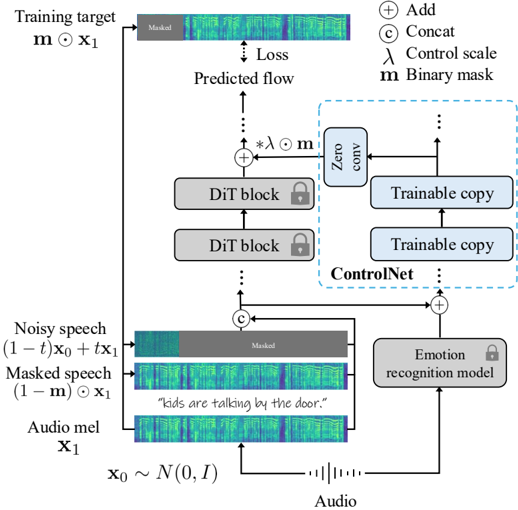

> [!abstract] arXiv · 2025 · Preprint
> **Jeong et al.** (Yonsei University) · [→ Paper](https://arxiv.org/abs/2507.04349) · Demo: ✓ · Code: ?
>
> Adapts the ControlNet paradigm from image generation to flow-matching TTS, enabling time-varying emotion control added to a frozen pretrained model using only approximately 400 hours of public emotional speech data.

## Problem

Existing emotion-controllable TTS systems operate at the utterance level and require either full fine-tuning on large labeled emotion datasets or accept degraded naturalness as a consequence. Methods that do support time-varying emotional modulation (e.g., EmoCtrl-TTS) depend on full model fine-tuning with tens of thousands of hours of in-house data, making them computationally expensive and closed to the research community. A gap therefore exists between utterance-level control achievable with modest resources and fine-grained time-varying control that is accessible and preserves the original model's capabilities.

## Method

TTS-CtrlNet freezes a pretrained flow-matching TTS backbone (F5-TTS, a DiT-based model) and introduces a parallel trainable copy of it following the ControlNet design of Zhang et al. (2023). The two branches are connected via zero-convolution layers, which initialize outputs to zero so that the backbone behavior is fully preserved at the start of training. Emotion conditioning enters through a wav2vec 2.0-based speech emotion recognition (SER) model that extracts arousal and valence features at the frame level; a 1x1 convolution then projects the SER output to match the DiT input channel dimension F, yielding an emotion embedding e with shape F x T that is concatenated with the model's standard inputs before entering the ControlNet branch.

The ControlNet blocks produce residual corrections that are added back to the corresponding original DiT block outputs at inference, gated by a control scale parameter lambda. Three design choices are developed through ablation:

**Selective block connection.** Not all DiT blocks contribute equally. A layer-wise skip-and-measure analysis identifies blocks whose removal sharply increases WER or degrades speaker similarity; these critical blocks are excluded from the ControlNet connection, preserving text intelligibility while maintaining emotion and speaker fidelity.

**Emotion-specific flow step.** Emotion is concentrated in early flow steps (close to the Gaussian prior), not near the target distribution. Training the ControlNet only on the interval t in [0, t_emo] (empirically 0.1 for F5-TTS) reduces WER and improves Emo-SIM compared to training across the full [0, 1] range. At inference, ControlNet is applied only during this early interval.

**Emotion window size.** The SER model was trained on utterance-level labels with mean-pooled wav2vec features. Using window-based interpolation over wav2vec outputs at inference approximates this averaging, producing smoother time-varying emotion embeddings than token-by-token prediction.

Training updates only the ControlNet parameters, using the standard OT-CFM loss conditioned on emotion. Training uses approximately 400 hours of public emotional speech assembled from five datasets.

## Key Results

> [!note]
> Most baseline results in Table 5 are taken from the EmoCtrl-TTS paper rather than independently reproduced. Direct numerical comparisons should be treated with caution, especially for models not publicly available.

On the EMO-Change benchmark (time-varying emotion with English prompts), TTS-CtrlNet achieves Emo-SIM 0.724 and Aro-Val SIM 0.864, outperforming F5-TTS (0.692 / 0.845) and all EmoCtrl-TTS variants in both emotion metrics, while maintaining near-zero WER (0.6%) comparable to the base model. Speaker similarity (SIM-o 0.589) is preserved relative to F5-TTS (0.579).

On the JVNV S2ST benchmark (cross-lingual Japanese-to-English emotion transfer), TTS-CtrlNet achieves Emo-SIM 0.751 and Aro-Val SIM 0.742, substantially above F5-TTS (0.684 / 0.627) and EmoCtrl-TTS (0.693 / 0.643). WER is 5.4%, higher than F5-TTS's 4.5%, attributable to the cross-lingual mismatch between Japanese input audio and the English-Chinese trained backbone.

Subjective evaluation on 20 samples per model shows NMOS 3.2 / EMOS 3.4 on JVNV S2ST, and NMOS 3.8 / EMOS 3.3 on EMO-Change, compared to F5-TTS's NMOS 2.3 / EMOS 2.6 and 3.8 / 2.0 respectively. The naturalness improvement on JVNV is notable. Results are from 10 raters per metric.

Regarding efficiency: limiting ControlNet to early flow steps [0, 0.1] adds 0.5 seconds per sample versus the 1.7-second overhead of full-range [0, 1] application (Table 8).

## Novelty Assessment

The core idea, freezing a pretrained model and training a parallel copy connected through zero-convolutions, is borrowed directly from Zhang et al. (2023) ControlNet for image diffusion. The primary novelty is the first application of this paradigm to flow-matching TTS and the domain-specific design choices that make it work. The three design contributions (selective block analysis, emotion-specific flow step, temporal smoothing for SER) are well-motivated and supported by ablation experiments. The ablation of emotion-specific flow steps is particularly novel: identifying that emotion in a flow trajectory is concentrated near the Gaussian end and exploiting this for training efficiency is a non-obvious finding.

The training data efficiency is a meaningful practical contribution: 400 hours of public data versus the 27k hours of in-house emotion data used by EmoCtrl-TTS. However, several limitations constrain the assessment. Most baseline comparisons rely on numbers reported by a prior paper rather than independent reproduction, which weakens the comparative claims. Speaker similarity for TTS-CtrlNet on JVNV S2ST (0.464) trails several baselines (EmoCtrl-TTS 0.497). The SER model's inability to handle non-verbal vocalizations restricts expressiveness relative to systems with dedicated non-verbal encoders.

## Field Significance

Moderate — provides the first adaptation of ControlNet-style frozen-backbone training to flow-matching TTS, demonstrating that time-varying emotion control can be added without full model retraining and with modest public data. The design analyses (selective block connections, emotion-specific flow steps, SER temporal smoothing) offer practical guidance for future emotion-conditioned TTS work. The efficiency advantage over full fine-tuning approaches is relevant to practitioners without access to large proprietary datasets.

## Claims

- **supports:** Frozen-backbone adapter training can add fine-grained, time-varying conditioning to pretrained flow-matching TTS with substantially less data than full fine-tuning.
  > *Evidence:* ControlNet blocks trained on approximately 400 hours of public emotion data achieve higher Emo-SIM and Aro-Val SIM than EmoCtrl-TTS, which requires 87k hours of training including 27k hours of in-house emotion data, while preserving the backbone's zero-shot voice cloning capability. *(§1, §4.4, Table 5)*

- **complicates:** Stronger emotion conditioning in flow-matching TTS introduces a trade-off with text intelligibility.
  > *Evidence:* Increasing control scale lambda from 0 to 1 consistently improves AutoPCP, Emo-SIM, and Aro-Val SIM but raises WER from 2.9% to 9.58% on the EMO-Change benchmark, showing that stronger emotion modulation introduces acoustic variations that degrade phoneme-level precision. *(§4.3.4, Table 4)*

- **supports:** Transformer blocks in DiT-based TTS models contribute unequally to speaker identity and text intelligibility, and block selection is important for conditional control.
  > *Evidence:* Layer-wise skip analysis on F5-TTS shows that removing specific blocks dramatically increases WER and reduces speaker similarity; excluding those critical blocks from ControlNet connections yields WER 0% and SIM-o 0.684 versus 8.9% WER and 0.630 SIM-o when all blocks are connected. *(§4.3.1, Figure 2, Table 3)*

- **supports:** Emotion in a flow-matching trajectory is concentrated at early denoising steps, and restricting conditioning to this interval improves both efficiency and intelligibility.
  > *Evidence:* Training with flow step interval [0, 0.1] achieves Emo-SIM 0.565 and Aro-Val SIM 0.876 with 1.9% WER, whereas training on the full [0, 1] interval degrades to Emo-SIM 0.389 and Aro-Val SIM 0.674 with 0% WER; applying ControlNet only in early steps reduces per-sample inference time from 5.4s to 4.2s. *(§4.3.2, Table 1, Table 8)*

- **complicates:** Frame-level emotion features from self-supervised SER models require temporal smoothing to serve as effective conditioning signals for TTS.
  > *Evidence:* Using emotion window size of 1 (no smoothing) produces Emo-SIM 0.500 and WER 4.7%; a window size of 30 achieves Emo-SIM 0.565 and WER 1.9%, demonstrating that token-level SER features without pooling lose emotional coherence. *(§4.3.3, Table 2)*

## Limitations and Open Questions

> [!warning]
> The underlying SER model cannot reliably recognize non-verbal vocalizations (laughing, crying) since these are not well-captured by the arousal-valence-dominance regression framework trained on utterance-level labels. This restricts the expressiveness of the emotion conditioning relative to systems with dedicated non-verbal encoders (e.g., EmoCtrl-TTS with its NV encoder).

Most baseline comparisons use values reported in a prior paper (EmoCtrl-TTS) rather than independently reproduced, limiting the reliability of direct numerical comparisons for closed-source models. On the cross-lingual JVNV S2ST benchmark, TTS-CtrlNet's speaker similarity (0.464) remains behind several baselines trained on much larger data. The method inherits any failure modes of the backbone F5-TTS, including artifacts during high-pitch synthesis and language bias toward English and Chinese.

## Wiki Connections

- [[flow-matching|Flow Matching]] — TTS-CtrlNet is built entirely on a flow-matching DiT backbone (F5-TTS) and introduces the first ControlNet-style adapter for flow-matching TTS.
- [[emotion-synthesis|Emotion Synthesis]] — the central contribution is a frozen-backbone mechanism for adding time-varying emotion control, with ablations identifying which flow steps and DiT blocks govern emotional expression.
- [[zero-shot-tts|Zero-Shot TTS]] — the ControlNet design preserves zero-shot voice cloning from a reference audio clip, maintaining this capability while adding emotion control.
- [[self-supervised-speech|Self-Supervised Speech]] — wav2vec 2.0 is the core of the SER model that provides frame-level arousal-valence embeddings fed into the ControlNet conditioning branch.
- [[2025.acl-long.313|F5-TTS]] — serves as the backbone; TTS-CtrlNet directly builds upon and extends F5-TTS with emotion conditioning without modifying its parameters.
- [[2407.05407|CosyVoice]] — cited as a related large-scale multilingual zero-shot TTS system representing the class of models this work targets augmenting.
