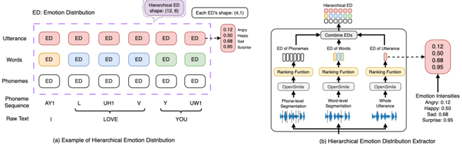

> [!abstract] arXiv · 2025 · Preprint
> **Inoue et al.** · [→ Paper](https://arxiv.org/abs/2507.04598) · Demo: ? · Code: ?
>
> A multi-step prediction framework for hierarchical emotion distribution (ED) that models utterance-, word-, and phoneme-level emotion intensities in successive steps, ensuring global emotional context guides fine-grained prosodic variation in TTS.

## Problem

Most emotional TTS systems represent emotion as a global utterance-level feature, ignoring the hierarchical nature of human speech emotion: pitch, energy, and duration patterns manifest differently at the phoneme, word, and utterance levels, and these levels interact. Prior work on multi-level emotion modeling, including the authors' own single-step hierarchical ED approach, treats each level independently during prediction, failing to propagate higher-level emotional context to lower-level prosodic decisions. This independence leads to inconsistencies in expressiveness and limits fine-grained, quantifiable user control over emotion rendering.

## Method

The framework centers on a hierarchical emotion distribution (ED) extractor that quantifies emotion intensity at three granularities. For each input utterance, the Montreal Forced Aligner segments audio into phoneme, word, and utterance spans. OpenSMILE then extracts an 88-dimensional feature set per segment. Pre-trained support vector machine ranking functions, trained with relative attribute objectives, map these features to continuous ED vectors in [0, 1] per emotion category, producing soft intensity labels that eliminate the need for manual annotation.

Multi-step ED prediction then proceeds sequentially: the utterance-level ED is predicted first from text, its output conditions word-level prediction, and the concatenated utterance and word predictions inform phoneme-level output. This contrasts with the authors' prior single-step baseline, which predicted all levels in parallel from the same text features. Two integration strategies into FastSpeech2 are explored: an External module that appends an ED embedding after a frozen text encoder, and a Variance Adaptor (VA) integration that jointly trains the linguistic encoder under a hierarchical ED difference loss alongside the standard mel-spectrogram L1 loss. HiFiGAN serves as the vocoder in both configurations.

At runtime, users can operate in three modes: emotion prediction (ED predicted from text only), emotion control (ED predicted then manually adjusted), and emotion editing (ED extracted from reference audio and modified). Intensity adjustments are quantitative and operate independently at each hierarchical level.

## Key Results

On the LibriTTS-R emotion prediction task, the VA (Multi-Step) model with ground-truth ED achieves a MUSHRA naturalness score of 62.2, compared to 57.5 for the single-step VA baseline, a meaningful gain especially on intelligibility (WER 2.48 vs. 3.11). When ED is predicted from text rather than taken from ground truth, the multi-step configuration scores 53.2 MUSHRA naturalness (WER 2.45) against 52.2 (WER 4.61) for single-step VA, with the WER improvement being the more striking result.

On the ESD emotion editing task, MUSHRA emotion similarity for multi-step External reaches 51.9 vs. 47.2 for single-step, with corresponding improvements in MCD, pitch distortion, and energy distortion. In best-worst scaling (BWS) controllability tests across five emotions, the proposed model more consistently selects the least expressive sample at intensity 0.0 and the most expressive at 1.0 than MsEmoTTS, particularly for Sad and Surprise categories.

One caveat: in the VA setting, multi-step prediction does not uniformly improve pitch distortion and frame disturbance. The authors attribute this to error accumulation across levels and to joint training making the model more sensitive to ED variation in longer segments.

## Novelty Assessment

The multi-step prediction strategy is a genuine structural addition to the authors' prior single-step hierarchical ED work (ICASSP 2024, APSIPA ASC 2024). The insight that conditioning lower-level ED prediction on higher-level outputs improves both naturalness and intelligibility, not just expressiveness, is the paper's primary empirical finding. The ED extractor, ranking function formulation, and both integration strategies are carried over from earlier work; the novelty is confined to the sequential, dependency-aware prediction architecture. FastSpeech2 is a well-established backbone, and HiFiGAN is standard. The external module design is specifically motivated by compatibility with black-box TTS systems, which is a practical contribution, though the evaluation tests it only on FastSpeech2. Comparisons are fair against the single-step prior work, but MsEmoTTS is the only external baseline and it is re-implemented rather than taken from the original codebase.

## Field Significance

Moderate — This paper advances multi-level emotion control for TTS by demonstrating that a hierarchically conditioned, sequential prediction strategy improves on independent, parallel level prediction. The contribution is primarily to the emotional TTS sub-area rather than to general TTS. The external module design offers a practical path for adapting the framework to other non-autoregressive TTS systems, though this flexibility is not empirically demonstrated beyond FastSpeech2.

## Claims

- **supports:** Hierarchical, dependency-aware emotion prediction yields better emotional naturalness and intelligibility than treating prosodic granularities independently.
  > *Evidence:* VA (Multi-Step) achieves MUSHRA naturalness 62.2 vs. 57.5 (single-step VA) with ground-truth ED, and WER 2.45 vs. 4.61 with predicted ED on LibriTTS-R. *(§5.1.1, Table 1)*

- **supports:** Multi-level emotion intensity control, when implemented at the phoneme and word levels, enables fine-grained and quantifiable manipulation of prosodic features consistent with perceptual expectations.
  > *Evidence:* BWS controllability tests show the proposed model more consistently associates low intensity with least-expressive and high intensity with most-expressive ratings across all five emotions compared to MsEmoTTS, and prosodic trend analysis (duration, pitch mean/std, energy) confirms expected acoustic correlates at each level. *(§5.2, Table 4, Figure 6)*

- **complicates:** Sequential multi-step prediction across hierarchical levels introduces error accumulation that can degrade pitch and duration alignment even when overall naturalness improves.
  > *Evidence:* In the VA setting, multi-step prediction does not outperform single-step on pitch distortion or frame disturbance metrics, attributed to cascaded prediction error and increased sensitivity from joint training with ED difference loss. *(§5.1.2, Table 2)*

- **refines:** The gap between ground-truth and text-predicted emotion distributions at the word level is smaller than at the phoneme level, suggesting that phoneme-level emotion is harder to infer from text.
  > *Evidence:* Table 3 shows mean absolute ED differences are lower for words than phonemes in the multi-step (Predicted) condition, and the authors interpret this as the model prioritizing cross-segment dependencies over precise ED matching. *(§5.1.3, Table 3)*

## Limitations and Open Questions

The system is evaluated exclusively on English data, and the authors identify extension to additional languages as future work. Both training datasets (LibriTTS-R, ESD) are relatively clean, and the method's robustness in noisy or spontaneous conditions is untested. The MsEmoTTS baseline is re-implemented within the FastSpeech2 framework rather than evaluated in its original form, which introduces a potential confound in the emotion editing comparison. The external module's claim of compatibility with arbitrary TTS systems is not verified against any system other than FastSpeech2. Model size and computational cost are not reported.

## Wiki Connections

- [[emotion-synthesis|Emotion Synthesis]] — proposes a hierarchical, multi-step approach to quantifying and controlling emotion intensity at three speech granularities, advancing interpretable emotion rendering.
- [[prosody-control|Prosody Control]] — introduces explicit word- and phoneme-level emotion intensity controls that directly modulate pitch, energy, and duration in synthesized speech.
- [[transformer-enc-dec-tts|Transformer Encoder-Decoder TTS]] — builds on FastSpeech2 as the backbone, integrating hierarchical ED prediction either within its variance adaptor or as an external module.
- [[2409.16681|Emotional Dimension Control in LM-Based TTS]] — cited as a related approach using continuous emotional representations in a language model TTS context; provides a point of comparison for the emotion control methodology.
