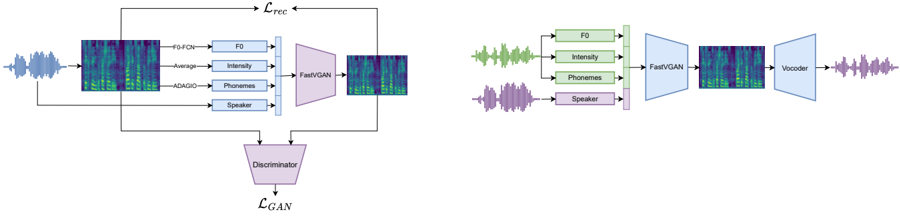

> [!abstract] arXiv · 2025 · Preprint
> **Abrassart et al.** (IRCAM / CNRS / Sorbonne Université) · [→ Paper](https://arxiv.org/abs/2507.04817) · Demo: ? · Code: ?
>
> Fast-VGAN is a lightweight, fully convolutional GAN that synthesises mel-spectrograms by conditioning on explicit, interpretable prosodic features (log-F0, intensity, aligned phonemes, and speaker embeddings), enabling independently controllable F0 and duration manipulation at inference time without disentanglement training.

## Problem

Most voice conversion systems treat prosody as an implicit by-product of speaker identity transfer: the model learns to match a target speaker's vocal character, but the pitch and rhythm of the converted output cannot be adjusted independently. Systems that do support explicit prosodic control typically rely on large pre-trained models (e.g., HuBERT for linguistic embeddings) or multi-stage pipelines that add engineering complexity without offering transparent access to individual prosodic dimensions. There is also limited exploration of whether prosodic contours extracted from expressive reference speakers can drive neutral-to-expressive conversion when a model has never seen expressive training examples.

## Method

Fast-VGAN is a non-autoregressive, fully convolutional GAN (approximately 3.2M parameters) that maps four explicit conditioning streams into an 80-band mel-spectrogram. The conditioning inputs are: (1) log-mean-normalised F0 extracted with F0-FCN, (2) per-frame intensity computed as the average mel-spectrogram energy, (3) temporally aligned phoneme embeddings derived from a Conv1D layer over one-hot phoneme labels with positional cross-fade encodings indicating frame position within the utterance and within each phoneme, and (4) a learnable unit-norm speaker lookup embedding. All features are concatenated along the feature axis, replicated along frequency, and projected via a Conv2D layer to form the input tensor.

The generator consists of five convolutional blocks (one transposed Conv2D followed by three Conv2D layers and a residual block), with channels decreasing from 160 to 96 and Swish activations throughout. Two parallel discriminator branches operate during training: a 2D convolutional branch that evaluates local time-frequency patterns and a 1D convolutional branch capturing global spectral structure over time. Both discriminators are conditioned on the same F0 contour, speaker embedding, and phoneme labels as the generator. The loss combines a reconstruction term (RMSE, weight 1.0) and an adversarial MSE term (weight 0.5). At inference, voice conversion is performed by substituting the target speaker's embedding; optional prosodic adaptation applies the target speaker's mean speech rate or F0 ambitus to the source contour. The MBExWN universal neural vocoder converts generated spectrograms to 24 kHz waveforms.

## Key Results

On seen-speaker VCTK VC (8 speakers, many-to-many), Fast-VGAN achieves a WER of 0.000% and a cosine speaker similarity of 0.648, compared to ControlVC (WER 0.089%, similarity 0.652) and HiFi-VC (WER 2.857%, similarity 0.586), with Fast-VGAN using roughly 3.2M parameters against ControlVC's ~20M and HiFi-VC's ~14M (Table 2). In subjective evaluation (40 participants on Prolific), Fast-VGAN scores a naturalness MOS of 3.63 ± 0.25 and speaker similarity MOS of 3.47 ± 0.32, placing it above ControlVC (3.60 / 2.82) and HiFi-VC (2.96 / 2.00) and below ground truth (4.35 / 4.34) (Table 4). When target-speaker ambitus or speech rate dilation is applied individually, performance remains stable; combining both degrades MOS naturalness to 3.13 and similarity to 2.99, suggesting that joint prosodic adaptation is a trade-off risk.

For static pitch shift and duration scaling, MOS curves peak at neutral settings and decline smoothly with extreme modifications (up to ±1 octave transposition or 3x vowel duration). On the expressive synthesis experiment (Expresso dataset, emotions confused/happy/sad), Fast-VGAN achieves a global speaker similarity of 0.867 ± 0.029 and a WER of 19.46% comparable to real recordings (19.38%), having been trained on only neutral utterances from those speakers (Table 3). Subjective results are encouraging for "confused" but mixed for "happy" and "sad", reflecting the inherent ambiguity of vocal emotion perception.

## Novelty Assessment

The contribution is genuine but incremental. Explicit F0 and duration conditioning in GAN-based VC is not new in principle (ControlVC takes a similar approach), but Fast-VGAN achieves this with a fully convolutional, end-to-end-trainable architecture that avoids any pre-trained SSL models, making the parameter footprint (3.2M) substantially smaller than comparable systems. The expressive synthesis experiment -- converting neutral speech to expressive styles using prosodic contours extracted from a parallel emotion corpus without expressive training data -- is a practically useful and lightly explored application of explicit prosody control. The limitation is that the model is constrained to seen speakers (many-to-many, not zero-shot): the speaker identity is represented by a lookup embedding rather than a learned d-vector or x-vector, so generalisation to unseen speakers requires retraining. The evaluation is on a relatively small set (8 VCTK speakers, 2 utterances per speaker pair), and all testing is conducted on seen speakers.

## Field Significance

Moderate -- Fast-VGAN provides concrete evidence that very lightweight GAN-based voice conversion (~3.2M params) can match significantly larger systems in objective intelligibility and speaker similarity while offering interpretable, independently adjustable prosodic controls. Its primary value is as a practical design point -- a compact, trainable-without-SSL architecture -- and as an empirical demonstration that prosodic contour transfer from expressive reference audio enables neutral-to-expressive conversion without expressive training data. The lack of zero-shot capability limits broader applicability, but the design rationale for explicit over disentangled conditioning is a useful reference point for prosody-controllable VC research.

## Claims

- **supports:** Explicit, interpretable prosodic conditioning in voice conversion can match the intelligibility and speaker similarity of systems using implicit or disentangled representations, at a fraction of the parameter cost.
  > *Evidence:* Fast-VGAN (~3.2M params) achieves WER of 0.000% and cosine similarity 0.648, competitive with ControlVC (~20M params, WER 0.089%, similarity 0.652) and superior to HiFi-VC (~14M params, WER 2.857%) on seen-speaker VCTK conversion. *(§5.1.1, Table 2)*

- **complicates:** Adapting target-speaker-specific prosodic parameters (pitch ambitus, speech rate) during voice conversion does not reliably improve perceived speaker identity, and combining multiple prosodic adaptations simultaneously degrades both naturalness and similarity.
  > *Evidence:* When ambitus and speech rate dilation are applied jointly, subjective MOS naturalness drops from 3.63 to 3.13 and speaker similarity from 3.47 to 2.99, compared to baseline Fast-VGAN conversion without prosodic parameter adaptation. *(§5.2.1, Table 4)*

- **supports:** Neutral-to-expressive speech resynthesis can be achieved by applying prosodic contours from expressive reference recordings to a model trained exclusively on neutral speech, without requiring expressive training data.
  > *Evidence:* Fast-VGAN trained only on neutral Expresso speaker utterances achieves 0.867 ± 0.029 cosine speaker similarity on expressive resynthesis across confused, happy, and sad conditions, with WER (19.46%) comparable to real recordings (19.38%). *(§4.3, §5.1.3, Table 3)*

- **complicates:** Extreme prosodic transformations in GAN-based voice conversion degrade naturalness and speaker similarity, with performance falling off on both sides of the neutral setting in a bell-shaped pattern.
  > *Evidence:* MOS scores for naturalness and speaker similarity peak at unmodified (neutral) settings and decline for both compression and expansion of duration (up to 3x/0.33x), ambitus (up to ±1 octave), and F0 transposition (up to ±1 octave), as measured in subjective listening tests with approximately 20 participants per condition. *(§5.2.2, Figure 3)*

## Limitations and Open Questions

> [!warning]
> Speaker generalisation is restricted to seen speakers: speaker identity is encoded as a learned lookup embedding, so the model cannot convert to unseen target speakers without retraining. The evaluation uses only 8 VCTK speakers with 2 utterances per speaker pair -- a narrow test set that may not reflect performance across the full VCTK diversity or cross-corpus speakers.

No demo or code is reported, limiting reproducibility. The speaker similarity metric uses Resemblyzer cosine embeddings, which may not correlate well with human speaker identity judgements; the subjective similarity results already show some misalignment (Fast-VGAN subjective similarity 3.47 vs ControlVC 2.82, while objective cosine similarity is nearly tied at 0.648 vs 0.652). The expressive synthesis experiment uses only 4 Expresso speakers (2M, 2F) and 3 emotions, leaving generalisation to other speakers and emotional categories open. The MBExWN vocoder introduces its own quality ceiling, and the combined system has not been evaluated on noisy or telephony-quality input speech.

## Wiki Connections

- [[voice-conversion|Voice Conversion]] -- Fast-VGAN proposes a new many-to-many VC architecture that replaces disentanglement-based training with explicit conditioning on interpretable prosodic features.
- [[prosody-control|Prosody Control]] -- The model introduces independent, inference-time control over F0 contour, F0 ambitus, intensity, and phoneme duration, making prosody a first-class input rather than an implicit by-product of speaker transfer.
- [[emotion-synthesis|Emotion Synthesis]] -- The expressive synthesis experiment demonstrates that emotional prosodic variation (confused, happy, sad) can be transferred from reference utterances to neutral speech without expressive training, using the same conditioning mechanism.
- [[subjective-evaluation|Subjective Evaluation]] -- The paper conducts MOS evaluations across naturalness and speaker similarity dimensions using Prolific crowdsourcing, including both identity conversion and prosodic parameter scaling conditions.
- [[evaluation-metrics|Evaluation Metrics]] -- The evaluation combines objective metrics (WER via a Conformer ASR model, Resemblyzer cosine speaker similarity) with subjective MOS, illustrating partial misalignment between objective cosine similarity and perceptual speaker identity scores.
