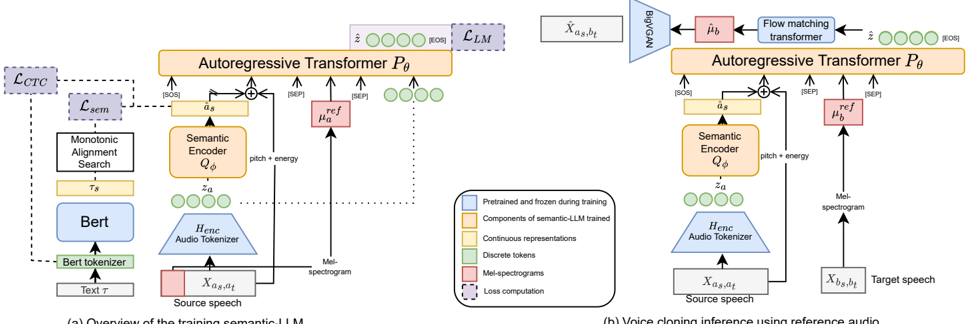

> [!abstract] arXiv · 2025 · Preprint
> **Mehta et al.** (Meta / KTH Royal Institute of Technology) · [→ Paper](https://arxiv.org/abs/2507.09070) · Demo: ✓ · Code: ?
>
> SemAlignVC addresses timbre leakage in codec-based zero-shot voice conversion by aligning audio encoder outputs to speaker-independent BERT text embeddings via monotonic alignment search, producing a semantic encoder that retains almost no speaker identity while preserving linguistic content.

## Problem

In codec-based and LLM-based zero-shot voice conversion, discrete audio tokens entangle speaker timbre with semantic content. Standard representations such as EnCodec, HuBERT tokens, and RVQ-based codecs all retain substantial speaker-identifying information even after quantization. As a result, when an autoregressive model generates tokens conditioned on these representations, residual source-speaker traits (timbre leakage) persist in the converted output. Existing approaches address this through speaker verification embeddings for re-conditioning, but that reintroduces an explicit speaker representation that raises privacy concerns and limits generalization to unseen speakers.

## Method

SemAlignVC is a four-stage pipeline: a BEST-RQ VQVAE audio tokenizer, a 0.5B-parameter autoregressive semantic LLM (LLaMa architecture with hidden dimension 2048 and 8 layers), a conditional flow matching acoustic model, and a BigVGAN vocoder. The audio tokenizer is trained on a large proprietary dataset; the semantic LLM is trained on 60k hours of transcribed English audiobooks from LibriHeavy.

The central contribution is SemAlign, an auxiliary training objective for the semantic encoder. Given an input utterance with transcript, BERT is used to produce text embeddings representing purely semantic content. Monotonic Alignment Search (MAS) aligns these text embeddings temporally to match the audio encoder output, and mean squared error is minimized between the aligned text embeddings and the encoder's output. This forces the encoder to produce representations that match text-derived features rather than audio-derived ones, stripping timbre while preserving linguistic and paralinguistic information. SemAlign is applied jointly with a CTC loss; the CTC loss alone proved insufficient for full timbre removal.

During training the LLM receives: the semantic encoder output, pitch and energy features (utterance-level mean-normalized to remove speaker information), and a mel spectrogram excerpt (approximately 25% of the utterance) as a timbre reference. Gradient propagation from the LLM decoder to the semantic encoder is blocked, preventing speaker identity from leaking back into the encoder through the decoder's loss. At inference, the target speaker's mel spectrogram excerpt replaces the source speaker's excerpt, conditioning timbre transfer without any speaker verification embedding.

The acoustic model follows the VoiceBox architecture with temporal span masking, and uses 12 midpoint ODE solver steps (NFE=24) at inference.

## Key Results

Speaker classification experiments on LibriHeavy (Table 1) show that raw codec representations retain strong speaker identity: EnCodec achieves 96.7% accuracy, the authors' BEST-RQ tokenizer 82.05%, and HuBERT layer 9 at 71.7%. The SemAlign-trained semantic encoder drops to 2.84%, confirming near-complete speaker information removal.

On subjective evaluation (SMOS, VCTK, 120 samples, 120 trained raters), SemAlignVC scores 3.29 vs. HierSpeech++ at 3.16, KNNVC at 2.77, and UniAudio at 2.56 (Table 2). On objective evaluation across 500 LibriHeavy utterances (Table 3), SemAlignVC achieves the highest naturalness (DNSMOS OVRL 3.38 vs. 3.34 for UniAudio, 3.29 for HierSpeech++) and speaker similarity scores across all three embedding models (WavLM: 0.95, ECAPA-TDNN: 0.82, Resemblyzer: 0.89). Intelligibility (WER 12.31%) trails HierSpeech++ (8.24%) but substantially beats KNNVC (18.85%). F0 correlation (FPC 0.622) is second-highest after KNNVC (0.632).

Comparisons are against public checkpoints of KNNVC, HierSpeech++, and UniAudio, which represents a fair but small baseline set.

## Novelty Assessment

SemAlign is a genuine methodological contribution: the idea of enforcing alignment between audio encoder outputs and BERT text embeddings via MAS to strip speaker identity is not present in the prior VC literature, which typically uses information bottlenecks, CTC-based phoneme prediction, or speaker embeddings for disentanglement. The CTC-alone ablation in the paper makes a specific point that phoneme-based objectives are insufficient because CTC blank tokens can still encode speaker-specific spectral content; text-to-audio alignment via MAS removes this residual channel.

The broader pipeline (AR semantic LLM conditioned on semantic tokens + flow-matching acoustic model + GAN vocoder) follows established patterns (similar to VoiceBox and UniAudio), so the architectural novelty lies specifically in the SemAlign training objective rather than in the overall system design. The proprietary audio tokenizer limits direct reproducibility, and the evaluation is English-only with a relatively small set of baselines.

## Field Significance

Moderate. SemAlignVC introduces a targeted mechanism for timbre disentanglement in codec-based VC by using cross-modal alignment between audio and text representations. The empirical case that CTC-based phoneme prediction is insufficient for timbre removal, whereas direct text-embedding alignment via MAS achieves near-complete speaker information suppression, is a specific and actionable finding. The lack of explicit speaker embeddings also addresses a practical privacy concern for conversion systems. The evaluation is solid but limited to English and a modest set of baselines.

## Claims

- **supports:** Audio codec and self-supervised speech representations inherently encode speaker identity, making timbre leakage a structural challenge in codec-based voice conversion.
  > *Evidence:* Speaker classification accuracy on LibriHeavy using EnCodec token IDs reaches 96.7%, HuBERT layer 9 discrete tokens 71.7%, and the authors' BEST-RQ tokenizer 82.05%, all substantially above chance. *(§4.1, Table 1)*

- **supports:** Aligning audio encoder outputs to speaker-independent text embeddings via monotonic alignment search produces representations with negligible residual speaker identity.
  > *Evidence:* The SemAlign-trained semantic encoder Q_ϕ achieves 2.84% speaker classification accuracy on LibriHeavy, versus 82.05% for the same encoder's raw tokenizer, confirming that the alignment objective removes speaker information that CTC loss alone cannot. *(§4.1, §5, Table 1)*

- **supports:** Zero-shot voice conversion without explicit speaker verification embeddings can achieve higher speaker similarity than systems that rely on them.
  > *Evidence:* SemAlignVC achieves the highest SMOS (3.29), WavLM speaker similarity (0.95), ECAPA-TDNN (0.82), and Resemblyzer (0.89) among KNNVC, HierSpeech++, and UniAudio on VCTK and LibriHeavy evaluations, despite using only a reference mel spectrogram excerpt rather than a speaker embedding. *(§4.2, Tables 2-3)*

- **complicates:** Aggressive timbre disentanglement via text-embedding alignment introduces intelligibility trade-offs when BERT-derived representations replace phoneme-based encodings.
  > *Evidence:* SemAlignVC achieves 12.31% WER on LibriHeavy, compared to HierSpeech++'s 8.24%, with the authors attributing the gap to occasional word substitutions caused by the semantic ambiguity of BERT token representations during generation. *(§5, Table 3)*

## Limitations and Open Questions

> [!warning]
> The audio tokenizer is trained on a proprietary internal dataset and is described as interchangeable, but its interaction with SemAlign has not been tested with public codecs. Results may not transfer directly to systems using EnCodec, SpeechTokenizer, or other publicly available tokenizers.

The evaluation is English-only and uses VCTK and LibriHeavy, which are relatively clean audiobook and read-speech corpora. Performance on spontaneous speech, accented speech, or noisy conditions is not assessed. The baseline set is modest (three systems), and no ablation isolates the contribution of the flow matching acoustic model relative to SemAlign itself. The WER gap relative to HierSpeech++ remains unexplained beyond the synonym-substitution hypothesis, which is not directly tested.

## Wiki Connections

- [[voice-conversion|Voice Conversion]] — introduces SemAlign as a new timbre disentanglement mechanism to address the timbre leakage problem common to codec-based zero-shot VC systems.
- [[disentanglement|Disentanglement]] — the SemAlign objective explicitly aligns the audio encoder's output to BERT text embeddings via MAS, creating a training objective that separates speaker identity from semantic content in representation space.
- [[neural-codec|Neural Audio Codec]] — demonstrates that standard codecs (EnCodec, HuBERT, BEST-RQ VQVAE) all retain speaker-identifying information, motivating the need for a disentanglement-aware semantic encoder.
- [[autoregressive-codec-tts|Autoregressive Codec TTS]] — the semantic LLM follows the LLaMa autoregressive architecture over discrete audio tokens, extending the codec-LM paradigm to zero-shot VC.
- [[flow-matching|Flow Matching]] — the acoustic model uses conditional flow matching (VoiceBox architecture) with a midpoint ODE solver to convert semantic tokens to mel spectrograms.
- [[2310.00704|UniAudio]] — used directly as a baseline; SemAlignVC outperforms UniAudio on all metrics including SMOS (3.29 vs 2.56) and speaker similarity, while sharing the codec-LM architectural pattern.
- [[2308.16692|SpeechTokenizer]] — cited as an example of codec-based VC where semantic and acoustic tokens are separated at the codec level rather than the encoder level.
- [[2403.03100|NaturalSpeech 3]] — cited as a related zero-shot synthesis system using factorized codec representations for disentanglement.
- [[2412.10117|CosyVoice2]] — cited as an LLM-based synthesis system with VC capability, contextualizing the LLM-based VC approach this paper builds on.
- [[2005.07143|ECAPA-TDNN]] — used as one of three speaker embedding models for objective speaker similarity evaluation in Table 3.
