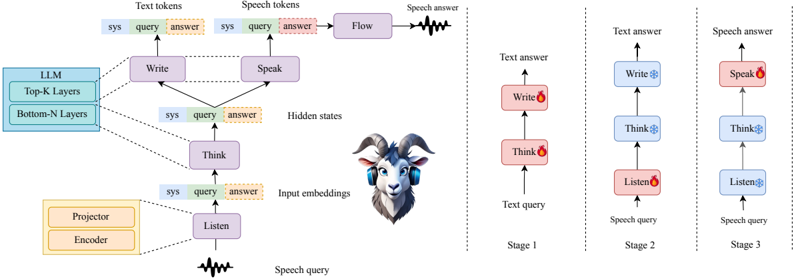

> [!abstract] arXiv · 2025 · Preprint
> **Chen et al.** (Institute of Artificial Intelligence (TeleAI), China Telecom) · [→ Paper](https://arxiv.org/abs/2507.18119) · Demo: ✓ · Code: ?
>
> GOAT-SLM introduces a dual-modality head architecture for spoken language modeling, enabling a single LLM backbone to generate both text and speech responses while autonomously detecting and adapting to paralinguistic cues such as dialect, emotion, age, and non-speech vocalizations without requiring explicit user instruction.

## Problem

Most spoken language models treat speech as a transparent medium for linguistic content, stripping away the paralinguistic and speaker-characteristic signals embedded in natural speech. Models recognize words but ignore whether the speaker is a child or an elder, speaking a regional dialect, expressing frustration, or interspersed with coughs and laughter. The gap between recognizing these cues and autonomously adjusting responses to them is particularly acute: prior work either classifies vocal attributes in isolation or requires the user to explicitly request "speak with empathy" rather than having the model infer and act on context. GOAT-SLM targets this reactive limitation, aiming for a system that proactively mirrors dialect, adapts register to age, and responds to non-speech vocalizations without any explicit instruction.

## Method

GOAT-SLM adopts the modality-alignment paradigm, building around five functional modules: Listen, Think, Write, Speak, and Flow-Matching. The Listen module uses a Whisper-small encoder followed by a two-layer CNN and two-layer Transformer projector to map input speech into the LLM embedding space. The Think module comprises the bottom 15 layers of TeleChat2-7B and acts as a shared semantic reasoning core. From this shared core, two branches emerge: the Write module (top 15 LLM layers) generates text responses, and the Speak module reuses the same top 15 layers but with a separate output layer that predicts speech tokens. Crucially, the Speak module is initialized from the Write module's weights, enabling parameter sharing and preserving the LLM's linguistic representations within the speech generation branch. A Flow-Matching module then converts the predicted speech token sequences into acoustic features, which are synthesized to waveforms by a spectrogram vocoder.

Training proceeds across three progressive stages. Stage 1 is supervised instruction tuning on approximately 115k multi-turn dialogue samples explicitly annotated with vocal attributes (emotion, dialect, age, non-speech vocal events); a contrastive construction strategy pairs the same query with different attribute descriptions to sharpen the model's response to vocal cues. Stage 2 aligns speech and text modalities using self-distillation, where the LLM generates textual targets from structured transcripts: Stage 2-1 trains on 73M large-scale ASR samples for linguistic alignment (170k hours), while Stage 2-2 extends to 53M mixed real and synthetic utterances (85k hours) for paralinguistic alignment with the Listen module fully unfrozen. Stage 3 trains the Speak module for high-fidelity expressive speech generation. Stage 3-1 uses 56M samples (150k hours) for cold-start speech generation across Mandarin, English, and dialects; Stage 3-2 refines attribute-aware generation with 5.7M samples (20k hours) built using GOAT-TTS to synthesize emotionally and demographically matched speech targets. A Multi-Token Prediction mechanism fuses current token embeddings with next-step input features to support streaming generation with a one-step latency delay behind the Write module. Confidence-based gradient masking, which updates high-confidence speech tokens while masking uncertain ones, stabilizes pronunciation during speech generation training.

## Key Results

Evaluation uses TELEVAL, a multi-dimensional benchmark covering semantic intelligence and paralinguistic awareness, compared against GLM-4-Voice, MiniCPM-o 2.6, Baichuan-Omni-1.5, SpeechGPT-2.0-preview, Freeze-Omni, Qwen2.5-Omni, and Kimi-Audio.

On general audio question-answering (Table 4), GOAT-SLM performs at average level across eight Chinese and English QA datasets, with the model acknowledging a slight drop compared to pure-text LLM performance as a trade-off for incorporating paralinguistic awareness.

The most striking gains appear on paralinguistic tasks. For dialect following (Table 7), GOAT-SLM achieves 50.73% average accuracy across five Chinese dialects, more than doubling the next-best model (Qwen2.5-Omni at 18.91%) without any explicit instruction prompting. For non-speech vocal signal response (Para_mix300-zh, Table 8), GOAT-SLM reaches 40.91% versus a ceiling of 9.19% from all other models, indicating a qualitative capability gap. For age-appropriate response generation (Age-zh, Table 8), GOAT-SLM scores 72.13% against the next-best 42.51% (Qwen2.5-Omni). On emotion response (ESD-zh, Table 8), GOAT-SLM scores 45.31%, competitive with Qwen2.5-Omni (44.83%) and below Kimi-Audio (53.17%).

For spoken response generation quality (Table 9), GOAT-SLM achieves CER of 1.57% (best overall), DNSMOS of 3.46 (comparable to others), and Emotion score of 61.48% (best overall, vs. 52.59% for Qwen2.5-Omni). Dialectal speech generation subjective evaluation (Table 10) shows consistency rates exceeding 90% for Cantonese, Henan dialect, Shanghainese, and Sichuanese, but only 57.2% for northeastern Mandarin.

GOAT-SLM was trained with substantially less audio data than top competitors: Baichuan-Omni-1.5 and Qwen2.5-Omni trained on more than 4 times the speech corpus, which partly explains lower general AQA performance while highlighting data efficiency for specialized paralinguistic capabilities.

## Novelty Assessment

The dual-modality head architecture, where the speech generation branch is initialized from and shares parameters with the text head, is a specific structural choice that sets GOAT-SLM apart from contemporaneous models like Kimi-Audio, which uses a randomly initialized speech branch. The empirical rationale is plausible: shared weights from a pre-trained LLM should preserve linguistic representations in the speech generation path. However, this is validated only via task-level performance rather than ablation on the initialization strategy itself.

The paralinguistic training pipeline, particularly the contrastive instruction construction in Stage 1 and the GOAT-TTS-based synthetic data generation in Stage 3-2, is an engineering contribution rather than an architectural one. Using a separate TTS system (GOAT-TTS) to generate training targets for the dialogue model is a pragmatic choice to avoid bootstrapping problems, but is not conceptually novel.

The key genuine contribution is demonstrating that autonomous, instruction-free adaptation to dialect, age, and non-speech vocalizations is achievable in a modality-alignment SLM with a carefully staged training curriculum. The scale gap relative to competitors (roughly 4x less training data) while achieving large margins on paralinguistic tasks suggests the training design is efficient, though evaluation on non-Chinese languages and less-controlled conditions remains absent.

## Field Significance

Moderate -- GOAT-SLM demonstrates that paralinguistic and speaker-characteristic awareness can be built into a spoken language model through training data design and a bifurcated generation architecture, rather than requiring larger training corpora or explicit conditioning signals. Its largest contribution is empirical: the TELEVAL results show a qualitative capability gap for non-speech vocal signal response that no competing open-source model currently addresses. The work also provides a concrete template for the modality-alignment approach with LLM-initialized speech branches, which can serve as a design reference for subsequent systems.

## Claims

- **supports:** Modality-alignment spoken language models can internalize paralinguistic cues (dialect, age, emotion, non-speech vocalizations) through staged training without requiring explicit user instructions at inference time.
  > *Evidence:* GOAT-SLM achieves 50.73% average dialect-following accuracy across five Chinese dialects without explicit prompting, versus 18.91% for the next-best model; it also reaches 40.91% on non-speech vocal response tasks where all other models score below 10%. *(§5.2, Table 7, Table 8)*

- **supports:** Initializing a speech generation head from a pretrained LLM text head promotes parameter reuse and can preserve linguistic competence in the speech branch without full retraining.
  > *Evidence:* The Speak module is initialized from Write module weights; the model retains multi-turn dialogue accuracy of 84% despite not training on multi-turn data, attributed to well-aligned input embeddings from this parameter sharing strategy. *(§3, §5.1, Table 6)*

- **complicates:** Incorporating paralinguistic awareness into a spoken language model introduces a trade-off with general semantic question-answering performance.
  > *Evidence:* GOAT-SLM's capability on general AQA (Table 4) declines compared to models without paralinguistic training, remaining at average level across eight QA datasets; the authors explicitly attribute this to the expanded training objectives. *(§5.1, Table 4)*

- **complicates:** Dialectal speech generation quality is uneven across dialects, with closely related varieties more reliably acquired than typologically distant ones.
  > *Evidence:* In subjective evaluation of dialectal spoken response (Table 10), GOAT-SLM exceeds 90% consistency for Cantonese, Henan, Shanghainese, and Sichuanese, but achieves only 57.2% for northeastern Mandarin, which the authors note is lexically similar to standard Mandarin and may suffer from training ambiguity. *(§5.2, Table 10)*

- **supports:** Confidence-based gradient masking during speech token training can improve pronunciation stability by selectively updating tokens where the model's predictions are reliable.
  > *Evidence:* GOAT-SLM applies confidence-based automatic gradient masking in Stage 3, masking low-confidence tokens during backpropagation; the technique is credited with significantly enhanced pronunciation stability and speech fidelity. *(§4.3)*

## Limitations and Open Questions

The evaluation is restricted to Chinese-language dialects and Mandarin-English bilingual content; generalization to non-Chinese languages, especially under dialectal conditions, is untested. The TELEVAL benchmark is developed by the same research group, introducing potential evaluation-training alignment that may not reflect performance on independently constructed benchmarks.

The paper relies on GOAT-TTS to generate synthetic speech training targets in Stage 3-2, creating a dependency on a proprietary tool whose capabilities bound the upper limit of the attribute-aware training data. The paper does not ablate the impact of LLM-initialized speech branch weights versus random initialization in a controlled experiment, leaving the primary architectural design claim without direct causal evidence.

Northeastern Mandarin generates only 57.2% dialectal consistency in subjective evaluation, revealing that dialects with high lexical overlap with the training language (standard Mandarin) are harder to acquire distinctly, likely because the model defaults to standard Mandarin patterns.

## Wiki Connections

- [[spoken-language-model|Spoken Language Model]] -- GOAT-SLM extends the modality-alignment variant of spoken LMs specifically to paralinguistic awareness, using shared LLM layers for text and speech generation.
- [[speech-to-speech|Speech-to-Speech]] -- The system takes speech input and produces spoken responses end-to-end, with dialect and emotion propagating through the dual-modality head without explicit conditioning.
- [[emotion-synthesis|Emotion Synthesis]] -- Emotion-conditioned response generation is one of three core paralinguistic dimensions trained in the orchestrated curriculum; GOAT-SLM achieves the highest open-source emotion score on TELEVAL.
- [[flow-matching|Flow Matching]] -- The Flow-Matching module converts predicted speech token sequences to acoustic features, serving as the acoustic decoder in the generation pipeline.
- [[multilingual-tts|Multilingual TTS]] -- Multi-dialect and bilingual (Mandarin/English) coverage is central to the evaluation; the system demonstrates strong dialect following without explicit dialect prompts.
