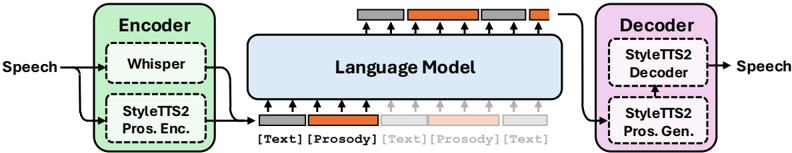

> [!abstract] arXiv · 2025 · Preprint
> **Qian et al.** · [→ Paper](https://arxiv.org/abs/2507.20091) · Demo: ✓ · Code: ?
>
> ProsodyLM demonstrates that replacing discrete codec tokens with explicit text-plus-word-level-prosody tokens enables a pre-trained LLM to develop diverse prosody understanding and generation capabilities — including contrastive focus, emotion recognition, and style continuity — through pre-training alone, without any task-specific fine-tuning.

## Problem

Speech language models trained on the dominant codec-token paradigm acquire only weak prosodic competence even at large data scales. The core issue is that codec tokens are designed to preserve perceptual speech quality, not to expose the structure of prosody to an LLM. As a result, models trained on these tokens must expend representational capacity merely to interpret the tokens, and they fail to develop prosody understanding or generation as an emergent capability through pre-training. The prevailing workaround — task-specific instruction tuning — can force narrow prosodic behaviours but does not generalise. The open question is whether a different tokenisation design can shift prosody learning into the pre-training regime, the way text LLMs acquire syntactic and pragmatic knowledge without supervised signal.

## Method

ProsodyLM replaces the usual codec or semantic tokens with a dual-section representation. Each utterance is encoded as a [Text] section containing the full ASR transcription, followed by a [Prosody] section of word-level tokens that encode five acoustic dimensions per word: phone-duration, log-F0 range, log-F0 median, log-F0 slope, and log-energy. Each dimension is quantised into 512 bins and added to the LLM vocabulary. A sentence-level [Global] token capturing aggregate prosodic extremity is optionally prepended to control expressive range during generation; the authors find it beneficial for generation tasks and detrimental for understanding tasks.

The encoder uses Whisper for transcription and the aligner and feature extractors from StyleTTS2 to compute the five-dimensional prosody vectors. The decoder adapts StyleTTS2's duration predictor and prosody predictor — replacing their dependence on StyleTTS2's diffusion-based style embedding with conditioning on the word-level values generated by the LLM — while leaving all other StyleTTS2 modules frozen at their pre-trained weights. Voice identity is controlled via an acoustic embedding drawn from a reference utterance; it is invisible to both the LLM and the prosody predictors, so it affects timbre only.

The language model is Llama 3.1 8B Instruct, continuously pre-trained on 29.9k hours of audiobooks from Librilight using rank-64 LoRA (α = 16), with no task-specific fine-tuning. A short narrative instruction prepended to each sequence is paraphrased into 65 variants to prevent the model from memorising a single prompt.

The resulting architecture supports two generation modes: TTS (text fills the [Text] section; the LLM generates [Prosody]) and speech continuation (a reference utterance seeds the context).

## Key Results

Objective prosody-following experiments compare ProsodyLM against two controlled baselines trained identically but with Mimi tokens (as in Moshi) or GLM-4Voice tokens, plus reference systems including Step-Audio-TTS-3B, ElevenLabs, and GPT-4o.

For direct style specification (high/low F0, fast/slow, loud/quiet), ProsodyLM achieves F0 separation of 18.5 semitones and duration separation of 1.48 symbol-rate units, outperforming all group-A baselines and most group-B systems — it is surpassed only by GPT-4o (115 semitones) which has far larger training budget and data. On indirect style inference from character descriptions, ProsodyLM again leads all group-A baselines.

On contrastive focus, ProsodyLM is the only group-A model that reproduces both on-focus pitch elevation and post-focus pitch compression; GPT-4o shows similar behaviour among group-B.

On prosody understanding tasks, ProsodyLM produces a statistically significant 6.6% log-probability increase for emphasised words (emphasis detection on EmphAssess), while both codec-token baselines show near-zero signal. For emotion recognition across five categories on the JL Corpus, ProsodyLM shows strong positive probability shifts for all emotions, especially Sad and Excited; baselines show negligible sensitivity.

Subjective MOS tests on 36 multi-sentence audiobook excerpts show ProsodyLM achieves prosody MOS of 4.07 (consistent-voice condition), not significantly different from Step-Audio-TTS-3B (4.01) or GPT-4o (4.05). On naturalness, ProsodyLM (3.96) is comparable to Step-Audio (4.04) and falls below ElevenLabs (4.23) and GPT-4o (3.75 naturalness, 4.05 prosody).

> [!note]
> Group-B baselines (Step-Audio, ElevenLabs, GPT-4o) are trained on substantially more and higher-quality data and have undergone additional alignment; they are reference points rather than fair comparisons. Group-A comparisons — same data, same training budget — are the controlled ablation.

Text perplexity on held-out audiobooks increases by only 2 points relative to a text-only fine-tuned Llama (11.70 vs. 13.87), indicating that prosody tokens add minimal interference to language modelling.

## Novelty Assessment

The core contribution is the tokenisation design: making prosody explicit, interpretable, and disentangled from content, rather than implicitly embedded in codec tokens. This is a principled architectural choice with a clear hypothesis: LLMs already understand text structure, so attaching explicit prosody annotations to each word gives the LLM a natural bridge to prosodic understanding. The claim that this enables emergent prosody capabilities through pre-training — without instruction tuning — is substantiated by controlled experiments.

The engineering is largely composed from existing components: Whisper for ASR, StyleTTS2 for acoustic encoding and decoding, LoRA for parameter-efficient adaptation, and Llama 3.1 as the backbone. The five-dimensional prosody vector is drawn from prior work (Shechtman 2023). The genuine novelty lies in the compositional design decision and in the systematic evaluation framework for prosody processing across three dependency types (Content→Prosody, Prosody→Content, Prosody→Prosody).

Limitations on the side of audio quality are acknowledged: the decoder is fixed to StyleTTS2 weights which constrain voice quality, and the prosody token vocabulary cannot represent voice quality changes — only F0, duration, and energy.

## Field Significance

Moderate — ProsodyLM provides a conceptually clear argument that tokenisation design, not data scale or fine-tuning, is the binding constraint on prosodic emergence in speech LLMs. The evaluation framework across three prosody dependency types is a useful methodological contribution for the subfield. The work is primarily a proof of concept on audiobook data; the audiobook domain limits direct applicability to conversational or expressive TTS settings, and real-world deployment would require integration with a higher-quality decoder.

## Claims

- Conventional codec-token speech LMs do not develop prosodic understanding or generation as emergent capabilities through pre-training, regardless of data scale.
- Replacing codec tokens with explicit, interpretable prosody annotations enables a pre-trained text LLM to acquire prosody processing capabilities — including contrastive focus, emotion recognition, and style transfer — without task-specific fine-tuning.
- Disentangling prosodic and linguistic content in the token sequence trades voice quality fidelity for prosodic expressiveness and controllability.
- Prosody-to-content dependencies (e.g., detecting emotion or emphasis from speech) are more difficult for codec-token LLMs than content-to-prosody generation.
- Word-level prosody tokens impose only marginal degradation on text language modelling capability when interleaved with transcription tokens in a joint sequence.

## Limitations and Open Questions

> [!warning]
> ProsodyLM is trained and evaluated exclusively on audiobooks (Librilight). Audiobook prosody is stylised and read-speech in character; generalisation to spontaneous conversation, emotional dialogue, or cross-domain settings is untested and likely requires substantial data re-collection or domain adaptation.

The decoder is frozen at StyleTTS2 pre-trained weights, which constrains output quality to that system's capability ceiling and limits the range of expressible voice characteristics. The five-dimensional prosody token cannot encode voice quality changes (breathiness, creakiness, vocal effort), which are important for fine-grained expressiveness.

The model is pretrained only; it has no instruction-following capability for arbitrary prosody control prompts at inference time. The global control token provides limited high-level steering but is a coarse mechanism. Whether this paradigm scales to longer contexts, diverse speaking styles, and multi-speaker dialogue settings beyond two-party audiobook narration remains open.

## Wiki Connections

Core method and training paradigm: [[spoken-language-model]] · [[autoregressive-codec-tts]] · [[self-supervised-speech]]

Prosody and expressiveness: [[prosody-control]] · [[emotion-synthesis]]

Evaluation: [[subjective-evaluation]]
