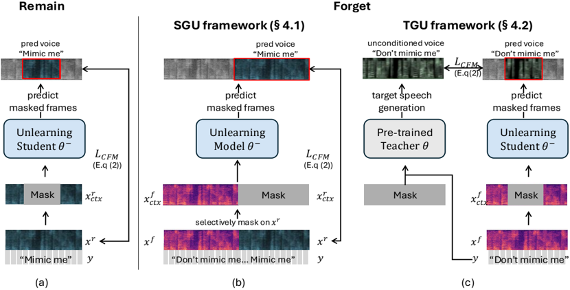

> [!abstract] arXiv · 2025 · Preprint
> **Kim et al.** · [→ Paper](https://arxiv.org/abs/2507.20140) · Demo: ✓ · Code: ?
>
> Introduces Teacher-Guided Unlearning (TGU), the first machine unlearning framework for zero-shot TTS, which modifies a pre-trained VoiceBox model to generate random speaker identities in response to a forgotten speaker's voice prompt while preserving synthesis quality for all other speakers.

## Problem

Zero-shot TTS systems can replicate any speaker's voice from a short audio reference, including individuals who did not consent to having their voices synthesized. Privacy regulations such as GDPR and the Right to Be Forgotten create obligations for service providers to remove such capabilities, but no mechanism existed for selectively deleting speaker-specific knowledge from a pre-trained ZS-TTS model. Excluding target speakers from fine-tuning data is insufficient, because ZS-TTS models generalize at inference time to voices never seen in training. Filtering speaker embeddings is equally limited, as targeted inversion or re-synthesis attacks can recover identifiable traits from seemingly anonymized representations.

## Method

The paper proposes guided unlearning frameworks built on top of VoiceBox (Le et al., 2024), a large-scale conditional flow matching model that generates 80-dimensional log mel-spectrograms at 16 kHz. VoiceBox uses a 24-layer Transformer with U-Net residual connections, 16 attention heads, and 1024/4096 embedding and FFN dimensions. The unlearning task divides speakers into a forget set (F) and a retain set (R): the modified model must produce speaker-divergent outputs when conditioned on a forget speaker's audio prompt, while maintaining high-fidelity voice cloning for retain speakers.

Two frameworks are introduced. Sample-Guided Unlearning (SGU) constructs training pairs by concatenating a forget speaker's audio with a randomly selected retain speaker's audio, masking the retain portion as the generation target. This forces the model to predict retain-speaker voice given a forget-speaker context, but mismatched tempo and rhythm between speakers degrade retain-set performance and generation quality.

Teacher-Guided Unlearning (TGU) avoids paired audio altogether. When VoiceBox is conditioned solely on text (without any audio prompt), it samples a different speaker identity at each Gaussian initialization. TGU uses these unconditionally generated samples as per-step targets for the forget set: the unlearned model is trained via a modified CFM loss to predict these random-identity outputs whenever a forget speaker's audio is provided as context. For the retain set, standard CFM training continues unchanged. The combined objective balances the two losses with a hyperparameter λ = 0.2:

L_total = λ · L_CFM-remain + (1 - λ) · L_CFM-forget

The paper also introduces the speaker-Zero Retrain Forgetting (spk-ZRF) metric. Adapted from the Zero Retrain Forgetting framework, spk-ZRF computes the Jensen-Shannon divergence between speaker embeddings extracted from the unlearned model's forget-speaker outputs and those from VoiceBox generating without any audio prompt. A score near 1 indicates the forget outputs are as random in speaker identity as unconditional generation; a score near 0 indicates patterned, traceable outputs.

## Key Results

Main evaluation uses 10 forget speakers randomly selected from LibriHeavy and LibriSpeech test-clean as the retain evaluation set (Table 1):

- TGU achieves SIM-F of 0.169 for the forget set, within the measured cross-speaker similarity range (mean 0.09, upper quartile 0.17 on LibriSpeech), indicating generated speech is genuinely speaker-divergent from the prompt. Retain-set SPK-SIM drops only 2.8% to 0.631 versus 0.649 for the original model.
- SGU reduces SIM-F to 0.194 but suffers a 21% drop in retain-set SPK-SIM (0.523 versus 0.649), showing weaker retain-set preservation.
- Exact Unlearning and Fine Tuning on the retain set produce SIM-F of 0.687 and 0.675, nearly identical to the original's 0.708, confirming data exclusion alone fails.
- Negative Gradient (NG) achieves WER-F of 5.0% and KL divergence maximization achieves WER-F of 47.2%, compared to 2.4% for TGU, revealing that both gradient-adversarial methods damage speech intelligibility rather than selectively suppressing speaker identity.
- spk-ZRF exposes a qualitative failure in NG and KL: despite their low SIM-F scores, both methods yield spk-ZRF-F values at or below the original model (0.842 and 0.810 versus 0.846 baseline), indicating consistent patterned failure susceptible to voice reconstruction. TGU achieves spk-ZRF-F of 0.871.
- Human evaluation (Table 4, 25 participants): TGU achieves CMOS-R of -0.02 relative to the original (SGU: -0.15) and SMOS-R of 4.67 (SGU: 3.12), with SMOS-F of 1.28, confirming forget-speaker voices become substantially dissimilar.
- Scalability holds across forget set sizes of 1, 3, and 10 speakers (Table 2); TGU also successfully unlearns out-of-domain speakers absent from pre-training (Table 3, LibriTTS setting).

## Novelty Assessment

The task definition is genuinely new: speaker identity unlearning for zero-shot TTS had not been addressed before this paper. The TGU method is a creative solution to a hard alignment problem. Standard machine unlearning operates on the training data distribution, but ZS-TTS models generalize to unseen speakers, so data exclusion is ineffective. TGU resolves this by exploiting the model's own unconditional sampling as a source of random-identity targets, sidestepping the need for any paired cross-speaker audio.

The spk-ZRF metric is a meaningful contribution. Speaker similarity can be low for the wrong reasons (generating noise rather than speech), and spk-ZRF distinguishes between genuine randomization and consistent failure patterns. The experimental design is thorough: five baselines are compared, statistical significance is reported (one-way ANOVA), and robustness and recovery experiments are included in appendices.

The primary scope limitation is architectural: experiments are conducted on a single TTS system (VoiceBox with mel-spectrogram representation). Whether TGU transfers to codec-based autoregressive ZS-TTS systems is untested. The generalizability claim is therefore tied to flow-matching, mel-spectrogram architectures.

## Field Significance

Moderate - this paper establishes machine unlearning as a viable approach to voice privacy compliance in pre-trained ZS-TTS systems, filling a gap left open by speaker anonymization and data filtering methods. The spk-ZRF metric addresses a diagnostic gap that existing unlearning evaluations miss. The contribution is well-scoped but currently tied to one architecture; its applicability to the broader class of codec-based ZS-TTS models, which now dominate the field, remains an open question.

## Claims

- **supports:** Machine unlearning via randomization-based training objectives can selectively suppress specific speaker identities in zero-shot TTS while preserving synthesis quality for retained speakers.
  > *Evidence:* TGU achieves SIM-F of 0.169 (within the measured cross-speaker similarity range of 0.02-0.17) and retain-set SPK-SIM of 0.631, a drop of only 2.8% from the original model's 0.649, with WER-F of 2.4% comparable to the original's 2.1% on the retain set. *(§5.2, Table 1)*

- **complicates:** Excluding target speakers from the fine-tuning dataset is insufficient for voice privacy protection in zero-shot TTS, because these models generalize at inference time to replicate unseen speakers via in-context learning.
  > *Evidence:* Exact Unlearning (retraining from scratch on the retain set) and Fine Tuning on the retain set yield SIM-F of 0.687 and 0.675 respectively, nearly identical to the original model's 0.708, confirming the model continues to clone forgotten speakers not present in the fine-tuning data. *(§5.2, Table 1)*

- **complicates:** Gradient-reversal and KL-divergence-based unlearning methods degrade speech intelligibility rather than achieving genuine speaker forgetting in voice-conditioned generative models, due to entanglement between speaker style and linguistic content.
  > *Evidence:* Negative Gradient achieves WER-F of 5.0% and KL divergence maximization achieves WER-F of 47.2%, compared to 2.4% for TGU; the paper attributes this to the model learning to generate incoherent audio rather than truly unlearning speaker identity, as speaker style and linguistic content are jointly encoded in VoiceBox's pre-training. *(§5.2, Table 1)*

- **supports:** Speaker similarity metrics alone are insufficient to verify effective machine unlearning in generative speech models, as consistent failure patterns can yield low similarity scores without achieving the randomness needed to resist voice reconstruction.
  > *Evidence:* Negative Gradient and KL methods achieve low SIM-F scores (0.402 and 0.179) but spk-ZRF-F values of 0.842 and 0.810, at or below the original model's baseline of 0.846, revealing patterned outputs that could be reverse-engineered. TGU achieves both low SIM-F (0.169) and elevated spk-ZRF-F (0.871). *(§4.3, §5.2, Table 1)*

- **supports:** A pre-trained generative model can serve as its own teacher for unlearning by providing diverse speaker-identity targets, eliminating the need for aligned cross-speaker audio pairs.
  > *Evidence:* TGU generates per-step training targets by running VoiceBox conditioned only on text (no audio prompt), which produces a different speaker identity at each Gaussian initialization; these unconditional outputs replace paired cross-speaker audio as forget-set targets in the modified CFM loss. *(§4.2)*

## Limitations and Open Questions

> [!warning]
> All experiments are conducted on a single TTS architecture (VoiceBox with mel-spectrogram representation). Transferability of TGU to codec-based autoregressive ZS-TTS systems is not evaluated, which limits the generalizability of the findings given that the broader field has largely shifted to codec-based generation.

Machine unlearning of voice identity raises boundary cases when remain speakers have similar vocal characteristics to forget speakers. The robustness experiment (Appendix H) shows only a weak positive correlation (r = 0.14) between a remain speaker's similarity to forget speakers and retain-set performance degradation, suggesting TGU is largely robust; however, the effect is not fully absent.

TGU introduces a trade-off in speech diversity, measured by Frechet Speech Distance (FSD), which increases from 170.2 to 177.8 on LibriSpeech test-other. This suggests the reduced effective training distribution from unlearning modestly narrows generative variety.

The paper explores adversarial recovery only through direct fine-tuning on forget speaker audio (Appendix J). More sophisticated inversion attacks or embedding-space reconstruction are left as open questions.

## Wiki Connections

- [[zero-shot-tts|Zero-Shot TTS]] - this paper directly extends zero-shot TTS by adding a privacy compliance mechanism that selectively removes learned speaker identities from a pre-trained model.
- [[flow-matching|Flow Matching]] - TGU and SGU are implemented on VoiceBox, a conditional flow matching model; the unlearning objective modifies the standard CFM loss to target forget speakers.
- [[speaker-adaptation|Speaker Adaptation]] - speaker identity unlearning is the inverse problem of speaker adaptation; the retain-set objective mirrors standard fine-tuning while the forget-set objective actively counteracts speaker-specific knowledge.
- [[evaluation-metrics|Evaluation Metrics]] - the paper introduces spk-ZRF, adapting the Zero Retrain Forgetting metric to measure speaker identity randomness specifically, and exposes failure modes that SPK-SIM alone cannot detect.
- [[subjective-evaluation|Subjective Evaluation]] - CMOS and SMOS listening tests with 25 participants assess audio quality preservation for retain speakers and speaker divergence for forget speakers.
