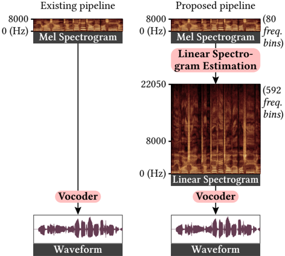
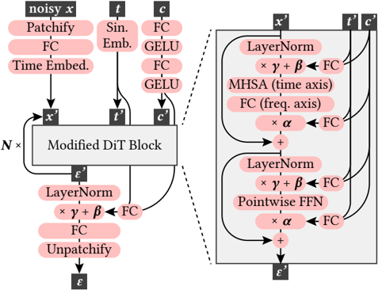

> [!abstract] arXiv · 2025 · Preprint
> **Runxuan Yang et al.** (Tsinghua University) · [→ Paper](https://arxiv.org/abs/2508.01796) · Demo: ✓ · Code: ?
>
> An intermediate linear spectrogram estimation step based on a DiT-adapted diffusion model, combined with a redesigned 2D-convolution vocoder (Vocos2D), produces singing voice spectrograms that are substantially harder for both human observers and lightweight neural classifiers to distinguish from real recordings.

## Problem

Vocoders trained on mel spectrograms routinely impose frequency caps (8–12 kHz) and prioritise phase reconstruction over high-frequency spectral detail. The result is that synthetic singing audio, while perceptually acceptable to most listeners, produces spectrograms with blurry, smoothed high-frequency energy patterns that are easily distinguishable from authentic recordings — both visually and by lightweight convolutional classifiers. Prior bandwidth extension methods (mdctGAN, NU-Wave 2) operate on waveforms and likewise fail to reproduce realistic high-frequency spectrogram structure.

## Method

The proposed pipeline inserts an explicit Linear Spectrogram Estimation (LSE) step between the acoustic model and the vocoder. Rather than feeding a mel spectrogram directly into the vocoder, the system first reconstructs a full-bandwidth linear spectrogram (592 frequency bins up to the Nyquist frequency) using a denoising diffusion model, then feeds this higher-resolution intermediate into a redesigned vocoder.

The LSE model adapts the Diffusion Transformer (DiT) architecture to handle time-frequency data with variable temporal lengths. Standard DiT applies multi-head self-attention across both spatial dimensions; the LSE model restricts self-attention to the time axis only, and handles inter-frequency communication through linear projections with per-frequency-bin learned embeddings. The model is conditioned on the input mel spectrogram (projected into the backbone's hidden space) and the diffusion timestep (sinusoidal embedding). At inference, DPM++ 2M Karras sampling with 32 steps is used.

The Vocos2D vocoder replaces the 1D convolutions in the original Vocos generator with 2D convolutions, enabling the model to attend to specific frequency bands rather than processing all frequencies of a frame uniformly. Per-frequency learned embeddings are again used for inter-frequency communication. Additional shortcut connections carry the input mel spectrogram condition directly into each ConvNeXt backbone block, allowing the vocoder to leverage spectral detail at every layer. The multi-period discriminator is removed (it degraded performance with the larger frequency resolution) and replaced with discriminator augmentation: random loudness shifts, sample shifts, and phase rotations applied only to the discriminator path so gradients flow back to the generator without requiring the generator to model the augmentations directly.

The LSE model uses 8 backbone blocks with 8 attention heads and hidden dimension 320, trained for 1.2M steps. Vocos2D uses 24 ConvNeXt backbone blocks with hidden dimension 256, trained for 900k steps. Both use AdamW with EMA checkpointing.

## Key Results

Spectrogram realism is evaluated both objectively (ConvNeXt classifier trained to distinguish real from synthetic spectrograms) and subjectively (human observers asked to identify whether spectrograms are real or synthetic). LSE+Vocos2D spectrograms were classified as real by human participants 46.9% of the time, compared to 24.3% for baseline Vocos and below 10% for mdctGAN and NU-Wave 2, with ground truth scoring 78.1%. The neural discriminator consistently classifies LSE+Vocos2D spectrograms near the ground truth score regardless of which baselines it was trained against; when trained exclusively on LSE+Vocos2D negatives, it achieves near-random discrimination (~0.5), indicating near-indistinguishability.

On perceived audio quality, LSE+Vocos2D achieves a subjective MOS of 4.176 against Vocos's 3.576, with ground truth at 4.769. The intermediate Vocos2D-only configuration scores 4.157, suggesting most of the MOS gain comes from the improved vocoder architecture rather than the LSE step itself. UTMOS and NISQA trends are consistent with the subjective scores. Notably, adding LSE to the original Vocos slightly reduces audio quality (MOS 3.329), as the unmodified 1D-convolution vocoder struggles with the larger frequency resolution; the quality gain requires the Vocos2D redesign.

> [!note]
> Audio quality metrics (UTMOS, Audiobox Aesthetics) resample audio to 16 kHz, limiting spectral scope to 8 kHz, while NISQA evaluates up to 20 kHz. This discrepancy partially explains differences in objective metric ordering across systems.

## Novelty Assessment

The LSE step and Vocos2D vocoder are both genuine architectural contributions. Applying DiT to time-frequency data with time-axis-only self-attention and per-frequency embeddings is a concrete and reasoned adaptation — not merely a hyperparameter variation. The Vocos2D 2D-convolution redesign with discriminator augmentation and shortcut conditioning is also a coherent structural change motivated by the expanded frequency resolution. The framing around adversarial attack resistance to fake spectrogram detectors is unusual for a vocoder paper and broadens the contribution beyond audio quality alone, though this remains a secondary framing. The evaluation protocol — objective classifier plus human visual realism judgment plus MOS — is thorough and well-designed, covering dimensions that prior vocoder papers typically ignore. The primary limitation is that the work targets singing voice specifically and all experiments use a proprietary/assembled corpus, so direct comparison to published TTS or SVS benchmarks is not possible.

## Field Significance

Moderate — This paper addresses a specific but underexplored gap in vocoder design: the fidelity of high-frequency spectrogram structure in singing synthesis. The dual contribution (LSE diffusion model + Vocos2D) provides a replicable pattern for inserting spectrogram super-resolution as a pre-vocoding stage, which is applicable beyond singing. The adversarial-detection framing adds a dimension — spectrogram visual realism as a quality axis — that complements audio perceptual quality and may influence how future work evaluates vocoder outputs.

## Claims

- Mel-spectrogram-to-waveform vocoders systematically underrepresent high-frequency spectral structure, producing a detectable signature that lightweight classifiers can exploit.
- Inserting an explicit bandwidth extension step prior to vocoding can improve both spectrogram visual realism and perceived audio quality, but only when the vocoder is redesigned to accommodate the higher-resolution intermediate representation.
- Diffusion models with transformer backbones can be adapted to time-frequency spectral data by restricting self-attention to the time axis and using per-frequency learned embeddings to handle the lack of spatial invariance across frequency.
- Spectrogram visual realism and waveform perceptual quality are partially independent dimensions: a system can improve on one while degrading on the other depending on how the vocoder processes the extended spectral representation.

## Limitations and Open Questions

> [!warning]
> All training and evaluation data is assembled from a mix of privately recorded singing audio and public datasets under a custom pipeline; no standard public benchmark is used for final comparison, making it difficult to situate results relative to the broader SVS or TTS literature.

The 32-step DPM++ sampling in the LSE model adds meaningful latency compared to a direct mel-to-waveform vocoder; the paper does not report inference-time benchmarks. The work focuses entirely on singing voice at 44.1 kHz — generalisation to speech or other domains is not tested. The spectrogram realism evaluation relies on a classifier trained on the same data distribution, which could favour the proposed method if the discriminator training is not sufficiently diverse. The adversarial-attack framing (evading fake-spectrogram detectors) raises questions about dual use that are not discussed.

## Wiki Connections

Concept pages most relevant to this paper: [[gan-vocoder]], [[diffusion-tts]], [[evaluation-metrics]], [[subjective-evaluation]].
