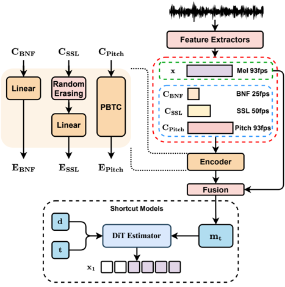

> [!abstract] arXiv · 2025 · Preprint
> **Jiang et al.** (Northwestern Polytechnical University) · [→ Paper](https://arxiv.org/abs/2508.04996) · Demo: ✓ · Code: ?
>
> REF-VC combines ASR bottleneck features and SSL representations in a flow-matching DiT, using random feature erasure to balance noise robustness against expressiveness — a trade-off that prior VC approaches each resolve at the other's expense.

## Problem

Voice conversion in real-world conditions faces two competing demands that existing approaches cannot satisfy simultaneously. ASR-based content encoders (phonetic posteriorgram or bottleneck feature methods) are noise-robust but discard paralinguistic content, producing converted speech that sounds flat and robotic. SSL-based encoders such as WavLM preserve prosody and expressiveness but are sensitive to noise and introduce source timbre leakage. Techniques like k-means clustering and vector quantisation can filter SSL features, but require careful parameter tuning and risk degrading expressiveness when misconfigured. No prior zero-shot VC system cleanly addresses noise robustness and expressiveness together without instability or information loss.

## Method

REF-VC uses a Diffusion Transformer (DiT) backbone with 12 layers, 8 attention heads, and a feedforward dimension of 768, totalling 100 million parameters. The system operates on mel-spectrograms decoded by a pretrained BigVGAN vocoder. Content conditioning draws from two parallel encoders: Wenet extracts bottleneck features (BNF) carrying linguistic content, and WavLM extracts SSL representations carrying paralinguistic information. A multi-scale pitch encoder using Parallel Biased Transposed Convolution (PBTC) modules provides fundamental frequency conditioning at the frame rate of the target spectrogram.

The central innovation is a **random erasing strategy** applied to SSL features during training. For each sample in a batch, the SSL features are replaced with noise with probability drawn uniformly from 0 to 1, subject to an overall batch erasure probability of 0.5. This compels the model to rely primarily on BNF for audio reconstruction while extracting only the useful paralinguistic content (prosody, emotion, non-verbal elements) from SSL features when they are present. Without any quantisation or information bottleneck, this prevents both timbre leakage and noise propagation from the SSL stream.

Alignment is handled implicitly via a fusion module inspired by E2TTS. BNF and SSL encoder outputs are shorter than the target sequence, so they are padded with blank frames to match the length of the noisy input $x_t$. The pitch features, already at the target frame rate, are concatenated directly. This strategy avoids frame-to-frame alignment through transposed convolution or interpolation, which the authors argue causes the model to over-reconstruct noise-carrying frames in the source.

For inference speed, the system adopts Shortcut Models rather than standard flow matching. Shortcut Models augment the flow-matching estimator with a step-size parameter $d$, enabling the model to compute longer jumps along the ODE trajectory. A self-consistency loss trains the shortcut property: a two-step prediction should equal one larger step. In practice, self-consistency loss is introduced gradually — only after the base flow-matching loss has converged — and reaches a proportion of 1/4 of the total loss. This allows high-quality synthesis in 4 inference steps versus the 32 steps baseline flow matching requires.

## Key Results

Evaluations use a clean set of 100 utterances (from internal data, WenetSpeech, and Emilia) and a noisy set of 50 recordings captured in everyday real-world environments. Target speakers come from the seed-tts-eval benchmark (10 unseen speakers). The principal baselines are Seed-VC (32 NFE, official 100M checkpoint trained on Emilia) and an internal VITS-based VC model.

On the clean set, REF-VC (32 NFE) achieves NMOS 3.92 and SMOS 3.98, comparable to Seed-VC (NMOS 3.87, SMOS 4.03). CER is 5.34 for REF-VC versus 5.16 for Seed-VC — essentially tied. Speaker cosine similarity (SECS) is 0.8253 for REF-VC and 0.8226 for Seed-VC, within margin.

The divergence is pronounced on the noisy set. REF-VC (32 NFE) achieves CER 8.03 compared to Seed-VC's 12.45, a large reduction in ASR error under noise despite Seed-VC being an ASR-based system. REF-VC also leads on SECS (0.8031 vs. 0.7884) and NMOS (3.68 vs. 3.76). The noisy set advantage validates the core design claim.

The 4-step configuration degrades modestly: NMOS 3.89 on clean, CER 8.79 on noisy, SECS 0.7919 — still competitive with Seed-VC 32-step on the noisy set.

Ablation results confirm both design choices are necessary. Removing random erasing collapses SECS to 0.5248 clean / 0.4384 noisy and raises CER to 18.64 on the noisy set. Removing implicit alignment degrades SMOS substantially (3.51 vs. 3.98 clean) and SECS on the noisy set.

ABX prosody preference tests show REF-VC rated significantly higher than Seed-VC and VITS-VC for preserving source prosody and non-verbal elements.

## Novelty Assessment

The architectural contribution is real but incremental. Each of the three main components — SSL/ASR feature fusion, flow matching with a DiT backbone, and Shortcut Models — is drawn from prior work. Seed-VC already uses a DiT-based flow-matching pipeline for zero-shot VC; REF-VC's novelty relative to it is the random erasing regulariser and the E2TTS-inspired implicit alignment. These are genuine engineering innovations: the random erasing strategy is simple, avoids the parameter sensitivity of VQ-based bottlenecks, and demonstrably prevents timbre leakage without explicit information bottleneck machinery. The result on the noisy test set is persuasive. That said, the evaluation is limited — the clean set is only 100 utterances, the noisy set just 50, and comparisons beyond Seed-VC are thin. Singing voice conversion compatibility is demonstrated briefly but not evaluated rigorously.

## Field Significance

Moderate — REF-VC identifies a clear gap in the SSL-based VC literature: most systems that gain expressiveness by adding SSL features pay a noise-robustness penalty, and most mitigation strategies (VQ, k-means) introduce their own instabilities. The random erasing approach shows this trade-off is addressable with a lightweight training-time regularisation rather than architectural surgery. As a design pattern, random feature erasure is transferable and may see adoption in other fusion-based VC or TTS systems dealing with noisy source conditions.

## Claims

- SSL features improve paralinguistic expressiveness in voice conversion but introduce timbre leakage and noise sensitivity that require explicit mitigation.
- Random feature erasure at training time can reduce a model's over-reliance on information-rich but noise-sensitive representations without information bottleneck machinery.
- Implicit alignment borrowed from non-autoregressive TTS can improve noise robustness in voice conversion by preventing the model from over-reconstructing noise-carrying source frames.
- Shortcut Models reduce flow-matching inference steps by an order of magnitude with only marginal quality loss in voice conversion.
- ASR-based bottleneck features and SSL representations are complementary: the former provides noise-robust linguistic content, the latter contributes paralinguistic fidelity that ASR training suppresses.

## Limitations and Open Questions

> [!warning]
> The model cannot synthesise arbitrarily long utterances. The implicit alignment mechanism introduces a maximum-length constraint analogous to that in E2TTS-style TTS systems. The authors flag this as a known limitation without providing an upper bound or workaround.

Evaluation scale is small: 100 clean and 50 noisy test utterances is insufficient to draw strong conclusions about generalisation across noise types or speaking styles. The noisy set recording conditions are not fully documented. Comparison to other noise-robust VC systems such as NORO (2411.19770) is absent — only Seed-VC and a VITS-VC internal baseline are used.

The prosody preservation trade-off is acknowledged: REF-VC preserves source prosody well, but users may prefer target speaker style transfer instead. Future work is needed to support simultaneous prosody preservation and style transfer.

Singing voice conversion is mentioned as a capability but receives no quantitative evaluation.

## Wiki Connections

This paper extends [[voice-conversion]] with a noise-robust SSL/ASR fusion approach, addressing the timbre-leakage and noise-sensitivity issues common to SSL-based VC systems. The [[flow-matching]] paradigm, already dominant in systems like [[2410.06885]] (F5-TTS), is here combined with Shortcut Models for fast inference. The random erasing strategy relates to [[disentanglement]] as a regularisation mechanism for separating linguistic from noise content. [[self-supervised-speech]] (WavLM) and [[zero-shot-tts]] capabilities are both directly relevant. The noise-robust one-shot system NORO ([[2411.19770]]) provides a comparable in-corpus reference for noise-robust VC. [[prosody-control]] is relevant given the ABX evaluation of paralinguistic preservation.
