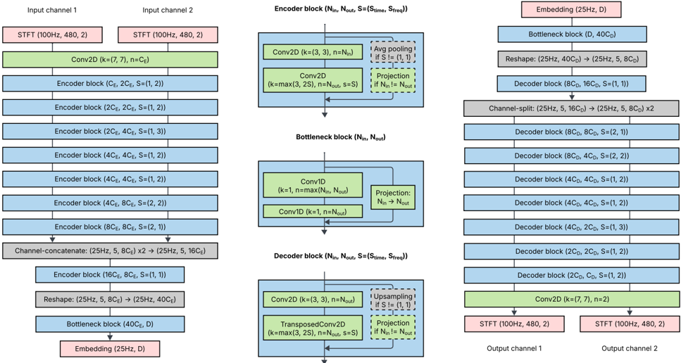

> [!abstract] arXiv · 2025 · Preprint
> **Yunpeng Li et al.** (Google DeepMind) · [→ Paper](https://arxiv.org/abs/2508.05207) · Demo: ? · Code: ?
>
> SpectroStream replaces the waveform-domain convolutional backbone of SoundStream with a 2D time-frequency architecture and a delayed-fusion multi-channel strategy, achieving substantially better reconstruction quality for 48 kHz stereo music at low bit rates.

## Problem

Most neural codecs are designed for monophonic speech at 24 kHz or below, making them poorly suited for music reproduction, which demands full-band stereo fidelity. Waveform-domain architectures (SoundStream, EnCodec, DAC) struggle at higher sample rates because capturing fine spectral structure from raw samples becomes increasingly difficult. Multi-channel support is either absent or bolted on without joint modelling of cross-channel phase relationships, which is perceptually critical for stereo music. Low bit rates are particularly challenging: at 2–3 kbps per channel, prior codecs exhibit audible artefacts that subjective listeners clearly prefer to avoid.

## Method

SpectroStream operates entirely in the time-frequency domain. Input audio is converted to complex spectrograms via STFT (window 960, step 480 at 48 kHz, giving 100 frames/second), and the real and imaginary components are treated as separate input channels to a 2D convolutional encoder. The encoder downsamples to 25 embedding vectors per second (dimension 256), which are then quantized using residual vector quantization (RVQ) with 64 codebooks of size 1024, supporting a maximum bit rate of 16 kbps. The decoder mirrors the encoder using transposed convolutions, with inverse STFT applied at the output to reconstruct the waveform.

For stereo audio, the encoder uses **delayed fusion**: early layers process each channel independently (with shared weights), fusing representations just before the final layers to enable joint modelling of cross-channel phase. The decoder mirrors this with early splitting. Fusing too early degrades per-channel fidelity; fusing too late loses stereo phase coherence. All encoder and decoder convolutions are causal, with a one-embedding look-ahead in the decoder only, yielding a total architectural latency of 80 ms — compatible with real-time CPU inference via the KWS streaming framework.

Training combines adversarial, feature matching, reconstruction (multi-scale mel spectral energy distance), and RVQ commitment losses. A multi-scale STFT-based discriminator operating at six window lengths (128 to 4096) replaces the waveform discriminator used in SoundStream. Two quantizer training refinements improve quality across the bit rate range: biased quantizer dropout skews training toward lower-codebook scenarios, and a full quantizer bypass (rate 0.5) provides the encoder with unaltered gradients that bypass the straight-through estimator. Total model size at inference is 61M parameters.

## Key Results

SpectroStream is compared against DAC (Descript Audio Codec) on 49 MUSDB18 tracks using ViSQOL as the objective metric, and on 20 clips with 60 trained raters using an A/B subjective preference protocol. Results across three bit-rate conditions:

| Bit rate | ViSQOL (SpectroStream) | ViSQOL (DAC) | Preference (SpectroStream) |
|----------|------------------------|--------------|---------------------------|
| 2.7 kbps | 3.21 | 1.47 | 76.3% |
| 5.3 kbps | 3.83 | 2.41 | 55.0% |
| 8.0 kbps | 4.00 | 3.33 | 50.8% |

The ViSQOL gap of 1.74 points at 2.7 kbps is substantial. Subjective preferences align with objective scores, with the clearest advantage at the low end. At 8 kbps the difference narrows to near-parity in subjective evaluation (50.8% vs. 49.2%).

> [!note]
> The comparison is limited to DAC, which is the only pre-trained stereo-capable baseline available. SoundStream and EnCodec are not evaluated, and the training dataset is proprietary, preventing direct reproduction of these results.

## Novelty Assessment

The time-frequency domain as an intermediate representation for neural codecs is not new — this paper consciously positions itself as a successor to SoundStream, with the spectrogram input as the core change. The specific combination of 2D convolutional encoder-decoder, multi-scale STFT discriminator, delayed-fusion stereo handling, and causal streaming design for 48 kHz music is a coherent and well-executed architectural package. The delayed-fusion strategy for multi-channel audio is the most distinctive technical contribution and appears underexplored in prior codec work. The training refinements (biased quantizer dropout, full bypass) are incremental over DAC's bypass technique but serve a practical purpose. The evaluation is honest about the limited baseline coverage and the proprietary training data, though both restrict reproducibility.

## Field Significance

Moderate — SpectroStream extends neural codec design to full-band stereo music with a principled time-frequency architecture, demonstrating that operating on spectrograms rather than waveforms yields meaningful gains at low bit rates. The delayed-fusion stereo strategy addresses a largely neglected dimension of codec design. The work is most relevant to systems where music quality and streaming latency both matter — a useful reference point as the field builds higher-quality audio generation foundations, but not a paradigm shift in how codecs are designed.

## Claims

- Operating in the time-frequency domain enables neural codecs to achieve higher perceptual quality for full-band audio than equivalent waveform-domain architectures, especially at low bit rates. *(§2, §4, Table 1)*
- Cross-channel phase coherence in multi-channel neural codecs requires joint processing of audio channels in at least some encoder layers, and neither fully independent nor fully joint encoding is optimal. *(§2)*
- Multi-scale spectral discriminators are effective for training high-quality neural codecs without requiring waveform-domain discriminators. *(§3)*
- Biased quantizer dropout towards low codebook counts during training improves codec quality at the low bit rate end without sacrificing high bit rate performance. *(§3.1.1)*
- Real-time streaming neural codec inference at 48 kHz stereo is achievable on a desktop CPU with an 80 ms architectural latency when using causal convolutions and a minimal look-ahead. *(§1, §2)*

## Limitations and Open Questions

> [!warning]
> Training data is proprietary and the only baseline is DAC; results cannot be reproduced and the comparison does not include SoundStream, EnCodec, or Mimi, leaving SpectroStream's position in the broader codec landscape unclear.

Evaluation is restricted to music (MUSDB18) despite the paper's "general audio" framing. Speech quality at 48 kHz stereo is not reported. The A/B preference protocol does not include a MUSHRA-style anchor, making absolute quality judgements difficult. The latency of 80 ms is described as suitable for streaming but is not benchmarked against real-time constraints in actual deployment. The delayed-fusion fusion point is treated as a design choice found empirically — no ablation is provided to quantify the quality/coherence trade-off as a function of fusion layer depth.

## Wiki Connections

- [[neural-codec]]
- [[gan-vocoder]]
- [[streaming-tts]]
