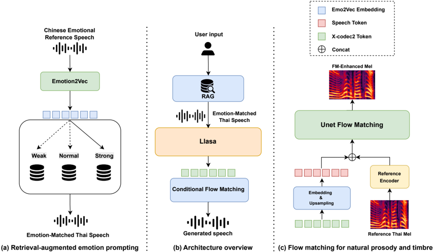

> [!abstract] arXiv · 2025 · Preprint
> **Zuo et al.** (Northwestern Polytechnical University) · [→ Paper](https://arxiv.org/abs/2508.07302) · Demo: ✓ · Code: ✗
>
> XEmoRAG enables zero-shot cross-lingual emotion transfer from Chinese to Thai by combining an LLM-based TTS backbone with a retrieval-augmented generation module that selects emotionally matched target-language prompts without requiring parallel bilingual emotional data.

## Problem

Cross-lingual emotion transfer poses a distinct challenge from ordinary multilingual TTS: the system must reproduce an emotional style conveyed in a source-language reference while generating speech that sounds native in a typologically distant target language. Prior approaches rely on discrete emotion labels or language identifiers, both of which are unavailable or unreliable in zero-shot low-resource settings. Disentanglement-based methods still require carefully paired multilingual data and often introduce foreign-accent artefacts when prosody is directly transferred between languages. The Chinese-to-Thai direction is a particularly hard case: the two languages differ in phonemic inventory, tonal structure, and prosodic conventions, and labelled Thai emotional speech data is scarce.

## Method

XEmoRAG builds on Llasa-1B-Multilingual, a 1B-parameter autoregressive decoder-only model that predicts discrete acoustic tokens from text in a next-token prediction loop. Speech is tokenised with X-Codec2, a single-layer vector quantiser that captures both semantic and acoustic features. The system adds two components on top of this backbone.

The retrieval-augmented generation (RAG) module handles emotion transfer without explicit labels. Given a Chinese reference utterance, Emo2Vec extracts a language-agnostic emotional embedding; K-means clustering over a pool of 8K Thai utterances then retrieves the best-matching Thai emotional prompt at inference time. The retrieved audio and its transcription are passed to Llasa as a prosodic and semantic prefix, guiding emotional style while keeping the generated phonetics native to Thai. Emotion intensity (weak, normal, strong) is controlled by restricting retrieval to the appropriate annotated subset of the Thai pool.

The flow-matching alignment module replaces Llasa's default X-Codec2-based acoustic decoding with a transformer-based 1D U-Net conditioned on speaker reference embeddings. It maps predicted discrete tokens to mel-spectrograms by learning a vector field via a continuous normalising flow, using an ODE solver at inference. A 1.6:1 linear upsampling step aligns token frame rates to mel frame rates before the flow, addressing a mismatch between codec and spectrogram resolutions. Mel outputs are then converted to waveforms by DSPGAN.

Training follows a two-stage fine-tuning strategy: first on 1K hours of non-emotional Thai data to establish phonetic grounding, then on 60 hours of Thai emotional data. The RAG module is active only at inference.

## Key Results

On an internal Chinese-to-Thai evaluation using 15 native listeners (10 Chinese, 5 Thai), XEmoRAG achieves an Emotion Similarity MOS (EMOS) of 4.65 ± 0.10, compared to 3.89 ± 0.12 for DelightfulTTS — a margin of 0.76 MOS. Naturalness MOS (NMOS) is 4.38 ± 0.12, essentially matching DelightfulTTS (4.41 ± 0.14), indicating that the emotional enhancement does not hurt perceptual naturalness. XEmoRAG also leads on speaker cosine similarity (SIM 0.89 vs. 0.83) and character error rate (CER 5.95% vs. 7.33%). Typhoon2-Audio 8B Instruct, an 8B-parameter Thai-optimised model, is included as a second baseline but only reports CER (8.72%), making direct emotional comparison impossible.

Ablations show that removing the flow-matching module drops EMOS to 4.20 and SIM sharply to 0.74, while removing the RAG module drops EMOS to 4.25. Both components contribute independently.

For retrieval, clustering-based retrieval at 8K utterances achieves the highest accuracy (86.3%) at 1.67s latency, outperforming direct cosine similarity search which degrades to 82.4% accuracy at 2.85s latency at the same scale — demonstrating that structured retrieval scales better than exhaustive search as the emotional pool grows.

> [!note]
> All evaluations use internal proprietary datasets not released publicly. There is no standard benchmark, and the sole fully-evaluated baseline is DelightfulTTS. Comparison to Typhoon2-Audio is limited to CER only, so the EMOS advantage cannot be assessed against that model.

## Novelty Assessment

The contribution is a system-level integration: RAG-based prompt selection for emotion and flow-matching-based acoustic decoding are both established techniques, but their combination in a zero-shot cross-lingual emotion transfer pipeline targeting a low-resource tonal language is new. Applying Emo2Vec's cross-lingual embeddings as a retrieval signal for prosody prompting is the most distinctive technical choice. The two-stage fine-tuning strategy is standard practice for low-resource adaptation and is not independently novel. The flow-matching component is a fairly conventional transformer U-Net replacing an existing codec alignment — the novelty is in the integration rather than the architecture itself. The overall contribution is practical and well-motivated, but the field-level novelty is moderate: the paper does not introduce a new training objective, a new model family, or a new evaluation framework.

## Field Significance

Moderate — XEmoRAG demonstrates that RAG-based prompt retrieval can substitute for parallel bilingual emotional data in zero-shot cross-lingual emotion transfer, a practically important capability for low-resource language pairs. The specific Chinese-to-Thai setting has limited generalisability as presented, but the framework design is language-agnostic and could extend to other distant language pairs. The paper is primarily engineering-integration work building on an existing LLM-TTS backbone, with the RAG and flow-matching components providing additive rather than paradigm-shifting advances.

## Claims

- Language-agnostic emotional embeddings from pre-trained models can serve as a reliable cross-lingual retrieval signal for zero-shot emotion transfer in TTS.
- Retrieval-augmented prompting reduces foreign-accent artefacts in cross-lingual emotional speech synthesis more effectively than direct prosody transfer between typologically distant languages.
- Flow-matching alignment between discrete codec tokens and mel-spectrograms improves speaker identity preservation as well as prosodic naturalness in multilingual synthesis.
- Clustering-based retrieval strategies over large emotional speech pools maintain higher accuracy and lower latency than exhaustive cosine similarity search as pool size grows.
- Two-stage fine-tuning — first on phonetics, then on expressiveness — enables effective emotion adaptation in low-resource target languages from a strong multilingual foundation model.

## Limitations and Open Questions

> [!warning]
> All evaluation is conducted on internal, non-public datasets with a narrow test configuration (one Chinese speaker, proprietary Thai data). There is no standard benchmark, no released code, and no cross-lab reproducibility path. Claims about emotion transfer quality are difficult to verify independently.

The evaluation covers only the Chinese-to-Thai direction. The paper claims the framework is language-agnostic, but this is stated as future work rather than demonstrated. The listener panel is small (15 raters) and the Thai subset is particularly small (5 raters), raising questions about statistical reliability. The EMOS metric used here is a custom MOS variant not directly comparable to published results elsewhere. Comparisons with Typhoon2-Audio are limited to CER only, leaving the emotional quality comparison against a strong 8B-parameter baseline unanswered.

## Wiki Connections

Concepts most directly relevant: [[zero-shot-tts]], [[multilingual-tts]], [[emotion-synthesis]], [[flow-matching]], [[neural-codec]], [[disentanglement]].
