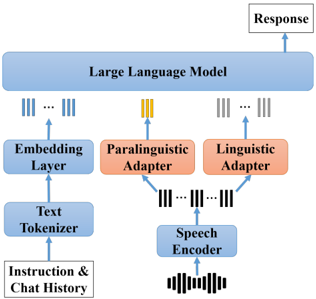

> [!abstract] arXiv · 2025 · Preprint
> **Chun Wang et al.** (Mashang Consumer Finance Co., Ltd.) · [→ Paper](https://arxiv.org/abs/2508.08095) · Demo: ? · Code: ?
>
> A dual-adapter speech language model that disentangles paralinguistic from linguistic information through heterogeneous adapter architectures and a weakly supervised Equivalence Replacement Regularization strategy, enabling emotionally aware spoken conversation using only frozen LLM and speech encoder components.

## Problem

Speech language models built by augmenting frozen text LLMs with speech encoders tend to prioritise linguistic content and neglect paralinguistic cues — pitch, speed, energy, and emotion — because the LLM's embedding space was trained entirely on text. When a single adapter bridges speech and language, the text-biased space naturally suppresses non-linguistic signals. A second problem is task overfitting: instruction-tuning on specific tasks can cause adapters to produce embeddings that encode task identity rather than generalisable information, reducing multi-turn context understanding. Prior systems such as E-chat, BLSP-Emo, and SpeechEmotionLlama use a single adapter and often require fine-tuning the speech encoder or the LLM itself to compensate, which risks degrading their pre-trained capabilities.

## Method

The proposed system introduces two structurally heterogeneous adapters that plug into a frozen speech encoder (Whisper-large-v3) and a frozen instruction-tuned LLM (Qwen2.5-7B or Llama3.1-8B). Only the adapters are trained, keeping both the encoder and LLM unchanged.

The **paralinguistic adapter** applies a compact transformer block (single layer, 8 heads) to the speech encoder output, then uses adaptive pooling to reduce the sequence to a fixed length of 10 embeddings. This captures utterance-level properties — emotion, pitch, energy, tempo, gender — that remain broadly consistent across the utterance. The resulting embeddings are injected as soft prompts, prepended to the LLM input.

The **linguistic adapter** concatenates every 5 adjacent speech embeddings into a compact representation (10 Hz effective rate) and passes them through a two-layer MLP with ReLU activation. The resulting sequence replaces the corresponding text token embeddings in the LLM input, preserving temporal correspondence to the transcript.

Training proceeds in three stages. Stage 1 jointly trains both adapters on ASR and attribute classification tasks. Stage 2 applies **Equivalence Replacement Regularization (ERR)**: when training the linguistic adapter on linguistic tasks, the paralinguistic adapter is frozen and linguistic embeddings are randomly combined with paralinguistic embeddings drawn from text captions, speech, or nothing at equal probability. Because linguistic tasks should not depend on paralinguistic source, this forces the linguistic adapter to capture only what text cannot explain. The symmetric procedure trains the paralinguistic adapter. Stage 3 fine-tunes jointly with multi-turn style-aware alignment tasks (StyleTalk, DailyTalk), using dynamic context lengths and ERR-induced combination randomness to prevent task-specific vector collapse.

## Key Results

On paralinguistic classification (TextrolSpeech), both SLM-Qwen and SLM-Llama achieve high weighted accuracy: gender 93.2–93.4%, pitch 82–84%, tempo 91%, energy 79–81%, emotion 90%. These hold even when only paralinguistic embeddings are presented, demonstrating successful disentanglement. On the MELD emotion recognition benchmark, both models (53.3% and 54.9% WA) are competitive with Qwen-Audio (55.7%) and Qwen2-Audio (55.3%) despite training neither the encoder nor the LLM — a notable efficiency result.

On ASR (LibriSpeech), SLM-Qwen achieves 2.5/5.5 WER (clean/other) and SLM-Llama 2.3/5.1, training on 960 hours only. These approach ASR-specific SLMs like SLAM-ASR (1.9/3.8) and compare reasonably to general SLMs trained on far more data.

For emotional conversation (StyleTalk evaluation), both models outscore Qwen2-Audio and LlamaOmni on CS content, CS style, and all four EGS dimensions under two independent LLM judges (Qwen2.5-72B and Llama-3.1-70B). SLM-Qwen with Qwen2.5-72B as judge achieves CS content 4.28 vs. 3.86 (Qwen2-Audio) and EGS total ~36.3 vs. ~33.7.

> [!note]
> The emotional conversation evaluation uses LLM-as-judge scoring on a relatively small extended StyleTalk test set, and the metric definitions (CS Score, EGS Score) are non-standard and paper-specific. Comparisons to baselines should be treated as indicative rather than definitive.

## Novelty Assessment

The key contribution is the combination of structurally heterogeneous adapters (pooled-transformer for paralinguistic, compressed-MLP for linguistic) with the ERR weakly supervised training strategy. The architecture is novel but modest in scope: both adapters are small and the design decisions (fixed-length vs. variable-length, soft prompt vs. token replacement) follow from first principles about the nature of the information being captured. ERR is a regularisation strategy grounded in well-established ideas about prompt tuning and task overfitting; the novelty lies in its application to the speech-LLM interface specifically. The paper does not propose a new language model or speech encoder — it is a parameter-efficient integration method for existing components. The three-stage training protocol is the most distinctive contribution, as it operationalises disentanglement through equivalence constraints rather than explicit supervision. The evaluation is limited to public datasets and LLM-as-judge metrics; no human listening tests are reported, and the system generates text rather than speech.

## Field Significance

Moderate — This paper identifies information entanglement at the speech-LLM adapter interface as a concrete failure mode and proposes a targeted, parameter-efficient fix. The dual-adapter design and ERR strategy are a useful template for building emotionally aware SLMs without disturbing pre-trained components. Its significance is primarily as a technique paper advancing the integration layer between frozen speech encoders and LLMs, rather than as a result that shifts the field's direction. The paper is presented at IEEE ICME 2025.

## Claims

- Disentangling paralinguistic and linguistic information through separate adapter architectures improves an SLM's ability to perceive both modalities independently without modifying the underlying encoder or LLM.
- Training-time randomisation over paralinguistic embedding sources (speech, text caption, or absent) can prevent adapter collapse into task-specific vectors and preserve contextual generalisation.
- Parameter-efficient adapter-only training on a frozen LLM is competitive with full fine-tuning approaches for emotional dialogue tasks when the information encoding is structured by design.
- Automatic LLM-as-judge evaluation of emotional conversation quality does not substitute for human subjective evaluation; score magnitudes are judge-model-dependent.

## Limitations and Open Questions

> [!warning]
> The system generates text responses, not speech. Despite targeting emotional spoken conversation, the output modality is text only — the emotional response is encoded in linguistic content and style, not in synthesised speech prosody. This limits applicability to fully spoken dialogue pipelines.

The evaluation relies entirely on LLM-as-judge metrics (CS Score, EGS Score) with no human listening tests, making quality estimates harder to interpret and compare across papers. The StyleTalk test set is small, and the evaluation extension (reversing assistant/user roles) is non-standard.

The paper does not report model parameter counts for the adapter components, making efficiency claims difficult to quantify precisely. Code and pretrained models are not publicly released (at time of submission).

ERR assumes that each task type primarily relies on one information type, but in practice multi-dimensional emotional speech may engage both simultaneously; the degree to which the disentanglement generalises beyond the training task taxonomy is untested.

## Wiki Connections

Concept pages: [[spoken-language-model]], [[emotion-synthesis]], [[disentanglement]], [[self-supervised-speech]], [[instruction-conditioned-tts]]

Related paper: [[2410.01162]] (frozen LLMs perceiving paralinguistic aspects of speech — closely related prior work on the same problem)
