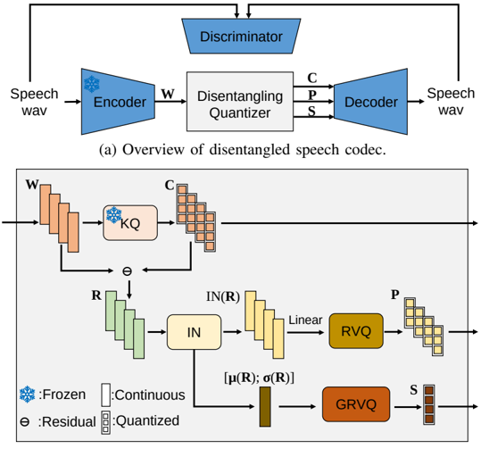

> [!abstract] arXiv · 2025 · Preprint
> **Aihara et al.** (MERL / Mitsubishi Electric) · [→ Paper](https://arxiv.org/abs/2508.08399) · Demo: ? · Code: ?
>
> A discrete neural audio codec that separates phonetic, prosodic, and speaker information into three independently quantized streams using WavLM hidden representations, enabling one-shot voice conversion by swapping speaker codes at inference without any transcription or F0 labels.

## Problem

Standard neural audio codecs (NACs) such as EnCodec and DAC encode speech into a single entangled representation, making it difficult to selectively manipulate individual attributes — speaker identity, prosody, and phonetic content — after the fact. Prior disentanglement approaches either left some components continuous (making them LLM-incompatible), relied on externally provided phoneme sequences or F0 trajectories, required computationally expensive time-domain alignment (WSOLA), or used gradient reversal layers known to be unstable. No prior unsupervised codec fully quantized all three speech attribute streams simultaneously without external supervision.

## Method

The model uses WavLM-Large (frozen) as its encoder, extracting 6th-layer hidden vectors at 50 Hz. These representations are passed through a disentangling quantizer that decomposes them into three streams:

1. **Content (phonetic) vectors** C: produced by k-means VQ (KQ) applied to the raw WavLM hidden vectors. The k-means codebook (1000 centroids) is precomputed from LibriSpeech and frozen, so the quantization is deterministic and speaker-independent.

2. **Prosody vectors** P: computed from the residual R = W − C after instance normalization (IN) removes the time-invariant speaker statistics. The time-variant remainder is projected to an 8-dimensional space and quantized with RVQ.

3. **Speaker vector** S: the concatenated mean and standard deviation of R (µ(R) and σ(R), time-invariant across an utterance) are quantized using group-residual vector quantization (GRVQ), which partitions the feature space by dimension before applying RVQ to each group.

The decoder combines all three streams: C and P are concatenated and then modulated by a feature-wise linear modulation (FiLM) layer conditioned on S, followed by depth-wise deconvolutional upsampling blocks to reconstruct the waveform. A GAN discriminator (multi-period + complex multi-scale STFT) is used for training, following the DAC setup. One-shot voice conversion is performed at inference simply by swapping the quantized speaker vector S from a single reference utterance.

The paper studies an ablation ladder — SKQ (phonetic only quantized, baseline), SKQ+σ (adds variance to speaker representation but keeps speaker/prosody continuous), SKQ2+σ (adds prosody quantization), and SKQ3+σ (fully quantized) — to isolate the effect of each quantization step.

## Key Results

On reconstruction (LibriSpeech test-clean), SKQ3+σ achieves ViSQOL of 3.88 and EER of 2.65%, compared to non-disentangled baselines Vanilla RVQ (4.01 / 3.01%) and SNAC (4.01 / 2.93%). The slight ViSQOL drop is expected; the disentangled models achieve lower EER than non-disentangled ones, indicating better speaker discrimination from the codec's own tokens.

On one-shot voice conversion, SKQ3+σ achieves WER 2.62%, EER 5.62%, and UTMOSv2 2.92 — broadly matching the baseline SKQ (2.25% / 6.88% / 3.03). The kNN-VC baseline attains the best EER (3.93%) but the worst WER (23.65%) and UTMOS (2.24), suggesting that kNN-VC's direct feature substitution degrades intelligibility and naturalness. Quantizing the prosody stream reduces EER for VC (more information bottleneck, cleaner disentanglement), but quantizing the speaker vector slightly increases EER relative to continuous speaker, posing a direct trade-off between LLM-compatibility and speaker identity fidelity.

The ablation on GRVQ hyperparameters (Table IV) shows that 16 groups / 8 RVQ layers is the configuration that best balances WER, EER, and naturalness; smaller GRVQ budgets degrade SV accuracy markedly.

UMAP visualizations confirm that the quantized speaker vectors cluster by speaker identity (similar to ECAPA-TDNN embeddings), while the quantized prosody vectors P do not cluster by speaker but instead align with speaker-normalized F0 deviation — the intended disentanglement behaviour.

## Novelty Assessment

The combination of elements here — frozen WavLM encoder, k-means phonetic quantization, instance normalization for speaker/prosody separation, RVQ for prosody, and GRVQ for speaker — is incremental relative to prior work (notably SKQVC, Speech Resynthesis, and FACodec), but the specific fully-discrete pipeline without external labels or F0 supervision is new. FACodec is the closest competitor; it quantizes the same three streams but requires phoneme labels and a gradient reversal layer. This paper removes both requirements. The GRVQ speaker quantization and the observation that speaker discretization introduces a measurable SV accuracy cost are contributions worth citing. The engineering is clean but the individual components (IN for speaker extraction, k-means for phonetics, RVQ for prosody) are all previously published. The primary novelty is their assembly into an unsupervised, fully discrete pipeline with a careful empirical analysis of each quantization step's effect.

## Field Significance

Moderate — The paper contributes a principled unsupervised approach to fully discrete speech disentanglement, which addresses a practical bottleneck for deploying disentangled representations in LLM-based speech systems. The finding that speaker discretization degrades speaker identity fidelity, and the ablation quantifying this trade-off, provides useful calibration data for practitioners designing codec-language model interfaces. The work is solid but narrowly scoped to a research system trained on a small clean dataset; its impact on the broader field is confirmatory and guiding rather than direction-changing.

## Claims

- Fully discrete disentanglement of phonetic, prosodic, and speaker information in a speech codec is achievable without phoneme labels or F0 supervision, at the cost of a small reconstruction quality degradation. *(§III, §IV.B, Table II)*
- Quantizing speaker vectors into discrete codes reduces speaker identity fidelity compared to continuous speaker representations, posing a fundamental trade-off between LLM compatibility and speaker retention. *(§IV.B, Table III)*
- Instance normalization of SSL residual features provides a label-free mechanism to separate time-invariant speaker statistics from time-variant prosodic content. *(§III.B)*
- Fully discrete speech codecs can match conventional voice conversion methods on intelligibility and naturalness while enabling attribute manipulation through codebook-level operations. *(§IV.B, Table III)*

## Limitations and Open Questions

> [!warning]
> All experiments use LibriSpeech clean speech (16 kHz, studio conditions); performance on noisy, spontaneous, or out-of-domain speech is untested. The one-shot VC evaluation uses only two reference speakers (one male, one female), limiting statistical confidence in the speaker similarity results.

The model is not tested on any downstream application (TTS, ASR, speech LM), despite this being the stated motivation. Whether the disentangled discrete tokens actually improve over non-disentangled tokens on downstream tasks remains an open question — the paper acknowledges this as future work. The GRVQ codebook dimensionality analysis shows a clear trade-off between bitrate and speaker identity, but optimal bitrate allocation across the three streams is not systematically explored. Prosody quantization codebook interpretability beyond F0 correlation (e.g., energy, duration, speaking rate) is not investigated.

## Wiki Connections

- [[neural-codec]]
- [[disentanglement]]
- [[voice-conversion]]
- [[self-supervised-speech]]
- [[speaker-adaptation]]
- [[prosody-control]]
