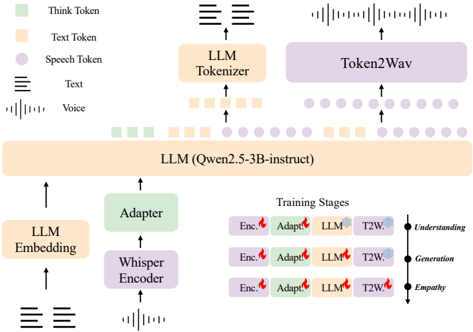

> [!abstract] arXiv · 2025 · Preprint
> **Geng et al.** (Northwestern Polytechnical University) · [→ Paper](https://arxiv.org/abs/2508.09600) · Demo: ? · Code: ✓
>
> OSUM-EChat is a native multimodal spoken dialogue system that transfers paralinguistic understanding capabilities — emotion, age, gender, sound events — from a pre-trained speech understanding model to empathetic speech-to-speech dialogue, using a three-stage curriculum and a chain-of-thought reasoning mechanism, while introducing the EChat-200K training corpus and EChat-eval benchmark for the task.

## Problem

End-to-end spoken dialogue systems that handle paralinguistic cues (emotion, age, gender, sound events) have historically required large-scale paired dialogue datasets to implicitly learn the mapping between these cues and contextually appropriate responses. Open-source native multimodal models in particular struggle to capture fine-grained paralinguistic information when trained without such data, falling back to predominantly neutral or happy vocal tones regardless of user input. Existing evaluation frameworks also do not systematically assess empathetic responsiveness across multiple paralinguistic dimensions simultaneously. This paper targets resource-constrained empathetic dialogue: building a system that can perceive and generate across all four paralinguistic dimensions without the data volumes available to industrial labs.

## Method

OSUM-EChat is a native multimodal architecture in which the LLM handles both text and speech token generation. The backbone is Qwen2.5-3B-instruct, extended with 4,097 new tokens: 4,096 speech tokens drawn from CosyVoice's codebook and one boundary token. A Whisper-Medium encoder feeds speech representations through a three-layer 1D convolutional adapter (4× downsampling) and four transformer encoder layers before entering the LLM. The output speech tokens are converted to waveforms by a CosyVoice-based token2wav module that combines a flow-matching Mel spectrogram estimator with HiFi-GAN, producing 24 kHz, 16-bit audio.

Training follows a three-stage understanding-driven spoken dialogue curriculum. Stage 1 (understanding) jointly trains ASR and paralinguistic prediction tasks (ASR+P: emotion, age, gender, sound events), keeping the encoder and adapter trainable; pseudo-labelling expands single-task data to all paralinguistic dimensions. Stage 2 (generation) first fine-tunes the LLM on TTS data alone, then jointly trains on speech-to-speech dialogue in both non-streaming (text tokens then speech tokens) and streaming (interleaved 6:18 text-to-speech token ratio) modes. Stage 3 (empathy) introduces the linguistic-paralinguistic dual think mechanism: before generating a response, the model produces a chain-of-thought segment delimited by `<think>` / `<think_end>` tokens that explicitly identifies linguistic and paralinguistic content. Training uses the EChat-200K corpus with a structured sparse learning strategy that masks unknown paralinguistic label positions — allowing the model to train across heterogeneous data with partial labelling.

The EChat-200K dataset (approximately 200K speech-to-speech dialogues) is constructed synthetically: DeepSeek generates query texts annotated with paralinguistic labels, CosyVoice2 synthesises query audio with sound event audio spliced in, and DeepSeek produces empathetic response texts that CosyVoice2 then renders with matching emotional voice. Roughly one-third of test data in EChat-eval uses real recordings to mitigate synthetic bias.

## Key Results

On EChat-eval (automatic GPT-4 scoring), OSUM-EChat achieves 72.0 in the multi-label scenario against a next-best baseline of 63.7 (Qwen2.5-Omni), and 87.1 on sound event empathy where most competitors score zero because they lack the capability. Human evaluation confirms the ranking: OSUM-EChat scores 73.3 (multi-label), ahead of Qwen2.5-Omni at 67.3, though a commercial system (Doubao) leads on the emotion dimension at 78.0 vs. 72.0.

On general dialogue quality (UltraEval-Audio, Table 4), OSUM-EChat's S2S mode scores comparably to other open-source native multimodal models (e.g. DeepTalk, GLM-4-Voice) but below modularly aligned systems such as MinMo and the commercial ChatGPT-4o. SEED-TTS WER results show functional TTS quality — 3.0% CER (zh) and 3.99% WER (en) — slightly better than the base CosyVoice but noticeably behind Seed-TTS and Qwen2.5-Omni.

The ablation study (Table 2) isolates the contribution of each stage: removing the understanding-driven training drops multi-label score from 72.0 to 63.1; removing the dual think mechanism drops it to 56.4. Both components are necessary; neither alone closes the gap to the full model.

There is a documented divergence between automated and human scores: emotion2vec-Large labelling errors and GPT-4o hallucinations inflate discrepancies, though model rankings remain consistent between the two evaluation modes.

## Novelty Assessment

The core novelty is the staged knowledge transfer from a strong speech understanding model to a dialogue generation model, specifically targeting paralinguistic dimensions. The dual think CoT approach applied to spoken dialogue is genuinely new — using explicit think tokens to separate paralinguistic identification from response generation is a reasonable adaptation of text-domain chain-of-thought to the speech modality. The structured sparse learning strategy for multi-label data with heterogeneous label completeness is a practical engineering contribution.

That said, the individual components are assembled from established methods: Whisper encoder, CosyVoice tokens, Qwen2.5 backbone, flow-matching decoder, HiFi-GAN vocoder. The architecture type mirrors other native multimodal dialogue systems (GLM-4-Voice, Mini-Omni). The primary contribution is the training curriculum design and the paralinguistic focus — not a novel architecture per se. EChat-200K and EChat-eval are genuine contributions that fill a real gap in open-source empathetic speech datasets and benchmarks.

## Field Significance

Moderate — OSUM-EChat advances the niche of empathetic end-to-end spoken dialogue, demonstrating that targeted knowledge transfer from a multitask speech understanding model can partially compensate for the absence of large-scale empathetic dialogue data. The EChat-200K corpus and EChat-eval benchmark are the paper's most reusable contributions, offering the community a dedicated resource for training and evaluating paralinguistic responsiveness in speech-to-speech systems — a dimension poorly covered by existing benchmarks.

## Claims

- Explicit chain-of-thought reasoning over paralinguistic cues (emotion, age, gender, sound events) improves empathetic response generation in speech-to-speech dialogue systems. *(§OSUM-EChat "Training", Stage 3 Empathy; Table 2)*
- Pretraining on multitask speech understanding before speech-to-speech dialogue training reduces dependence on large-scale paired dialogue datasets while maintaining paralinguistic modelling quality. *(§OSUM-EChat "Training", Stage 1; Table 2)*
- Synthetic speech-to-speech data derived from TTS systems exhibits reduced emotional expressiveness compared to real human speech, creating a systematic domain gap that degrades empathetic dialogue evaluation. *(§EChat-200K Dataset)*
- Automatic empathy evaluation pipelines using LLM scoring and automatic emotion classifiers diverge measurably from human judgements, primarily due to emotion classifier errors and LLM hallucinations. *(§Main Results "Results of Empathetic Intelligence"; Table 3)*
- Native multimodal models that integrate speech token prediction directly into the LLM are better suited to capturing and generating paralinguistic nuance than modularly aligned architectures that treat speech decoding separately. *(§Introduction; §Related Work "End-to-End Spoken Dialogue System")*

## Limitations and Open Questions

> [!warning]
> The EChat-200K dataset is almost entirely synthetic: query audio is generated by CosyVoice2 and response audio likewise, with real recordings comprising only a minority of the data. The authors acknowledge that emotional expressiveness of synthesised audio lags real human speech, and the training corpus does not include dynamic paralinguistic scenarios (e.g. emotional transitions, multi-speaker interactions). Generalisability to natural in-the-wild speech remains unvalidated.

The EChat-eval automatic scoring pipeline — combining GPT-4o and emotion2vec-Large — produces rankings consistent with human evaluation but absolute scores that diverge meaningfully. The benchmark is therefore more reliable for ranking systems than for measuring absolute empathy. Sound event capability is evaluated only within the categories present in EChat-200K, which may not reflect the diversity of real conversational contexts. General linguistic intelligence (UltraEval-Audio, Table 4) regresses compared to the Qwen2.5-3B base: GSM8K drops from 85 to 34 after the multi-stage training, indicating that the speech capability gain comes at a significant cost to LLM reasoning.

## Wiki Connections

**Concepts:** [[spoken-language-model]] · [[emotion-synthesis]] · [[speech-to-speech]] · [[self-supervised-speech]] · [[evaluation-metrics]] · [[instruction-conditioned-tts]]

**Related papers:** [[2506.21864]] (DeepTalk — contemporaneous native multimodal spoken dialogue model used as a baseline)
