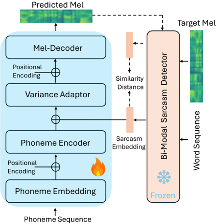
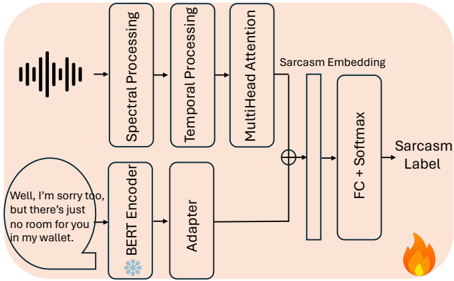

> [!abstract] arXiv · 2025 · Preprint
> **Zhu Li et al.** (University of Groningen) · [→ Paper](https://arxiv.org/abs/2508.13028) · Demo: ✓ · Code: ?
>
> A FastSpeech 2-based TTS system for sarcastic speech synthesis that integrates feedback loss from a bi-modal sarcasm detector during training, combined with a two-stage fine-tuning process, to produce prosody that more accurately conveys sarcasm.

## Problem

Generating sarcastic speech is a largely unaddressed problem in expressive TTS: existing systems focus on neutral or emotion-labelled speech, and sarcasm's distinctive prosodic profile — exaggerated pitch, altered timing, unexpected emphasis — resists standard emotion-conditioning approaches. The problem is compounded by scarcity of annotated sarcastic speech data, making transfer learning and data augmentation necessary but difficult to calibrate. The question the paper addresses is whether signals from a sarcasm detection model can be looped back into the synthesis training objective to make the synthesizer explicitly sarcasm-aware.

## Method

The system builds on FastSpeech 2 as the acoustic backbone, which generates mel spectrograms from phoneme sequences and converts them to waveform via HiFi-GAN. To this standard transformer encoder-decoder architecture, the authors add a bi-modal sarcasm detector that processes both speech (mel spectrogram through spectral convolution, temporal recurrence, and multi-head self-attention) and text (BERT embeddings). During training, the detector computes a sarcasm embedding from the input text and target speech; this embedding is concatenated with the phoneme encoder output before the variance adaptor, injecting sarcasm-related features into the synthesis path.

The training loss augments the standard MAE on mel spectrograms with a cosine-distance term between the ground-truth audio+text sarcasm embedding and the sarcasm embedding extracted from the predicted mel spectrogram. This feedback loss penalizes the model when its output's sarcasm signature diverges from the reference, providing a direct sarcasm-consistency signal during optimization.

Training follows three stages: (1) pre-training on LibriTTS for a read-speech baseline (800k iterations); (2) fine-tuning on 6.17 hours of conversational speech extracted from sitcom episodes (Friends, The Big Bang Theory) processed with Emilia-Pipe, to adapt prosody diversity; and (3) fine-tuning on the MUStARD++ sarcasm dataset (601 sarcastic, 601 non-sarcastic utterances) with the feedback loss active. During inference the detector generates an embedding from input text and a reference speech segment to guide synthesis. Model size is not reported.

## Key Results

**Sarcasm detection on synthesized speech (Table 2):** The proposed system's output is better recognized as sarcastic by the detector compared to the baseline FastSpeech 2 output. In the speech+text condition, the proposed model achieves an F1-score of 70.1% versus 68.8% for the baseline. In the speech-only condition, the gain is smaller: 63.4% versus 62.2%. These differences are modest and the evaluation is circular in character — the same detector family used in training is used for evaluation, which inflates the apparent advantage.

**Subjective evaluation (Figure 3, Figure 4):** Thirteen listeners rated the proposed system higher on MOS (exact value not reported; described as "significantly higher"). In preference tests, 53% of utterances from the proposed model were judged to have a stronger sarcasm tendency, and 49% were preferred overall, versus the baseline.

> [!note]
> The subjective evaluation uses 13 listeners only, does not report an absolute MOS value or confidence intervals, and all stimuli are drawn from a sarcasm-labelled dataset, which may prime listeners toward attributing sarcasm regardless of prosody. The preference margin (49% vs. baseline) is narrow. Direct comparison to prior expressive TTS work is absent.

## Novelty Assessment

The paper's primary novelty is using a sarcasm detector's output as an auxiliary training loss for TTS — a feedback loop between detection and synthesis. This is a direct extension of the classifier-feedback pattern seen in controllable emotion TTS work (Li et al. 2021 with an emotion classifier), applied for the first time to sarcasm as a target style. The bi-modal sarcasm detector itself combines established components (mel spectrogram CNNs, BERT, multi-head attention), without architectural novelty at the component level. The two-stage fine-tuning protocol is a practical adaptation of transfer learning for low-resource expressive speech, not a conceptual advance. The paper claims to present "the first comprehensive approach to sarcastic speech synthesis," and the specific application domain — sarcasm — is genuinely underexplored in the TTS literature. The contribution is primarily engineering integration and application novelty rather than a fundamental methodological advance.

## Field Significance

Low — This paper opens a narrow but real gap in the expressive TTS literature by directly targeting sarcasm, a communicative style that resists standard emotion-label conditioning. Its methodological contribution — routing detector feedback loss back into the synthesizer — is an incremental extension of existing classifier-guided training. The evaluation is limited in scope (13 listeners, single-dataset, no confidence intervals, circular detection metric) and the system cannot be cleanly compared against contemporary expressive TTS baselines. It will likely be cited for the problem formulation rather than for a replicable technique.

## Claims

- Feedback loss from a sarcasm classifier can be integrated into TTS training to bias synthesized speech toward detector-recognizable sarcastic prosody. *(§2.2, §4.2, Table 2)*
- Bi-modal sarcasm detection that combines acoustic features and text substantially outperforms audio-only detection, suggesting that sarcasm in speech is often semantically encoded and not recoverable from prosody alone. *(§4.1, Table 1)*
- Two-stage fine-tuning — from neutral read speech to conversational speech and then to target style — provides a viable data strategy for low-resource expressive speech synthesis. *(§2.3, §3.1)*
- Subjective sarcasm perception in listening tests is difficult to isolate from the sarcastic content of the text, creating ambiguity in whether listeners respond to prosody or semantics. *(§5, §4.3)*

## Limitations and Open Questions

> [!warning]
> The evaluation design has a critical circularity: the same detector architecture trained on the same data distribution is used both as the training feedback signal and as the primary objective metric. Improvements in detection score on synthesized outputs are therefore expected by construction and cannot be treated as independent evidence of sarcasm-aware synthesis.

The paper does not include an ablation that isolates the contribution of the feedback loss from the two-stage fine-tuning; it is therefore unclear which component drives the reported gains. The subjective study is small (13 listeners) and does not report MOS confidence intervals, making statistical significance uncertain. All evaluation stimuli are drawn from a sarcasm corpus, which may prime listener responses. The system has not been compared against more expressive modern TTS models (e.g., flow-matching or diffusion-based systems with style conditioning). Finally, the system is English-only and trained on North American sitcom speech, limiting generalizability to other languages, speakers, or sarcasm conventions.

## Wiki Connections

Core technique connects to [[emotion-synthesis]] (classifier-guided style training) and [[prosody-control]] (sarcasm-specific prosody modeling). The evaluation methodology raises issues relevant to [[subjective-evaluation]] (evaluation design and listener priming). The backbone architecture falls within [[transformer-enc-dec-tts]] (FastSpeech 2 lineage). Automatic sarcasm detection used as an objective proxy is a variant of the proxy-metric pattern discussed in [[evaluation-metrics]].
