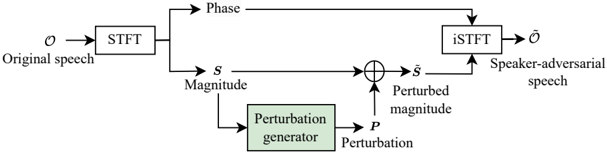

> [!abstract] arXiv · 2025 · Preprint
> **Liping Chen et al.** (University of Science and Technology of China) · [→ Paper](https://arxiv.org/abs/2508.15565) · Demo: ✓ · Code: ✓
>
> A Conformer-based adversarial perturbation generator trained with a batch mean loss that anonymizes all speakers in a mini-batch toward a shared pseudo-speaker, eliminating the privacy violation inherent in targeted-attack anonymization while improving both de-identification and identity unlinkability over prior feedforward and optimization-based baselines.

## Problem

Voice anonymization systems that use adversarial perturbations have typically relied on targeted attacks, which guide anonymized speech toward a designated real speaker. This violates the designated speaker's own privacy. Untargeted attack alternatives evade speaker verification but produce anonymized utterances that cluster together by original speaker — making them linkable even without recovering the original identity. The field lacked a feedforward approach that simultaneously achieves de-identification, identity unlinkability, and perceptual quality while avoiding real speaker designation.

## Method

The system operates in the STFT magnitude domain. Given an input utterance, the short-time Fourier transform extracts the magnitude spectrum, which passes through a perturbation generator built from six Conformer blocks. The generator produces additive perturbation vectors that are summed with the original magnitude, and the perturbed speech is reconstructed via inverse STFT using the original phase. A pre-trained and frozen ECAPA-TDNN speaker encoder extracts 192-dimensional embeddings from the original and perturbed magnitudes.

Training uses a composite loss with three terms weighted at α=0.5 (perceptual), β=0.15 (angular/untargeted), γ=0.35 (batch mean). The angular loss maximizes the cosine distance between original and adversarial embeddings, providing standard de-identification. The perceptual loss constrains log filterbank features to preserve speech quality. The key contribution is the batch mean loss: within each training mini-batch of K utterances, the average of the adversarial speaker embeddings is computed and used as a pseudo-speaker. Each utterance is then trained to have its adversarial embedding cosine-similar to this batch mean, driving all utterances in the batch toward the same fictitious centroid. Because the pseudo-speaker differs across batches and is never a real speaker, the any-to-any strategy improves identity unlinkability without assigning a real person's identity.

The perturbation generator (34.85 MB) is considerably smaller than V-Cloak's generator (66.90 MB). The speaker encoder is ECAPA-TDNN trained on VoxCeleb1+2 (2,680 hours, 7,205 speakers). No neural codec is used; the pipeline operates directly on STFT spectra.

## Key Results

In white-box evaluation on VoxCeleb1-O (Table I), the proposed method achieves EER of 46.79% for de-identification and 38.93% for identity unlinkability, the highest among all compared methods (MI-FGSM, GRA, V-Cloak). The w/o BM ablation — which removes the batch mean loss — shows 71.48% EER for de-identification but only 21.81% for unlinkability, confirming that the batch mean loss trades some de-identification capability to substantially improve unlinkability. Speech quality (PESQ >4.0) and human speaker similarity perception (SMOS 4.28 vs 4.30 reference) are preserved at levels comparable to optimization-based methods.

In black-box transfer experiments (Table II), the proposed method achieves the highest de-identification EERs against ResNet34, xi-vector, and ResNet100 extractors, and the highest unlinkability EERs against all four black-box extractors. However, performance degrades substantially under the ResNet100 extractor (EERs of 7.04% de-id and 7.53% unlinkability, versus 46.79/38.93 in white-box), highlighting adversarial transferability as a persistent weakness.

Against adaptive attacks (Table III), the proposed method achieves the highest average EERs for both de-identification (17.62%) and unlinkability (19.26%), but quantization reduces EERs to 7.63% and 11.63% respectively — a large drop. Out-of-domain evaluation (Table IV) on LibriSpeech and AIShell shows de-identification generalises well (EERs above 45% in some cases) while identity unlinkability degrades, particularly on English data.

## Novelty Assessment

The any-to-any training strategy — using the batch mean of adversarial embeddings as a pseudo-speaker — is a genuine and well-motivated contribution. It addresses a real privacy flaw in targeted-attack anonymization without introducing a new designated speaker. The Conformer-based perturbation generator is an architectural improvement over the CNN-based approach in V-Cloak, but both are straightforward application of known components. The use of STFT-domain perturbations rather than waveform-domain transformations distinguishes the approach from V-Cloak but is otherwise standard. The evaluation is thorough, covering speech quality, human perception, ASR intelligibility, white-box and black-box speaker verification, adaptive attacks, out-of-domain generalisation, and stability — this breadth is a genuine strength. The claimed gains over V-Cloak are real and fairly evaluated on the same conditions.

## Field Significance

Moderate — This paper contributes a principled solution to the real-speaker privacy problem in targeted adversarial anonymization, combining a simple but effective batch-mean training objective with a Conformer-based generator. It is relevant to the intersection of voice privacy and speaker attribute manipulation, a narrower sub-area than mainstream TTS or VC. The comprehensive evaluation framework and open-source release increase its practical utility, but the approach does not shift the broader TTS or VC paradigm.

## Claims

- Anonymizing adversarial utterances toward a pseudo-speaker derived from the batch mean of adversarial embeddings improves identity unlinkability without requiring a designated real speaker. *(§IV-A, Table I)*
- In feedforward adversarial anonymization, training with a composite loss covering untargeted attack, perceptual quality, and unlinkability objectives achieves better balance between de-identification and identity unlinkability than untargeted attack alone. *(§IV-A, Table I)*
- Adversarial perturbation-based voice anonymization degrades substantially under strong adaptive attacks such as quantization, revealing a fundamental vulnerability that is independent of the training strategy. *(§V-F, Table III)*
- Speaker adversarial perturbations transfer less effectively to black-box speaker extractors with strong verification capability, indicating that white-box EER gains overstate real-world privacy protection. *(§V-G, Table II)*

## Limitations and Open Questions

> [!warning]
> De-identification and identity unlinkability EERs drop sharply under adaptive attacks (quantization reduces de-id EER from 46.79% to 7.63%), and black-box transfer to the ResNet100 extractor similarly reduces EERs to single digits. The method's privacy guarantees are therefore limited to white-box threat models, which may not reflect realistic deployment conditions.

Identity unlinkability generalises less well than de-identification to out-of-domain datasets, particularly LibriSpeech and AIShell, suggesting the batch mean loss is sensitive to the speaker distribution at training time. The method also degrades speech intelligibility (WER increases across all ASR test sets compared to original speech), which limits applicability in voice assistant or captioning contexts. Future directions include improving transferability against black-box extractors, enhancing resilience to adaptive attacks, and strengthening out-of-domain unlinkability.

## Wiki Connections

This paper contributes to [[voice-conversion]] by demonstrating adversarial perturbation as an asynchronous anonymization approach that preserves voice characteristics for human listeners while fooling automated speaker verification. The disentanglement of speaker identity from speech content is a central theme — see [[disentanglement]]. The evaluation methodology spans perceptual quality (PESQ, SMOS), ASR intelligibility (WER), and EER for speaker verification, making this paper relevant to [[evaluation-metrics]] and [[subjective-evaluation]]. The batch mean pseudo-speaker strategy connects loosely to [[speaker-adaptation]] as a form of controlled speaker identity manipulation.
