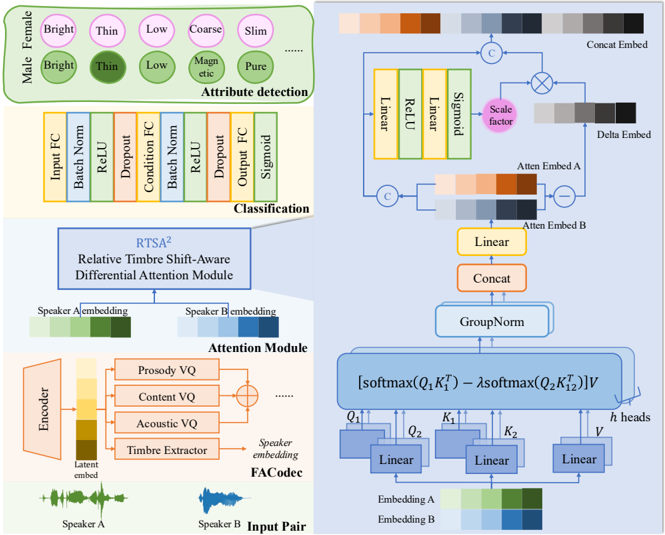

> [!abstract] arXiv · 2025 · Preprint
> **Wu et al.** (Qifu Technology) · [→ Paper](https://arxiv.org/abs/2508.15931) · Demo: ? · Code: ?
>
> A pairwise comparison framework for predicting which of two speakers exhibits a stronger presence of a target timbre attribute, combining graph-based data augmentation with differential attention to improve cross-speaker generalisation on the VCTK-RVA benchmark.

## Problem

Fine-grained timbre attribute detection — determining which speaker sounds brighter, rougher, or mellower — is a prerequisite for controllable and expressive speech generation, yet it remains poorly solved. The VCTK-RVA dataset that defines this task suffers from severe label imbalance: a handful of head attributes account for over 45% of samples while tail attributes may have fewer than 1% coverage. Existing approaches rely on speaker embeddings paired with straightforward classification, but these struggle to disentangle speaker-irrelevant timbre contrasts from identity information, leading to poor generalisation when evaluated on unseen speakers.

## Method

QvTAD frames timbre attribute detection as a pairwise relative strength task: given two utterances and a target attribute, predict which utterance is stronger in that attribute. The framework has two principal components.

The first is a Directed Acyclic Graph (DAG)-based data augmentation strategy using Disjoint-Set Union (DSU) searching. Each annotated comparison is encoded as a directed edge between speaker–attribute nodes. Under the assumption of transitivity, the DAG is traversed to discover latent, unannotated pairs that can be assigned reliable pseudo-labels. A minimum path length threshold and multi-path voting filter noisy inferences. After augmentation, the 6,038 original training pairs expand to 166,409 samples.

The second component is the Relative Timbre Shift-Aware Differential Attention (RTSA²) module. Speaker embeddings are extracted using the frozen FACodec encoder from NaturalSpeech3, producing 256-dimensional representations. The two embeddings are concatenated and fed into a multi-head differential attention block that computes two sets of attention maps and subtracts them (scaled by a learnable λ), suppressing shared timbral signals and amplifying attribute-specific contrasts. A difference vector between the two enhanced embeddings is then non-linearly modulated by a learnable amplification factor γ ∈ [0, 2] generated by a two-layer feedforward contrastive predictor. The final representation — concatenating both attended embeddings and the amplified difference — is passed to a fully connected classifier with binary cross-entropy loss over the target attribute dimension.

## Key Results

On the VCTK-RVA test set (Table 1), QvTAD-RTSA² achieves 86.99% average accuracy on unseen speakers, outperforming the reproduced FACodec baseline (75.99%) by a substantial margin and matching the originally reported FACodec result (90.72%) within a reasonable range. For male unseen speakers, EER drops to 7.89%, compared to 18.04% for the reproduced baseline. Performance on seen speakers (85.89% ACC) is slightly below the reproduced FACodec baseline (86.03%), indicating that the model's gains are concentrated in the cross-speaker generalisation setting rather than memorisation of known speakers.

Ablation results (Table 2) show that removing the DSU data augmentation hurts seen accuracy by 2.12% and unseen accuracy by 1.44%. Removing RTSA² causes a 0.71% drop in unseen accuracy while marginally improving seen accuracy (+0.10%), consistent with the module's purpose: suppressing absolute identity information in favour of relative attribute shifts.

> [!note]
> The reported FACodec numbers in Table 1 come from the official challenge paper and may have been obtained under different training or inference conditions than the reproduced baseline; direct comparison of those rows should be treated with caution.

## Novelty Assessment

The paper's two contributions are incremental adaptations of established ideas. DAG-based transitivity augmentation is a principled but straightforward engineering solution to label sparsity — the graph structure itself is novel in this speech context but the technique (transitive closure over pairwise labels) is well-known in ranking literature. The RTSA² module adapts the differential transformer (Ye et al., ICLR 2025) to pairwise embedding comparison, which is a sensible application but not a fundamental architectural advance. The key value is in demonstrating that relative attribute modelling benefits from suppressing shared timbral information, and that data augmentation via transitivity meaningfully improves generalisation.

## Field Significance

Moderate — This paper addresses a niche but practically relevant subtask: automated timbre attribute ranking, which underlies instruction-conditioned and attribute-guided TTS. The core methodological ideas (differential attention, transitivity-based augmentation) are borrowed from other domains, but the adaptation to speech timbre comparison and the improved unseen-speaker results on VCTK-RVA provide a useful reference point for future work on fine-grained perceptual attribute modelling.

## Claims

- Pairwise comparison framing reduces annotation subjectivity and label sparsity in perceptual attribute modelling more effectively than scalar labelling alone. *(§2.2, §3.1)*
- Differential attention that subtracts shared information between two representations improves cross-speaker generalisation in timbre attribute discrimination. *(§3.2, Table 1)*
- Transitivity-based data augmentation over sparse pairwise labels significantly expands training coverage and improves model robustness without requiring additional human annotation. *(§3.1, Table 2)*
- Acoustic signal features and human perceptual judgements of timbre attributes are systematically inconsistent, limiting the effectiveness of handcrafted feature approaches. *(§2.2, Figure 1)*

## Limitations and Open Questions

> [!warning]
> Evaluation is confined to VCTK-RVA, a dataset of 110 clean studio-recorded English speakers. Generalisation to spontaneous speech, noisy conditions, or non-English timbre descriptors is entirely unvalidated.

The model targets classification accuracy but does not demonstrate downstream impact on any generation task. Whether improved timbre attribute detection actually produces better controllable TTS or voice editing remains an open question. The FACodec encoder is frozen throughout; it is unclear whether joint fine-tuning would further improve performance. The 34 timbre attributes in VCTK-RVA are English-centric and human-annotated by a small group, raising questions about attribute definition consistency and cultural transferability.

## Wiki Connections

**Concepts:** [[evaluation-metrics]] · [[subjective-evaluation]] · [[disentanglement]] · [[speaker-adaptation]] · [[neural-codec]]

**Related papers:** [[2504.12867]] (EmoVoice — instruction-conditioned TTS with controllable style, a downstream application of the kind of fine-grained attribute modelling this paper targets)
