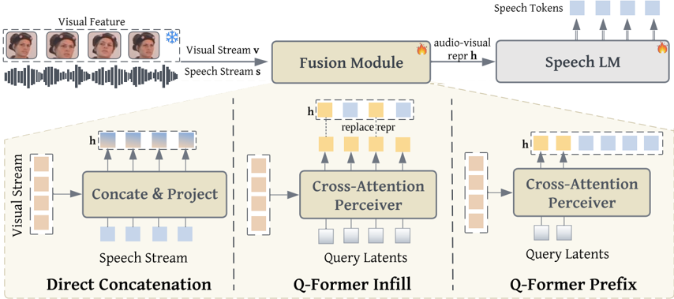

> [!abstract] EMNLP · 2025 · Conference
> **Weiting Tan et al.** · [→ Paper](https://arxiv.org/abs/2508.16188) · Demo: ? · Code: ?
>
> An Audio-Visual Language Model (AVLM) that integrates full-face visual cues via a Q-Former prefix fusion module into a pre-trained expressive speech LM (SpiritLM), improving emotion recognition by over 5 F1 points and generating more emotionally aligned speech compared to speech-only baselines.

## Problem

Most expressive speech generation systems condition generation solely on audio or text, ignoring the rich paralinguistic information encoded in visual signals. Facial expressions, head movements, and eye contact carry emotion cues that are tightly coupled to vocal expression but are routinely discarded. Existing audio-visual approaches for speech recognition focus narrowly on lip regions for semantic alignment (e.g., AVHuBERT), leaving out the broader facial dynamics that signal emotional state. The result is systems that can be fluent but emotionally inert — producing responses that fail to match the affective tone of the interlocutor.

## Method

The AVLM builds on SpiritLM, a decoder-only speech language model that represents speech as interleaved semantic, style, and pitch tokens. Visual features are extracted from full-face video frames using SMIRK, a lightweight 3D facial reconstruction encoder that disentangles expressive and jaw parameters (58 dimensions total) — chosen over larger alternatives (Open-MAGVIT2, VGG-Face2) for its disentangled emotional features and lower computational overhead.

Three modality fusion strategies were explored during pre-training on LRS3 (433h of unlabelled video): (1) Direct Concatenation of time-aligned audio-visual features projected through a feedforward network, (2) Q-Former Infill, where learned query latents drawn via cross-attention over the visual stream replace a random 50% of speech token positions, and (3) Q-Former Prefix, where compressed visual query representations (5 per second of video) are prepended as a prefix to the speech token sequence. Q-Former Prefix with 30% speech attention masking achieved the lowest perplexity and was adopted as the base for all downstream fine-tuning. LoRA (r=16, α=32) is applied throughout for parameter-efficient adaptation.

Fine-tuning for expressive dialogue uses a synthetic dataset derived from IEMOCAP: GPT-4 rewrites short original turns into two-sentence responses, which are then synthesised by Step-Audio-TTS-3B with voice cloning and emotion prompting, yielding 4,859 conversation pairs. At inference, an auxiliary emotion classifier (operating on visual query and style/pitch hidden states, trained with a stop-gradient to avoid interference) predicts the emotion label, which is inserted into the multimodal prompt before autoregressive speech generation. In-context learning demonstrations per emotion class are shown to substantially improve emotion controllability over zero-shot prompting.

## Key Results

On AVSR (LRS3), the pre-trained AVLM achieves 3.5% WER (clean) versus 4.43% for the speech-only SpiritLM baseline — a 1-point absolute reduction — with the advantage growing under noisy conditions (SNR injection and attention masking). These results are below specialist AVSR systems such as MMS-LLaMa (0.92%) and LLaMa-AVSR (0.95%), which the authors attribute to SpiritLM's lossy speech tokenization and the use of full-face (rather than lip-only) visual features.

For emotion recognition on IEMOCAP (four-class: Happy, Sad, Angry, Neutral), the AVLM reaches 66.2% F1 versus 61.3% for the speech-only baseline — a +4.9 F1 absolute gain from §5.3, Table 7. For expressive speech generation (emotion F1 of synthesised responses evaluated by Qwen2-Audio), AVLM achieves 42.49% F1 versus 38.39% — a +4.1 F1 gain. Happy and Angry emotions are easier to transfer than Neutral and Sad, consistent with their stronger facial expression signatures.

In an emotion controllability analysis, zero-shot prompt modification of the emotion label largely fails to change the emotional tone of generated speech; in-context learning demonstrations improve responsiveness considerably, though the model remains heavily anchored to input audio-visual context.

## Novelty Assessment

The core architectural contribution — a Q-Former prefix fusion module connecting a visual encoder to a speech LM — adapts the BLIP-2 Q-Former mechanism to the audio-visual speech domain. This is not a new module design; Q-Former is established in vision-language modelling. The novelty lies in the combination: applying it to full-face (non-lip) visual features to guide expressive speech generation via a tokenised speech LM (SpiritLM), a setup not previously demonstrated. The systematic comparison of three fusion strategies and three visual encoders is a useful ablation, but the individual components are all imported from prior work. The synthetic data pipeline for constructing emotionally consistent conversational pairs is a practical engineering contribution. The overall characterisation is `engineering-integration` with an `architectural-novelty` component at the level of adaptation rather than invention.

## Field Significance

Moderate — This paper is an early demonstration that full-face visual cues meaningfully improve expressive speech generation when integrated into a tokenised speech LM, complementing the dominant pattern of audio-only conditioning. The gains are real but modest, the evaluation is limited to IEMOCAP with synthetic training data, and the emotion controllability findings (§5.3, Figure 5) surface a significant gap that data scale alone may not close.

## Claims

- Full-face visual features encode complementary emotional information not captured by audio alone, and combining both modalities yields meaningfully higher emotion recognition accuracy than either modality individually. *(§3, Table 1)*
- Prefix-based visual fusion using compressed Q-Former query latents integrates more effectively into autoregressive speech LMs than direct feature concatenation, which collapses perplexity. *(§5.1, Table 3)*
- Visual guidance during training improves not only classification accuracy but also the emotional alignment of generated speech in conversational settings. *(§5.3, Table 7)*
- Emotion controllability through prompt-only label manipulation is insufficient when a model is trained on data where input and response emotions are correlated; in-context demonstrations are necessary to override this bias. *(§5.3, Figure 5)*

## Limitations and Open Questions

> [!warning]
> The expressive generation evaluation relies on a third-party model (Qwen2-Audio) to classify emotion in synthesised speech — there is no human perceptual evaluation of naturalness, similarity, or overall quality. The fine-tuning dataset is small (4,859 synthetic pairs from IEMOCAP), and the system is evaluated on a closed four-class emotion taxonomy, limiting generalisability to naturalistic conversation.

The decoding strategy enforces structural constraints on SpiritLM's interleaved token types (style → pitch → semantic), which adds inference complexity and may suppress the model's capacity for stylistic diversity beyond the four emotion classes. The AVSR results (3.5% WER clean) lag specialist systems by more than 2.5 percentage points, a gap the paper attributes to design choices rather than fundamental limitations — though this distinction is not tested directly. Cross-language and multi-speaker generalisation beyond IEMOCAP's two-speaker dyadic setup are not evaluated.

## Wiki Connections

Concepts this paper most informs: [[emotion-synthesis]], [[spoken-language-model]], [[self-supervised-speech]], [[speech-to-speech]], [[disentanglement]], [[evaluation-metrics]].
