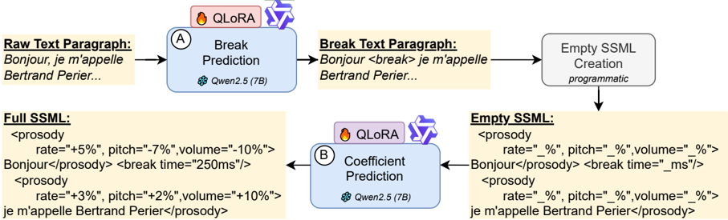

> [!abstract] workshop · 2025 · Workshop
> **Ould Ouali et al.** (École Polytechnique / Hi! PARIS) · [→ Paper](https://arxiv.org/abs/2508.17494) · Demo: ✓ · Code: ✓
>
> A cascaded two-stage LLM pipeline that automatically inserts SSML prosody tags into French text, raising MOS from 3.20 to 3.87 over a commercial TTS baseline by disentangling phrase-break prediction from prosodic parameter regression.

## Problem

Commercial TTS systems optimise for intelligibility at the expense of prosodic variation, producing speech that sounds monotonous and unexpressive. French is a particularly under-served language: its prosodic features — phrase-final intonation rises, elisions, liaisons — are complex enough that naively applying English-centric prosody models yields poor results. Prior approaches either relied on partial manual SSML annotation that does not scale, or used LLMs prompted directly to generate markup. Those prompt-only methods systematically under-generate `<break>` and `<prosody>` tags, produce syntactically invalid SSML, and lack precise numerical control over prosodic parameters — all of which prevent reliable deployment with commercial TTS engines.

## Method

The pipeline operates in two stages. First, natural French speech is force-aligned to transcripts using Whisper Timestamped with voice activity detection, then segmented into prosodic syntagms via acoustic pause and punctuation detection. Each syntagm is annotated with four prosodic features — median pitch (expressed as a semitone offset converted to percentage), volume (LUFS-derived gain), speaking rate (words per second delta), and inter-syntagm break duration — normalised relative to a Microsoft Azure Henri baseline voice to produce relative delta values suitable for SSML encoding.

The second stage is a cascaded fine-tuning architecture using two QLoRA-adapted Qwen 2.5-7B models (4-bit quantisation, rank 8). QwenA is trained for structural prediction: given a French paragraph, it inserts `<break>` tags at linguistically appropriate positions, producing a syntactically valid SSML skeleton. QwenB then replaces the empty `<prosody>` placeholders with fully specified numerical attributes for pitch, rate, volume, and break duration. Loss for QwenB is computed on the numeric tokens only, so the adapter's capacity is focused entirely on the prosodic regression task. Targets are standardised to unit variance during training and rescaled at inference to stabilise gradients.

This disentanglement — structure first, values second — is the paper's core architectural contribution. It sidesteps the failure mode of joint generation where a model's token budget gets consumed by categorical text rather than numerical precision.

## Key Results

QwenA achieves 99.24% F1 for break tag placement and perplexity 1.001, compared to 92.06% F1 for fine-tuned BERT (Table 4). QwenB achieves MAE of 0.97% for pitch, 1.09% for volume, 1.10% for rate, and 132.9 ms for break timing — reducing error by 25–40% relative to the best few-shot LLM baseline (Qwen3-32B few-shot, Table 5).

Perceptual evaluation (18 listeners, 30 one-minute pairs each) shows MOS rising from 3.20 (Azure Henri baseline) to 3.87 with SSML enhancement (p < 0.005), a 20% improvement. 15 of 18 listeners preferred the enhanced version in over half of comparisons; 7 preferred it in more than 75% of comparisons (§5.1).

The LLM benchmarking (§5.3, Table 3) finds that all zero-shot and few-shot prompted models consistently under-generate break and prosody tags relative to the gold standard. Few-shot prompting improves numerical accuracy but can cause unexpected structural collapses (Llama 3's prosody tagging nearly disappears in few-shot mode).

> [!note]
> Training and evaluation use the same 14-hour proprietary corpus. Held-out test sets are subsets of this corpus, so the MOS improvement reflects gains within the same speaker and domain distribution; cross-domain or cross-engine generalisation is not demonstrated.

## Novelty Assessment

The pipeline's primary contribution is the two-stage disentanglement: separating structural prediction (QwenA) from numerical regression (QwenB) addresses a concrete failure mode of joint LLM SSML generation. This is an architectural choice within a fine-tuning framework, not a new model family. The preprocessing pipeline — force alignment, syntagm segmentation, relative prosodic normalisation — is assembled from established components (Whisper, Demucs, Praat). The novelty is in the end-to-end integration targeting French specifically, and in demonstrating that task decomposition substantially outperforms both prompted LLMs and recurrent baselines on SSML generation. For a workshop paper, the empirical rigour is solid: the BERT and BiLSTM baselines replicate prior work, and the LLM benchmarking is comprehensive across seven models.

## Field Significance

Moderate — This paper addresses an often-overlooked practical pathway for expressiveness: augmenting commercial TTS engines via markup rather than retraining them. The finding that prompt-only LLMs systematically fail at SSML structure generation is a useful diagnostic for practitioners. The cascaded fine-tuning approach is a transferable pattern for other markup-controlled generation tasks, though the evaluation remains confined to a single French corpus and a single TTS engine voice.

## Claims

- Cascaded task decomposition — separating structural tag prediction from numerical parameter regression — substantially outperforms joint LLM generation for SSML-based prosody control. *(§4.4, §5.4, Table 4, Table 5)*
- Prompt-only LLMs (zero-shot and few-shot) systematically under-generate prosodic markup tags relative to gold annotations, and this failure persists across architectures and scales. *(§5.3, Figure 3)*
- Prosody enhancement via SSML yields substantial perceptual gains over neutral commercial TTS voices, even when the underlying synthesiser is not retrained. *(§5.1)*
- French TTS prosody normalised relative to a synthetic baseline captures linguistically meaningful patterns — phrase-final pitch rises, deliberate pacing — without requiring manual annotation. *(§3, Appendix A)*

## Limitations and Open Questions

> [!warning]
> The entire pipeline is calibrated and evaluated against a single commercial TTS voice (Azure Henri, fr-FR). SSML tag semantics — the acoustic realisation of percentage pitch and rate adjustments — are implementation-dependent and voice-dependent. Transfer to any other engine or voice requires voice-specific recalibration, limiting the method's out-of-the-box generalisability.

The dataset is 14 hours of proprietary French podcasts; generalisation to other French domains, other speech styles (spontaneous, informal, unpunctuated text), or other languages is unvalidated. The paper's pipeline assumes that punctuation and syntactic cues reliably predict prosodic boundaries — an assumption that breaks down for social media text or transcribed spontaneous speech. Fine-tuning each Qwen 2.5-7B stage requires approximately 15 GB of GPU memory at 4-bit quantisation, which constrains deployment in low-resource settings. The perceptual test involved 18 listeners, a sample size sufficient for statistical significance but small for robust effect-size estimation across listener backgrounds.

An open question is whether a single end-to-end model trained with a combined structural and regression loss could match or exceed the two-stage pipeline — the authors note this as future work.

## Wiki Connections

Concept pages: [[prosody-control]] · [[instruction-conditioned-tts]] · [[multilingual-tts]] · [[evaluation-metrics]] · [[subjective-evaluation]]
