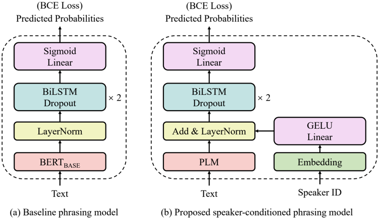

> [!abstract] arXiv · 2025 · Preprint
> **Dong Yang et al.** (The University of Tokyo) · [→ Paper](https://arxiv.org/abs/2509.00675) · Demo: ✓ · Code: ?
>
> Speaker-conditioned phrase break prediction for multi-speaker TTS, incorporating speaker embeddings and phoneme-level pre-trained language models into the TTS front-end to improve respiratory pause insertion accuracy.

## Problem

Phrase break prediction — deciding where to insert respiratory pauses (RPs) in TTS output — is typically handled by a front-end model that ignores speaker identity. This treats individual phrasing styles as noise and forces the model to learn an average behavior across speakers, capping its accuracy. Separately, mainstream pre-trained language models (PLMs) such as BERT operate at the subword level, but RP insertion is fundamentally a spoken-language phenomenon linked to phoneme-level articulation. The gap between subword representations and the acoustic realities of pausing limits what text-level PLMs can contribute to phrasing tasks.

## Method

The proposed model extends a conventional encoder-decoder phrasing architecture (PLM encoder + BiLSTM decoder) by inserting a speaker embedding layer between the two components. A fixed-length speaker embedding is linearly projected to match the PLM output dimension and injected via a GELU activation before the decoder processes the sequence. The decoder consists of two BiLSTM layers followed by a sigmoid output predicting RP probability at each word boundary.

For seen speakers, the speaker embedding layer can be randomly initialized (Xavier) and trained end-to-end, or pre-initialised with utterance-averaged embeddings from a pre-trained speaker verification model (PSVM) — specifically ECAPA-TDNN, ResNet-TDNN, SpeakerNet, or TitaNet-LARGE. For unseen speakers at inference, the paper proposes a lightweight embedding adapter: a two-linear-layer network trained to map PSVM embeddings from the seen-speaker space to the adapted embedding space used by phrasing models with trainable layers, enabling few-shot adaptation with as few as 5–10 reference utterances per unseen speaker without any fine-tuning of the phrasing model itself.

On the PLM side, the paper experiments with both subword-level models (BERT, XLNet, RoBERTa, ALBERT, DeBERTaV3 in BASE and LARGE variants) and phoneme-level models: Mixed-Phoneme BERT (MP BERT), which introduces sup-phoneme auxiliary tokens aligned with phoneme tokens, and Phoneme-Level BERT (PL BERT), which uses a phoneme-to-grapheme pre-training objective. Models are trained on a phrasing dataset constructed from LibriTTS-R using Montreal Forced Aligner to detect pauses, with binary cross-entropy loss and a two-stage training schedule (PLM frozen then unfrozen). The primary evaluation metric is F0.5, which weights precision over recall reflecting the preference to omit rather than misplace RPs.

## Key Results

For seen speakers, the baseline BERT-BASE phrasing model achieves F0.5 = 0.3719. Adding speaker embeddings (Xavier initialized, trainable) raises this to 0.4755 — a substantial jump. Phoneme-level PLMs push further: MP BERT achieves F0.5 = 0.4991, outperforming all subword-level PLMs including RoBERTa-LARGE (0.4865) despite using only a BASE-scale architecture. Subjective MOS scores with Matcha-TTS as the synthesis backbone rise from 3.35 (baseline) to 3.51 (MP BERT + speaker embedding), with the MP BERT model the only variant achieving statistical significance over the baseline (Table 5).

For unseen speakers with few-shot adaptation, the baseline achieves F0.5 = 0.3188. The best proposed model with 40 reference utterances and trainable embeddings + adapter (BERT-BASE + ResNet-TDNN) reaches 0.4041, substantially above baseline. MOS with VITS rises from 3.02 (baseline) to 3.14–3.19 across proposed configurations. Notably, MP BERT-based proposed models achieve competitive or higher MOS than BERT-BASE counterparts for unseen speakers despite lower F0.5 scores, suggesting MP BERT's pause placement better aligns with human naturalness preferences even when it underfits the aggregate distribution (Table 8).

Scaling subword PLMs from BASE to LARGE yields only modest F0.5 gains (~0.01–0.009) despite tripling parameter count, suggesting that subword representations approach a ceiling for this task (Table 4, §5.1.3).

## Novelty Assessment

The core ideas — speaker-conditioned front-end and phoneme-level PLM for phrasing — are well-motivated extensions of existing techniques. Speaker embedding injection is standard practice in multi-speaker TTS back-ends, applied here for the first time to the phrasing front-end. The embedding adapter for unseen-speaker generalization is a lightweight, practically useful mechanism. The first application of phoneme-level PLMs (MP BERT, PL BERT) to a TTS front-end task is the most novel claim: the result that MP BERT outperforms all subword models with a smaller architecture is genuinely informative. The contribution is an architectural integration and empirical demonstration rather than a new paradigm; the phrasing model architecture itself (PLM + BiLSTM) is established.

## Field Significance

Moderate — This paper contributes evidence that speaker identity is a meaningful signal for TTS prosody prediction at the front-end level, complementing its established role in acoustic models. The application of phoneme-level PLMs to front-end tasks opens a practical path to closing the gap between text-level phrasing models and the acoustic nature of pause insertion, offering a concrete and replicable recipe.

## Claims

- Speaker-specific phrasing behaviour is a substantive source of variance in RP insertion that generic multi-speaker models fail to capture, and modeling it explicitly improves both objective and subjective phrasing quality. *(§5.1.2, Table 3, Table 5)*
- Phoneme-level language models outperform subword-level models on phrase break prediction, even at smaller model sizes, because phoneme representations carry acoustic information more directly relevant to pause insertion than subword tokens. *(§5.1.3, Table 4)*
- Scaling subword PLMs from BASE to LARGE yields diminishing returns for phrasing tasks, suggesting a representational ceiling specific to this task modality. *(§5.1.3, Table 4)*
- Pre-trained speaker verification embeddings capture prosodic and fluency-related characteristics that transfer to phrasing models via few-shot adaptation without fine-tuning, enabling reasonable generalization to unseen speakers. *(§5.2.2, Table 7)*
- F0.5 score and naturalness MOS can diverge for phrasing models using different PLMs, indicating that objective phrasing accuracy does not fully predict perceived speech naturalness. *(§5.2.3, Table 8)*

## Limitations and Open Questions

> [!warning]
> Training data is exclusively from LibriTTS-R audiobook readings. The resulting phrasing models are likely miscalibrated for spontaneous speech, conversational TTS, or out-of-domain styles; generalization is explicitly flagged by the authors as an open problem.

Additional limitations: the paper cannot disentangle the contributions of phoneme vs. subword information within phoneme-level PLMs (since their pre-training also includes grapheme-level objectives), leaving the mechanism of improvement partially unclear. The embedding adapter for unseen speakers assumes that the mapping from PSVM embeddings to trained embeddings is approximately injective and learnable with a small network — this assumption may not hold for speakers whose acoustic characteristics fall outside the training distribution.

## Wiki Connections

Core concepts: [[prosody-control]], [[speaker-adaptation]], [[self-supervised-speech]], [[subjective-evaluation]]
