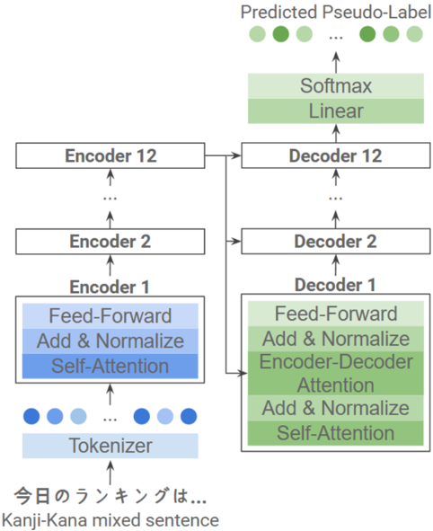

> [!abstract] arXiv · 2025 · Preprint
> **Park et al.** (The University of Tokyo) · [→ Paper](https://arxiv.org/abs/2509.01391) · Demo: ? · Code: ?
>
> A G2P-free Japanese TTS pipeline that replaces grapheme-to-phoneme conversion with SSL-derived discrete tokens and a T5-based pseudo-language label predictor, achieving comparable naturalness to a conventional G2P baseline.

## Problem

Constructing TTS systems for languages with complex orthography — particularly Japanese, where texts mix kanji and kana — requires extensive language-specific resources: pronunciation dictionaries, morphological analysers, accent dictionaries, and labelled phoneme-aligned corpora. These resources are costly to build and fundamentally language-specific, making them a bottleneck for extending synthesis to low-resource or multilingual settings. Existing multilingual G2P models address breadth but remain text-centric and cannot capture the paralinguistic features (accent, prosody, duration) that are embedded in raw speech signals.

## Method

The system follows a three-stage pipeline. First, an SSL encoder (a HuBERT-family model fine-tuned on Japanese speech with ContentVec for speaker disentanglement) maps raw audio to a sequence of 500 discrete tokens via k-means clustering, producing what the paper calls pseudo-language labels. Second, a T5 encoder-decoder (12 encoder and 12 decoder layers, pre-trained on ReazonSpeech and fine-tuned on five Japanese TTS corpora with a Japanese BERT tokenizer) learns to predict this discrete token sequence directly from raw mixed-script text. Third, the predicted token sequences are fed into FastSpeech 2 as input representations in place of phonemes, and FastSpeech 2 predicts mel-spectrograms which are converted to waveforms by a vocoder.

Two control conditions bracket the proposed method: a conventional G2P baseline using OpenJTalk, Mecab, and Marine with full phoneme, duration, and accent labels; and an oracle that feeds SSL-derived labels from the ground-truth audio directly to FastSpeech 2, bypassing the text-based predictor entirely. The oracle establishes an upper bound for the label predictor's contribution.

## Key Results

On 100 held-out JVS utterances, the proposed system reaches UTMOS 2.54 versus 2.59 for the G2P baseline and 2.49 for the oracle (Table 2). The unit error rate (UER) between predicted and oracle pseudo-language labels is 7.47%, while CER for synthesized speech is 21.28% (proposed), 20.63% (oracle), and 18.24% (baseline). WARP-Q acoustic quality for the proposed method (2.63) is comparable to the oracle (2.64) and above the baseline (2.47), suggesting the SSL-based pipeline does not introduce significant acoustic degradation relative to the G2P approach.

The naturalness gap between proposed and baseline (UTMOS 2.54 vs. 2.59) is small but consistent. The authors attribute most of this gap to the spectral predictor (FastSpeech 2) rather than to the label predictor, citing the oracle result as evidence — the oracle's UTMOS is actually lower than the proposed, which is counter-intuitive and warrants caution in interpretation.

> [!note]
> The oracle UTMOS (2.49) being lower than the proposed (2.54) is unexpected; the authors suggest this reflects FastSpeech 2's behaviour with SSL-derived labels rather than quality of the labels themselves. This limits the reliability of the oracle as a ceiling estimate.

## Novelty Assessment

The contribution is engineering integration: the GSLM framework, ContentVec, T5, and FastSpeech 2 are all established components assembled into a G2P-free pipeline for Japanese mixed-script TTS. The pseudo-language label predictor as a learned text-to-SSL-token mapper is a sensible and practically motivated design, but the underlying idea of replacing phonemes with SSL discrete tokens predates this work (GSLM, SoundStorm, and related systems). The Japanese-specific aspects — handling kanji-kana mixing — are the clearest domain contribution. The evaluation is limited to a single language, a single speaker style domain, and automatic metrics (UTMOS, CER, WARP-Q, SDR); no subjective listening tests are reported.

## Field Significance

Low — This paper provides proof-of-concept evidence that SSL-derived discrete tokens can substitute G2P-derived phonemes in a Japanese TTS pipeline without a substantial naturalness penalty. The contribution is primarily an engineering integration applied to the mixed-script Japanese case. It confirms the viability of G2P-free synthesis for morphologically complex languages but does not advance the state of the art architecturally or empirically.

## Claims

- SSL-derived discrete tokens can substitute phoneme sequences as input representations in a TTS front-end without a substantial naturalness penalty in automatic evaluation. *(§V.B, Table II)*
- G2P-free TTS pipelines that learn text-to-token mappings from paired speech data avoid the language-specific resource burden of phoneme dictionaries and morphological analysers. *(§I, §III)*
- In an SSL-token-based TTS pipeline, the spectral predictor contributes more to naturalness differences than the text-to-token mapping stage. *(§V.B, Table II)*
- SSL-based speech representations preserve sufficient acoustic quality through a discretise-then-synthesise pipeline to remain competitive with G2P-derived representations on codec-style quality metrics. *(§V.C, Table II)*

## Limitations and Open Questions

> [!warning]
> All evaluations use automatic metrics only (UTMOS, CER, WARP-Q, SDR) on 100 utterances from a single speaker subset of JVS. No subjective MOS or preference tests are reported; the conclusions about naturalness parity are therefore tentative.

The system is demonstrated exclusively on Japanese and does not yet extend to multilingual settings. The T5 tokenizer is language-specific (tohoku-BERTv3), which the authors acknowledge as a barrier to multilingual scalability. Future directions involve BPE tokenizers (mT5, ByT5) to reduce this dependency. The oracle's counter-intuitive lower UTMOS than the proposed system is left unexplained and may indicate an interaction between SSL token sequence statistics and FastSpeech 2's duration predictor. Individual contribution analysis of duration, pitch, and accent inputs to FastSpeech 2 is identified as missing.

## Wiki Connections

Concept pages most relevant to this paper:
- [[self-supervised-speech]] — the SSL encoder (ContentVec) is the core representation backbone
- [[multilingual-tts]] — G2P-free approach motivated by mixed-script and multilingual challenges
- [[prosody-control]] — pseudo-language labels carry accent and intonation as implicit paralinguistic features
- [[transformer-enc-dec-tts]] — FastSpeech 2 serves as the spectral predictor
- [[evaluation-metrics]] — UTMOS, CER, WARP-Q, and SDR used in lieu of subjective evaluation
