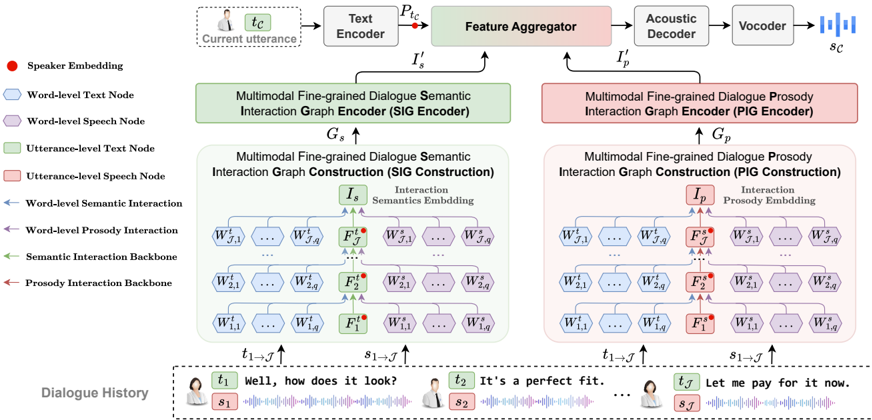

> [!abstract] EMNLP · 2025 · Conference
> **Jia et al.** · [→ Paper](https://arxiv.org/abs/2509.06074) · Demo: ✓ · Code: ✓
>
> MFCIG-CSS introduces two word-level interaction graph modules that encode how fine-grained semantics and prosody in dialogue history influence subsequent utterances, improving prosodic expressiveness in conversational speech synthesis over utterance-level baselines.

## Problem

Conversational speech synthesis (CSS) systems must generate speech whose prosody reflects the dynamics of an ongoing dialogue, not just the content of the current utterance. Prior approaches encode dialogue history at the utterance level, with coarse-grained context encoders or heterogeneous graph models operating on utterance-level representations. These methods overlook the influence of individual word-level semantics and prosody on subsequent utterances: the same general topic spoken with different key words, and with different prosodic coloring, warrants different responses in both content and delivery. Without modeling fine-grained word-level interactions across turns, CSS systems lack the resolution to accurately capture prosodic variation inherent in natural conversation.

## Method

MFCIG-CSS (Multimodal Fine-grained Context Interaction Graph CSS) is built from three components: a Semantic Interaction Graph (SIG), a Prosody Interaction Graph (PIG), and a FastSpeech 2-based speech synthesizer. Both graphs share a SAGEConv-based encoder architecture but are designed to encode different interaction targets from the multimodal dialogue history (MDH).

The SIG captures how word-level text semantics and word-level prosody in dialogue history influence the utterance-level semantics of subsequent utterances. Node features are initialized using TOD-BERT for word-level text, SentenceBERT for utterance-level text, and Wav2Vec 2.0 (with Montreal Forced Alignment providing word-boundary segments) for word-level speech prosody. The graph propagates these features sequentially across dialogue turns via SAGEConv message passing, aggregating into a final semantic interaction feature vector.

The PIG mirrors the SIG structure but targets prosodic interactions: it encodes how word-level semantics and prosody in dialogue history influence the prosody of subsequent turns. Wav2Vec 2.0 fine-tuned on IEMOCAP provides utterance-level speech representations for PIG nodes. Both graphs add a special aggregation node at the end of their backbone branch to integrate interaction features across the full MDH.

The resulting semantic and prosodic interaction feature vectors from SIG and PIG are injected into the speech synthesizer's feature aggregator, following the I3-CSS synthesizer design, to condition FastSpeech 2's output. All feature dimensions are set to 256, with speaker embeddings also at 256. The system is trained for 400k steps with batch size 16 on a single A800 GPU using the standard FastSpeech 2 reconstruction loss.

## Key Results

On DailyTalk, MFCIG-CSS outperforms seven CSS baselines across most metrics. Subjectively, it achieves N-DMOS (naturalness) of 3.980 and P-DMOS (prosody quality) of 3.899, improving by 0.122 and 0.104 over the best prior model (I3-CSS). Objectively, MAE-P (pitch error) of 0.439 and MCD of 9.53 also surpass all baselines. The one exception is MAE-E (energy error) at 0.314, where MFCIG-CSS ranks second to MSRGCN-CSS (0.310) by a margin of 0.004.

Ablation results confirm the contribution of each module. Removing SIG alone reduces N-DMOS by 0.147 and P-DMOS by 0.106; removing PIG alone yields comparable drops with especially large degradation in prosody metrics. Removing both graph modules degrades performance dramatically, with pitch MAE rising from 0.439 to 0.681 and MCD worsening by 2.78, confirming that the two interaction graphs together are responsible for the bulk of the system's prosodic capability.

## Novelty Assessment

The core novelty is the construction of two dedicated graph modules (SIG and PIG) that jointly encode word-level text and prosody interactions across dialogue history, at finer granularity than all seven compared baselines. The graph encoding (SAGEConv), prosody feature extraction (Wav2Vec 2.0), and speech synthesizer (FastSpeech 2 via I3-CSS) are all established components; the contribution lies in the specific graph construction design and the dual-graph conditioning architecture for dialogue-aware prosody. Evaluation is limited to a single English dataset (~20 hours) under a FastSpeech 2 backbone, so the generalization claim is constrained. The ablation study is thorough and supports the component contributions cleanly.

## Field Significance

Moderate — MFCIG-CSS provides direct empirical evidence that word-level graph modeling of multimodal dialogue history yields measurable prosodic gains over utterance-level CSS approaches, contributing a concrete architectural direction for fine-grained conversational prosody modeling. The result is bounded by the single-dataset, single-backbone evaluation; whether the same gains hold for autoregressive codec-based or VITS-style synthesizers remains untested.

## Claims

- **supports:** Word-level semantic and prosodic context modeling in dialogue history improves prosody expressiveness in conversational TTS over utterance-level context encoders.
  > *Evidence:* MFCIG-CSS achieves N-DMOS 3.980 and P-DMOS 3.899 on DailyTalk, outperforming seven baselines that operate at the utterance level by 0.122 and 0.104 respectively; ablation removing both graph modules causes the largest performance collapse across all metrics. *(§3.5, Table 1; §3.6, Table 2)*

- **supports:** Graph neural networks with sequential cross-turn aggregation can encode complementary semantic and prosodic interaction patterns from multimodal dialogue history for prosody-aware TTS.
  > *Evidence:* SIG and PIG are independently ablated: removing SIG reduces N-DMOS by 0.147 and P-DMOS by 0.106; removing PIG produces comparable drops. Both modules contribute distinctly and their combined use provides the strongest performance. *(§3.6, Table 2)*

- **complicates:** Objective energy error and subjective prosody quality metrics can rank conversational TTS systems differently.
  > *Evidence:* MFCIG-CSS achieves best N-DMOS (3.980) and P-DMOS (3.899) on DailyTalk but ranks second on MAE-E (0.314 vs. 0.310 for MSRGCN-CSS), indicating that signal-level energy accuracy does not fully predict human prosody quality judgments. *(§3.5, Table 1)*

- **complicates:** Prosody modeling gains demonstrated with acoustic-feature-based TTS backbones may not transfer to codec-token-based or flow-based architectures.
  > *Evidence:* MFCIG-CSS is validated only on a FastSpeech 2 backbone; the authors explicitly identify extension to VITS-based architectures and discrete token-based speech encoders as future work, acknowledging that the current validation scope limits generalizability claims. *(§5 Limitations)*

## Limitations and Open Questions

MFCIG-CSS is evaluated on a single English dialogue dataset (DailyTalk, approximately 20 hours) with a FastSpeech 2 backbone, leaving generalization to other languages, longer conversations, noisy conditions, and modern autoregressive or codec-based TTS systems untested. The interaction graphs operate on frame-averaged acoustic features from Wav2Vec 2.0 and do not yet model fine-grained intra-word acoustic cues such as emotion, emphasis, or pauses. Extension to VITS-based architectures and discrete token-based speech encoders is the primary open direction identified by the authors.

## Wiki Connections

- [[prosody-control|Prosody Control]] — MFCIG-CSS introduces word-level graph modules that derive prosody conditioning signals from multimodal dialogue history, extending prosody control to conversational interaction dynamics across turns.
- [[transformer-enc-dec-tts|Transformer Encoder-Decoder TTS]] — the speech synthesizer reuses the FastSpeech 2 encoder-decoder architecture as its backbone, augmented by the SIG and PIG context modules.
- [[self-supervised-speech|Self-Supervised Speech]] — Wav2Vec 2.0 (and Wav2Vec 2.0 fine-tuned on IEMOCAP) serve as core components for word-level and utterance-level prosody feature extraction within both interaction graph modules.
- [[subjective-evaluation|Subjective Evaluation]] — primary quality assessment uses Dialogue-level MOS scores (N-DMOS for naturalness, P-DMOS for prosody) collected from 20 trained human raters with certified English proficiency.
