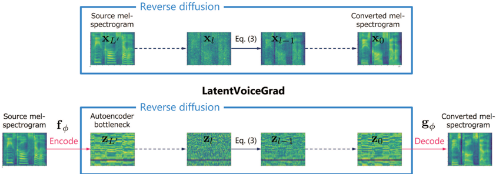

> [!abstract] arXiv · 2025 · Preprint
> **Kameoka et al.** · [→ Paper](https://arxiv.org/abs/2509.08379) · Demo: ✓ · Code: ?
>
> LatentVoiceGrad improves non-parallel zero-shot voice conversion over the authors' prior VoiceGrad system by moving the iterative conversion process from the mel-spectrogram domain into the lower-dimensional bottleneck of an adversarially trained autoencoder, and by substituting or supplementing diffusion with flow matching to reduce the required number of inference steps.

## Problem

VoiceGrad, the authors' prior score-based VC method, performs iterative mel-spectrogram conversion through the reverse diffusion process of a diffusion probabilistic model (DPM). This approach faces two interconnected limitations: the high dimensionality of mel-spectrograms makes score function prediction difficult, degrading audio quality; and the iterative nature of the process is slower than many modern VC approaches that operate at very high speeds. The core challenge is to improve both audio quality and inference speed without abandoning the flexibility that score-based generative models provide, particularly the ability to steer conversion via independently pretrained classifiers or conditioning signals during inference.

## Method

LatentVoiceGrad compresses mel-spectrograms into a low-dimensional bottleneck before applying iterative generation. A speaker-independent undercomplete autoencoder (bottleneck dimension 32, versus 80 for mel-spectrograms) handles this compression. The autoencoder is trained with a combined objective: L1 reconstruction loss, KL divergence to regularise the bottleneck to zero-mean unit variance, mel-spectrogram loss, feature matching loss, and an adversarial loss using HiFi-GAN's multi-period and multi-scale discriminators. The adversarial training encourages the autoencoder to produce mel-spectrograms from which a pretrained, frozen HiFi-GAN vocoder can generate realistic waveforms. Ablation confirms that the adversarial loss is critical: removing it drops pMOS from 3.93 to 3.78 and SECS from 0.844 to 0.829.

Once the autoencoder is trained, either a score network (DPM variant) or a vector field network (FM variant) operates on the bottleneck features. Both networks share the same 1D U-Net convolutional architecture as the original VoiceGrad score network, conditioned on speaker embedding (GE2E), timestep, and phoneme embedding sequence from a separately pretrained ASR encoder. GE2E speaker embeddings allow zero-shot any-to-any conversion: neither source nor target speaker appears in training.

The paper evaluates four variants: VoiceGrad-DPM (baseline), LatentVoiceGrad-DPM, VoiceGrad-FM, and LatentVoiceGrad-FM. For the FM variants, the ODE is initialised by mixing the encoded source features with Gaussian noise at ratio r (r = 0.7 found optimal), and Euler's method solves the ODE. All models are trained on 100 VCTK speakers using Adam with learning rate 0.0002 for 1000 epochs on a single Tesla V100 GPU. Training takes approximately 3 days for LatentVoiceGrad versus 5 days for VoiceGrad.

## Key Results

In objective evaluation on VCTK zero-shot any-to-any VC, LatentVoiceGrad-DPM achieves pMOS 3.93 and SECS 0.844, versus 3.86 and 0.830 for VoiceGrad-DPM. FACodec and Diff-VC score lower on pMOS (3.71 and 3.67 respectively), with Diff-VC showing substantially higher CER (8.2 vs. 2.99 for LatentVoiceGrad-DPM). Subjective listening tests (12 listeners) confirm the trend: LatentVoiceGrad-FM achieves qMOS 4.16 (±0.09) versus VoiceGrad-DPM 3.83 (±0.07) and Diff-VC 3.56 (±0.13), with ground truth at 4.21 (±0.19). sMOS for LatentVoiceGrad-DPM is 3.05 (±0.15), substantially above VoiceGrad-DPM (2.63) and Diff-VC (2.74).

On inference speed (GPU RTF), LatentVoiceGrad-DPM is 1.3x faster than VoiceGrad-DPM (0.034 vs. 0.045). The FM variant can operate effectively with as few as 3-5 Euler steps: VoiceGrad-FM at L=3 achieves GPU RTF 0.007 (about 6x faster than DPM) with comparable pMOS (3.85 vs. 3.86). In a cross-dataset scenario (VCTK source, LibriTTS target), LatentVoiceGrad maintains nearly the same pMOS and CER as in the within-dataset setting, while Diff-VC and FACodec degrade slightly. Discrete acoustic token (DAT) representations from DAC perform substantially worse than mel-spectrograms in both methods, with VoiceGrad-DAT reaching only pMOS 2.41 and LatentVoiceGrad-DAT showing CER 9.08 versus 2.99 for the mel-spectrogram variant.

## Novelty Assessment

The contribution is a well-motivated but incremental application of established techniques. Latent diffusion for image synthesis was introduced by Rombach et al. (2022) and flow matching by Lipman et al. (2023); this work adapts both to the VoiceGrad VC framework, which is the same authors' prior work. The combination is natural: compressing mel-spectrograms before iterative generation reduces both dimensionality and difficulty of score or flow prediction, consistent with how latent diffusion improved image generation. The adversarial autoencoder training (borrowed from HiFi-GAN's discriminator setup) is a practical engineering choice rather than a novel contribution. The empirical evaluation is thorough, covering four system variants, an ablation on adversarial training, sweeps over FM hyperparameters (r and L), cross-dataset evaluation, and comparisons across three input feature types, but the listening test involves only 12 listeners and does not include FACodec.

## Field Significance

Moderate — LatentVoiceGrad provides a principled extension of score-based VC to latent space, demonstrating that audio quality and speed improvements from latent diffusion transfer to the VC domain. The paper primarily consolidates two known improvements (latent compression, flow matching) into an existing framework and is useful evidence that latent-domain generative models are viable for mel-spectrogram-based VC and that flow matching's fewer-step advantage holds in this application.

## Claims

- **supports:** Operating diffusion and flow-matching models in a compressed latent representation improves audio quality and inference speed in non-parallel voice conversion compared to operating directly on mel-spectrograms.
  > *Evidence:* LatentVoiceGrad-DPM outperforms VoiceGrad-DPM in pMOS (3.93 vs. 3.86), subjective qMOS (4.09 vs. 3.83), sMOS (3.05 vs. 2.63), and GPU RTF (0.034 vs. 0.045) on VCTK zero-shot any-to-any conversion. *(§III.A, §IV.H, Table IV, Table X)*

- **supports:** Flow matching achieves comparable voice conversion quality to diffusion models with substantially fewer inference steps.
  > *Evidence:* VoiceGrad-FM with L=3 Euler steps achieves pMOS 3.85 (versus 3.86 for VoiceGrad-DPM at L=20), at GPU RTF 0.007 versus 0.045, a six-fold speedup with no quality penalty. *(§IV.G, §IV.J, Tables VII, IX)*

- **supports:** Adversarial autoencoder training substantially improves audio quality and speaker similarity in latent-domain voice conversion compared to reconstruction-only training.
  > *Evidence:* Adding adversarial loss during autoencoder training improves pMOS from 3.78 to 3.93 and SECS from 0.829 to 0.844 on VCTK zero-shot VC with the DPM generative model. *(§IV.F, Table V)*

- **complicates:** Discrete acoustic token sequences from neural audio codecs underperform continuous spectral representations as the conversion domain for iterative generative voice conversion models.
  > *Evidence:* VoiceGrad with DAT features (DAC codec, dimensionality 1024) achieves pMOS 2.41 versus 3.86 for mel-spectrograms; LatentVoiceGrad-DAT shows CER 9.08 versus 2.99 for the mel-spectrogram variant, suggesting the combination of high-dimensional discrete tokens and score-based conversion is not yet effective. *(§IV.E, Tables II, III)*

- **refines:** The noise injection ratio at the initial point of the ODE in flow-matching voice conversion controls a three-way trade-off between audio quality, intelligibility, and speaker similarity.
  > *Evidence:* Systematic sweeps of r from 0 to 1 in VoiceGrad-FM and LatentVoiceGrad-FM show that increasing r raises SECS but degrades CER, with pMOS peaking around r=0.4-0.6; r=0.7 provides a practical balance across all three metrics. *(§IV.G, Table VI)*

## Limitations and Open Questions

Only objective metrics are reported for most ablations; the subjective listening test covers only 12 listeners and does not include FACodec as a comparison. The DAT evaluation is acknowledged as potentially sub-optimal due to untuned hyperparameters, so the conclusion that discrete tokens are unsuitable for this framework remains tentative. The model is evaluated on English speech only (VCTK and LibriTTS), and generalisation to other languages or noisy conditions is untested. The phoneme encoder relies on a supervised ASR model trained on English data, which ties the system to English without further adaptation.

## Wiki Connections

- [[voice-conversion|Voice Conversion]] — LatentVoiceGrad directly addresses non-parallel any-to-any VC, proposing latent-space and flow-matching improvements over prior score-based VC systems.
- [[diffusion-tts|Diffusion TTS]] — the DPM variant applies reverse diffusion in a compressed autoencoder bottleneck, extending the core diffusion-based generative approach to VC in latent space.
- [[flow-matching|Flow Matching]] — LatentVoiceGrad-FM adopts conditional flow matching as an alternative to DPM, demonstrating its speed advantage in the VC domain with as few as 3 Euler steps.
- [[zero-shot-tts|Zero-Shot TTS]] — the system achieves any-to-any conversion for unseen speakers using GE2E speaker embeddings from a reference utterance, operating in the same zero-shot paradigm common in TTS.
- [[gan-vocoder|GAN Vocoder]] — HiFi-GAN serves both as the final waveform synthesizer and as a training signal for the adversarial autoencoder, with its multi-period and multi-scale discriminators guiding the autoencoder to produce vocoder-compatible mel-spectrograms.
