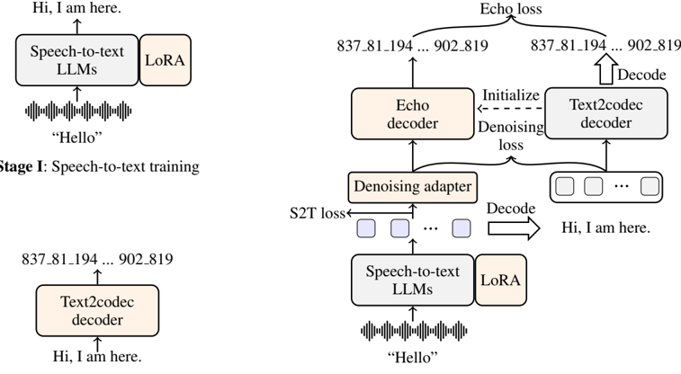

> [!abstract] arXiv · 2025 · Preprint
> **Zhang et al.** (The Chinese University of Hong Kong, Shenzhen) · [→ Paper](https://arxiv.org/abs/2509.09174) · Demo: ? · Code: ✓
>
> EchoX introduces Echo training, a three-stage framework that dynamically generates speech token targets from the LLM's own semantic hidden states rather than from annotated acoustic labels, mitigating the acoustic-semantic gap that causes knowledge degradation in speech-to-speech LLMs.

## Problem

Speech-to-speech LLMs built on top of text LLMs consistently degrade in knowledge and reasoning relative to their text-only counterparts. Prior work attributed this to the inherent acoustic-semantic conflict in speech codec representations, but EchoX identifies a more fundamental cause: the training objective itself is misaligned. Standard speech LLM training treats speech tokens as prediction targets, which penalises the model heavily for acoustically different but semantically equivalent responses. A model that produces the correct meaning with a different pronunciation incurs a large training loss, pushing internal representations toward acoustic fidelity at the expense of semantic coherence. Neither the interleaved approach (jointly predicting text and audio tokens) nor the text-to-codec (T2C) decoder approach fully resolves this mismatch.

## Method

EchoX proceeds through three training stages. In Stage I, a text LLM is converted into a speech-to-text (S2T) dialogue model by attaching an audio encoder with alignment and compression adapters (using the Soundwave framework). LoRA fine-tuning adapts the backbone to speech recognition and conversational speech data; no supervised fine-tuning is applied beyond that.

In Stage II, a separate text-to-codec (T2C) module is trained with a decoder-only transformer (6 layers, 512-dim hidden for the 3B variant; 8 layers, 768-dim for the 8B variant). Its input is text; its target is a sequence of speech tokens produced by passing text through the speech synthesis pipeline. The T2C module shares its embedding space with the S2T LLM to ensure representation consistency.

Stage III introduces Echo training, the paper's central contribution. Rather than requiring ground-truth audio annotations for the speech output, EchoX feeds the S2T LLM's intermediate hidden states (H) into an Echo decoder initialised from the T2C parameters. At each training step, the model performs a greedy decode of H to obtain a text sequence, passes that text through the frozen T2C module to obtain pseudo speech tokens (Y'), and trains the Echo decoder to predict Y'. A supplementary Denoising Adapter (feed-forward network) aligns H to the T2C embedding space via cosine similarity loss, reducing noise. A LoRA speech-to-text loss on ground-truth text labels is added in parallel. The full training objective is a weighted sum of these three terms.

Speech tokens use unit language rather than raw discrete units. HuBERT (11th layer) encodes input speech into continuous representations, which are assigned to k-means cluster centroids. A dynamic-programming segmentation then groups contiguous units into word-like tokens, achieving roughly 2x compression relative to raw units while maintaining synthesis quality and significantly improving recognition accuracy on generated audio (Table 5).

Streaming generation is handled by a cosine similarity trigger computed on the current semantic representation. A "write" operation (passing a segment to the Echo decoder) is initiated only when similarity exceeds a threshold and the current position is a local extremum within a sliding window. This avoids cutting segments mid-semantic unit. Training uses approximately 6,200 hours across all stages, with no target audio at Stage III (Table 1).

## Key Results

On three spoken QA benchmarks (Llama Questions, Web Questions, TriviaQA), EchoX-8B achieves 63.3/40.6/35.0 (avg 46.3) in speech-to-speech mode (Table 2). This is competitive with MinMo (47.2) and MiniCPM-o 2.6 (47.1) while substantially outperforming Moshi (28.1), Freeze-Omni (32.6), and GLM-4-Voice (39.5). EchoX-3B achieves 54.0/31.6/25.8 (avg 37.1), surpassing OmniDRCA-2B (31.8) and Freeze-Omni (32.6) with a smaller model.

The ablation in Table 4 isolates the training strategy effect. Interleaved training on the same data collapses to 12.8 avg, EchoX without Echo training reaches 24.3 avg, while Echo training brings the 3B model to 37.1 avg. This delta (from 24.3 to 37.1) represents the direct benefit of the pseudo-label approach over the standard T2C decoder.

In speech-to-text mode (Table 3), EchoX-3B (50.0 avg) and EchoX-8B (56.2 avg) are both competitive, with EchoX-3B exceeding LLaMA-Omni2-3B (no TriviaQA reported). The speech-to-text performance is generally higher than speech-to-speech, consistent with error introduced at the vocoder stage.

Streaming decoding (Table 6) imposes minimal accuracy degradation while reducing first-token latency from 138 tokens to 27 tokens for the 3B model. A side-by-side human evaluation (5 raters, 100 votes per comparison, Appendix C) shows EchoX wins on helpfulness against Freeze-Omni and LLaMA-Omni2, while naturalness remains competitive but not dominant, consistent with the lack of explicit acoustic-quality objectives in training.

## Novelty Assessment

Echo training is a conceptually clean and technically genuine contribution. The core insight that training targets should be derived from the model's own semantic representations rather than from acoustic ground truth directly addresses the identified failure mode. The Denoising Adapter and cosine-similarity loss are auxiliary engineering choices that support the main idea rather than contributing novel mechanisms in isolation.

The unit language component is adopted from prior work by the same group (Zhang et al., 2025b, arXiv 2505.15333) and is not a contribution of this paper. The streaming trigger is simple and engineering-level. The backbone (LLaMA) and the audio encoder (Soundwave) are off-the-shelf. The paper's evaluation is narrow: all benchmarks test factual QA, not dialogue fluency, emotional range, or speech naturalness; and the human evaluation involves only five raters on one dataset.

The data efficiency claim (6k hours vs. millions of hours for interleaved models) is real and practically significant, though exact comparisons vary by baseline.

## Field Significance

Moderate. EchoX addresses a structural training mismatch that affects all codec-based speech-to-speech LLMs. The Echo training paradigm demonstrates that generating dynamic pseudo-labels from the model's own semantic states is substantially more effective than standard T2C approaches at the same data scale, and dramatically more stable than interleaved token training. The contribution is primarily a training-recipe innovation rather than a new architecture; its impact on the broader field depends on whether the pseudo-label approach proves robust across tasks beyond factual QA.

## Claims

- **supports:** Decoupling semantic training objectives from acoustic token prediction substantially reduces knowledge degradation in speech-to-speech LLMs.
  > *Evidence:* EchoX's Echo training, which generates speech targets from the model's own semantic hidden states, raises average QA accuracy from 24.3 (T2C without Echo) to 37.1 (EchoX-3B) on the same data, compared to 12.8 for direct interleaved training. *(§5.1, Table 4)*

- **supports:** Unit-based speech token compression via language-model segmentation improves downstream accuracy and reduces sequence length without sacrificing audio quality.
  > *Evidence:* Unit language achieves 4.57 length ratio vs. 9.31 for raw units while improving accuracy on all three QA benchmarks and maintaining comparable audio quality in spectral comparison. *(§5.3, Table 5, Figure 7)*

- **supports:** Streaming inference in speech LLMs can be achieved with minimal accuracy degradation when the segmentation boundary is determined by semantic similarity rather than fixed length.
  > *Evidence:* EchoX's cosine-similarity trigger reduces first-token latency from 138 to 27 tokens at 3B scale with less than 1.5 percentage points of accuracy drop on any benchmark. *(§5.4, Table 6)*

- **complicates:** Training data efficiency in speech LLMs may depend more on the training paradigm than on data volume.
  > *Evidence:* EchoX achieves competitive performance on spoken QA against models trained on millions of hours using only approximately 6,200 hours, but this result holds specifically for factual QA and has not been tested on broader spoken dialogue tasks. *(§4.2, Table 2)*

- **complicates:** Speech naturalness and response helpfulness are not jointly optimised by the same training signal in speech-to-speech LLMs.
  > *Evidence:* Human evaluation shows EchoX wins clearly on helpfulness but performs only competitively on naturalness, reflecting a training objective focused on semantic correctness rather than prosodic quality. *(§Appendix C, Figure 8)*

## Limitations and Open Questions

> [!warning]
> Speech quality is assessed only via brief spectral comparison (Figure 7) and a 5-rater human study. No perceptual quality metric (MOS, DNSMOS) or automatic speech recognition accuracy on generated audio is reported as a primary evaluation result, making it difficult to characterise the system's output quality independently of QA accuracy.

The evaluation benchmarks are limited to factual knowledge QA (Llama Questions, Web Questions, TriviaQA). It is unclear whether Echo training retains its advantage on open-ended dialogue, instruction following, or longer-form conversational tasks. The human evaluation was conducted with only five raters on one dataset (AlpacaEval), which limits statistical confidence in the naturalness comparison. The model trains on synthesised assistant audio from GPT-SoVITS, which may introduce a fixed timbre bias and limit voice diversity. The streaming threshold and window size are fixed hyperparameters with no ablation reported on their sensitivity.

## Wiki Connections

- [[spoken-language-model|Spoken Language Model]] — EchoX proposes Echo training specifically to address knowledge degradation in spoken LLMs by aligning training targets with the model's own semantic representations.
- [[speech-to-speech|Speech-to-Speech]] — the full pipeline processes spoken input and generates spoken output, evaluated on spoken QA benchmarks.
- [[neural-codec|Neural Audio Codec]] — the paper replaces standard neural codec tokens with HuBERT-based unit language, arguing that acoustic-semantic alignment in the token space is a root cause of SLLM degradation.
- [[self-supervised-speech|Self-Supervised Speech]] — HuBERT (11th layer) is a core component used for speech unit extraction and the foundation for the unit language codec representation.
- [[streaming-tts|Streaming TTS]] — EchoX introduces a cosine-similarity trigger mechanism to enable streaming speech generation with minimal accuracy loss.
- [[autoregressive-codec-tts|Autoregressive Codec TTS]] — EchoX's Echo decoder generates speech tokens autoregressively from LLM hidden states, building on the T2C autoregressive paradigm.
- [[2410.00037|Moshi]] — compared as a primary interleaved-generation baseline; represents the competing training paradigm that EchoX outperforms on knowledge QA at smaller data scale.
- [[2411.00774|Freeze-Omni]] — compared as a T2C-based baseline; EchoX explicitly builds on and extends this T2C architecture by adding the Echo decoder.
- [[2412.02612|GLM-4-Voice]] — compared as an interleaved-approach baseline on spoken QA benchmarks.
- [[2506.23325|XY-Tokenizer]] — concurrent work addressing the same acoustic-semantic conflict in speech codecs from the token-design perspective rather than the training-strategy perspective.
- [[2505.03739|VITA-Audio]] — compared as a large-scale interleaved baseline; EchoX achieves near-comparable performance with far fewer training hours.
- [[2505.02625|LLaMA-Omni2]] — compared at both 3B and 7B scale on spoken QA benchmarks.
- [[2305.11000|SpeechGPT]] — cited as early prior work establishing the speech token LM paradigm that EchoX addresses.
- [[2501.06282|MinMo]] — compared as a high-performing T2C-based baseline; EchoX-8B approaches MinMo performance with a simpler training setup.
