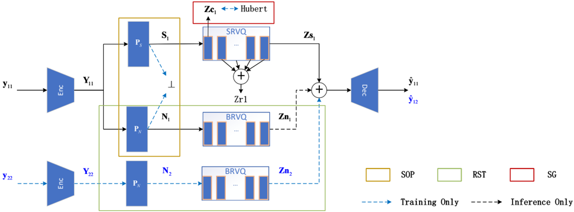

> [!abstract] arXiv · 2025 · Preprint
> **Luo et al.** (Jiutian AI Research Institute, China Mobile; Peking University) · [→ Paper](https://arxiv.org/abs/2509.09201) · Demo: ✓ · Code: ?
>
> DeCodec introduces subspace orthogonal projection and a representation swap training procedure to factorize mixed-audio codec representations into orthogonal speech and background sound subspaces, with semantic/paralinguistic further separated within speech, enabling controllable feature recombination for enhancement, voice conversion, and TTS without cascaded front-end separation.

## Problem

Existing neural codecs fall into two camps: universal codecs such as EnCodec and DAC preserve signal fidelity across audio types but treat all content as a single entangled representation; speech-specific codecs such as SpeechTokenizer and DualCodec disentangle semantic from paralinguistic information but only in clean-speech conditions. Neither approach handles the common real-world scenario where speech and background sound coexist in the same recording. The conventional solution (cascade a speech separation front-end before downstream processing) introduces error propagation from imperfect separation, requires downstream models to be fine-tuned on pre-processed audio, and scales poorly when multiple tasks require different feature access patterns.

## Method

DeCodec builds on the DAC encoder-decoder backbone (four convolutional encoder blocks with downsampling strides [2, 4, 5, 8] and corresponding decoder blocks) extended with three new components. The encoder processes a mixed-audio waveform into a continuous embedding, which feeds into the subspace orthogonal projection (SOP) module: two linear projection layers (P_S and P_N) that map the embedding into orthogonal subspaces for speech and background sound, respectively, enforced by a loss term that minimises the inner product between the two projected representations. After projection, parallel residual vector quantisers (SRVQ with 8 levels for speech, NRVQ with 8 levels for background sound) independently quantise each subspace at a combined 4.0+4.0 kbps. HuBERT-L9 representations of the corresponding clean speech provide semantic guidance (SG) on the first SRVQ layer, directing the quantiser to concentrate semantic content in Z_c and paralinguistic information in the remaining layers Z_r. This achieves a hierarchical decomposition: speech vs. background at the top level, and semantic vs. paralinguistic within speech.

The representation swap training (RST) procedure enforces genuine disentanglement by pairing two uncorrelated noisy samples, swapping their background representations, and training the decoder to reconstruct the hybrid mixture. The training loss combines the RST reconstruction term, the SG cosine-similarity term, the orthogonality constraint, multi-scale mel-spectral reconstruction loss, and GAN discriminator losses. At inference, any task can be achieved by selecting and recombining the appropriate quantised streams: replacing background sound with silence achieves speech enhancement; replacing paralinguistic tokens from a reference speaker achieves one-shot voice conversion; retaining or discarding background tokens in VALL-E-based TTS controls ambient sound preservation.

## Key Results

On codec reconstruction (Table 2), DeCodec achieves the highest SDR on both clean speech (7.61) and noisy speech (5.21), exceeding EnCodec (6.86 / 4.88) and DAC (0.6 / -1.62). Mel distance on clean speech is slightly behind DAC (0.89 vs. 0.65), which the authors attribute to the orthogonality and disentanglement constraints.

On speech enhancement against the DNS Challenge blind test (Table 3), DeCodec reaches DNSMOS OVL 3.39 (without reverb) and 3.13 (real recordings), surpassing all baselines including the diffusion-based StoRM and the Transformer-based SELM, with particular advantage in background suppression (BAK 4.13 vs. SELM 4.10).

For one-shot voice conversion on noisy speech (Table 4), DeCodec achieves speaker similarity of 0.83 and WER 50.46, matching StoRM+SpeechTokenizer (0.83 / 52.73) without requiring explicit denoising. The WER remains high due to voiced/unvoiced segment mismatches rather than content loss.

In downstream ASR (Table 6), using DeCodec features yields WER* 26.7 on noisy speech, compared to 59.2 for SpeechTokenizer and 34.5 for StoRM+SpeechTokenizer, demonstrating that representation-domain decoupling is more noise-robust than cascaded denoising as a pre-processing stage.

For zero-shot TTS (VALL-E backbone, Table 7), DeCodec achieves MOS 4.09 (with background sound preserved) vs. SpeechTokenizer MOS 1.48 on noisy inputs, and matches StoRM+SpeechTokenizer on SMOS (3.69 vs. 3.68) while outperforming it on BRMOS (4.74 vs. 4.68) without front-end denoising.

## Novelty Assessment

The SOP module combined with RST is a genuine architectural contribution: explicitly projecting mixed-audio embeddings into mathematically orthogonal subspaces before quantisation has not been done in prior audio codec work. The orthogonality constraint paired with swap training provides a theoretically grounded proof that the quantised speech vector does not carry background information and vice versa. The semantic guidance approach is borrowed from SpeechTokenizer but applied here in a more challenging setting (noisy input, parallel dual-stream quantisation), which is a meaningful extension rather than a straight replication. The DAC encoder-decoder backbone is unchanged; the novelty is entirely in the projection and training design. The evaluation scope is somewhat narrow (300 clips, small subjective panels of 10-12 listeners) and the VC WER results are high, leaving robustness to diverse noise conditions underexplored.

## Field Significance

Moderate — DeCodec introduces a principled approach to universal audio disentanglement in the codec's representation domain, extending the semantic/paralinguistic decomposition line of work (SpeechTokenizer, DualCodec) to also separate background sound without requiring explicit front-end processing. The gains on downstream ASR and TTS under noisy conditions are real and measurable, providing a concrete demonstration that representation-domain decoupling can outperform cascaded denoising pipelines. The work's applicability is currently limited to 16 kHz speech-dominant audio with controlled noise mixtures, and the small evaluation panels constrain the confidence of the subjective results.

## Claims

- **supports:** Neural audio codecs can disentangle speech and background sound in the representation domain, enabling downstream tasks to selectively access either component without explicit front-end separation.
  > *Evidence:* DeCodec's SOP+RST design achieves orthogonal speech and background subspaces; recombining representations enables one-shot VC (SPK-SIM 0.83, WER 50.46) and speech enhancement (DNSMOS OVL 3.39) without denoising pre-processing, outperforming cascaded StoRM+SpeechTokenizer on ASR (WER* 26.7 vs. 34.5). *(§4.3, §4.5, §6.1, Table 4, Table 6)*

- **supports:** Semantic guidance from self-supervised features in the first quantiser layer improves the noise-robustness of codec representations used for downstream ASR.
  > *Evidence:* Ablation-3 (SOP+RST without SG) achieves WER* 41.9 on noisy speech; adding HuBERT-L9 guidance reduces it to 25.8 (causal) and 23.6 (non-causal), confirming that semantic anchoring helps the quantiser concentrate linguistic content in a background-invariant first layer. *(§6.1.4, Table 5)*

- **complicates:** Explicit disentanglement constraints in neural codecs introduce a reconstruction quality trade-off relative to purely reconstruction-optimised designs.
  > *Evidence:* DeCodec's mel distance on clean speech (0.89) is worse than DAC (0.65) and HiFi-Codec (0.75), which use no orthogonality or disentanglement losses, suggesting that forcing orthogonal subspace separation increases spectral distortion. *(§6.1.1, Table 2)*

- **supports:** Hierarchical codec disentanglement enables controllable background sound handling in zero-shot TTS without retraining the downstream generation model.
  > *Evidence:* VALL-E trained on DeCodec tokens achieves MOS 4.09 with background preserved (BPMOS 4.19) vs. MOS 3.96 without, controlled solely by whether the BRVQ-1:8 background tokens are included at inference; the TTS model itself was trained only on clean speech. *(§6.2.2, Table 7)*

- **complicates:** Voice conversion on noisy speech via representation recombination produces high WER even when speaker similarity is well-preserved, due to voiced/unvoiced segment boundary mismatches between source and reference utterances.
  > *Evidence:* DeCodec one-shot VC achieves SPK-SIM 0.83 (matching the reference ceiling of 0.69 being clearly exceeded) but WER 50.46, which the authors attribute to structural mismatch in speech segment timing rather than semantic content corruption. *(§6.1.3, Table 4)*

## Limitations and Open Questions

> [!warning]
> Subjective evaluations use panels of 10-12 volunteers on 300-clip test sets, which is small for MOS-based conclusions. The noisy speech test set is constructed by synthetically mixing clean LibriSpeech with DNS-Noise at controlled SNRs (-5 to 20 dB), which may not reflect the diversity of real-world background conditions.

The model operates at 16 kHz and is trained on a speech-dominant corpus; performance on music or non-speech audio types is not evaluated despite the universal codec framing. The high VC WER (50.46) under noisy conditions indicates that the current representation recombination approach for voice conversion degrades intelligibility significantly and would likely need additional design work before practical deployment. Model size is not reported, making direct efficiency comparisons with baselines difficult.

## Wiki Connections

- [[neural-codec|Neural Audio Codec]] — DeCodec extends the neural codec framework to achieve universal disentanglement of speech and background sound in the representation domain, going beyond the signal-compression focus of EnCodec and DAC.
- [[disentanglement|Disentanglement]] — the paper's core contribution is a two-level hierarchical disentanglement: speech vs. background via SOP+RST, and semantic vs. paralinguistic via HuBERT-guided quantisation within the speech stream.
- [[voice-conversion|Voice Conversion]] — DeCodec enables one-shot VC on noisy speech by swapping the paralinguistic (SRVQ-2:8) tokens between source and reference, without requiring a denoising front-end.
- [[self-supervised-speech|Self-Supervised Speech]] — HuBERT-L9 representations serve as semantic guidance in the first SRVQ layer, a core architectural component that anchors the codec's semantic subspace to SSL-derived phonetic content.
