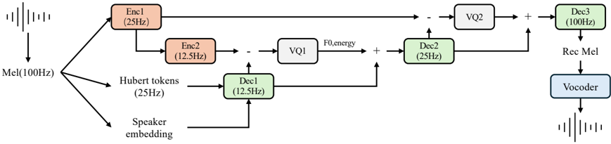

> [!abstract] arXiv · 2025 · Preprint
> **Li et al.** (LIGHTSPEED) · [→ Paper](https://arxiv.org/abs/2509.13068) · Demo: ✓ · Code: ✓
>
> MSR-Codec encodes speech into four disentangled streams (semantic, timbre, prosody, residual) via cascaded residual fusion, achieving low-bitrate reconstruction and enabling modular zero-shot voice and prosody conversion without adversarial disentanglement training.

## Problem

Low-bitrate neural codecs for speech generation struggle to separate speech attributes cleanly, which limits both reconstruction quality at high compression and the ability to perform targeted voice or prosody conversion. Prior disentanglement approaches, such as NaturalSpeech 3, rely on adversarial training to enforce attribute separation, adding training instability. At the same time, codec-based TTS systems typically trade efficiency for quality, requiring large models and large datasets to remain competitive. The paper addresses whether a structurally factorized codec, with stream-specific roles enforced through architecture rather than through adversarial objectives, can achieve both competitive reconstruction quality and clean attribute manipulation at low bitrates.

## Method

MSR-Codec encodes speech into four progressively fused streams using a cascaded residual architecture. The base layer extracts two time-invariant or slow-moving representations: a speaker timbre embedding produced by a frozen pre-trained CAM++ network, and semantic tokens from a frozen HuBERT model operating at 25 Hz, downsampled to a 12.5 Hz sequence via a 2-layer conformer decoder (Dec1) with cross-attention. These form the foundation of what is said and by whom.

A prosody stream captures pitch and rhythm at 12.5 Hz by quantizing the residual difference between the Dec1 output and the output of a second downsampling encoder (Enc2). A single codebook (VQ1) discretizes this residual. Crucially, the prosody stream is supervised with an explicit MSE loss against frame-level F0 and spectral energy values, anchoring the stream to prosodic attributes. Finally, a residual stream at 25 Hz captures fine-grained acoustic detail not covered by the earlier streams, quantized via a second codebook (VQ2). All streams are element-wise added at successive decoder stages (Dec2, Dec3) to reconstruct the Mel-spectrogram, which a pre-trained FreGAN vocoder converts to a waveform.

Three codec variants are trained at 424, 524, and 612 bps, all operating at 62.5 tokens per second with 3 quantizers total. The codec is trained end-to-end with reconstruction loss (L1+L2 on Mel-spectrogram), adversarial loss from a discriminator, and the prosody supervision loss. The speaker and HuBERT encoders remain frozen throughout.

Built on top of MSR-Codec, a two-stage autoregressive TTS model (0.2B params total) generates speech from text. A 6-layer text encoder feeds an 18-layer Semantic Decoder, which generates features at 12.5 Hz that are split to predict two 25 Hz semantic tokens per step. A lighter 3-layer Acoustic Decoder then predicts prosody and residual tokens conditioned on the Semantic Decoder output. The speaker embedding is injected only at codec decode time, not during token prediction, which means the TTS model is agnostic to speaker identity during generation.

## Key Results

**Codec reconstruction (Table 1, LibriSpeech test):** MSR-Codec-612 achieves STOI 0.90, UTMOS 4.13, and SPK-SIM 0.83, the highest speaker similarity among all compared low-bitrate codecs. STOI and PESQ scores are lower than some higher-bitrate baselines, consistent with a bitrate trade-off. MSR-Codec-424 already achieves SPK-SIM 0.80, higher than WavTokenizer (0.67), SemantiCodec (0.74), and X-Codec (0.72) despite operating at fewer bits.

**Zero-shot TTS (Table 2, Seed-TTS-eval English):** The 0.2B MSR-Codec-524 TTS model trained on 45k hours achieves WER 3.07% and SPK-SIM 0.613, outperforming Llasa-1B (WER 3.22%, trained on 250k hours) and FireRedTTS-0.4B (WER 3.82%) on intelligibility. CosyVoice2-0.5B achieves lower WER (2.57%) but higher SPK-SIM than MSR-Codec-524. MSR-Codec-524 achieves the lowest real-time factor (RTF 0.67), faster than both Llasa and CosyVoice2.

**Voice and prosody conversion (Table 3, VCTK/LibriTTS):** Timbre-only conversion (swapping speaker embedding) achieves SIM-tar of 0.51-0.56 against a target speaker while preserving source prosody (low ΔF0,tar, high ΔF0,src), outperforming CosyVoice2 (SIM-tar 0.43) and Seed-VC (SIM-tar 0.48). Prosody-only conversion achieves clear F0 transfer (low ΔF0,tar) while retaining source speaker identity (SIM-src 0.59-0.64). Combined conversion of both timbre and prosody simultaneously outperforms either alone on target speaker match.

## Novelty Assessment

The core novelty is in the cascaded residual fusion mechanism for multi-stream disentanglement. Rather than enforcing attribute separation adversarially, the architecture achieves it implicitly: each successive stream can only encode information not already captured by earlier streams, because it operates in the residual domain relative to what the previous stage reconstructed. The prosody stream's F0/energy supervision makes this disentanglement explicit for prosodic attributes.

The individual components are not new: HuBERT for semantic tokens, CAM++ for speaker embeddings, SEANet-like convolution encoders/decoders, and FreGAN vocoding are all established tools. The contribution lies in how they are organized and the demonstration that cascaded residuals, rather than adversarial training, can achieve clean separation. The evaluation is competitive but limited to a single TTS benchmark (Seed-TTS-eval) with a relatively small test protocol for VC (8 target speakers, 100 source utterances). No subjective listening test is reported.

## Field Significance

Moderate -- MSR-Codec demonstrates that structural factorization of codec streams, with explicit prosody supervision, can substitute for adversarial disentanglement training, yielding a more stable training objective while achieving clean attribute manipulation. The result that a 0.2B model trained on 45k hours competes with 0.5-1B models on intelligibility and speaker similarity provides useful evidence that codec design, not just model scale, is a meaningful lever for TTS quality. The approach is not the first to propose multi-stream factorized codecs, but the cascaded residual design and the joint demonstration of TTS and targeted VC conversion offer a concrete design alternative to adversarially-disentangled systems.

## Claims

- **supports:** Cascaded residual codec architectures can enforce attribute disentanglement through structure rather than through adversarial training objectives.
  > *Evidence:* MSR-Codec achieves clean separation of timbre, prosody, and semantic content by having each stream operate on residuals from the previous stage, without adversarial disentanglement loss; VC experiments confirm independent manipulation of each attribute. *(§2.1, §3.3.3, Table 3)*

- **supports:** Explicit prosodic supervision in a dedicated codec stream promotes measurable disentanglement of pitch from speaker identity.
  > *Evidence:* VQ1 (prosody stream) is trained with MSE loss against ground-truth F0 and spectral energy; prosody-only VC achieves low ΔF0,tar (12.3-14.2 Hz) while maintaining high SIM-src (0.59-0.64), confirming that prosody and timbre are independently manipulable. *(§2.1.2, §3.3.3, Table 3)*

- **supports:** Disentangled codec designs can achieve competitive speaker similarity at lower bitrates than undifferentiated RVQ codecs.
  > *Evidence:* MSR-Codec-424 achieves SPK-SIM 0.80 at 424 bps, higher than WavTokenizer (0.67 at 900 bps) and X-Codec (0.72 at 1000 bps), attributed to the time-invariant timbre stream which preserves speaker identity without scaling with utterance length. *(§3.3.1, Table 1)*

- **supports:** Data-efficient TTS systems built on factorized codec representations can achieve competitive intelligibility relative to larger models trained on more data.
  > *Evidence:* The 0.2B MSR-Codec-524 TTS model trained on 45k hours achieves WER 3.07% on Seed-TTS-eval English, outperforming Llasa-1B trained on 250k hours (WER 3.22%) and FireRedTTS-0.4B trained on 150k hours (WER 3.82%). *(§3.3.2, Table 2)*

- **complicates:** Signal-fidelity codec metrics (STOI, PESQ) and speaker similarity diverge at low bitrates, making holistic quality assessment difficult.
  > *Evidence:* MSR-Codec-424 achieves the highest SPK-SIM (0.80) among codecs at comparable bitrates but lower STOI (0.84) and PESQ-WB (1.82) than some baselines, indicating that speaker preservation and signal-level fidelity are optimized differently by the multi-stream design. *(§3.3.1, Table 1)*

## Limitations and Open Questions

> [!warning]
> No subjective listening test (MOS/MUSHRA) is reported for any condition; all quality comparisons rely on automatic metrics (UTMOS, STOI, PESQ, WER, SPK-SIM). Conclusions about perceived naturalness cannot be confirmed from the available data.

The VC evaluation protocol is small in scope: 8 target speakers from VCTK and 100 source utterances from LibriTTS. Generalisation to more diverse speakers, accents, or noisy conditions is not assessed. The FreGAN vocoder operates at 16 kHz, and the Mel-spectrogram-based pipeline may impose a quality ceiling relative to waveform-domain codecs. The TTS model is evaluated only on English; the codec was trained on Mandarin and English data but multilingual TTS capability is not demonstrated. Model size figures for the codec itself are not reported; only the TTS model size (0.2B) is provided.

## Wiki Connections

- [[neural-codec|Neural Audio Codec]] -- MSR-Codec contributes a multi-stream residual codec design achieving disentangled representation at 424-612 bps, distinct from standard RVQ approaches.
- [[autoregressive-codec-tts|Autoregressive Codec TTS]] -- the two-stage TTS model built on MSR-Codec uses autoregressive transformer decoders, demonstrating that disentangled codec tokens support efficient autoregressive generation.
- [[zero-shot-tts|Zero-Shot TTS]] -- the system supports zero-shot speaker cloning by injecting a speaker embedding only at codec decode time, keeping the TTS model speaker-agnostic.
- [[voice-conversion|Voice Conversion]] -- the codec's disentangled streams enable independent timbre and prosody conversion by stream-level swapping, evaluated against CosyVoice2 and Seed-VC baselines.
- [[disentanglement|Disentanglement]] -- the paper's central contribution is structural disentanglement via cascaded residual streams and explicit prosody supervision, without adversarial training.
- [[self-supervised-speech|Self-Supervised Speech]] -- frozen HuBERT features form the semantic stream of MSR-Codec, serving as the linguistic backbone of the factorized representation.
- [[2412.10117|CosyVoice 2]] -- used as a direct baseline for both zero-shot TTS (Table 2) and voice conversion (Table 3); MSR-Codec-524 outperforms it in speaker similarity on the TTS benchmark.
- [[2411.09943|Seed-VC]] -- compared as a VC baseline in Table 3; MSR-Codec achieves higher target speaker similarity under timbre conversion.
- [[2502.04128|Llasa]] -- compared as a TTS baseline in Table 2; the 0.2B MSR-Codec TTS outperforms this 1B model on WER despite using 5x less training data.
- [[2409.03283|FireRedTTS]] -- compared as a TTS baseline in Table 2; MSR-Codec-524 achieves lower WER and higher SPK-SIM with a smaller model.
- [[2301.02111|VALL-E]] -- foundational codec language model cited as the paradigm that MSR-Codec's TTS system builds upon.
- [[2407.05407|CosyVoice]] -- cited as prior work on multilingual zero-shot TTS with supervised semantic tokens, part of the design lineage leading to the two-stage TTS model.
